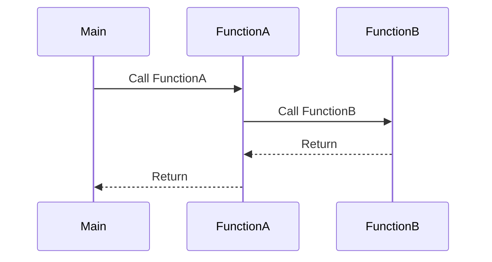
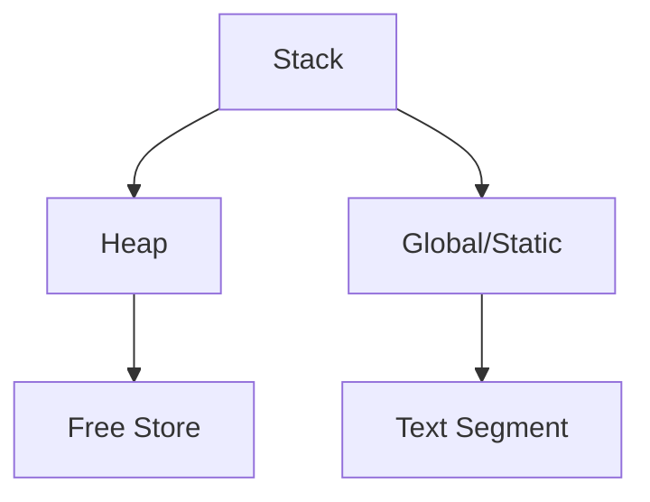

## 3.13 Debugging Techniques

Debugging is an essential skill for any software engineer, especially when working with a complex language like C++. Mastering debugging techniques can significantly enhance your productivity and the quality of your code. In this section, we will delve into effective debugging strategies, explore various tools, and discuss best practices to help you become a proficient debugger in C++.

### Introduction to Debugging

Debugging is the process of identifying, analyzing, and removing errors or bugs in a computer program. In C++, debugging can be particularly challenging due to the language's complexity, including issues related to memory management, pointer arithmetic, and concurrency. However, with the right techniques and tools, you can efficiently track down and fix bugs.

### Using Debuggers Effectively

A debugger is a software tool that allows you to execute your program step by step, inspect variables, and control the execution flow. Here are some key features of debuggers and how to use them effectively:

#### Breakpoints

Breakpoints allow you to pause the execution of your program at a specific line of code. This helps you examine the state of your program at that point. To set a breakpoint, simply click on the line number in your IDE or use a command in your debugger.

```cpp
#include <iostream>

int main() {
    int a = 5;
    int b = 10;
    int c = a + b; // Set breakpoint here
    std::cout << "Result: " << c << std::endl;
    return 0;
}
```

#### Step Over, Step Into, and Step Out

- **Step Over**: Executes the current line of code and moves to the next line. If the current line is a function call, it executes the entire function without stepping through it.
- **Step Into**: Moves into the function call to debug it line by line.
- **Step Out**: Completes the execution of the current function and returns to the calling function.

#### Watch Variables

Watch variables allow you to monitor the values of specific variables as your program executes. This is useful for tracking changes and identifying unexpected behavior.

#### Call Stack

The call stack provides a view of the function calls that led to the current point of execution. This helps you understand the sequence of function calls and identify where things might have gone wrong.

#### Memory Inspection

Inspecting memory is crucial in C++ due to manual memory management. Use your debugger to examine memory addresses and ensure that pointers are pointing to valid memory.

### Common Debugging Strategies

#### Reproduce the Bug

The first step in debugging is to reproduce the bug consistently. This might involve setting up specific conditions or inputs that trigger the bug. Once you can reliably reproduce the issue, you can start investigating its cause.

#### Simplify the Problem

Try to isolate the problem by simplifying the code. Remove unnecessary parts of the code to focus on the section that is causing the issue. This can help you identify the root cause more easily.

#### Use Logging

Incorporate logging into your code to track the flow of execution and variable values. This can provide insights into where the program is deviating from expected behavior.

```cpp
#include <iostream>
#include <fstream>

void log(const std::string& message) {
    std::ofstream logFile("debug.log", std::ios_base::app);
    logFile << message << std::endl;
}

int main() {
    int a = 5;
    int b = 10;
    log("Before addition");
    int c = a + b;
    log("After addition: " + std::to_string(c));
    std::cout << "Result: " << c << std::endl;
    return 0;
}
```

#### Divide and Conquer

Break down your code into smaller sections and test each part individually. This can help you pinpoint the exact location of the bug.

#### Rubber Duck Debugging

Explain your code and the problem to someone else, or even to an inanimate object like a rubber duck. This process can help you see the problem from a different perspective and often leads to a solution.

### Tools and Best Practices

#### Integrated Development Environments (IDEs)

Modern IDEs like Visual Studio, CLion, and Eclipse come with built-in debugging tools that make it easier to set breakpoints, watch variables, and inspect memory.

#### Command-Line Debuggers

For those who prefer command-line tools, GDB (GNU Debugger) is a powerful option. It allows you to perform all the standard debugging tasks and is highly customizable.

#### Static Analysis Tools

Static analysis tools like Clang-Tidy and SonarQube analyze your code for potential errors without executing it. They can catch issues like memory leaks, null pointer dereferences, and more.

#### Valgrind

Valgrind is a tool for memory debugging, memory leak detection, and profiling. It can help you identify memory-related issues that are common in C++ programs.

#### AddressSanitizer

AddressSanitizer is a fast memory error detector that can find out-of-bounds accesses and use-after-free errors. It is integrated into GCC and Clang compilers.

#### Best Practices

- **Write Test Cases**: Develop unit tests for your code to catch bugs early in the development process.
- **Use Version Control**: Keep track of changes in your code using version control systems like Git. This allows you to revert to a previous state if a bug is introduced.
- **Document Your Code**: Write clear and concise documentation to make your code easier to understand and debug.
- **Adopt a Consistent Coding Style**: Consistent naming conventions and code formatting can make your code easier to read and debug.

### Visualizing Debugging Concepts

To better understand the debugging process, let's visualize some key concepts using Mermaid.js diagrams.

#### Call Stack Visualization



*Figure 1: Call Stack Visualization* - This diagram shows the sequence of function calls and returns, helping you understand the flow of execution.

#### Memory Layout in C++



*Figure 2: Memory Layout in C++* - This diagram illustrates the different memory segments in a C++ program, which is crucial for understanding memory-related bugs.

### Try It Yourself

Now that we've covered the basics of debugging, let's put your skills to the test. Try modifying the following code to introduce a bug and then use a debugger to find and fix it.

```cpp
#include <iostream>

int divide(int a, int b) {
    return a / b; // Potential division by zero
}

int main() {
    int x = 10;
    int y = 0; // Change this to a non-zero value to fix the bug
    std::cout << "Result: " << divide(x, y) << std::endl;
    return 0;
}
```

### Knowledge Check

- **What is the purpose of a breakpoint in debugging?**
- **How can you use the call stack to identify the source of a bug?**
- **What are some common tools used for debugging C++ programs?**
- **Explain the difference between static analysis and dynamic analysis tools.**

### Conclusion

Debugging is an art that requires patience, practice, and the right tools. By mastering the techniques and strategies discussed in this section, you can become a more effective and efficient C++ developer. Remember, debugging is not just about fixing bugs; it's about understanding your code and improving its quality.

## Quiz Time!



### What is the primary purpose of a breakpoint in debugging?

- [x] To pause program execution at a specific line
- [ ] To automatically fix errors
- [ ] To compile the code
- [ ] To optimize performance

> **Explanation:** Breakpoints are used to pause the execution of a program at a specific line of code to inspect the program's state.

### Which of the following tools is commonly used for memory debugging in C++?

- [x] Valgrind
- [ ] Git
- [ ] Make
- [ ] Doxygen

> **Explanation:** Valgrind is a tool for memory debugging, memory leak detection, and profiling.

### What does the "Step Over" command do in a debugger?

- [x] Executes the current line and moves to the next line
- [ ] Moves into a function call
- [ ] Completes the execution of the current function
- [ ] Deletes the current line of code

> **Explanation:** "Step Over" executes the current line of code and moves to the next line, skipping over function calls.

### Which tool is used for static analysis in C++?

- [x] Clang-Tidy
- [ ] GDB
- [ ] Valgrind
- [ ] AddressSanitizer

> **Explanation:** Clang-Tidy is a static analysis tool that checks C++ code for potential errors without executing it.

### What is the benefit of using version control in debugging?

- [x] Allows you to revert to a previous state if a bug is introduced
- [ ] Automatically fixes bugs
- [ ] Compiles code faster
- [ ] Increases memory efficiency

> **Explanation:** Version control systems like Git allow you to track changes and revert to previous states, which is useful when debugging.

### What is the function of AddressSanitizer?

- [x] Detects memory errors like out-of-bounds accesses
- [ ] Compiles code
- [ ] Formats code
- [ ] Manages dependencies

> **Explanation:** AddressSanitizer is a tool that detects memory errors such as out-of-bounds accesses and use-after-free errors.

### How can logging help in debugging?

- [x] By tracking the flow of execution and variable values
- [ ] By automatically fixing errors
- [ ] By compiling the code
- [ ] By optimizing performance

> **Explanation:** Logging helps track the flow of execution and variable values, providing insights into where the program deviates from expected behavior.

### What is the purpose of the call stack in debugging?

- [x] To show the sequence of function calls leading to the current point
- [ ] To compile the code
- [ ] To optimize performance
- [ ] To automatically fix errors

> **Explanation:** The call stack shows the sequence of function calls that led to the current point of execution, helping identify where things might have gone wrong.

### What is "Rubber Duck Debugging"?

- [x] Explaining your code to someone or something to gain a new perspective
- [ ] Using a rubber duck to fix bugs
- [ ] A tool for memory debugging
- [ ] A type of breakpoint

> **Explanation:** Rubber Duck Debugging involves explaining your code to someone or something to gain a new perspective and often leads to finding a solution.

### True or False: Static analysis tools execute the code to find errors.

- [ ] True
- [x] False

> **Explanation:** Static analysis tools analyze code without executing it to find potential errors.



Remember, this is just the beginning. As you progress, you'll build more complex and interactive C++ applications. Keep experimenting, stay curious, and enjoy the journey!
