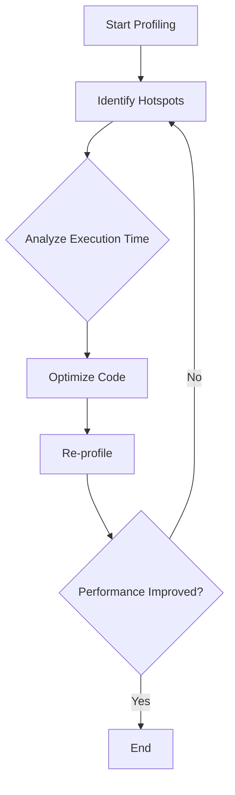

## 3.14 Profiling and Optimization

In the realm of C++ programming, achieving optimal performance is often a critical requirement. Profiling and optimization are key processes that help identify and eliminate performance bottlenecks, ensuring that your applications run efficiently. In this section, we will delve into the intricacies of profiling and optimization, exploring tools, techniques, and strategies that can be employed to enhance the performance of C++ applications.

### Understanding Performance Bottlenecks

Before diving into profiling tools and optimization strategies, it's essential to understand what performance bottlenecks are. A performance bottleneck is a point in the software where the performance is limited or constrained, causing the entire system to slow down. Bottlenecks can occur due to various reasons, such as inefficient algorithms, excessive memory usage, or poor I/O operations.

#### Identifying Bottlenecks

To effectively optimize a C++ application, you must first identify where the bottlenecks are. This involves:

1. **Analyzing Execution Time**: Determine which parts of the code consume the most time.
2. **Monitoring Resource Usage**: Check for excessive CPU, memory, and I/O usage.
3. **Evaluating Algorithm Efficiency**: Analyze the complexity of algorithms and data structures.

### Profiling Tools for C++

Profiling is the process of measuring the performance of your application to identify bottlenecks. Several tools are available for profiling C++ applications, each offering unique features and capabilities.

#### 1. **gprof**

`gprof` is a GNU profiler that analyzes program performance by collecting data on function call frequencies and execution times. It provides a detailed report that includes:

- **Flat Profile**: Shows the time spent in each function.
- **Call Graph**: Displays the call hierarchy and the time spent in each function call.

**Usage Example**:

```bash
g++ -pg -o my_program my_program.cpp
./my_program
gprof my_program gmon.out > analysis.txt
```

#### 2. **Valgrind**

Valgrind is a versatile tool suite for debugging and profiling. It includes `Callgrind`, a profiler that provides detailed information about function calls and execution paths.

**Usage Example**:

```bash
valgrind --tool=callgrind ./my_program
kcachegrind callgrind.out.<pid>
```

#### 3. **Perf**

`perf` is a powerful Linux profiling tool that provides insights into CPU performance, cache usage, and more. It can be used to profile both user-space and kernel-space code.

**Usage Example**:

```bash
perf record -g ./my_program
perf report
```

#### 4. **Visual Studio Profiler**

For Windows users, the Visual Studio Profiler offers a comprehensive set of tools for analyzing CPU usage, memory allocation, and I/O operations in C++ applications.

**Usage Example**:

- Open your project in Visual Studio.
- Go to `Debug > Performance Profiler`.
- Select the profiling options and start profiling.

#### 5. **Intel VTune Profiler**

Intel VTune is a performance analysis tool that provides detailed insights into CPU, threading, and memory usage. It is particularly useful for optimizing applications on Intel processors.

**Usage Example**:

- Install Intel VTune.
- Use the GUI to set up and run a profiling session.
- Analyze the results to identify bottlenecks.

### Optimization Strategies

Once bottlenecks are identified, the next step is to optimize the code. Optimization involves making changes to the code to improve performance without altering its functionality.

#### 1. **Algorithm Optimization**

- **Choose the Right Data Structures**: Use efficient data structures that match your use case. For example, use `std::vector` for dynamic arrays and `std::unordered_map` for fast key-value lookups.
- **Reduce Algorithm Complexity**: Aim for algorithms with lower time complexity. For instance, prefer `O(n log n)` algorithms over `O(n^2)` when sorting large datasets.

#### 2. **Memory Optimization**

- **Minimize Memory Allocation**: Frequent memory allocation and deallocation can be costly. Use memory pools or custom allocators to manage memory efficiently.
- **Use Smart Pointers**: Leverage `std::unique_ptr` and `std::shared_ptr` to manage memory automatically and prevent leaks.

#### 3. **CPU Optimization**

- **Inline Functions**: Use the `inline` keyword to suggest that the compiler replace a function call with the function code itself, reducing call overhead.
- **Loop Unrolling**: Manually unroll loops to decrease the overhead of loop control, especially in performance-critical sections.

#### 4. **I/O Optimization**

- **Buffer I/O Operations**: Use buffered I/O to reduce the number of system calls, which can be expensive.
- **Asynchronous I/O**: Implement asynchronous I/O operations to prevent blocking and improve responsiveness.

#### 5. **Compiler Optimizations**

- **Enable Optimization Flags**: Use compiler optimization flags such as `-O2` or `-O3` to let the compiler optimize your code for speed.
- **Profile-Guided Optimization (PGO)**: Use profiling data to guide the compiler in optimizing the code paths that are most frequently executed.

### Code Example: Optimizing a Sorting Algorithm

Let's consider a simple example of optimizing a sorting algorithm. We will compare a naive bubble sort with the more efficient quicksort.

**Bubble Sort**:

```cpp
#include <vector>
#include <algorithm>

void bubbleSort(std::vector<int>& arr) {
    for (size_t i = 0; i < arr.size(); ++i) {
        for (size_t j = 0; j < arr.size() - i - 1; ++j) {
            if (arr[j] > arr[j + 1]) {
                std::swap(arr[j], arr[j + 1]);
            }
        }
    }
}
```

**Quicksort**:

```cpp
#include <vector>
#include <algorithm>

void quickSort(std::vector<int>& arr, int low, int high) {
    if (low < high) {
        int pivot = partition(arr, low, high);
        quickSort(arr, low, pivot - 1);
        quickSort(arr, pivot + 1, high);
    }
}

int partition(std::vector<int>& arr, int low, int high) {
    int pivot = arr[high];
    int i = low - 1;
    for (int j = low; j <= high - 1; ++j) {
        if (arr[j] < pivot) {
            ++i;
            std::swap(arr[i], arr[j]);
        }
    }
    std::swap(arr[i + 1], arr[high]);
    return i + 1;
}
```

**Try It Yourself**: Experiment with different input sizes and measure the execution time of both sorting algorithms. Notice the performance difference as the input size increases.

### Visualizing Performance Bottlenecks

Understanding how to visualize performance bottlenecks is crucial for effective optimization. Tools like `gprof`, `Valgrind`, and `Perf` provide visual representations of your application's performance.



**Diagram Explanation**: This flowchart illustrates the iterative process of profiling and optimization. Start by profiling your application to identify hotspots. Analyze the execution time to understand where optimizations are needed. After optimizing the code, re-profile to check if performance has improved. Repeat the process as necessary.

### References and Further Reading

- [GNU gprof Documentation](https://sourceware.org/binutils/docs/gprof/)
- [Valgrind User Manual](http://valgrind.org/docs/manual/manual.html)
- [Perf Wiki](https://perf.wiki.kernel.org/index.php/Main_Page)
- [Intel VTune Profiler](https://software.intel.com/content/www/us/en/develop/tools/oneapi/components/vtune-profiler.html)

### Knowledge Check

- **Question**: What is the primary purpose of profiling in software development?
- **Exercise**: Use `gprof` to profile a simple C++ application and identify the function that consumes the most execution time.

### Embrace the Journey

Remember, profiling and optimization are ongoing processes. As you continue to develop and refine your C++ applications, regularly profile your code to ensure it remains efficient. Keep experimenting with different optimization strategies, stay curious, and enjoy the journey of mastering C++ performance!

## Quiz Time!



### What is a performance bottleneck in software development?

- [x] A point where the performance is limited or constrained
- [ ] A tool used for profiling
- [ ] A type of algorithm
- [ ] A memory management technique

> **Explanation:** A performance bottleneck is a point in the software where the performance is limited or constrained, causing the entire system to slow down.

### Which tool is used for profiling C++ applications on Linux?

- [x] gprof
- [ ] Visual Studio Profiler
- [ ] Intel VTune
- [ ] Valgrind

> **Explanation:** `gprof` is a GNU profiler used for analyzing program performance on Linux.

### What is the purpose of using inline functions in C++?

- [x] To reduce function call overhead
- [ ] To increase memory usage
- [ ] To slow down execution
- [ ] To create new data structures

> **Explanation:** Inline functions suggest that the compiler replace a function call with the function code itself, reducing call overhead.

### What is the benefit of using smart pointers in C++?

- [x] Automatic memory management
- [ ] Increased code complexity
- [ ] Reduced execution speed
- [ ] Manual memory allocation

> **Explanation:** Smart pointers like `std::unique_ptr` and `std::shared_ptr` manage memory automatically, preventing leaks.

### Which of the following is a compiler optimization flag?

- [x] -O2
- [ ] -pg
- [ ] -g
- [ ] -Wall

> **Explanation:** `-O2` is a compiler optimization flag used to optimize code for speed.

### What does the `partition` function do in the quicksort algorithm?

- [x] Divides the array into two parts based on a pivot
- [ ] Merges two sorted arrays
- [ ] Finds the maximum element
- [ ] Sorts the array in descending order

> **Explanation:** The `partition` function divides the array into two parts based on a pivot, which is used in the quicksort algorithm.

### Which tool provides insights into CPU performance and cache usage?

- [x] Perf
- [ ] gprof
- [ ] Valgrind
- [ ] Visual Studio Profiler

> **Explanation:** `perf` is a powerful Linux profiling tool that provides insights into CPU performance and cache usage.

### What is the primary goal of optimization in software development?

- [x] Improve performance without altering functionality
- [ ] Increase code complexity
- [ ] Reduce code readability
- [ ] Add new features

> **Explanation:** The primary goal of optimization is to improve performance without altering the functionality of the code.

### True or False: Profiling should only be done once during the development cycle.

- [ ] True
- [x] False

> **Explanation:** Profiling should be an ongoing process throughout the development cycle to ensure the application remains efficient.

### What is the advantage of using buffered I/O operations?

- [x] Reduces the number of system calls
- [ ] Increases memory usage
- [ ] Slows down execution
- [ ] Increases code complexity

> **Explanation:** Buffered I/O operations reduce the number of system calls, which can be expensive, thus improving performance.


