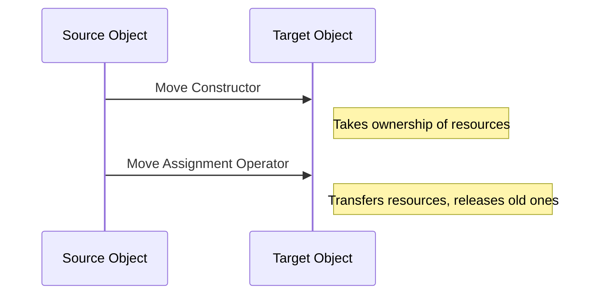
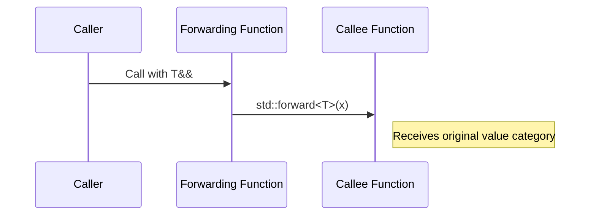

## 3.2 Move Semantics and Perfect Forwarding

In the realm of C++ programming, efficient resource management is crucial for building high-performance applications. With the introduction of C++11, move semantics and perfect forwarding have become essential tools for developers aiming to optimize their code. This section will delve into these concepts, providing a comprehensive understanding and practical guidance on their implementation.

### Understanding Move Semantics

Move semantics is a powerful feature introduced in C++11 that allows resources to be transferred from one object to another, rather than copied. This is particularly useful for objects that manage dynamic memory, file handles, or other resources that are expensive to copy.

#### The Problem with Copy Semantics

Traditionally, C++ relied on copy semantics, where objects are duplicated when passed by value. This can be inefficient for objects managing large resources. Consider the following example:

```cpp
#include <iostream>
#include <vector>

class LargeObject {
public:
    LargeObject() : data(new int[1000000]) {
        std::cout << "Constructed\n";
    }
    ~LargeObject() {
        delete[] data;
        std::cout << "Destructed\n";
    }
    LargeObject(const LargeObject& other) : data(new int[1000000]) {
        std::copy(other.data, other.data + 1000000, data);
        std::cout << "Copied\n";
    }
private:
    int* data;
};

int main() {
    LargeObject obj1;
    LargeObject obj2 = obj1; // Copy constructor is called
    return 0;
}
```

In this example, copying `LargeObject` involves allocating new memory and copying a large amount of data, which is inefficient.

#### Introducing Move Semantics

Move semantics addresses this inefficiency by allowing the resources of an object to be "moved" rather than copied. This is achieved through move constructors and move assignment operators.

##### Move Constructor

A move constructor transfers the resources from a source object to a new object, leaving the source in a valid but unspecified state. Here's how you can implement a move constructor:

```cpp
#include <iostream>
#include <vector>

class LargeObject {
public:
    LargeObject() : data(new int[1000000]) {
        std::cout << "Constructed\n";
    }
    ~LargeObject() {
        delete[] data;
        std::cout << "Destructed\n";
    }
    LargeObject(LargeObject&& other) noexcept : data(other.data) {
        other.data = nullptr;
        std::cout << "Moved\n";
    }
private:
    int* data;
};

int main() {
    LargeObject obj1;
    LargeObject obj2 = std::move(obj1); // Move constructor is called
    return 0;
}
```

In this code, the move constructor transfers ownership of the resource from `obj1` to `obj2`, avoiding the expensive copy operation.

##### Move Assignment Operator

Similar to the move constructor, the move assignment operator transfers resources from one object to another. Here is an example:

```cpp
#include <iostream>
#include <vector>

class LargeObject {
public:
    LargeObject() : data(new int[1000000]) {
        std::cout << "Constructed\n";
    }
    ~LargeObject() {
        delete[] data;
        std::cout << "Destructed\n";
    }
    LargeObject(LargeObject&& other) noexcept : data(other.data) {
        other.data = nullptr;
        std::cout << "Moved\n";
    }
    LargeObject& operator=(LargeObject&& other) noexcept {
        if (this != &other) {
            delete[] data;
            data = other.data;
            other.data = nullptr;
            std::cout << "Move Assigned\n";
        }
        return *this;
    }
private:
    int* data;
};

int main() {
    LargeObject obj1;
    LargeObject obj2;
    obj2 = std::move(obj1); // Move assignment operator is called
    return 0;
}
```

The move assignment operator first checks for self-assignment, then releases any resources held by the target object before taking ownership of the source's resources.

### Perfect Forwarding with `std::forward`

Perfect forwarding is a technique used to pass arguments to functions while preserving their value category (lvalue or rvalue). This is particularly useful in template functions where you want to forward arguments to another function without losing their original characteristics.

#### The Need for Perfect Forwarding

Consider a generic function template that forwards its arguments to another function:

```cpp
#include <iostream>

void process(int& x) {
    std::cout << "Lvalue processed: " << x << "\n";
}

void process(int&& x) {
    std::cout << "Rvalue processed: " << x << "\n";
}

template <typename T>
void forwardToProcess(T&& x) {
    process(std::forward<T>(x));
}

int main() {
    int a = 10;
    forwardToProcess(a);        // Calls process(int&)
    forwardToProcess(20);       // Calls process(int&&)
    return 0;
}
```

In this example, `std::forward` is used to perfectly forward the argument `x` to the `process` function, preserving its value category.

#### Implementing Perfect Forwarding

To implement perfect forwarding, use `std::forward` in conjunction with universal references. Universal references are deduced as either lvalue references or rvalue references based on the context in which they are used.

Here's a breakdown of how perfect forwarding works:

1. **Universal References**: A function template parameter declared as `T&&` is a universal reference if it is a template parameter and not part of a specialization.

2. **`std::forward`**: This utility function is used to cast the argument to its original value category, ensuring that lvalues remain lvalues and rvalues remain rvalues.

3. **Preserving Value Categories**: By using `std::forward`, you ensure that the forwarded argument retains its original characteristics, allowing for efficient function calls.

### Visualizing Move Semantics and Perfect Forwarding

To better understand these concepts, let's visualize the flow of data and ownership in move semantics and perfect forwarding.

#### Move Semantics Diagram



#### Perfect Forwarding Diagram



### Key Considerations and Best Practices

When using move semantics and perfect forwarding, keep the following considerations in mind:

- **Noexcept Specification**: Always declare move constructors and move assignment operators as `noexcept`. This ensures that your objects can be used in standard library containers, which require move operations to be noexcept for certain optimizations.

- **Self-Assignment Check**: In move assignment operators, always check for self-assignment to avoid releasing resources that the object still owns.

- **Resource Management**: Ensure that your objects are left in a valid state after a move operation. Typically, this means setting pointers to `nullptr` or resetting other resource handles.

- **Universal References**: Use `T&&` only in template functions to denote universal references. In non-template functions, `T&&` is an rvalue reference.

- **Avoid Overuse**: While move semantics and perfect forwarding are powerful, they should be used judiciously. Overusing these features can complicate code and lead to subtle bugs.

### Try It Yourself

To deepen your understanding, try modifying the examples provided:

1. **Experiment with Different Data Types**: Implement move semantics for a class managing a different resource, such as a file handle or network connection.

2. **Test Exception Safety**: Modify the move constructor and move assignment operator to throw exceptions and observe the behavior. Ensure your code is exception-safe.

3. **Create a Forwarding Function**: Write a template function that forwards its arguments to multiple overloaded functions, similar to the `process` example.

### References and Further Reading

- [C++ Reference: Move Semantics](https://en.cppreference.com/w/cpp/language/move_constructor)
- [C++ Reference: std::forward](https://en.cppreference.com/w/cpp/utility/forward)
- [Effective Modern C++ by Scott Meyers](https://www.oreilly.com/library/view/effective-modern-c/9781491908419/)

### Knowledge Check

Before moving on, let's review some key points:

- **What is the main advantage of move semantics over copy semantics?**
  - Move semantics allows for efficient resource transfer without the overhead of copying.

- **How does `std::forward` differ from `std::move`?**
  - `std::forward` preserves the value category of its argument, while `std::move` casts its argument to an rvalue.

- **Why is it important to declare move operations as `noexcept`?**
  - Declaring move operations as `noexcept` allows standard library optimizations and ensures compatibility with certain containers.

### Embrace the Journey

Remember, mastering move semantics and perfect forwarding is a journey. As you continue to explore these concepts, you'll unlock new levels of efficiency and elegance in your C++ code. Keep experimenting, stay curious, and enjoy the process!

## Quiz Time!



### What is the primary purpose of move semantics in C++?

- [x] To transfer resources efficiently without copying
- [ ] To enhance polymorphism
- [ ] To simplify template programming
- [ ] To improve exception handling

> **Explanation:** Move semantics allow resources to be transferred from one object to another, avoiding the overhead of copying.

### Which keyword is used to implement perfect forwarding in C++?

- [ ] std::move
- [x] std::forward
- [ ] std::copy
- [ ] std::transfer

> **Explanation:** `std::forward` is used to preserve the value category of arguments in template functions.

### What does the move constructor do?

- [x] Transfers resources from a source object to a new object
- [ ] Copies resources from a source object to a new object
- [ ] Deletes resources from a source object
- [ ] Allocates new resources for a new object

> **Explanation:** The move constructor transfers ownership of resources from the source object to the new object.

### Why should move constructors be marked as noexcept?

- [x] To allow optimizations in standard library containers
- [ ] To prevent exceptions from being thrown
- [ ] To enable polymorphism
- [ ] To simplify template programming

> **Explanation:** Marking move constructors as noexcept allows certain optimizations in standard library containers.

### What is a universal reference?

- [x] A template parameter declared as T&&
- [ ] A reference to a universal object
- [ ] A reference that can be used in any function
- [ ] A reference to a global variable

> **Explanation:** A universal reference is a template parameter declared as `T&&`, which can bind to both lvalues and rvalues.

### How does `std::forward` differ from `std::move`?

- [x] `std::forward` preserves the value category, while `std::move` casts to an rvalue
- [ ] `std::forward` casts to an rvalue, while `std::move` preserves the value category
- [ ] Both perform the same function
- [ ] Neither is used in template programming

> **Explanation:** `std::forward` preserves the original value category of its argument, while `std::move` casts it to an rvalue.

### What is the purpose of self-assignment checks in move assignment operators?

- [x] To prevent resource leaks
- [ ] To enhance polymorphism
- [ ] To simplify template programming
- [ ] To improve exception handling

> **Explanation:** Self-assignment checks prevent releasing resources that the object still owns, avoiding resource leaks.

### What happens to the source object after a move operation?

- [x] It is left in a valid but unspecified state
- [ ] It is deleted
- [ ] It is copied
- [ ] It is reset to its initial state

> **Explanation:** After a move operation, the source object is left in a valid but unspecified state, typically with its resources set to null or default values.

### What is the main advantage of perfect forwarding?

- [x] It preserves the value category of arguments
- [ ] It simplifies exception handling
- [ ] It enhances polymorphism
- [ ] It improves memory management

> **Explanation:** Perfect forwarding preserves the value category of arguments, ensuring efficient function calls.

### True or False: Move semantics can only be used with objects that manage dynamic memory.

- [ ] True
- [x] False

> **Explanation:** Move semantics can be used with any object that manages resources, not just those managing dynamic memory.


