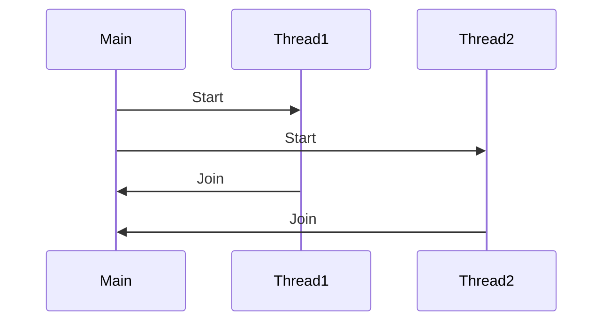

## 3.3 Concurrency and Multithreading

Concurrency and multithreading are crucial concepts in modern software development, enabling applications to perform multiple operations simultaneously, thereby improving performance and responsiveness. In C++, these concepts are supported by a rich set of features introduced in C++11 and further enhanced in subsequent standards. This section delves into the core components of concurrency and multithreading in C++, providing expert guidance on leveraging these features effectively.

### Thread Management with `std::thread`

The `std::thread` class in C++ is the foundation for multithreading, allowing developers to create and manage threads. Threads are lightweight processes that share the same memory space, making them ideal for tasks that can run concurrently.

#### Creating and Managing Threads

To create a thread in C++, instantiate an `std::thread` object and pass a callable object (such as a function pointer, lambda expression, or functor) as an argument. Here's a simple example:

```cpp
#include <iostream>
#include <thread>

// Function to be executed by the thread
void threadFunction() {
    std::cout << "Hello from the thread!" << std::endl;
}

int main() {
    // Create a thread that runs threadFunction
    std::thread t(threadFunction);

    // Wait for the thread to finish
    t.join();

    std::cout << "Hello from the main thread!" << std::endl;
    return 0;
}
```

In this example, `t.join()` is used to wait for the thread to complete before the main thread continues execution. Alternatively, `t.detach()` can be used to allow the thread to run independently, but this requires careful management to avoid accessing resources that may be destroyed.

#### Key Considerations

- **Thread Lifecycle**: Ensure that threads are properly joined or detached to prevent resource leaks.
- **Exception Safety**: Handle exceptions within threads to avoid unexpected termination.
- **Resource Sharing**: Be mindful of shared resources and potential race conditions.

### Synchronization Primitives

Synchronization is essential in multithreaded programming to ensure that threads do not interfere with each other when accessing shared resources. C++ provides several synchronization primitives, including `std::mutex`, `std::lock_guard`, and `std::unique_lock`.

#### Using `std::mutex`

A mutex (mutual exclusion) is a synchronization primitive used to protect shared data from being simultaneously accessed by multiple threads. Here's how to use `std::mutex`:

```cpp
#include <iostream>
#include <thread>
#include <mutex>

std::mutex mtx; // Mutex for critical section

void printMessage(const std::string& message) {
    std::lock_guard<std::mutex> lock(mtx); // Lock the mutex
    std::cout << message << std::endl;
}

int main() {
    std::thread t1(printMessage, "Hello from thread 1");
    std::thread t2(printMessage, "Hello from thread 2");

    t1.join();
    t2.join();

    return 0;
}
```

In this example, `std::lock_guard` is used to lock the mutex, ensuring that only one thread can access the critical section at a time. The lock is automatically released when `std::lock_guard` goes out of scope.

#### `std::unique_lock`

`std::unique_lock` offers more flexibility than `std::lock_guard`, allowing for deferred locking, timed locking, and manual unlocking. Here's an example:

```cpp
#include <iostream>
#include <thread>
#include <mutex>
#include <chrono>

std::mutex mtx;

void timedLockFunction() {
    std::unique_lock<std::mutex> lock(mtx, std::defer_lock);

    if (lock.try_lock_for(std::chrono::milliseconds(100))) {
        std::cout << "Lock acquired within 100ms" << std::endl;
    } else {
        std::cout << "Failed to acquire lock within 100ms" << std::endl;
    }
}

int main() {
    std::thread t(timedLockFunction);
    t.join();

    return 0;
}
```

#### Key Considerations

- **Deadlocks**: Avoid deadlocks by ensuring consistent locking order and using lock hierarchies.
- **Performance**: Minimize the duration of locked sections to reduce contention and improve performance.

### Condition Variables

Condition variables allow threads to wait for certain conditions to be met before proceeding. They are used in conjunction with mutexes to synchronize thread execution.

#### Using Condition Variables

Here's an example demonstrating the use of `std::condition_variable`:

```cpp
#include <iostream>
#include <thread>
#include <mutex>
#include <condition_variable>

std::mutex mtx;
std::condition_variable cv;
bool ready = false;

void workerThread() {
    std::unique_lock<std::mutex> lock(mtx);
    cv.wait(lock, [] { return ready; }); // Wait until ready becomes true
    std::cout << "Worker thread proceeding" << std::endl;
}

int main() {
    std::thread t(workerThread);

    std::this_thread::sleep_for(std::chrono::seconds(1)); // Simulate work
    {
        std::lock_guard<std::mutex> lock(mtx);
        ready = true;
    }
    cv.notify_one(); // Notify the worker thread

    t.join();
    return 0;
}
```

In this example, the worker thread waits for the `ready` flag to become true before proceeding. The main thread sets the flag and notifies the worker thread using `cv.notify_one()`.

#### Key Considerations

- **Spurious Wakeups**: Always use a predicate in `wait()` to handle spurious wakeups.
- **Efficiency**: Use condition variables to avoid busy-waiting and improve efficiency.

### Atomic Operations and `std::atomic`

Atomic operations are fundamental in concurrent programming, allowing operations on shared data to be performed atomically without the need for locks. C++ provides the `std::atomic` template for this purpose.

#### Using `std::atomic`

Here's a simple example of using `std::atomic`:

```cpp
#include <iostream>
#include <thread>
#include <atomic>

std::atomic<int> counter(0);

void incrementCounter() {
    for (int i = 0; i < 1000; ++i) {
        ++counter;
    }
}

int main() {
    std::thread t1(incrementCounter);
    std::thread t2(incrementCounter);

    t1.join();
    t2.join();

    std::cout << "Final counter value: " << counter << std::endl;
    return 0;
}
```

In this example, `std::atomic<int>` ensures that increment operations on `counter` are atomic, preventing race conditions.

#### Key Considerations

- **Memory Ordering**: Understand memory ordering and use appropriate memory order constraints when necessary.
- **Performance**: Atomic operations are generally faster than locks but may not be suitable for all scenarios.

### Futures and Promises

Futures and promises provide a mechanism for asynchronous communication between threads, allowing one thread to produce a result that another thread can consume.

#### Using Futures and Promises

Here's an example demonstrating futures and promises:

```cpp
#include <iostream>
#include <thread>
#include <future>

int computeValue() {
    std::this_thread::sleep_for(std::chrono::seconds(2)); // Simulate work
    return 42;
}

int main() {
    std::promise<int> promise;
    std::future<int> future = promise.get_future();

    std::thread t([&promise] {
        int result = computeValue();
        promise.set_value(result);
    });

    std::cout << "Waiting for result..." << std::endl;
    int value = future.get(); // Wait for the result
    std::cout << "Result: " << value << std::endl;

    t.join();
    return 0;
}
```

In this example, the promise is used to set the result of a computation, which is then retrieved by the future.

#### Key Considerations

- **Exception Handling**: Use `promise.set_exception()` to propagate exceptions to the future.
- **Synchronization**: Futures and promises provide a convenient way to synchronize threads without explicit locks.

### Asynchronous Tasks with `std::async`

`std::async` simplifies the creation of asynchronous tasks, automatically managing threads and returning a future for the result.

#### Using `std::async`

Here's an example of using `std::async`:

```cpp
#include <iostream>
#include <future>

int computeValue() {
    std::this_thread::sleep_for(std::chrono::seconds(2)); // Simulate work
    return 42;
}

int main() {
    std::future<int> future = std::async(std::launch::async, computeValue);

    std::cout << "Waiting for result..." << std::endl;
    int value = future.get(); // Wait for the result
    std::cout << "Result: " << value << std::endl;

    return 0;
}
```

In this example, `std::async` is used to launch `computeValue` asynchronously, returning a future for the result.

#### Key Considerations

- **Launch Policy**: Use `std::launch::async` to ensure the task runs asynchronously.
- **Exception Handling**: Handle exceptions that may be thrown during task execution.

### Parallel STL Algorithms

C++17 introduced parallel algorithms in the Standard Template Library (STL), allowing developers to execute algorithms in parallel using execution policies.

#### Using Parallel Algorithms

Here's an example of using parallel algorithms:

```cpp
#include <iostream>
#include <vector>
#include <algorithm>
#include <execution>

int main() {
    std::vector<int> data(1000000, 1);

    // Parallel execution of std::transform
    std::transform(std::execution::par, data.begin(), data.end(), data.begin(), [](int x) {
        return x * 2;
    });

    std::cout << "First element: " << data[0] << std::endl;
    return 0;
}
```

In this example, `std::transform` is executed in parallel using `std::execution::par`, doubling each element in the vector.

#### Key Considerations

- **Performance**: Parallel algorithms can significantly improve performance for large datasets.
- **Data Dependencies**: Ensure that parallel execution does not introduce data races or dependencies.

### Visualizing Concurrency and Multithreading

To better understand the flow of concurrency and multithreading, let's visualize a simple scenario using a sequence diagram.



**Diagram Description**: This sequence diagram illustrates the main thread starting two separate threads (`Thread1` and `Thread2`). Both threads execute concurrently and eventually join back with the main thread, ensuring that all threads complete before the program exits.

### Try It Yourself

Experiment with the provided code examples by modifying them to suit different scenarios. Here are some suggestions:

- **Modify the Thread Function**: Change the function executed by the thread to perform different tasks, such as file I/O or network operations.
- **Experiment with Synchronization**: Try using different synchronization primitives, such as `std::shared_mutex`, to understand their behavior.
- **Explore Parallel Algorithms**: Implement different parallel algorithms and measure their performance on large datasets.

### Knowledge Check

Let's reinforce what we've learned with a few questions:

- How does `std::thread` differ from traditional threading models?
- What are the benefits of using `std::lock_guard` over manual locking?
- How do condition variables improve thread synchronization?
- What are the advantages of using `std::atomic` for shared data?
- How do futures and promises facilitate asynchronous communication?

### Embrace the Journey

Concurrency and multithreading can be complex, but mastering these concepts opens up new possibilities for building efficient and responsive applications. Remember, this is just the beginning. As you progress, you'll build more complex and interactive systems. Keep experimenting, stay curious, and enjoy the journey!

## Quiz Time!



### What is the primary purpose of `std::thread` in C++?

- [x] To create and manage threads for concurrent execution
- [ ] To synchronize data between threads
- [ ] To handle exceptions in multithreaded applications
- [ ] To provide atomic operations

> **Explanation:** `std::thread` is used to create and manage threads, allowing concurrent execution of tasks.

### Which synchronization primitive is used to protect shared data from concurrent access?

- [x] `std::mutex`
- [ ] `std::atomic`
- [ ] `std::future`
- [ ] `std::promise`

> **Explanation:** `std::mutex` is a synchronization primitive used to protect shared data from being accessed by multiple threads simultaneously.

### What is the role of a condition variable in multithreading?

- [x] To allow threads to wait for specific conditions before proceeding
- [ ] To provide atomic operations on shared data
- [ ] To manage thread lifecycles
- [ ] To execute tasks asynchronously

> **Explanation:** Condition variables allow threads to wait for certain conditions to be met before proceeding, improving synchronization.

### How does `std::atomic` differ from `std::mutex`?

- [x] `std::atomic` provides lock-free atomic operations, while `std::mutex` provides mutual exclusion
- [ ] `std::atomic` is used for thread management, while `std::mutex` is used for synchronization
- [ ] `std::atomic` is slower than `std::mutex`
- [ ] `std::atomic` is used for condition variables

> **Explanation:** `std::atomic` provides lock-free atomic operations, whereas `std::mutex` is used for mutual exclusion and synchronization.

### What is the primary advantage of using `std::async`?

- [x] It simplifies the creation of asynchronous tasks
- [ ] It provides atomic operations on shared data
- [ ] It manages thread lifecycles
- [ ] It synchronizes data between threads

> **Explanation:** `std::async` simplifies the creation of asynchronous tasks by automatically managing threads and returning a future for the result.

### Which execution policy is used to run parallel algorithms in C++?

- [x] `std::execution::par`
- [ ] `std::execution::seq`
- [ ] `std::execution::unseq`
- [ ] `std::execution::async`

> **Explanation:** `std::execution::par` is the execution policy used to run algorithms in parallel in C++.

### What is a potential risk when using `std::thread::detach()`?

- [x] The thread may access resources that have been destroyed
- [ ] The thread will not execute concurrently
- [ ] The thread will automatically join with the main thread
- [ ] The thread will become a daemon thread

> **Explanation:** When a thread is detached, it runs independently, which can lead to accessing resources that have been destroyed if not managed carefully.

### How can spurious wakeups be handled when using condition variables?

- [x] By using a predicate in the `wait()` function
- [ ] By using `std::atomic` for synchronization
- [ ] By using `std::async` for task execution
- [ ] By using `std::mutex` for mutual exclusion

> **Explanation:** Spurious wakeups can be handled by using a predicate in the `wait()` function to ensure that the condition is met before proceeding.

### What is the purpose of `std::promise` in C++?

- [x] To set a value or exception for a future
- [ ] To execute tasks asynchronously
- [ ] To manage thread lifecycles
- [ ] To provide atomic operations on shared data

> **Explanation:** `std::promise` is used to set a value or exception for a future, facilitating asynchronous communication between threads.

### True or False: `std::lock_guard` automatically releases the lock when it goes out of scope.

- [x] True
- [ ] False

> **Explanation:** `std::lock_guard` automatically releases the lock when it goes out of scope, ensuring proper resource management.


