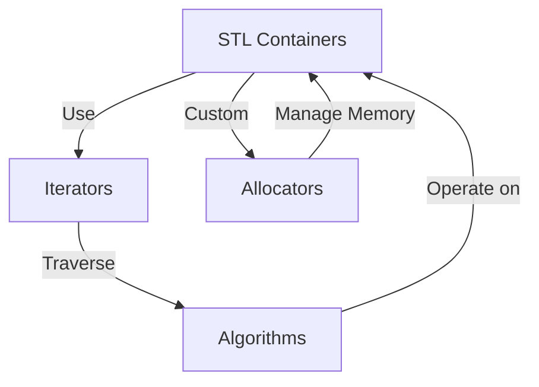

## 3.4 STL Containers and Algorithms

The Standard Template Library (STL) is a powerful feature of C++ that provides a collection of generic classes and functions. These are designed to handle data structures and algorithms, allowing developers to write more efficient and reusable code. In this section, we will explore the various STL containers, delve into iterators and their categories, examine common algorithms, and discuss custom allocators and allocator-aware programming.

### Overview of STL Containers

STL containers are the backbone of the STL, providing data structures such as arrays, linked lists, stacks, queues, and more. They are designed to be flexible, efficient, and easy to use. Let's explore some of the most commonly used STL containers:

1. **Vector**: A dynamic array that can grow in size. It provides fast random access and is efficient for insertion and deletion at the end.

2. **List**: A doubly-linked list that allows fast insertion and deletion from anywhere in the list.

3. **Deque**: A double-ended queue that allows fast insertion and deletion at both ends.

4. **Set**: A collection of unique elements, typically implemented as a balanced binary tree.

5. **Map**: A collection of key-value pairs, also implemented as a balanced binary tree.

6. **Unordered Set**: Similar to a set, but implemented using a hash table for faster access.

7. **Unordered Map**: Similar to a map, but implemented using a hash table.

8. **Stack**: A container adapter that provides LIFO (last-in, first-out) access.

9. **Queue**: A container adapter that provides FIFO (first-in, first-out) access.

10. **Priority Queue**: A container adapter that provides access to the largest element.

#### Code Example: Using STL Containers

```cpp
#include <iostream>
#include <vector>
#include <list>
#include <deque>
#include <set>
#include <map>
#include <unordered_set>
#include <unordered_map>
#include <stack>
#include <queue>

int main() {
    // Vector example
    std::vector<int> vec = {1, 2, 3, 4, 5};
    vec.push_back(6); // Add element to the end

    // List example
    std::list<int> lst = {1, 2, 3, 4, 5};
    lst.push_front(0); // Add element to the front

    // Deque example
    std::deque<int> deq = {1, 2, 3, 4, 5};
    deq.push_back(6); // Add element to the end
    deq.push_front(0); // Add element to the front

    // Set example
    std::set<int> s = {1, 2, 3, 4, 5};
    s.insert(6); // Add element

    // Map example
    std::map<int, std::string> m = {{1, "one"}, {2, "two"}, {3, "three"}};
    m[4] = "four"; // Add key-value pair

    // Unordered Set example
    std::unordered_set<int> us = {1, 2, 3, 4, 5};
    us.insert(6); // Add element

    // Unordered Map example
    std::unordered_map<int, std::string> um = {{1, "one"}, {2, "two"}, {3, "three"}};
    um[4] = "four"; // Add key-value pair

    // Stack example
    std::stack<int> stk;
    stk.push(1); // Add element

    // Queue example
    std::queue<int> q;
    q.push(1); // Add element

    // Priority Queue example
    std::priority_queue<int> pq;
    pq.push(1); // Add element

    return 0;
}
```

### Iterators and Iterator Categories

Iterators are a crucial part of the STL, providing a way to traverse the elements of a container. They are similar to pointers and allow you to access elements in a container without exposing the underlying representation.

#### Categories of Iterators

1. **Input Iterator**: Can read elements from a container.

2. **Output Iterator**: Can write elements to a container.

3. **Forward Iterator**: Can read and write elements, and can move forward.

4. **Bidirectional Iterator**: Can move both forward and backward.

5. **Random Access Iterator**: Can move to any element in constant time.

#### Code Example: Using Iterators

```cpp
#include <iostream>
#include <vector>
#include <list>

int main() {
    std::vector<int> vec = {1, 2, 3, 4, 5};
    std::list<int> lst = {1, 2, 3, 4, 5};

    // Using vector iterator
    std::cout << "Vector elements: ";
    for (auto it = vec.begin(); it != vec.end(); ++it) {
        std::cout << *it << " ";
    }
    std::cout << std::endl;

    // Using list iterator
    std::cout << "List elements: ";
    for (auto it = lst.begin(); it != lst.end(); ++it) {
        std::cout << *it << " ";
    }
    std::cout << std::endl;

    return 0;
}
```

### Common Algorithms and Their Uses

The STL provides a rich set of algorithms that operate on containers through iterators. These algorithms can perform a wide range of operations, from searching and sorting to modifying elements.

#### Examples of Common Algorithms

1. **std::sort**: Sorts elements in a range.

2. **std::find**: Finds an element in a range.

3. **std::for_each**: Applies a function to each element in a range.

4. **std::accumulate**: Computes the sum of elements in a range.

5. **std::copy**: Copies elements from one range to another.

6. **std::remove**: Removes elements from a range.

#### Code Example: Using STL Algorithms

```cpp
#include <iostream>
#include <vector>
#include <algorithm>
#include <numeric>

int main() {
    std::vector<int> vec = {5, 3, 1, 4, 2};

    // Sort the vector
    std::sort(vec.begin(), vec.end());

    // Find an element
    auto it = std::find(vec.begin(), vec.end(), 3);
    if (it != vec.end()) {
        std::cout << "Element found: " << *it << std::endl;
    }

    // Apply a function to each element
    std::for_each(vec.begin(), vec.end(), [](int &n){ n *= 2; });

    // Compute the sum of elements
    int sum = std::accumulate(vec.begin(), vec.end(), 0);
    std::cout << "Sum of elements: " << sum << std::endl;

    return 0;
}
```

### Custom Allocators

Allocators are a mechanism in the STL that abstracts memory allocation and deallocation. They allow you to customize how memory is allocated for containers, which can be useful for optimizing performance or managing memory in a specific way.

#### Code Example: Custom Allocator

```cpp
#include <iostream>
#include <vector>
#include <memory>

template <typename T>
struct CustomAllocator {
    using value_type = T;

    CustomAllocator() = default;

    template <typename U>
    CustomAllocator(const CustomAllocator<U>&) {}

    T* allocate(std::size_t n) {
        std::cout << "Allocating " << n << " elements" << std::endl;
        return static_cast<T*>(::operator new(n * sizeof(T)));
    }

    void deallocate(T* p, std::size_t n) {
        std::cout << "Deallocating " << n << " elements" << std::endl;
        ::operator delete(p);
    }
};

int main() {
    std::vector<int, CustomAllocator<int>> vec = {1, 2, 3, 4, 5};
    vec.push_back(6);

    return 0;
}
```

### Allocator-Aware Programming

Allocator-aware programming refers to writing code that can work with different types of allocators. This is important for creating flexible and reusable code that can adapt to different memory management strategies.

#### Code Example: Allocator-Aware Container

```cpp
#include <iostream>
#include <vector>
#include <memory>

template <typename T, typename Alloc = std::allocator<T>>
class AllocatorAwareContainer {
public:
    using allocator_type = Alloc;

    AllocatorAwareContainer(const Alloc& alloc = Alloc()) : allocator_(alloc) {}

    void addElement(const T& element) {
        T* p = allocator_.allocate(1);
        allocator_.construct(p, element);
        elements_.push_back(p);
    }

    ~AllocatorAwareContainer() {
        for (T* p : elements_) {
            allocator_.destroy(p);
            allocator_.deallocate(p, 1);
        }
    }

private:
    std::vector<T*> elements_;
    Alloc allocator_;
};

int main() {
    AllocatorAwareContainer<int> container;
    container.addElement(1);
    container.addElement(2);

    return 0;
}
```

### Visualizing STL Containers and Algorithms

To better understand the relationships and interactions between STL containers, iterators, and algorithms, let's visualize these concepts using a diagram.



**Diagram Description**: This diagram illustrates the interaction between STL containers, iterators, algorithms, and allocators. Containers use iterators to traverse their elements, while algorithms operate on containers through iterators. Custom allocators manage memory for containers.

### Try It Yourself

Experiment with the code examples provided in this section. Try modifying the containers, iterators, and algorithms to see how they interact. For example, you can:

- Change the type of container used in the examples.
- Use different algorithms to manipulate the data.
- Implement your own custom allocator with different memory management strategies.

### Knowledge Check

- What are the main categories of STL containers?
- How do iterators differ from pointers?
- What is the purpose of custom allocators in STL?
- How can you make a container allocator-aware?

### Embrace the Journey

Remember, mastering STL containers and algorithms is a journey. As you continue to explore and experiment with these powerful tools, you'll gain a deeper understanding of C++ and its capabilities. Keep practicing and stay curious!

## Quiz Time!



### What is the primary purpose of STL containers?

- [x] To provide efficient data structures for storing and managing collections of data.
- [ ] To replace all manual memory management in C++.
- [ ] To handle input and output operations.
- [ ] To provide a graphical user interface for C++ applications.

> **Explanation:** STL containers are designed to provide efficient data structures for storing and managing collections of data, such as vectors, lists, and maps.

### Which iterator category allows both forward and backward traversal?

- [ ] Input Iterator
- [ ] Output Iterator
- [x] Bidirectional Iterator
- [ ] Random Access Iterator

> **Explanation:** Bidirectional iterators allow traversal in both forward and backward directions, unlike input and output iterators which only allow forward traversal.

### What does the `std::sort` algorithm do?

- [ ] Finds an element in a range.
- [x] Sorts elements in a range.
- [ ] Copies elements from one range to another.
- [ ] Removes elements from a range.

> **Explanation:** The `std::sort` algorithm sorts elements within a specified range, arranging them in ascending order by default.

### What is a key benefit of using custom allocators with STL containers?

- [ ] They simplify the syntax of container operations.
- [x] They allow customization of memory allocation strategies.
- [ ] They automatically optimize container performance.
- [ ] They provide built-in thread safety.

> **Explanation:** Custom allocators allow developers to define specific memory allocation strategies, which can be beneficial for performance optimization or specific memory management needs.

### Which STL container is typically implemented as a balanced binary tree?

- [ ] Vector
- [ ] List
- [x] Set
- [ ] Stack

> **Explanation:** The `std::set` container is typically implemented as a balanced binary tree, ensuring efficient operations for insertion, deletion, and lookup.

### What is the role of an output iterator?

- [ ] To read elements from a container.
- [x] To write elements to a container.
- [ ] To traverse a container in reverse order.
- [ ] To provide random access to container elements.

> **Explanation:** Output iterators are used to write elements to a container, allowing modification of the container's contents.

### How can you make a container allocator-aware?

- [x] By using a template parameter for the allocator type.
- [ ] By manually managing memory within the container.
- [ ] By using only standard allocators.
- [ ] By avoiding the use of iterators.

> **Explanation:** Making a container allocator-aware involves using a template parameter for the allocator type, allowing the container to work with different allocator implementations.

### What does the `std::accumulate` algorithm do?

- [ ] Sorts elements in a range.
- [ ] Finds an element in a range.
- [x] Computes the sum of elements in a range.
- [ ] Copies elements from one range to another.

> **Explanation:** The `std::accumulate` algorithm computes the sum of elements within a specified range, often used for numerical operations.

### Which of the following is NOT a standard STL container?

- [ ] Vector
- [ ] List
- [ ] Map
- [x] Graph

> **Explanation:** The STL does not include a `Graph` container. Graphs can be implemented using other containers like vectors and lists.

### True or False: All STL containers support random access iterators.

- [ ] True
- [x] False

> **Explanation:** Not all STL containers support random access iterators. For example, `std::list` supports bidirectional iterators, not random access iterators.


