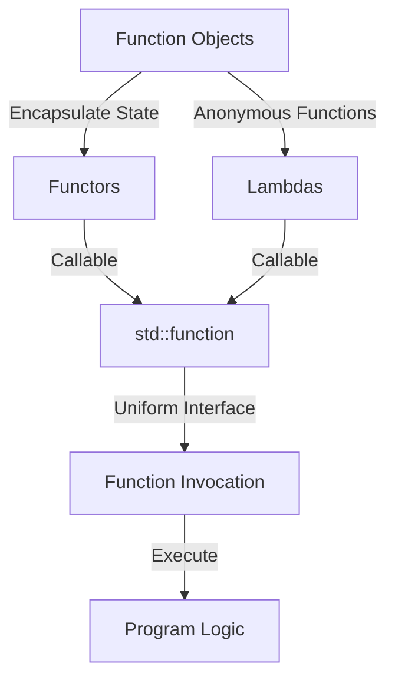

## 3.5 Functors, Function Objects, and Lambdas

In the realm of C++ programming, understanding the nuances of functors, function objects, and lambdas is crucial for writing efficient and expressive code. These constructs allow developers to encapsulate operations, manage state, and create flexible APIs. In this section, we will explore these concepts in depth, providing you with the knowledge to leverage them effectively in your software projects.

### Understanding Function Objects and Their Uses

**Function objects**, or **functors**, are objects that can be called as if they were ordinary functions. They are a powerful feature in C++ that allows you to encapsulate both data and behavior. This encapsulation makes them more flexible than regular functions, as they can maintain state across invocations.

#### Key Characteristics of Function Objects

- **Stateful**: Unlike regular functions, functors can hold state. This means they can maintain information between calls.
- **Flexible**: They can be passed around like regular objects, allowing for greater flexibility in function interfaces.
- **Overloadable**: You can overload the `operator()` to define how the functor behaves when called.

#### Example: A Simple Functor

Let's start with a simple example to illustrate how a functor works:

```cpp
#include <iostream>

// A simple functor that adds a fixed value to its input
class Adder {
public:
    Adder(int value) : value_(value) {}

    // Overloading the function call operator
    int operator()(int x) const {
        return x + value_;
    }

private:
    int value_;
};

int main() {
    Adder addFive(5);
    std::cout << "5 + 5 = " << addFive(5) << std::endl; // Outputs: 5 + 5 = 10
    return 0;
}
```

In this example, `Adder` is a functor that adds a fixed value to its input. The `operator()` is overloaded to define the behavior of the functor when it is called.

#### Advantages of Using Functors

- **Encapsulation**: Functors can encapsulate both data and behavior, making them ideal for scenarios where stateful operations are required.
- **Reusability**: They can be reused across different parts of a program, providing a consistent interface for similar operations.
- **Customizability**: By overloading the `operator()`, you can tailor the behavior of the functor to suit specific needs.

### Writing Custom Functors

Writing custom functors involves creating a class that overloads the `operator()`. This allows you to define how the functor behaves when it is called.

#### Example: A Functor for Multiplication

Let's create a functor that multiplies its input by a fixed factor:

```cpp
#include <iostream>

// A functor that multiplies its input by a fixed factor
class Multiplier {
public:
    Multiplier(int factor) : factor_(factor) {}

    // Overloading the function call operator
    int operator()(int x) const {
        return x * factor_;
    }

private:
    int factor_;
};

int main() {
    Multiplier multiplyByThree(3);
    std::cout << "3 * 4 = " << multiplyByThree(4) << std::endl; // Outputs: 3 * 4 = 12
    return 0;
}
```

In this example, `Multiplier` is a functor that multiplies its input by a fixed factor. The `operator()` is overloaded to define the multiplication operation.

#### Use Cases for Functors

- **Algorithms**: Functors are often used with algorithms that require a callable object, such as those in the Standard Template Library (STL).
- **Callbacks**: They can be used as callbacks in event-driven programming, where maintaining state between calls is necessary.
- **Custom Operations**: Functors are ideal for encapsulating custom operations that need to be reused across different parts of a program.

### Capturing Context with Lambda Functions

**Lambda expressions** in C++ provide a concise way to define anonymous functions. They are particularly useful for short-lived operations that do not require a full-fledged function or functor. Lambdas can capture variables from their surrounding context, making them highly versatile.

#### Syntax of Lambda Expressions

The basic syntax of a lambda expression is as follows:

```cpp
[capture](parameters) -> return_type {
    // function body
}
```

- **Capture**: Specifies which variables from the surrounding context are accessible within the lambda.
- **Parameters**: The input parameters for the lambda.
- **Return Type**: The type of the value returned by the lambda. This can often be omitted, as the compiler can deduce it.
- **Function Body**: The code that defines the behavior of the lambda.

#### Example: A Simple Lambda

Let's look at a simple lambda expression that adds two numbers:

```cpp
#include <iostream>

int main() {
    auto add = [](int a, int b) -> int {
        return a + b;
    };

    std::cout << "3 + 4 = " << add(3, 4) << std::endl; // Outputs: 3 + 4 = 7
    return 0;
}
```

In this example, `add` is a lambda expression that takes two integers and returns their sum.

#### Capturing Variables

Lambdas can capture variables from their surrounding context by value or by reference. This allows them to access and modify variables that are not passed as parameters.

##### Capture by Value

When capturing by value, the lambda makes a copy of the variable:

```cpp
#include <iostream>

int main() {
    int factor = 2;
    auto multiply = [factor](int x) {
        return x * factor;
    };

    std::cout << "2 * 3 = " << multiply(3) << std::endl; // Outputs: 2 * 3 = 6
    return 0;
}
```

In this example, `factor` is captured by value, so changes to `factor` outside the lambda do not affect the lambda's behavior.

##### Capture by Reference

When capturing by reference, the lambda accesses the original variable:

```cpp
#include <iostream>

int main() {
    int factor = 2;
    auto multiply = [&factor](int x) {
        return x * factor;
    };

    factor = 3;
    std::cout << "3 * 3 = " << multiply(3) << std::endl; // Outputs: 3 * 3 = 9
    return 0;
}
```

In this example, `factor` is captured by reference, so changes to `factor` outside the lambda affect the lambda's behavior.

#### Use Cases for Lambdas

- **Short-lived Operations**: Lambdas are ideal for short-lived operations that do not require a named function.
- **Inline Callbacks**: They are often used as inline callbacks in event-driven programming.
- **Functional Programming**: Lambdas are a key component of functional programming in C++, enabling higher-order functions and function composition.

### Using `std::function` and `std::bind`

The C++ Standard Library provides `std::function` and `std::bind` to facilitate the use of callable objects, including functors, lambdas, and regular functions.

#### `std::function`

`std::function` is a polymorphic function wrapper that can store any callable target. It provides a uniform interface for invoking callable objects, making it easier to work with different types of callables.

##### Example: Using `std::function`

```cpp
#include <iostream>
#include <functional>

// A simple function
int add(int a, int b) {
    return a + b;
}

int main() {
    // Using std::function to store a function pointer
    std::function<int(int, int)> func = add;
    std::cout << "3 + 4 = " << func(3, 4) << std::endl; // Outputs: 3 + 4 = 7

    return 0;
}
```

In this example, `std::function` is used to store a pointer to the `add` function, allowing it to be invoked through a uniform interface.

#### `std::bind`

`std::bind` is used to create a callable object by binding arguments to a function. It is useful for creating partial function applications and adapting functions to different interfaces.

##### Example: Using `std::bind`

```cpp
#include <iostream>
#include <functional>

// A simple function
int multiply(int a, int b) {
    return a * b;
}

int main() {
    // Using std::bind to create a new function with one argument bound
    auto multiplyByTwo = std::bind(multiply, std::placeholders::_1, 2);

    std::cout << "3 * 2 = " << multiplyByTwo(3) << std::endl; // Outputs: 3 * 2 = 6
    return 0;
}
```

In this example, `std::bind` is used to create a new callable object, `multiplyByTwo`, which multiplies its input by 2.

### Try It Yourself

To deepen your understanding of functors, lambdas, and `std::function`, try modifying the examples above:

- **Modify the Functor**: Change the `Adder` functor to subtract a fixed value instead of adding it.
- **Experiment with Lambdas**: Create a lambda that captures multiple variables by reference and modifies them.
- **Explore `std::function`**: Use `std::function` to store a lambda expression and invoke it.

### Visualizing Functors, Lambdas, and `std::function`

Let's visualize how these components interact in a typical C++ program:



**Caption**: This diagram illustrates the relationship between function objects, functors, lambdas, and `std::function`. Functors and lambdas can be used as callables, which can be stored in `std::function` for uniform invocation.

### Key Takeaways

- **Functors** are objects that can be called like functions, allowing for stateful operations.
- **Lambdas** provide a concise way to define anonymous functions and can capture variables from their surrounding context.
- **`std::function`** and **`std::bind`** offer flexible ways to manage and invoke callable objects in C++.

### References and Further Reading

- [C++ Lambda Expressions](https://en.cppreference.com/w/cpp/language/lambda) - cppreference.com
- [std::function](https://en.cppreference.com/w/cpp/utility/functional/function) - cppreference.com
- [std::bind](https://en.cppreference.com/w/cpp/utility/functional/bind) - cppreference.com

## Quiz Time!



### What is a functor in C++?

- [x] An object that can be called like a function
- [ ] A function that returns an object
- [ ] A type of lambda expression
- [ ] A special type of pointer

> **Explanation:** A functor is an object that can be called like a function, typically by overloading the `operator()`.

### How do lambdas capture variables from their surrounding context?

- [x] By value or by reference
- [ ] Only by value
- [ ] Only by reference
- [ ] They cannot capture variables

> **Explanation:** Lambdas can capture variables by value or by reference, allowing them to access and modify variables from their surrounding context.

### What is the purpose of `std::function`?

- [x] To provide a uniform interface for invoking callable objects
- [ ] To create new functions at runtime
- [ ] To bind arguments to functions
- [ ] To store only lambda expressions

> **Explanation:** `std::function` is a polymorphic function wrapper that provides a uniform interface for invoking callable objects, including functions, functors, and lambdas.

### Which of the following is NOT a characteristic of functors?

- [ ] Stateful
- [ ] Flexible
- [x] Immutable
- [ ] Overloadable

> **Explanation:** Functors are not inherently immutable; they can maintain state and modify it between calls.

### How does `std::bind` work?

- [x] It creates a callable object by binding arguments to a function
- [ ] It creates a new function by combining two existing functions
- [ ] It stores a function pointer for later use
- [ ] It converts a lambda into a functor

> **Explanation:** `std::bind` creates a callable object by binding specific arguments to a function, allowing for partial function application.

### What is the syntax for capturing variables by reference in a lambda?

- [x] [&variable]
- [ ] [variable]
- [ ] [=variable]
- [ ] [*variable]

> **Explanation:** The syntax `[&variable]` captures the variable by reference, allowing the lambda to modify the original variable.

### Which C++ feature allows you to define anonymous functions?

- [x] Lambda expressions
- [ ] Functors
- [ ] std::function
- [ ] std::bind

> **Explanation:** Lambda expressions allow you to define anonymous functions in C++.

### What is the main advantage of using `std::function`?

- [x] It allows for storing and invoking different types of callable objects
- [ ] It automatically optimizes function calls
- [ ] It only works with lambdas
- [ ] It simplifies function overloading

> **Explanation:** `std::function` allows for storing and invoking different types of callable objects through a uniform interface.

### Can lambdas be used as callbacks in event-driven programming?

- [x] True
- [ ] False

> **Explanation:** Lambdas are ideal for use as inline callbacks in event-driven programming due to their ability to capture context and define behavior concisely.

### What does `std::bind` return?

- [x] A callable object
- [ ] A function pointer
- [ ] A lambda expression
- [ ] A functor

> **Explanation:** `std::bind` returns a callable object that can be invoked with the bound arguments.



Remember, mastering these concepts is just the beginning. As you continue your journey in C++ programming, you'll find endless opportunities to apply these powerful tools in creative and effective ways. Keep experimenting, stay curious, and enjoy the process!
