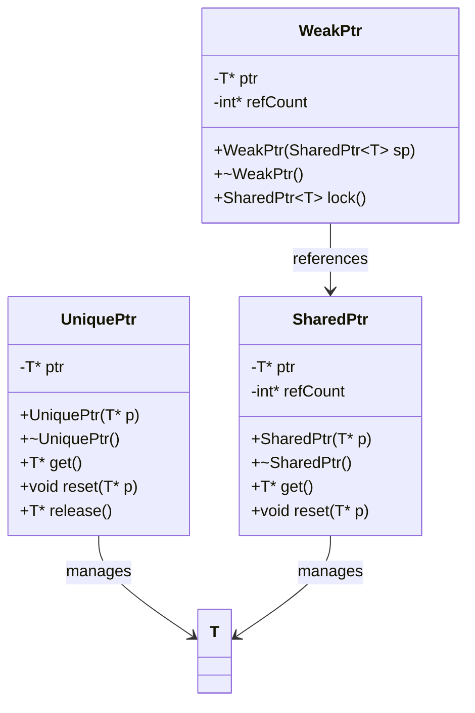

## 3.6 Smart Pointers and Ownership Models

In modern C++ programming, managing memory effectively is crucial for building robust, efficient, and maintainable applications. Smart pointers, introduced in C++11, provide a safer and more intuitive way to manage dynamic memory compared to raw pointers. They encapsulate memory management tasks, reducing the risk of memory leaks and dangling pointers. In this section, we will delve into the various types of smart pointers available in C++, their ownership models, and best practices for their use.

### Understanding Ownership Models

Before we explore smart pointers, it's essential to understand the concept of ownership in C++. Ownership determines which part of the code is responsible for managing the lifecycle of an object, particularly its memory. Proper ownership management ensures that resources are released when no longer needed, preventing memory leaks and undefined behavior.

#### Exclusive Ownership

Exclusive ownership implies that a single entity is responsible for managing the lifecycle of an object. When this entity is destroyed, the object is also destroyed. This model is ideal for scenarios where an object should not be shared or accessed by multiple owners.

#### Shared Ownership

Shared ownership allows multiple entities to share responsibility for an object. The object is only destroyed when the last owner releases it. This model is useful when multiple parts of a program need access to the same resource.

#### Weak Ownership

Weak ownership is a non-owning reference to an object managed by shared ownership. It allows access to the object without affecting its lifetime, preventing cyclic dependencies that can lead to memory leaks.

### `std::unique_ptr`: Exclusive Ownership

`std::unique_ptr` is a smart pointer that implements exclusive ownership. It is lightweight and efficient, providing automatic memory management for dynamically allocated objects. When a `std::unique_ptr` goes out of scope, it automatically deletes the object it owns.

#### Key Features of `std::unique_ptr`

- **Exclusive Ownership**: Only one `std::unique_ptr` can own a particular object at a time.
- **Move Semantics**: `std::unique_ptr` supports move semantics, allowing ownership to be transferred between pointers.
- **No Copy Semantics**: Copying a `std::unique_ptr` is not allowed, ensuring exclusive ownership.

#### Using `std::unique_ptr`

Let's explore how to use `std::unique_ptr` in C++:

```cpp
#include <iostream>
#include <memory>

class Resource {
public:
    Resource() { std::cout << "Resource acquired\n"; }
    ~Resource() { std::cout << "Resource destroyed\n"; }
    void sayHello() { std::cout << "Hello from Resource\n"; }
};

int main() {
    // Create a unique_ptr to manage a Resource
    std::unique_ptr<Resource> resPtr(new Resource());

    // Access the Resource using the unique_ptr
    resPtr->sayHello();

    // Transfer ownership to another unique_ptr
    std::unique_ptr<Resource> anotherPtr = std::move(resPtr);

    // resPtr is now empty, and anotherPtr owns the Resource
    if (!resPtr) {
        std::cout << "resPtr is empty\n";
    }

    return 0;
}
```

In this example, `std::unique_ptr` manages a `Resource` object. Ownership is transferred from `resPtr` to `anotherPtr` using `std::move`, demonstrating the move semantics of `std::unique_ptr`.

#### Advantages of `std::unique_ptr`

- **Automatic Resource Management**: Automatically releases resources when the pointer goes out of scope.
- **Efficient**: Minimal overhead compared to raw pointers.
- **Safe**: Prevents accidental copying and ensures exclusive ownership.

#### When to Use `std::unique_ptr`

- When you need exclusive ownership of a resource.
- When you want to ensure that a resource is automatically released when no longer needed.
- When you want to transfer ownership of a resource without copying it.

### `std::shared_ptr`: Shared Ownership

`std::shared_ptr` is a smart pointer that implements shared ownership. It maintains a reference count to track how many `std::shared_ptr` instances own the same object. The object is destroyed when the last `std::shared_ptr` owning it is destroyed or reset.

#### Key Features of `std::shared_ptr`

- **Shared Ownership**: Multiple `std::shared_ptr` instances can own the same object.
- **Reference Counting**: Automatically manages the object's lifetime using reference counting.
- **Thread-Safe**: The reference count is managed in a thread-safe manner.

#### Using `std::shared_ptr`

Let's see how `std::shared_ptr` works in practice:

```cpp
#include <iostream>
#include <memory>

class Resource {
public:
    Resource() { std::cout << "Resource acquired\n"; }
    ~Resource() { std::cout << "Resource destroyed\n"; }
    void sayHello() { std::cout << "Hello from Resource\n"; }
};

int main() {
    // Create a shared_ptr to manage a Resource
    std::shared_ptr<Resource> resPtr1 = std::make_shared<Resource>();

    {
        // Create another shared_ptr sharing ownership
        std::shared_ptr<Resource> resPtr2 = resPtr1;

        // Both resPtr1 and resPtr2 own the Resource
        resPtr2->sayHello();
    } // resPtr2 goes out of scope, but the Resource is not destroyed

    // Resource is still alive as resPtr1 owns it
    resPtr1->sayHello();

    return 0;
}
```

In this example, `std::shared_ptr` manages a `Resource` object. Both `resPtr1` and `resPtr2` share ownership of the `Resource`. The object is only destroyed when the last `std::shared_ptr` (`resPtr1`) is destroyed.

#### Advantages of `std::shared_ptr`

- **Automatic Memory Management**: Automatically deletes the object when the last owner is destroyed.
- **Flexible**: Allows multiple parts of a program to share ownership of a resource.
- **Thread-Safe**: Reference counting is thread-safe, making it suitable for multithreaded applications.

#### When to Use `std::shared_ptr`

- When multiple parts of a program need to share ownership of a resource.
- When you want to ensure that a resource is automatically released when no longer needed.
- When you need thread-safe shared ownership.

### Avoiding Memory Leaks with Smart Pointers

Memory leaks occur when dynamically allocated memory is not released, leading to wasted resources and potential application crashes. Smart pointers help prevent memory leaks by automatically managing the lifecycle of objects.

#### Common Causes of Memory Leaks

- **Forgetting to Delete**: Failing to delete dynamically allocated memory.
- **Exceptions**: Memory allocated before an exception is thrown may not be released.
- **Cyclic References**: Objects referencing each other can prevent memory from being released.

#### How Smart Pointers Prevent Memory Leaks

- **Automatic Deletion**: Smart pointers automatically delete the objects they manage when they go out of scope.
- **Exception Safety**: Smart pointers ensure that memory is released even if an exception occurs.
- **Avoiding Cyclic References**: Using `std::weak_ptr` can prevent cyclic references that lead to memory leaks.

### `std::weak_ptr`: Preventing Cyclic References

`std::weak_ptr` is a smart pointer that provides a non-owning reference to an object managed by `std::shared_ptr`. It allows access to the object without affecting its lifetime, preventing cyclic dependencies that can lead to memory leaks.

#### Key Features of `std::weak_ptr`

- **Non-Owning Reference**: Does not affect the reference count of the object.
- **Prevents Cyclic References**: Helps break cyclic dependencies between objects.
- **Safe Access**: Provides a way to safely access the object without extending its lifetime.

#### Using `std::weak_ptr`

Let's explore how to use `std::weak_ptr` to prevent cyclic references:

```cpp
#include <iostream>
#include <memory>

class Resource;

class Owner {
public:
    std::shared_ptr<Resource> resource;
    ~Owner() { std::cout << "Owner destroyed\n"; }
};

class Resource {
public:
    std::weak_ptr<Owner> owner;
    ~Resource() { std::cout << "Resource destroyed\n"; }
};

int main() {
    auto owner = std::make_shared<Owner>();
    auto resource = std::make_shared<Resource>();

    owner->resource = resource;
    resource->owner = owner; // Use weak_ptr to prevent cyclic reference

    return 0;
}
```

In this example, `std::weak_ptr` is used to prevent a cyclic reference between `Owner` and `Resource`. This ensures that both objects are properly destroyed when no longer needed.

#### Advantages of `std::weak_ptr`

- **Prevents Memory Leaks**: Helps break cyclic dependencies that can lead to memory leaks.
- **Safe Access**: Allows access to the object without affecting its lifetime.
- **Efficient**: Minimal overhead compared to `std::shared_ptr`.

#### When to Use `std::weak_ptr`

- When you need a non-owning reference to an object managed by `std::shared_ptr`.
- When you want to prevent cyclic dependencies between objects.
- When you need safe access to an object without extending its lifetime.

### Best Practices for Using Smart Pointers

To make the most of smart pointers in C++, follow these best practices:

1. **Prefer `std::make_unique` and `std::make_shared`**: Use these functions to create smart pointers, as they provide exception safety and efficiency.

2. **Avoid Raw Pointers for Ownership**: Use smart pointers instead of raw pointers to manage ownership and prevent memory leaks.

3. **Use `std::unique_ptr` for Exclusive Ownership**: When only one part of the program should own a resource, use `std::unique_ptr`.

4. **Use `std::shared_ptr` for Shared Ownership**: When multiple parts of the program need to share ownership of a resource, use `std::shared_ptr`.

5. **Use `std::weak_ptr` to Break Cyclic References**: Use `std::weak_ptr` to prevent cyclic dependencies that can lead to memory leaks.

6. **Be Mindful of Performance**: While smart pointers provide safety, they can introduce overhead. Use them judiciously in performance-critical code.

7. **Understand the Ownership Model**: Clearly understand and document the ownership model of your program to avoid confusion and bugs.

### Visualizing Smart Pointers and Ownership Models

To better understand the relationships between smart pointers and their ownership models, let's visualize these concepts using a class diagram.



**Diagram Description**: This class diagram illustrates the relationships between `UniquePtr`, `SharedPtr`, and `WeakPtr`. `UniquePtr` and `SharedPtr` manage the lifecycle of objects, while `WeakPtr` provides a non-owning reference to objects managed by `SharedPtr`.

### Try It Yourself

To deepen your understanding of smart pointers, try modifying the code examples provided:

- **Experiment with Ownership Transfer**: Modify the `std::unique_ptr` example to transfer ownership between multiple pointers.
- **Implement a Cyclic Reference**: Create a cyclic reference using `std::shared_ptr` and resolve it using `std::weak_ptr`.
- **Measure Performance**: Compare the performance of raw pointers and smart pointers in a simple application.

### Knowledge Check

To reinforce your understanding of smart pointers and ownership models, consider the following questions:

- What are the key differences between `std::unique_ptr` and `std::shared_ptr`?
- How does `std::weak_ptr` help prevent memory leaks?
- When should you use `std::make_unique` and `std::make_shared`?

### Embrace the Journey

Remember, mastering smart pointers and ownership models is a crucial step in becoming a proficient C++ developer. As you progress, you'll build more complex and efficient applications. Keep experimenting, stay curious, and enjoy the journey!

## Quiz Time!



### What is the primary purpose of `std::unique_ptr`?

- [x] To provide exclusive ownership of a resource
- [ ] To allow shared ownership of a resource
- [ ] To prevent cyclic references
- [ ] To manage reference counting

> **Explanation:** `std::unique_ptr` is designed for exclusive ownership, ensuring that only one pointer manages a resource at a time.

### How does `std::shared_ptr` manage the lifecycle of an object?

- [x] By using reference counting
- [ ] By using a destructor
- [ ] By using a garbage collector
- [ ] By using manual deletion

> **Explanation:** `std::shared_ptr` uses reference counting to manage the object's lifecycle, deleting it when the last reference is destroyed.

### What is the role of `std::weak_ptr` in preventing memory leaks?

- [x] It provides a non-owning reference to break cyclic dependencies
- [ ] It increases the reference count of `std::shared_ptr`
- [ ] It deletes the object when out of scope
- [ ] It manages exclusive ownership

> **Explanation:** `std::weak_ptr` provides a non-owning reference, helping to break cyclic dependencies that can lead to memory leaks.

### Which function is recommended for creating `std::unique_ptr`?

- [x] `std::make_unique`
- [ ] `std::make_shared`
- [ ] `new`
- [ ] `std::allocate`

> **Explanation:** `std::make_unique` is recommended for creating `std::unique_ptr` as it provides exception safety and efficiency.

### What happens when a `std::unique_ptr` goes out of scope?

- [x] The object it manages is automatically deleted
- [ ] The object is transferred to a `std::shared_ptr`
- [ ] The object remains in memory
- [ ] The object is converted to a raw pointer

> **Explanation:** When a `std::unique_ptr` goes out of scope, it automatically deletes the object it manages.

### Can `std::shared_ptr` be used in multithreaded applications?

- [x] Yes, because its reference counting is thread-safe
- [ ] No, because it is not thread-safe
- [ ] Yes, but only with additional synchronization
- [ ] No, because it does not support shared ownership

> **Explanation:** `std::shared_ptr` is thread-safe in terms of reference counting, making it suitable for multithreaded applications.

### What is a common cause of memory leaks that `std::weak_ptr` helps prevent?

- [x] Cyclic references
- [ ] Forgetting to delete memory
- [ ] Manual memory management
- [ ] Using raw pointers

> **Explanation:** `std::weak_ptr` helps prevent memory leaks caused by cyclic references between `std::shared_ptr` instances.

### How does `std::make_shared` improve performance compared to `new`?

- [x] It allocates memory for the object and control block in a single allocation
- [ ] It uses garbage collection
- [ ] It reduces the size of the object
- [ ] It uses a faster allocator

> **Explanation:** `std::make_shared` improves performance by allocating memory for the object and control block in a single allocation, reducing overhead.

### What is the main advantage of using smart pointers over raw pointers?

- [x] Automatic memory management
- [ ] Faster execution
- [ ] Smaller memory footprint
- [ ] Simpler syntax

> **Explanation:** The main advantage of smart pointers is automatic memory management, which helps prevent memory leaks and dangling pointers.

### True or False: `std::weak_ptr` can extend the lifetime of an object.

- [ ] True
- [x] False

> **Explanation:** `std::weak_ptr` does not extend the lifetime of an object; it provides a non-owning reference to it.


