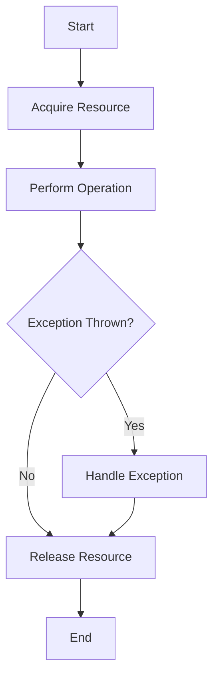

## 3.7 Exception Safety and RAII

In the realm of C++ programming, ensuring that your code is robust and resilient in the face of exceptions is crucial. Exception safety and Resource Acquisition Is Initialization (RAII) are two fundamental concepts that help achieve this goal. In this section, we will delve into the principles of designing exception-safe code, explore how RAII can be leveraged to manage resources effectively, and discuss best practices for writing exception-safe functions.

### Understanding Exception Safety

Exception safety refers to the guarantee that a piece of code will behave correctly even when exceptions are thrown. In C++, exceptions are used to handle errors and unexpected conditions, and they provide a mechanism to transfer control from one part of a program to another. However, if not handled properly, exceptions can lead to resource leaks, inconsistent states, and undefined behavior.

#### Levels of Exception Safety

There are three commonly recognized levels of exception safety:

1. **Basic Guarantee**: The program remains in a valid state, and no resources are leaked, but the state of the program may not be the same as before the exception was thrown.

2. **Strong Guarantee**: Operations are either completed successfully, or they have no effect (also known as the commit or rollback semantics). This is akin to transaction safety in databases.

3. **No-Throw Guarantee**: Operations are guaranteed not to throw exceptions. This is often used for destructors and operations that must not fail.

#### Designing Exception-Safe Code

To design exception-safe code, follow these principles:

- **Minimize the Use of Raw Pointers**: Use smart pointers (`std::unique_ptr`, `std::shared_ptr`) to manage dynamic memory automatically.
- **Prefer Stack Allocation**: Allocate objects on the stack whenever possible, as they are automatically destroyed when they go out of scope.
- **Use RAII**: Encapsulate resource management in objects whose destructors release the resources.
- **Limit Exception Propagation**: Catch exceptions at appropriate levels and handle them gracefully.
- **Avoid Resource Leaks**: Ensure that all resources are released even if an exception occurs.

### Resource Acquisition Is Initialization (RAII)

RAII is a programming idiom that ties resource management to object lifetime. The idea is simple: acquire resources in a constructor and release them in a destructor. This ensures that resources are automatically cleaned up when an object goes out of scope, preventing leaks and ensuring exception safety.

#### Implementing RAII

To implement RAII, follow these steps:

1. **Encapsulate Resources**: Create a class that encapsulates the resource you want to manage (e.g., a file handle, network connection, or memory block).

2. **Acquire Resources in the Constructor**: Initialize the resource in the constructor of the class.

3. **Release Resources in the Destructor**: Ensure that the destructor releases the resource, even if an exception occurs.

Here's a simple example of RAII in action:

```cpp
#include <iostream>
#include <fstream>

class FileHandler {
public:
    FileHandler(const std::string& filename) {
        file.open(filename);
        if (!file.is_open()) {
            throw std::runtime_error("Failed to open file");
        }
    }

    ~FileHandler() {
        if (file.is_open()) {
            file.close();
        }
    }

    void write(const std::string& data) {
        if (file.is_open()) {
            file << data;
        }
    }

private:
    std::ofstream file;
};

int main() {
    try {
        FileHandler fileHandler("example.txt");
        fileHandler.write("Hello, World!");
    } catch (const std::exception& e) {
        std::cerr << "Exception: " << e.what() << std::endl;
    }
    return 0;
}
```

In this example, the `FileHandler` class manages a file resource. The file is opened in the constructor and closed in the destructor, ensuring that the file is always properly closed, even if an exception is thrown.

### Best Practices for Writing Exception-Safe Functions

When writing functions that need to be exception-safe, consider the following best practices:

#### Use RAII for Resource Management

As demonstrated earlier, RAII is a powerful tool for managing resources. By tying resource management to object lifetime, you can ensure that resources are always released, even in the presence of exceptions.

#### Prefer Strong Exception Safety

Whenever possible, design your functions to provide the strong exception safety guarantee. This means that if an operation fails, the state of the program remains unchanged. To achieve this, consider using temporary objects and swap idioms.

Here's an example of a function with strong exception safety:

```cpp
#include <vector>
#include <algorithm>

void addElement(std::vector<int>& vec, int element) {
    std::vector<int> temp(vec);
    temp.push_back(element);
    std::swap(vec, temp);
}
```

In this example, the function `addElement` creates a temporary copy of the vector, adds the element to the copy, and then swaps the original vector with the copy. If an exception occurs during the addition, the original vector remains unchanged.

#### Handle Exceptions Appropriately

Catch exceptions at appropriate levels and handle them gracefully. Avoid catching exceptions only to rethrow them without any additional processing, as this can lead to unnecessary complexity.

#### Avoid Throwing Exceptions from Destructors

Destructors should not throw exceptions. If a destructor must perform an operation that can fail, handle the error internally or log it, but do not let the exception propagate.

#### Use `noexcept` for Non-Throwing Functions

Mark functions that are guaranteed not to throw exceptions with the `noexcept` specifier. This provides a clear contract to users of the function and can lead to performance optimizations.

Here's an example:

```cpp
class MyClass {
public:
    void doSomething() noexcept {
        // Implementation that does not throw exceptions
    }
};
```

### Visualizing Exception Safety and RAII

To better understand how RAII and exception safety work together, let's visualize the process using a flowchart:



**Caption**: This flowchart illustrates the RAII process, where resources are acquired at the start, operations are performed, and resources are released at the end, regardless of whether an exception is thrown.

### Try It Yourself

To deepen your understanding of exception safety and RAII, try modifying the `FileHandler` example:

- **Experiment with Different Resources**: Extend the `FileHandler` class to manage other resources, such as network sockets or database connections.
- **Implement Strong Exception Safety**: Modify the `FileHandler` class to provide strong exception safety guarantees.
- **Test Exception Handling**: Introduce scenarios where exceptions are thrown and observe how the RAII pattern ensures resource cleanup.

### Knowledge Check

Let's reinforce what we've learned with a few questions:

1. What are the three levels of exception safety, and how do they differ?
2. How does RAII help in managing resources in C++?
3. Why should destructors not throw exceptions?
4. How can the `noexcept` specifier be used to optimize performance?
5. What are some best practices for writing exception-safe functions?

### Conclusion

Exception safety and RAII are essential concepts in C++ programming that help ensure your code is robust, maintainable, and free from resource leaks. By designing exception-safe code and leveraging RAII for resource management, you can create applications that are resilient in the face of errors and exceptions.

Remember, this is just the beginning. As you progress, you'll build more complex and interactive applications. Keep experimenting, stay curious, and enjoy the journey!

## Quiz Time!



### What is the primary purpose of exception safety in C++?

- [x] To ensure that code behaves correctly even when exceptions are thrown.
- [ ] To prevent all exceptions from occurring.
- [ ] To improve the performance of C++ applications.
- [ ] To simplify the syntax of C++ code.

> **Explanation:** Exception safety ensures that code remains in a valid state and resources are not leaked when exceptions occur.

### Which of the following is NOT a level of exception safety?

- [ ] Basic Guarantee
- [ ] Strong Guarantee
- [ ] No-Throw Guarantee
- [x] Partial Guarantee

> **Explanation:** The three recognized levels of exception safety are Basic Guarantee, Strong Guarantee, and No-Throw Guarantee. Partial Guarantee is not a recognized level.

### What does RAII stand for?

- [x] Resource Acquisition Is Initialization
- [ ] Resource Allocation Is Initialization
- [ ] Resource Assignment Is Initialization
- [ ] Resource Acquisition Is Implementation

> **Explanation:** RAII stands for Resource Acquisition Is Initialization, a programming idiom that ties resource management to object lifetime.

### Why should destructors not throw exceptions?

- [x] Because it can lead to undefined behavior if an exception is thrown during stack unwinding.
- [ ] Because destructors are not allowed to contain any code.
- [ ] Because exceptions in destructors are automatically ignored.
- [ ] Because destructors are executed only in the main function.

> **Explanation:** Throwing exceptions from destructors can lead to undefined behavior, especially during stack unwinding when another exception is already active.

### How can the `noexcept` specifier be used in C++?

- [x] To mark functions that are guaranteed not to throw exceptions.
- [ ] To catch exceptions in a function.
- [ ] To throw exceptions from a function.
- [ ] To disable exception handling in a program.

> **Explanation:** The `noexcept` specifier is used to mark functions that are guaranteed not to throw exceptions, providing a clear contract to users.

### What is a key benefit of using smart pointers in C++?

- [x] They automatically manage dynamic memory, reducing the risk of memory leaks.
- [ ] They make the code run faster.
- [ ] They eliminate the need for constructors.
- [ ] They replace all raw pointers in C++.

> **Explanation:** Smart pointers automatically manage dynamic memory, ensuring proper cleanup and reducing the risk of memory leaks.

### Which of the following is a best practice for writing exception-safe functions?

- [x] Use RAII for resource management.
- [ ] Avoid using any exceptions.
- [ ] Catch all exceptions and ignore them.
- [ ] Use raw pointers for dynamic memory management.

> **Explanation:** Using RAII for resource management is a best practice for writing exception-safe functions, ensuring resources are properly released.

### What is the purpose of the swap idiom in exception-safe code?

- [x] To achieve strong exception safety by using temporary objects.
- [ ] To swap the values of two variables.
- [ ] To catch exceptions in a function.
- [ ] To disable exception handling in a program.

> **Explanation:** The swap idiom is used to achieve strong exception safety by using temporary objects, ensuring that operations are either completed successfully or have no effect.

### What does the strong exception safety guarantee ensure?

- [x] Operations are either completed successfully or have no effect.
- [ ] Operations are guaranteed not to throw exceptions.
- [ ] Operations are completed, but the state may change.
- [ ] Operations are completed, but resources may be leaked.

> **Explanation:** The strong exception safety guarantee ensures that operations are either completed successfully or have no effect, akin to transaction safety.

### True or False: RAII can be used to manage any type of resource, not just memory.

- [x] True
- [ ] False

> **Explanation:** True. RAII can be used to manage any type of resource, such as file handles, network connections, and more, not just memory.


