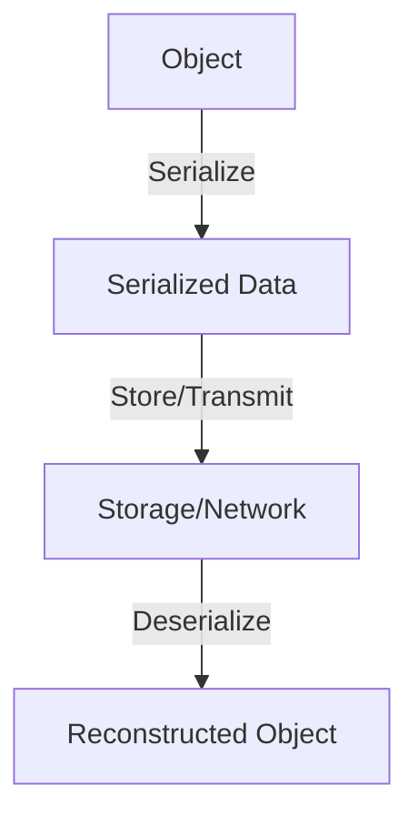

## 3.8 Data Serialization and Deserialization

In the realm of C++ programming, data serialization and deserialization are crucial techniques for converting complex data structures into a format that can be easily stored or transmitted and then reconstructed later. This process is vital for tasks such as saving application state, sending data over a network, or persisting objects to disk. In this section, we will delve into the intricacies of serialization and deserialization, explore popular libraries like Boost.Serialization, and discuss strategies for managing versioning and ensuring backward compatibility.

### Understanding Serialization and Deserialization

**Serialization** is the process of converting an object into a format that can be easily stored or transmitted. This format is often a byte stream or a text-based format like JSON or XML. **Deserialization** is the reverse process, where the serialized data is converted back into a copy of the original object.

#### Why Serialization?

Serialization is essential for several reasons:

- **Persistence**: Save the state of an object to a file or database.
- **Communication**: Send objects over a network between different systems or components.
- **Caching**: Store objects temporarily to improve performance.
- **Logging**: Record the state of objects for debugging or auditing purposes.

### Techniques for Object Serialization

There are multiple techniques for serializing objects in C++. Let's explore some of the most common methods:

#### 1. Manual Serialization

Manual serialization involves writing custom code to convert each member of an object into a serial format. This method offers full control over the serialization process but can be error-prone and tedious.

```cpp
#include <iostream>
#include <fstream>
#include <string>

class Person {
public:
    std::string name;
    int age;

    void serialize(std::ostream& os) const {
        os << name << '\n' << age << '\n';
    }

    void deserialize(std::istream& is) {
        std::getline(is, name);
        is >> age;
        is.ignore(std::numeric_limits<std::streamsize>::max(), '\n');
    }
};

int main() {
    Person person{"Alice", 30};

    // Serialize to a file
    std::ofstream ofs("person.txt");
    person.serialize(ofs);
    ofs.close();

    // Deserialize from a file
    Person newPerson;
    std::ifstream ifs("person.txt");
    newPerson.deserialize(ifs);
    ifs.close();

    std::cout << "Name: " << newPerson.name << ", Age: " << newPerson.age << std::endl;
    return 0;
}
```

**Key Points:**

- Manual serialization requires explicit handling of each data member.
- This approach can be customized to handle complex data structures.
- Error handling and data validation are crucial to avoid data corruption.

#### 2. Using Libraries like Boost.Serialization

Boost.Serialization is a powerful library that simplifies the serialization process. It provides a flexible and extensible framework for serializing C++ objects.

**Key Features of Boost.Serialization:**

- Supports serialization to various formats, including text, binary, and XML.
- Handles pointers, STL containers, and user-defined types.
- Offers versioning support to manage changes in class definitions.

**Example:**

```cpp
#include <boost/archive/text_oarchive.hpp>
#include <boost/archive/text_iarchive.hpp>
#include <fstream>

class Person {
public:
    std::string name;
    int age;

    template<class Archive>
    void serialize(Archive& ar, const unsigned int version) {
        ar & name;
        ar & age;
    }
};

int main() {
    Person person{"Bob", 25};

    // Serialize to a file
    std::ofstream ofs("person_boost.txt");
    boost::archive::text_oarchive oa(ofs);
    oa << person;
    ofs.close();

    // Deserialize from a file
    Person newPerson;
    std::ifstream ifs("person_boost.txt");
    boost::archive::text_iarchive ia(ifs);
    ia >> newPerson;
    ifs.close();

    std::cout << "Name: " << newPerson.name << ", Age: " << newPerson.age << std::endl;
    return 0;
}
```

**Advantages:**

- **Ease of Use**: Reduces boilerplate code by automating serialization.
- **Flexibility**: Supports a wide range of data types and formats.
- **Versioning**: Facilitates backward compatibility through versioning.

### Managing Versioning and Backward Compatibility

As software evolves, class definitions may change, necessitating strategies to handle versioning and ensure backward compatibility.

#### Versioning in Serialization

Versioning involves maintaining compatibility between different versions of serialized data. Boost.Serialization supports versioning through its serialization framework.

**Implementing Versioning:**

```cpp
class Person {
public:
    std::string name;
    int age;
    std::string address;  // New field in version 2

    template<class Archive>
    void serialize(Archive& ar, const unsigned int version) {
        ar & name;
        ar & age;
        if (version > 1) {
            ar & address;
        }
    }
};

// Register the class version
BOOST_CLASS_VERSION(Person, 2)
```

**Key Considerations:**

- **Backward Compatibility**: Ensure older versions of serialized data can still be deserialized.
- **Forward Compatibility**: Design serialization logic to handle unknown fields gracefully.

#### Strategies for Backward Compatibility

1. **Optional Fields**: Use optional fields to accommodate new data members without breaking existing serialized data.

2. **Default Values**: Assign default values to new fields when deserializing older data formats.

3. **Graceful Degradation**: Implement logic to handle missing or extra fields without causing errors.

### Try It Yourself

Experiment with the provided code examples by modifying the class definitions or adding new fields. Observe how the serialization and deserialization processes adapt to these changes. Try using different serialization formats (text, binary, XML) with Boost.Serialization to see how they affect the output.

### Visualizing the Serialization Process

To better understand the serialization process, let's visualize how data flows from an object to a serialized format and back.



**Diagram Explanation:**

- **Object**: The original data structure to be serialized.
- **Serialized Data**: The format (e.g., text, binary) used to store or transmit the object.
- **Storage/Network**: The medium where serialized data is stored or transmitted.
- **Reconstructed Object**: The object obtained after deserialization.

### Advanced Serialization Techniques

#### 1. Custom Serialization

For complex data structures, you may need to implement custom serialization logic. This involves defining how each member of a class is serialized and deserialized.

**Example:**

```cpp
class ComplexData {
public:
    std::vector<int> numbers;
    std::map<std::string, std::string> attributes;

    template<class Archive>
    void serialize(Archive& ar, const unsigned int version) {
        ar & numbers;
        ar & attributes;
    }
};
```

#### 2. Handling Pointers and References

Pointers and references require special handling during serialization to ensure data integrity and avoid memory leaks.

**Boost.Serialization Example:**

```cpp
class Node {
public:
    int value;
    Node* next;

    template<class Archive>
    void serialize(Archive& ar, const unsigned int version) {
        ar & value;
        ar & next;
    }
};
```

**Key Points:**

- Use smart pointers (e.g., `std::shared_ptr`) to manage memory automatically.
- Ensure that pointers are serialized correctly to maintain object relationships.

### Serialization Formats

Different serialization formats offer various trade-offs in terms of readability, size, and performance.

#### 1. Text Serialization

Text-based formats like JSON and XML are human-readable and easy to debug but may result in larger file sizes.

#### 2. Binary Serialization

Binary formats are more compact and efficient but are not human-readable. They are suitable for performance-critical applications.

#### 3. XML Serialization

XML provides a flexible and extensible format for structured data. It is widely used for configuration files and data interchange.

### Libraries for Serialization in C++

In addition to Boost.Serialization, several other libraries facilitate serialization in C++:

#### 1. Cereal

Cereal is a header-only C++11 library that provides a simple and efficient way to serialize data.

**Features:**

- Supports JSON, XML, and binary formats.
- Easy integration with existing codebases.
- Handles complex data structures and STL containers.

#### 2. Protobuf

Google's Protocol Buffers (Protobuf) is a language-neutral, platform-neutral extensible mechanism for serializing structured data.

**Features:**

- Efficient and compact binary format.
- Language-agnostic, supporting multiple programming languages.
- Strongly typed with schema definition.

#### 3. FlatBuffers

FlatBuffers is an efficient cross-platform serialization library developed by Google.

**Features:**

- Zero-copy deserialization for fast access.
- Supports forward and backward compatibility.
- Suitable for performance-sensitive applications.

### Design Considerations

When implementing serialization in your C++ applications, consider the following:

- **Performance**: Choose a serialization format that balances speed and size based on your application's needs.
- **Compatibility**: Ensure that serialized data remains compatible across different versions of your application.
- **Security**: Validate and sanitize serialized data to prevent security vulnerabilities such as buffer overflows or injection attacks.

### Differences and Similarities with Other Patterns

Serialization and deserialization are often used in conjunction with other design patterns, such as:

- **Factory Pattern**: To create objects from deserialized data.
- **Builder Pattern**: To construct complex objects during deserialization.
- **Prototype Pattern**: To clone objects during serialization.

### Conclusion

Data serialization and deserialization are fundamental techniques in C++ programming, enabling efficient data storage, transmission, and reconstruction. By leveraging libraries like Boost.Serialization and understanding the nuances of versioning and compatibility, you can implement robust serialization solutions in your applications. Remember, this is just the beginning. As you progress, you'll build more complex and interactive systems. Keep experimenting, stay curious, and enjoy the journey!

## Quiz Time!



### What is the primary purpose of serialization in C++?

- [x] Convert objects into a format for storage or transmission
- [ ] Increase the speed of object creation
- [ ] Enhance the security of data
- [ ] Simplify object-oriented design

> **Explanation:** Serialization is used to convert objects into a format that can be easily stored or transmitted, such as a byte stream or text format.

### Which library is commonly used for serialization in C++?

- [x] Boost.Serialization
- [ ] OpenSSL
- [ ] TensorFlow
- [ ] React

> **Explanation:** Boost.Serialization is a popular library in C++ for serializing objects to various formats like text, binary, and XML.

### What is a key advantage of using Boost.Serialization?

- [x] It automates serialization and reduces boilerplate code
- [ ] It is the fastest serialization library available
- [ ] It only supports binary serialization
- [ ] It is exclusive to C++20

> **Explanation:** Boost.Serialization simplifies the serialization process by automating it, reducing the amount of manual code required.

### How does versioning help in serialization?

- [x] Maintains compatibility between different versions of serialized data
- [ ] Increases the speed of serialization
- [ ] Reduces the size of serialized data
- [ ] Enhances the security of serialized data

> **Explanation:** Versioning ensures that serialized data remains compatible across different versions of an application, allowing for changes in class definitions.

### What is a common strategy for backward compatibility in serialization?

- [x] Use optional fields and default values
- [ ] Remove all old fields
- [ ] Encrypt all serialized data
- [ ] Use only binary formats

> **Explanation:** Using optional fields and default values helps maintain backward compatibility by accommodating new data members without breaking existing serialized data.

### Which serialization format is typically more compact and efficient?

- [x] Binary
- [ ] Text
- [ ] XML
- [ ] JSON

> **Explanation:** Binary serialization is generally more compact and efficient compared to text-based formats like XML or JSON.

### What is a benefit of using text-based serialization formats?

- [x] They are human-readable and easy to debug
- [ ] They are the most secure serialization formats
- [ ] They require less storage space
- [ ] They are faster than binary formats

> **Explanation:** Text-based formats like JSON and XML are human-readable, making them easier to debug and understand.

### What is the role of deserialization?

- [x] Convert serialized data back into objects
- [ ] Increase the speed of data transmission
- [ ] Encrypt data for security
- [ ] Simplify code structure

> **Explanation:** Deserialization is the process of converting serialized data back into a copy of the original object.

### True or False: FlatBuffers is a library developed by Google for efficient serialization.

- [x] True
- [ ] False

> **Explanation:** FlatBuffers is indeed a serialization library developed by Google, known for its efficient and zero-copy deserialization capabilities.

### Which of the following is NOT a feature of Boost.Serialization?

- [ ] Supports serialization to text, binary, and XML formats
- [ ] Handles pointers and STL containers
- [x] Provides real-time data encryption
- [ ] Offers versioning support

> **Explanation:** Boost.Serialization does not provide real-time data encryption; it focuses on serialization and deserialization processes.


