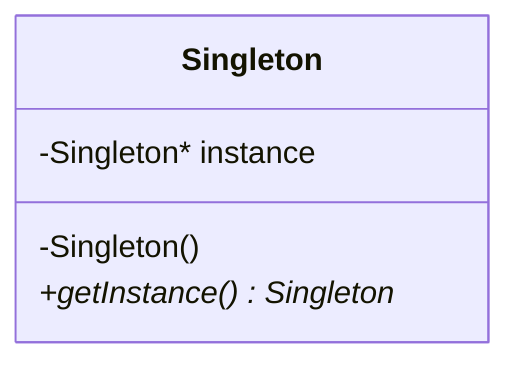
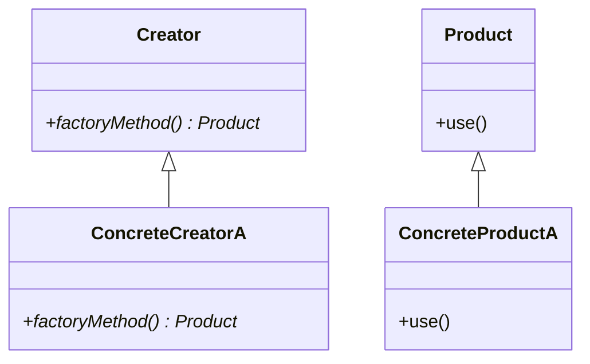
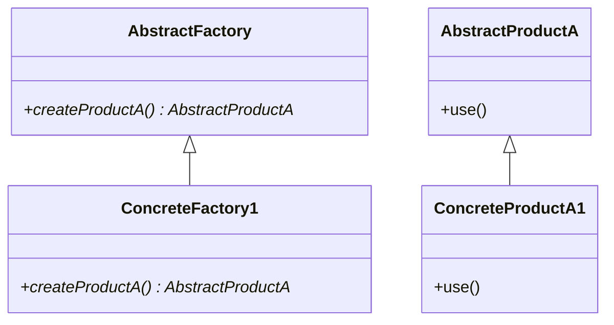
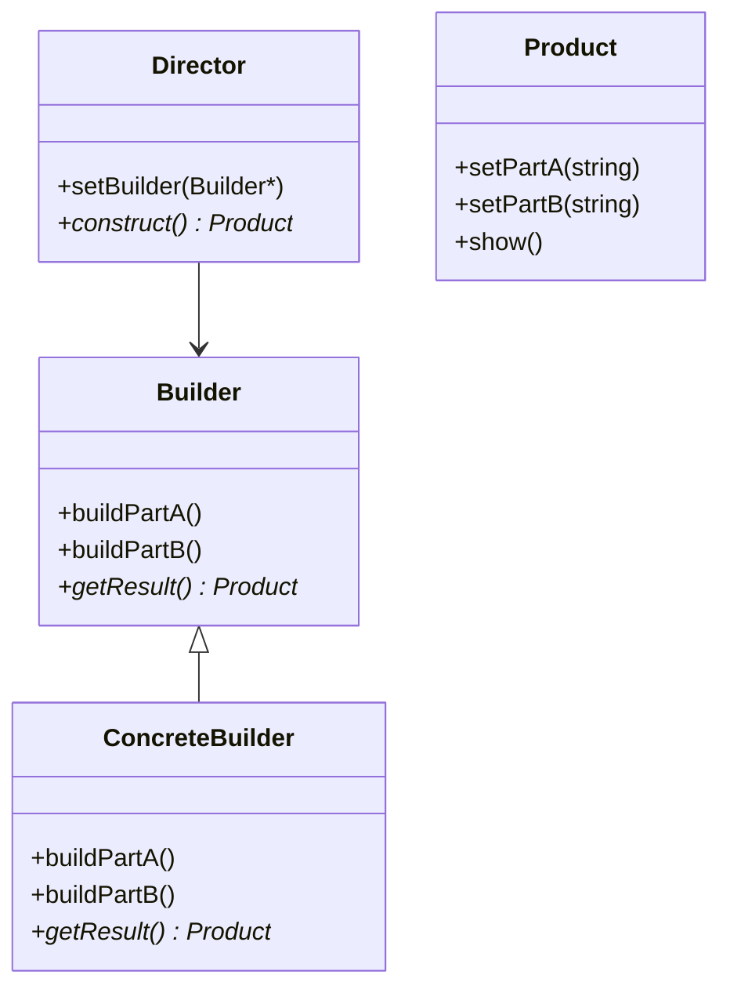
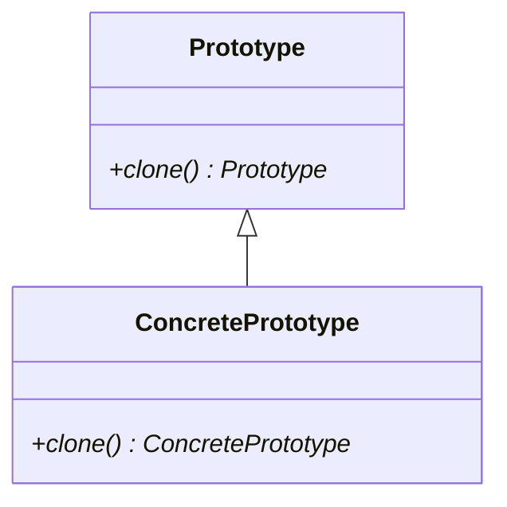

## 4.1 Overview of Creational Patterns

In the world of software design, creational patterns play a pivotal role in object creation. They provide various ways to create objects while hiding the creation logic, making the system independent of how its objects are created, composed, and represented. In this section, we will delve into the essence of creational patterns in C++, exploring their importance, key concepts, and practical applications.

### Understanding Creational Patterns

Creational design patterns abstract the instantiation process. They help make a system independent of how its objects are created, composed, and represented. This is particularly useful in C++, where object creation can be complex due to the language's features like constructors, destructors, and memory management.

#### Key Concepts

- **Encapsulation of Object Creation**: Creational patterns encapsulate the knowledge about which concrete classes the system uses. This encapsulation allows for greater flexibility in deciding which objects need to be created for a given use case.
- **Decoupling**: By using creational patterns, the code is decoupled from the specific classes it needs to instantiate. This promotes loose coupling and enhances the maintainability of the code.
- **Flexibility**: These patterns provide flexibility in terms of what gets created, who creates it, how it gets created, and when it gets created.

### The Role of Creational Patterns in C++

In C++, creational patterns are essential due to the language's complexity in object management. They help manage memory efficiently, ensure resource safety, and provide a structured way to handle object creation. Let's explore some of the most common creational patterns used in C++.

#### Singleton Pattern

The Singleton pattern ensures that a class has only one instance and provides a global point of access to it. This is particularly useful for managing shared resources like configuration settings or connection pools.

```cpp
class Singleton {
private:
    static Singleton* instance;
    Singleton() {} // Private constructor

public:
    static Singleton* getInstance() {
        if (!instance) {
            instance = new Singleton();
        }
        return instance;
    }
};

// Initialize static member
Singleton* Singleton::instance = nullptr;
```

#### Factory Method Pattern

The Factory Method pattern defines an interface for creating an object, but lets subclasses alter the type of objects that will be created. This pattern is particularly useful when a class cannot anticipate the class of objects it must create.

```cpp
class Product {
public:
    virtual void use() = 0;
};

class ConcreteProductA : public Product {
public:
    void use() override {
        std::cout << "Using ConcreteProductA" << std::endl;
    }
};

class Creator {
public:
    virtual Product* factoryMethod() = 0;
};

class ConcreteCreatorA : public Creator {
public:
    Product* factoryMethod() override {
        return new ConcreteProductA();
    }
};
```

#### Abstract Factory Pattern

The Abstract Factory pattern provides an interface for creating families of related or dependent objects without specifying their concrete classes. This pattern is particularly useful when the system needs to be independent of how its objects are created.

```cpp
class AbstractProductA {
public:
    virtual void use() = 0;
};

class ConcreteProductA1 : public AbstractProductA {
public:
    void use() override {
        std::cout << "Using ConcreteProductA1" << std::endl;
    }
};

class AbstractFactory {
public:
    virtual AbstractProductA* createProductA() = 0;
};

class ConcreteFactory1 : public AbstractFactory {
public:
    AbstractProductA* createProductA() override {
        return new ConcreteProductA1();
    }
};
```

#### Builder Pattern

The Builder pattern separates the construction of a complex object from its representation, allowing the same construction process to create different representations. This pattern is useful when an object needs to be created with many optional parts or configurations.

```cpp
class Product {
    std::string partA;
    std::string partB;

public:
    void setPartA(const std::string& part) { partA = part; }
    void setPartB(const std::string& part) { partB = part; }
    void show() {
        std::cout << "Product with " << partA << " and " << partB << std::endl;
    }
};

class Builder {
public:
    virtual void buildPartA() = 0;
    virtual void buildPartB() = 0;
    virtual Product* getResult() = 0;
};

class ConcreteBuilder : public Builder {
    Product* product;

public:
    ConcreteBuilder() { product = new Product(); }
    void buildPartA() override { product->setPartA("PartA1"); }
    void buildPartB() override { product->setPartB("PartB1"); }
    Product* getResult() override { return product; }
};

class Director {
    Builder* builder;

public:
    void setBuilder(Builder* b) { builder = b; }
    Product* construct() {
        builder->buildPartA();
        builder->buildPartB();
        return builder->getResult();
    }
};
```

#### Prototype Pattern

The Prototype pattern is used to create a duplicate object or clone of the current object to avoid the creation of a new instance from scratch. This pattern is particularly useful when the cost of creating a new object is expensive.

```cpp
class Prototype {
public:
    virtual Prototype* clone() const = 0;
};

class ConcretePrototype : public Prototype {
public:
    ConcretePrototype* clone() const override {
        return new ConcretePrototype(*this);
    }
};
```

### Visualizing Creational Patterns

To better understand how these patterns work, let's visualize the relationships and workflows involved in each pattern using Mermaid.js diagrams.

#### Singleton Pattern Diagram



#### Factory Method Pattern Diagram



#### Abstract Factory Pattern Diagram



#### Builder Pattern Diagram



#### Prototype Pattern Diagram



### Applicability of Creational Patterns

Creational patterns are applicable in various scenarios where object creation is complex or needs to be decoupled from the system. Here are some common use cases:

- **Singleton Pattern**: Use when you need exactly one instance of a class and want to provide a global point of access to it.
- **Factory Method Pattern**: Use when a class cannot anticipate the class of objects it must create.
- **Abstract Factory Pattern**: Use when the system needs to be independent of how its objects are created.
- **Builder Pattern**: Use when an object needs to be created with many optional parts or configurations.
- **Prototype Pattern**: Use when the cost of creating a new object is expensive.

### Design Considerations

When implementing creational patterns, consider the following:

- **Thread Safety**: Ensure that object creation is thread-safe, especially in patterns like Singleton.
- **Performance**: Consider the performance implications of object creation, especially in patterns like Prototype.
- **Flexibility**: Ensure that the pattern provides the necessary flexibility for future changes.

### Differences and Similarities

Creational patterns often share similarities, but they are distinct in their intent and implementation:

- **Singleton vs. Factory Method**: Singleton ensures a single instance, while Factory Method focuses on creating objects without specifying the exact class.
- **Abstract Factory vs. Builder**: Abstract Factory creates families of related objects, while Builder constructs complex objects step by step.
- **Prototype vs. Factory Method**: Prototype clones existing objects, while Factory Method creates new instances.

### Try It Yourself

Experiment with the code examples provided. Try modifying the Singleton pattern to make it thread-safe, or extend the Factory Method pattern to create different types of products. This hands-on approach will deepen your understanding of creational patterns.

### Knowledge Check

Before we conclude, let's reinforce your understanding with a few questions:

- What is the primary purpose of creational patterns?
- How does the Singleton pattern ensure only one instance of a class?
- In what scenarios would you use the Builder pattern?

### Embrace the Journey

Remember, mastering creational patterns is just the beginning. As you progress, you'll build more complex and interactive C++ applications. Keep experimenting, stay curious, and enjoy the journey!

## Quiz Time!



### What is the primary purpose of creational patterns?

- [x] To abstract the instantiation process and make a system independent of how its objects are created.
- [ ] To provide a way to define a family of algorithms.
- [ ] To ensure a class has only one instance.
- [ ] To manage the behavior of a group of objects.

> **Explanation:** Creational patterns abstract the instantiation process, making a system independent of how its objects are created, composed, and represented.

### How does the Singleton pattern ensure only one instance of a class?

- [x] By using a private constructor and a static method to control instance creation.
- [ ] By using a public constructor and a static method to control instance creation.
- [ ] By using multiple constructors to manage instances.
- [ ] By using a factory method to create instances.

> **Explanation:** The Singleton pattern uses a private constructor and a static method to ensure that only one instance of the class is created.

### When would you use the Builder pattern?

- [x] When an object needs to be created with many optional parts or configurations.
- [ ] When you need exactly one instance of a class.
- [ ] When a class cannot anticipate the class of objects it must create.
- [ ] When the cost of creating a new object is expensive.

> **Explanation:** The Builder pattern is used when an object needs to be created with many optional parts or configurations, allowing for a flexible construction process.

### Which pattern provides an interface for creating families of related or dependent objects?

- [x] Abstract Factory Pattern
- [ ] Singleton Pattern
- [ ] Builder Pattern
- [ ] Prototype Pattern

> **Explanation:** The Abstract Factory pattern provides an interface for creating families of related or dependent objects without specifying their concrete classes.

### What is a key difference between the Factory Method and Prototype patterns?

- [x] Factory Method creates new instances, while Prototype clones existing objects.
- [ ] Factory Method clones existing objects, while Prototype creates new instances.
- [ ] Both patterns create new instances.
- [ ] Both patterns clone existing objects.

> **Explanation:** The Factory Method pattern creates new instances, while the Prototype pattern clones existing objects.

### Which pattern is particularly useful for managing shared resources like configuration settings?

- [x] Singleton Pattern
- [ ] Factory Method Pattern
- [ ] Builder Pattern
- [ ] Prototype Pattern

> **Explanation:** The Singleton pattern is useful for managing shared resources like configuration settings, ensuring only one instance is used.

### How does the Builder pattern separate the construction of a complex object from its representation?

- [x] By allowing the same construction process to create different representations.
- [ ] By using a single method to create all parts of the object.
- [ ] By creating a new instance for each part of the object.
- [ ] By cloning existing objects.

> **Explanation:** The Builder pattern separates the construction of a complex object from its representation, allowing the same construction process to create different representations.

### What is a common use case for the Prototype pattern?

- [x] When the cost of creating a new object is expensive.
- [ ] When you need exactly one instance of a class.
- [ ] When a class cannot anticipate the class of objects it must create.
- [ ] When an object needs to be created with many optional parts or configurations.

> **Explanation:** The Prototype pattern is used when the cost of creating a new object is expensive, allowing for cloning of existing objects.

### Which pattern is best suited for creating objects without specifying the exact class?

- [x] Factory Method Pattern
- [ ] Singleton Pattern
- [ ] Builder Pattern
- [ ] Prototype Pattern

> **Explanation:** The Factory Method pattern is best suited for creating objects without specifying the exact class, allowing subclasses to alter the type of objects created.

### True or False: The Abstract Factory pattern is used to create a single instance of a class.

- [ ] True
- [x] False

> **Explanation:** False. The Abstract Factory pattern is used to create families of related or dependent objects, not a single instance of a class.


