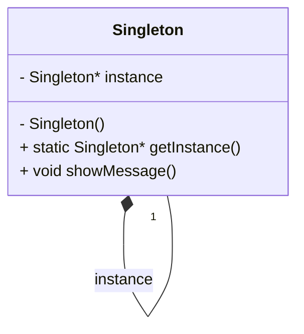

## 4.2 Singleton Pattern

The Singleton Pattern is a creational design pattern that ensures a class has only one instance and provides a global point of access to it. This pattern is particularly useful when exactly one object is needed to coordinate actions across the system. In this section, we will delve into various ways to implement the Singleton Pattern in C++, including lazy initialization, thread-safe implementations, Meyers' Singleton, and double-checked locking.

### Intent

The primary intent of the Singleton Pattern is to control object creation, limiting the number of instances to one. This is useful in scenarios where a single instance of a class is required to coordinate actions, such as in configurations, logging, or managing shared resources.

### Key Participants

1. **Singleton Class**: The class that is responsible for creating and managing its own unique instance.
2. **Client Code**: The code that accesses the Singleton instance.

### Applicability

Use the Singleton Pattern when:
- There must be exactly one instance of a class, and it must be accessible to clients from a well-known access point.
- The sole instance should be extensible by subclassing, and clients should be able to use an extended instance without modifying their code.

### Implementing Singleton with Lazy Initialization

Lazy initialization refers to delaying the creation of an object until it is needed. This is a common approach in implementing the Singleton Pattern, as it ensures that the Singleton instance is created only when it is first accessed.

```cpp
#include <iostream>

class Singleton {
private:
    static Singleton* instance;

    // Private constructor to prevent instantiation
    Singleton() {}

public:
    // Static method to access the Singleton instance
    static Singleton* getInstance() {
        if (instance == nullptr) {
            instance = new Singleton();
        }
        return instance;
    }

    void showMessage() {
        std::cout << "Singleton Instance Accessed!" << std::endl;
    }
};

// Initialize the static member
Singleton* Singleton::instance = nullptr;

int main() {
    // Accessing the Singleton instance
    Singleton* singleton = Singleton::getInstance();
    singleton->showMessage();

    return 0;
}
```

**Explanation**: In this example, the `Singleton` class has a private static pointer `instance` that holds the single instance of the class. The `getInstance()` method checks if the instance is `nullptr` and creates it if necessary. This ensures that the instance is created only when it is first accessed.

### Thread-Safe Singleton Implementation

In a multithreaded environment, the lazy initialization approach can lead to race conditions, where multiple threads might create multiple instances of the Singleton class. To address this, we need a thread-safe implementation.

#### Using Mutex for Thread Safety

One way to ensure thread safety is by using a mutex to lock the critical section where the instance is created.

```cpp
#include <iostream>
#include <mutex>

class ThreadSafeSingleton {
private:
    static ThreadSafeSingleton* instance;
    static std::mutex mutex;

    ThreadSafeSingleton() {}

public:
    static ThreadSafeSingleton* getInstance() {
        std::lock_guard<std::mutex> lock(mutex);
        if (instance == nullptr) {
            instance = new ThreadSafeSingleton();
        }
        return instance;
    }

    void showMessage() {
        std::cout << "Thread-Safe Singleton Instance Accessed!" << std::endl;
    }
};

// Initialize the static members
ThreadSafeSingleton* ThreadSafeSingleton::instance = nullptr;
std::mutex ThreadSafeSingleton::mutex;

int main() {
    ThreadSafeSingleton* singleton = ThreadSafeSingleton::getInstance();
    singleton->showMessage();

    return 0;
}
```

**Explanation**: In this implementation, a `std::mutex` is used to lock the critical section in the `getInstance()` method. The `std::lock_guard` ensures that the mutex is automatically released when the lock goes out of scope, thus preventing race conditions.

### Meyers' Singleton

Meyers' Singleton is a thread-safe Singleton implementation that leverages the static initialization order guarantee in C++. It is named after Scott Meyers, a prominent C++ expert.

```cpp
#include <iostream>

class MeyersSingleton {
public:
    static MeyersSingleton& getInstance() {
        static MeyersSingleton instance;
        return instance;
    }

    void showMessage() {
        std::cout << "Meyers' Singleton Instance Accessed!" << std::endl;
    }

private:
    MeyersSingleton() {}
    MeyersSingleton(const MeyersSingleton&) = delete;
    MeyersSingleton& operator=(const MeyersSingleton&) = delete;
};

int main() {
    MeyersSingleton& singleton = MeyersSingleton::getInstance();
    singleton.showMessage();

    return 0;
}
```

**Explanation**: Meyers' Singleton uses a local static variable inside the `getInstance()` method. The C++ standard guarantees that this variable is initialized in a thread-safe manner the first time the control passes through its declaration. This eliminates the need for explicit synchronization mechanisms.

### Double-Checked Locking

Double-checked locking is an optimization technique used to reduce the overhead of acquiring a lock by first testing the locking criterion without actually acquiring the lock. This is particularly useful in scenarios where the lock is expensive to acquire and the locking criterion is frequently false.

```cpp
#include <iostream>
#include <mutex>

class DoubleCheckedLockingSingleton {
private:
    static DoubleCheckedLockingSingleton* instance;
    static std::mutex mutex;

    DoubleCheckedLockingSingleton() {}

public:
    static DoubleCheckedLockingSingleton* getInstance() {
        if (instance == nullptr) { // First check (no locking)
            std::lock_guard<std::mutex> lock(mutex);
            if (instance == nullptr) { // Second check (with locking)
                instance = new DoubleCheckedLockingSingleton();
            }
        }
        return instance;
    }

    void showMessage() {
        std::cout << "Double-Checked Locking Singleton Instance Accessed!" << std::endl;
    }
};

// Initialize the static members
DoubleCheckedLockingSingleton* DoubleCheckedLockingSingleton::instance = nullptr;
std::mutex DoubleCheckedLockingSingleton::mutex;

int main() {
    DoubleCheckedLockingSingleton* singleton = DoubleCheckedLockingSingleton::getInstance();
    singleton->showMessage();

    return 0;
}
```

**Explanation**: In this implementation, the `getInstance()` method first checks if the instance is `nullptr` without acquiring the lock. If it is `nullptr`, it acquires the lock and checks again before creating the instance. This reduces the overhead of acquiring the lock when the instance is already initialized.

### Design Considerations

When implementing the Singleton Pattern, consider the following:

- **Lazy vs. Eager Initialization**: Lazy initialization delays the creation of the instance until it is needed, which can save resources. However, it requires careful handling of thread safety. Eager initialization creates the instance at program startup, which can be simpler but may waste resources if the instance is never used.
  
- **Thread Safety**: In a multithreaded environment, ensure that the Singleton implementation is thread-safe. Meyers' Singleton is a simple and effective solution for thread safety.

- **Destruction**: Consider how and when the Singleton instance should be destroyed. In some cases, it may be necessary to implement custom cleanup logic.

- **Global Access**: While the Singleton Pattern provides global access to the instance, it can lead to tightly coupled code. Consider whether the Singleton is the best solution for your design needs.

### Differences and Similarities

The Singleton Pattern is often confused with other patterns that manage object creation, such as the Factory Pattern. The key difference is that the Singleton Pattern ensures a single instance, while the Factory Pattern is concerned with creating objects without specifying the exact class of object that will be created.

### Visualizing Singleton Pattern

Let's visualize the Singleton Pattern using a class diagram to better understand its structure.



**Diagram Explanation**: The class diagram illustrates the Singleton class with a private static member `instance` and a private constructor. The public static method `getInstance()` provides access to the single instance, and `showMessage()` is a sample method to demonstrate functionality.

### Try It Yourself

To deepen your understanding of the Singleton Pattern, try modifying the code examples:

- Implement a Singleton class that manages a configuration file. Ensure that the file is loaded only once, and provide methods to read and write configuration settings.
- Experiment with different thread-safe implementations, such as using `std::call_once` to initialize the Singleton instance.
- Create a Singleton class that logs messages to a file. Ensure that the file is opened only once and is properly closed when the program exits.

### Knowledge Check

- What is the primary purpose of the Singleton Pattern?
- How does lazy initialization differ from eager initialization?
- Why is thread safety important in Singleton implementations?
- What is Meyers' Singleton, and why is it considered thread-safe?
- How does double-checked locking optimize Singleton creation?

### Embrace the Journey

Remember, mastering design patterns is a journey. The Singleton Pattern is just one of many patterns that can enhance your software design skills. As you explore more patterns, you'll gain a deeper understanding of how to create robust, scalable, and maintainable applications. Keep experimenting, stay curious, and enjoy the journey!

## Quiz Time!



### What is the primary purpose of the Singleton Pattern?

- [x] To ensure a class has only one instance and provide a global point of access to it.
- [ ] To create multiple instances of a class.
- [ ] To encapsulate object creation logic.
- [ ] To define a family of algorithms.

> **Explanation:** The Singleton Pattern ensures that a class has only one instance and provides a global access point to it.

### Which of the following is a key feature of Meyers' Singleton?

- [x] It uses a local static variable for thread-safe initialization.
- [ ] It requires explicit locking mechanisms.
- [ ] It is not thread-safe.
- [ ] It uses eager initialization.

> **Explanation:** Meyers' Singleton uses a local static variable, which is initialized in a thread-safe manner by the C++ standard.

### What is the main advantage of double-checked locking in Singleton implementation?

- [x] It reduces the overhead of acquiring a lock.
- [ ] It simplifies the code.
- [ ] It ensures eager initialization.
- [ ] It eliminates the need for a mutex.

> **Explanation:** Double-checked locking reduces the overhead of acquiring a lock by first checking the locking criterion without acquiring the lock.

### Why is thread safety important in Singleton implementations?

- [x] To prevent race conditions in multithreaded environments.
- [ ] To ensure eager initialization.
- [ ] To allow multiple instances.
- [ ] To simplify the code.

> **Explanation:** Thread safety is crucial in Singleton implementations to prevent race conditions when multiple threads access the Singleton instance.

### What is lazy initialization?

- [x] Delaying the creation of an object until it is needed.
- [ ] Creating an object at program startup.
- [ ] Using a local static variable for initialization.
- [ ] Using a mutex for thread safety.

> **Explanation:** Lazy initialization delays the creation of an object until it is first accessed, which can save resources.

### How can you ensure thread safety in a Singleton implementation?

- [x] Use a mutex to lock the critical section.
- [ ] Use eager initialization.
- [ ] Avoid using static variables.
- [ ] Use multiple instances.

> **Explanation:** Using a mutex to lock the critical section ensures that only one thread can create the Singleton instance at a time.

### What is the role of the `getInstance()` method in a Singleton class?

- [x] To provide access to the single instance of the class.
- [ ] To create multiple instances of the class.
- [ ] To encapsulate object creation logic.
- [ ] To define a family of algorithms.

> **Explanation:** The `getInstance()` method provides access to the single instance of the Singleton class.

### What is a potential drawback of the Singleton Pattern?

- [x] It can lead to tightly coupled code.
- [ ] It simplifies code complexity.
- [ ] It allows multiple instances.
- [ ] It eliminates the need for global variables.

> **Explanation:** The Singleton Pattern can lead to tightly coupled code, as it provides global access to the instance.

### Which of the following is a common use case for the Singleton Pattern?

- [x] Managing configuration settings.
- [ ] Creating multiple instances of a class.
- [ ] Defining a family of algorithms.
- [ ] Encapsulating object creation logic.

> **Explanation:** The Singleton Pattern is commonly used for managing configuration settings, where a single instance is needed to coordinate actions.

### True or False: Meyers' Singleton requires explicit locking mechanisms for thread safety.

- [x] False
- [ ] True

> **Explanation:** Meyers' Singleton does not require explicit locking mechanisms, as the C++ standard guarantees thread-safe initialization of local static variables.


