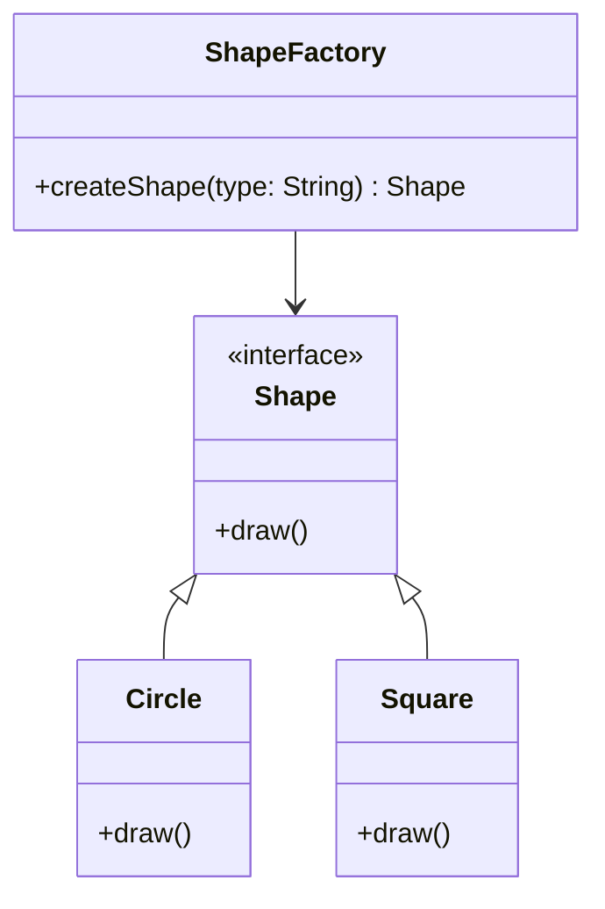
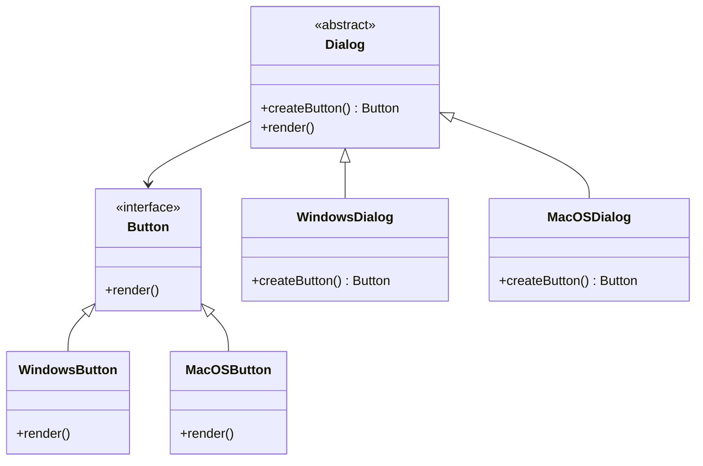
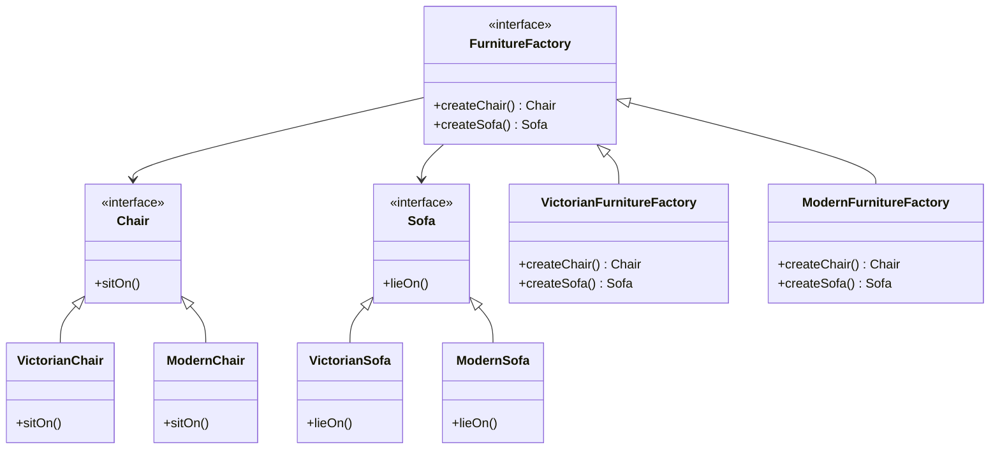

## 4.3 Factory Patterns

In the realm of software design, Factory Patterns play a pivotal role in managing object creation. They provide a way to encapsulate the instantiation process, allowing for more flexible and scalable code. In C++, Factory Patterns are particularly useful due to the language's complex type system and the need for efficient memory management. In this section, we will delve into three primary types of Factory Patterns: the Simple Factory Pattern, the Factory Method Pattern, and the Abstract Factory Pattern. Each of these patterns offers unique advantages and can be applied in different scenarios to enhance your software architecture.

### Simple Factory Pattern

#### Intent
The Simple Factory Pattern aims to encapsulate the object creation logic in a single place. It provides a static method that returns instances of different classes based on input parameters. This pattern is not a part of the Gang of Four (GoF) design patterns but is a widely used idiom in object-oriented programming.

#### Key Participants
- **Factory**: The class responsible for creating objects.
- **Product**: The interface or abstract class for the objects created by the factory.
- **ConcreteProduct**: The specific implementations of the Product interface.

#### Applicability
Use the Simple Factory Pattern when:
- You have a large number of subclasses that share a common interface.
- You want to centralize object creation logic to reduce code duplication.
- You need to control which specific class is instantiated based on input parameters.

#### Sample Code Snippet

```cpp
#include <iostream>
#include <memory>

// Product interface
class Shape {
public:
    virtual void draw() const = 0;
    virtual ~Shape() = default;
};

// ConcreteProduct: Circle
class Circle : public Shape {
public:
    void draw() const override {
        std::cout << "Drawing a Circle\n";
    }
};

// ConcreteProduct: Square
class Square : public Shape {
public:
    void draw() const override {
        std::cout << "Drawing a Square\n";
    }
};

// Factory class
class ShapeFactory {
public:
    static std::unique_ptr<Shape> createShape(const std::string& type) {
        if (type == "circle") {
            return std::make_unique<Circle>();
        } else if (type == "square") {
            return std::make_unique<Square>();
        }
        return nullptr;
    }
};

// Client code
int main() {
    auto circle = ShapeFactory::createShape("circle");
    if (circle) {
        circle->draw();
    }

    auto square = ShapeFactory::createShape("square");
    if (square) {
        square->draw();
    }

    return 0;
}
```

#### Design Considerations
- **Simplicity**: The Simple Factory Pattern is easy to implement and understand, making it a good starting point for managing object creation.
- **Scalability**: As the number of product types grows, the factory method can become unwieldy. Consider transitioning to a more sophisticated pattern if this becomes an issue.
- **Flexibility**: The pattern centralizes the creation logic, which can be both an advantage and a limitation. It simplifies maintenance but can lead to a single point of failure.

#### Differences and Similarities
- **Factory Method Pattern**: Unlike the Simple Factory, the Factory Method Pattern uses inheritance and polymorphism to delegate the instantiation process to subclasses.
- **Abstract Factory Pattern**: This pattern is more complex and is used to create families of related objects without specifying their concrete classes.

### Factory Method Pattern

#### Intent
The Factory Method Pattern defines an interface for creating an object but allows subclasses to alter the type of objects that will be created. It is a part of the GoF design patterns and promotes loose coupling by eliminating the need for the client to instantiate objects directly.

#### Key Participants
- **Product**: The interface or abstract class for objects created by the factory method.
- **ConcreteProduct**: The specific implementations of the Product interface.
- **Creator**: The abstract class that declares the factory method.
- **ConcreteCreator**: The subclasses that implement the factory method to create ConcreteProduct instances.

#### Applicability
Use the Factory Method Pattern when:
- A class cannot anticipate the class of objects it must create.
- A class wants its subclasses to specify the objects it creates.
- You want to localize the knowledge of which class gets created.

#### Sample Code Snippet

```cpp
#include <iostream>
#include <memory>

// Product interface
class Button {
public:
    virtual void render() const = 0;
    virtual ~Button() = default;
};

// ConcreteProduct: WindowsButton
class WindowsButton : public Button {
public:
    void render() const override {
        std::cout << "Rendering a Windows button\n";
    }
};

// ConcreteProduct: MacOSButton
class MacOSButton : public Button {
public:
    void render() const override {
        std::cout << "Rendering a MacOS button\n";
    }
};

// Creator class
class Dialog {
public:
    virtual std::unique_ptr<Button> createButton() const = 0;
    void render() const {
        auto button = createButton();
        button->render();
    }
    virtual ~Dialog() = default;
};

// ConcreteCreator: WindowsDialog
class WindowsDialog : public Dialog {
public:
    std::unique_ptr<Button> createButton() const override {
        return std::make_unique<WindowsButton>();
    }
};

// ConcreteCreator: MacOSDialog
class MacOSDialog : public Dialog {
public:
    std::unique_ptr<Button> createButton() const override {
        return std::make_unique<MacOSButton>();
    }
};

// Client code
int main() {
    std::unique_ptr<Dialog> dialog = std::make_unique<WindowsDialog>();
    dialog->render();

    dialog = std::make_unique<MacOSDialog>();
    dialog->render();

    return 0;
}
```

#### Design Considerations
- **Extensibility**: The Factory Method Pattern allows new product types to be added without modifying existing code.
- **Complexity**: This pattern introduces additional classes and interfaces, which can increase the complexity of the codebase.
- **Polymorphism**: It leverages polymorphism to allow subclasses to determine the concrete class of the object being created.

#### Differences and Similarities
- **Simple Factory Pattern**: The Factory Method Pattern is more flexible as it allows subclasses to decide which class to instantiate.
- **Abstract Factory Pattern**: While the Factory Method Pattern deals with a single product, the Abstract Factory Pattern involves creating families of related products.

### Abstract Factory Pattern

#### Intent
The Abstract Factory Pattern provides an interface for creating families of related or dependent objects without specifying their concrete classes. It is a part of the GoF design patterns and is useful when a system needs to be independent of how its objects are created.

#### Key Participants
- **AbstractFactory**: Declares an interface for operations that create abstract products.
- **ConcreteFactory**: Implements the operations to create concrete product objects.
- **AbstractProduct**: Declares an interface for a type of product object.
- **ConcreteProduct**: Defines a product object to be created by the corresponding concrete factory.
- **Client**: Uses only interfaces declared by AbstractFactory and AbstractProduct classes.

#### Applicability
Use the Abstract Factory Pattern when:
- A system should be independent of how its products are created, composed, and represented.
- A system should be configured with one of multiple families of products.
- You want to provide a library of products, and you only want to reveal their interfaces, not their implementations.

#### Sample Code Snippet

```cpp
#include <iostream>
#include <memory>

// AbstractProductA
class Chair {
public:
    virtual void sitOn() const = 0;
    virtual ~Chair() = default;
};

// ConcreteProductA1
class VictorianChair : public Chair {
public:
    void sitOn() const override {
        std::cout << "Sitting on a Victorian chair\n";
    }
};

// ConcreteProductA2
class ModernChair : public Chair {
public:
    void sitOn() const override {
        std::cout << "Sitting on a Modern chair\n";
    }
};

// AbstractProductB
class Sofa {
public:
    virtual void lieOn() const = 0;
    virtual ~Sofa() = default;
};

// ConcreteProductB1
class VictorianSofa : public Sofa {
public:
    void lieOn() const override {
        std::cout << "Lying on a Victorian sofa\n";
    }
};

// ConcreteProductB2
class ModernSofa : public Sofa {
public:
    void lieOn() const override {
        std::cout << "Lying on a Modern sofa\n";
    }
};

// AbstractFactory
class FurnitureFactory {
public:
    virtual std::unique_ptr<Chair> createChair() const = 0;
    virtual std::unique_ptr<Sofa> createSofa() const = 0;
    virtual ~FurnitureFactory() = default;
};

// ConcreteFactory1
class VictorianFurnitureFactory : public FurnitureFactory {
public:
    std::unique_ptr<Chair> createChair() const override {
        return std::make_unique<VictorianChair>();
    }
    std::unique_ptr<Sofa> createSofa() const override {
        return std::make_unique<VictorianSofa>();
    }
};

// ConcreteFactory2
class ModernFurnitureFactory : public FurnitureFactory {
public:
    std::unique_ptr<Chair> createChair() const override {
        return std::make_unique<ModernChair>();
    }
    std::unique_ptr<Sofa> createSofa() const override {
        return std::make_unique<ModernSofa>();
    }
};

// Client code
void clientCode(const FurnitureFactory& factory) {
    auto chair = factory.createChair();
    auto sofa = factory.createSofa();
    chair->sitOn();
    sofa->lieOn();
}

int main() {
    std::cout << "Client: Testing client code with the Victorian factory:\n";
    VictorianFurnitureFactory victorianFactory;
    clientCode(victorianFactory);

    std::cout << "\nClient: Testing the same client code with the Modern factory:\n";
    ModernFurnitureFactory modernFactory;
    clientCode(modernFactory);

    return 0;
}
```

#### Design Considerations
- **Scalability**: The Abstract Factory Pattern makes it easy to introduce new variants of products without changing existing code.
- **Complexity**: It can add complexity due to the increased number of classes and interfaces.
- **Consistency**: Ensures that products from the same family are used together, maintaining consistency in the system.

#### Differences and Similarities
- **Factory Method Pattern**: The Abstract Factory Pattern is more abstract and is used to create families of related objects, whereas the Factory Method Pattern deals with a single product.
- **Simple Factory Pattern**: The Abstract Factory Pattern is more structured and is used when there are multiple families of products.

### Visualizing Factory Patterns

To better understand the relationships and interactions between the components of the Factory Patterns, let's visualize them using Mermaid.js diagrams.

#### Simple Factory Pattern Diagram



#### Factory Method Pattern Diagram



#### Abstract Factory Pattern Diagram



### Try It Yourself

To deepen your understanding of Factory Patterns, try modifying the code examples provided:

1. **Add a New Shape**: Extend the Simple Factory Pattern by adding a new shape, such as a Triangle. Update the `ShapeFactory` to handle this new type.

2. **Extend the Factory Method Pattern**: Create a new type of dialog, such as a LinuxDialog, and implement the corresponding button.

3. **Experiment with Abstract Factory**: Add a new family of furniture, such as ArtDeco, and implement the corresponding products.

### Knowledge Check

- **What are the main differences between the Simple Factory and Factory Method Patterns?**
- **How does the Abstract Factory Pattern ensure consistency in a system?**
- **In what scenarios would you choose the Factory Method Pattern over the Simple Factory Pattern?**

### Embrace the Journey

Remember, mastering design patterns is a journey. As you experiment with these patterns, you'll gain insights into their strengths and limitations. Keep exploring, stay curious, and enjoy the process of becoming a more proficient C++ developer.

## Quiz Time!



### What is the primary purpose of the Simple Factory Pattern?

- [x] To encapsulate object creation logic in a single place.
- [ ] To define an interface for creating objects.
- [ ] To create families of related objects without specifying concrete classes.
- [ ] To manage object lifecycles.

> **Explanation:** The Simple Factory Pattern is designed to encapsulate the object creation logic in a single place, making it easier to manage and maintain.

### Which pattern allows subclasses to alter the type of objects that will be created?

- [ ] Simple Factory Pattern
- [x] Factory Method Pattern
- [ ] Abstract Factory Pattern
- [ ] Singleton Pattern

> **Explanation:** The Factory Method Pattern allows subclasses to determine which class to instantiate, providing flexibility in object creation.

### What is a key benefit of the Abstract Factory Pattern?

- [x] It allows for the creation of families of related objects without specifying their concrete classes.
- [ ] It simplifies the code by reducing the number of classes.
- [ ] It eliminates the need for polymorphism.
- [ ] It provides a single point of failure.

> **Explanation:** The Abstract Factory Pattern is beneficial because it allows for the creation of families of related objects without specifying their concrete classes, ensuring consistency.

### In the Factory Method Pattern, what role does the Creator class play?

- [x] It declares the factory method for creating objects.
- [ ] It implements the concrete product.
- [ ] It provides a static method for object creation.
- [ ] It manages the lifecycle of objects.

> **Explanation:** The Creator class in the Factory Method Pattern declares the factory method, which is responsible for creating objects.

### How does the Abstract Factory Pattern differ from the Factory Method Pattern?

- [x] The Abstract Factory Pattern deals with families of related objects, while the Factory Method Pattern deals with a single product.
- [ ] The Abstract Factory Pattern is simpler to implement.
- [ ] The Factory Method Pattern does not use polymorphism.
- [ ] The Abstract Factory Pattern is not part of the GoF design patterns.

> **Explanation:** The Abstract Factory Pattern is used to create families of related objects, whereas the Factory Method Pattern is focused on creating a single product.

### Which pattern is not part of the Gang of Four (GoF) design patterns?

- [x] Simple Factory Pattern
- [ ] Factory Method Pattern
- [ ] Abstract Factory Pattern
- [ ] Singleton Pattern

> **Explanation:** The Simple Factory Pattern is not part of the GoF design patterns, although it is a widely used idiom in object-oriented programming.

### What is a potential drawback of the Simple Factory Pattern?

- [x] It can lead to a single point of failure if not managed properly.
- [ ] It increases the number of classes in the codebase.
- [ ] It eliminates the need for interfaces.
- [ ] It complicates the object creation process.

> **Explanation:** The Simple Factory Pattern centralizes the creation logic, which can lead to a single point of failure if not managed properly.

### What is a key advantage of using the Factory Method Pattern?

- [x] It allows for extensibility by enabling new product types to be added without modifying existing code.
- [ ] It simplifies the code by reducing the number of classes.
- [ ] It eliminates the need for inheritance.
- [ ] It provides a single point of failure.

> **Explanation:** The Factory Method Pattern allows for extensibility by enabling new product types to be added without modifying existing code, making it a flexible choice.

### Which pattern is best suited for creating a library of products with only their interfaces exposed?

- [ ] Simple Factory Pattern
- [ ] Factory Method Pattern
- [x] Abstract Factory Pattern
- [ ] Singleton Pattern

> **Explanation:** The Abstract Factory Pattern is best suited for creating a library of products with only their interfaces exposed, ensuring that the implementation details are hidden.

### True or False: The Factory Method Pattern can be used to create families of related objects.

- [ ] True
- [x] False

> **Explanation:** False. The Factory Method Pattern is used to create a single product, whereas the Abstract Factory Pattern is used to create families of related objects.


