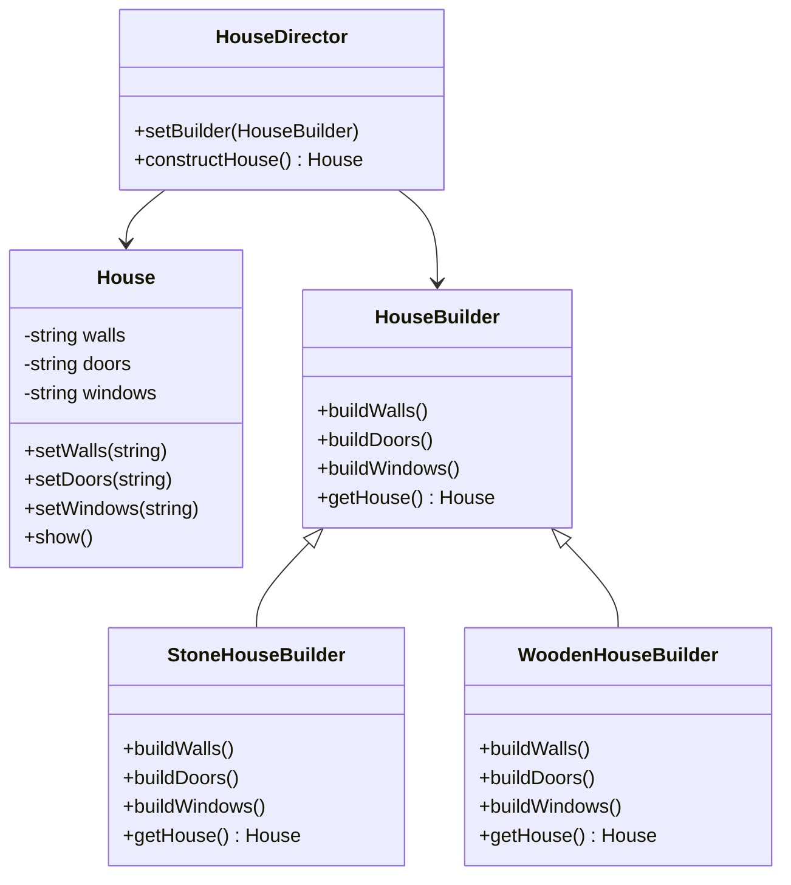

## 4.4 Builder Pattern

In the realm of software design patterns, the Builder Pattern stands out as a powerful technique for constructing complex objects step by step. This pattern is particularly useful when an object needs to be created with numerous optional components or configurations. In this section, we will delve into the intricacies of the Builder Pattern, its implementation in C++, and its role in fluent interface design and Director classes.

### Intent of the Builder Pattern

The primary intent of the Builder Pattern is to separate the construction of a complex object from its representation, allowing the same construction process to create different representations. This pattern is ideal when the construction process involves multiple steps or when the object being constructed requires various configurations.

### Key Participants

1. **Builder**: An abstract interface that defines the steps to build the product.
2. **ConcreteBuilder**: Implements the Builder interface to construct and assemble parts of the product.
3. **Director**: Constructs an object using the Builder interface.
4. **Product**: The complex object that is being built.

### Applicability

The Builder Pattern is applicable in scenarios where:

- The construction process of an object is complex and involves multiple steps.
- Different representations of the object are needed.
- The construction process needs to be independent of the parts that make up the object.

### Implementing the Builder Pattern in C++

Let's explore how to implement the Builder Pattern in C++ through a practical example. We'll create a `House` class that can have various components such as walls, doors, and windows. The construction of a house can vary based on different requirements, making it a perfect candidate for the Builder Pattern.

#### Step 1: Define the Product

First, we define the `House` class, which represents the complex object we want to build.

```cpp
#include <iostream>
#include <string>

class House {
public:
    void setWalls(const std::string& walls) { walls_ = walls; }
    void setDoors(const std::string& doors) { doors_ = doors; }
    void setWindows(const std::string& windows) { windows_ = windows; }
    void show() const {
        std::cout << "House with " << walls_ << ", " << doors_ << ", and " << windows_ << ".\n";
    }

private:
    std::string walls_;
    std::string doors_;
    std::string windows_;
};
```

#### Step 2: Create the Builder Interface

Next, we define the `HouseBuilder` interface, which specifies the steps required to build a house.

```cpp
class HouseBuilder {
public:
    virtual ~HouseBuilder() {}
    virtual void buildWalls() = 0;
    virtual void buildDoors() = 0;
    virtual void buildWindows() = 0;
    virtual House* getHouse() = 0;
};
```

#### Step 3: Implement Concrete Builders

We create concrete builders that implement the `HouseBuilder` interface. Each concrete builder can create a different type of house.

```cpp
class StoneHouseBuilder : public HouseBuilder {
public:
    StoneHouseBuilder() { house_ = new House(); }
    ~StoneHouseBuilder() { delete house_; }

    void buildWalls() override { house_->setWalls("Stone walls"); }
    void buildDoors() override { house_->setDoors("Wooden doors"); }
    void buildWindows() override { house_->setWindows("Glass windows"); }
    House* getHouse() override { return house_; }

private:
    House* house_;
};

class WoodenHouseBuilder : public HouseBuilder {
public:
    WoodenHouseBuilder() { house_ = new House(); }
    ~WoodenHouseBuilder() { delete house_; }

    void buildWalls() override { house_->setWalls("Wooden walls"); }
    void buildDoors() override { house_->setDoors("Wooden doors"); }
    void buildWindows() override { house_->setWindows("Plastic windows"); }
    House* getHouse() override { return house_; }

private:
    House* house_;
};
```

#### Step 4: Implement the Director

The Director class is responsible for managing the construction process. It uses a builder to construct the product.

```cpp
class HouseDirector {
public:
    void setBuilder(HouseBuilder* builder) { builder_ = builder; }
    House* constructHouse() {
        builder_->buildWalls();
        builder_->buildDoors();
        builder_->buildWindows();
        return builder_->getHouse();
    }

private:
    HouseBuilder* builder_;
};
```

#### Step 5: Client Code

Finally, the client code demonstrates how to use the Builder Pattern to construct different types of houses.

```cpp
int main() {
    HouseDirector director;

    StoneHouseBuilder stoneBuilder;
    director.setBuilder(&stoneBuilder);
    House* stoneHouse = director.constructHouse();
    stoneHouse->show();

    WoodenHouseBuilder woodenBuilder;
    director.setBuilder(&woodenBuilder);
    House* woodenHouse = director.constructHouse();
    woodenHouse->show();

    delete stoneHouse;
    delete woodenHouse;

    return 0;
}
```

### Fluent Interface Design

The Builder Pattern can be enhanced with a fluent interface design, which allows method chaining to improve readability and usability. In C++, this can be achieved by returning a reference to the builder object from each method.

#### Example of Fluent Interface

Let's modify our `HouseBuilder` to support a fluent interface.

```cpp
class FluentHouseBuilder {
public:
    FluentHouseBuilder& buildWalls(const std::string& walls) {
        house_.setWalls(walls);
        return *this;
    }

    FluentHouseBuilder& buildDoors(const std::string& doors) {
        house_.setDoors(doors);
        return *this;
    }

    FluentHouseBuilder& buildWindows(const std::string& windows) {
        house_.setWindows(windows);
        return *this;
    }

    House getHouse() const { return house_; }

private:
    House house_;
};
```

#### Using the Fluent Interface

The client code can now use the fluent interface to construct a house in a more readable manner.

```cpp
int main() {
    FluentHouseBuilder builder;
    House house = builder.buildWalls("Brick walls")
                        .buildDoors("Metal doors")
                        .buildWindows("Double-glazed windows")
                        .getHouse();
    house.show();

    return 0;
}
```

### Using Director Classes

The Director class plays a crucial role in the Builder Pattern by encapsulating the construction process. It ensures that the steps are executed in the correct order, which is particularly important for complex objects.

#### Benefits of Using Director Classes

- **Separation of Concerns**: The Director separates the construction logic from the representation of the product.
- **Reusability**: The same Director can be used with different builders to create various representations of the product.
- **Flexibility**: Changes to the construction process can be made in the Director without affecting the builders.

### Design Considerations

When implementing the Builder Pattern, consider the following:

- **Complexity vs. Simplicity**: Use the Builder Pattern when the construction process is complex. For simple objects, a straightforward constructor may suffice.
- **Memory Management**: Ensure proper memory management, especially if dynamic memory allocation is involved.
- **Thread Safety**: If the construction process is used in a multithreaded environment, ensure that it is thread-safe.

### Differences and Similarities

The Builder Pattern is often compared to the Factory Pattern. While both are creational patterns, they serve different purposes:

- **Builder Pattern**: Focuses on constructing a complex object step by step.
- **Factory Pattern**: Focuses on creating an object in a single step.

### Visualizing the Builder Pattern

To better understand the Builder Pattern, let's visualize its structure using a class diagram.



### Try It Yourself

To deepen your understanding of the Builder Pattern, try modifying the code examples:

- Add a new component to the `House` class, such as a roof, and update the builders accordingly.
- Implement a new `ConcreteBuilder` for a different type of house, such as a glass house.
- Experiment with the fluent interface by chaining additional methods.

### Knowledge Check

Before we conclude, let's reinforce what we've learned:

- **What is the primary intent of the Builder Pattern?**
- **How does a Director class contribute to the Builder Pattern?**
- **What are the benefits of using a fluent interface?**

### Embrace the Journey

Remember, mastering design patterns is a journey. As you continue to explore and apply these patterns, you'll enhance your ability to create robust and maintainable software. Keep experimenting, stay curious, and enjoy the process!

## Quiz Time!



### What is the primary intent of the Builder Pattern?

- [x] To separate the construction of a complex object from its representation
- [ ] To create a single instance of a class
- [ ] To provide a way to access elements of a collection sequentially
- [ ] To define a family of algorithms

> **Explanation:** The Builder Pattern separates the construction of a complex object from its representation, allowing the same construction process to create different representations.

### Which class in the Builder Pattern is responsible for managing the construction process?

- [ ] Product
- [x] Director
- [ ] Builder
- [ ] ConcreteBuilder

> **Explanation:** The Director class is responsible for managing the construction process by using the Builder interface.

### What is a key benefit of using a fluent interface in the Builder Pattern?

- [x] Improved readability and usability through method chaining
- [ ] Reduced memory usage
- [ ] Enhanced security
- [ ] Faster execution time

> **Explanation:** A fluent interface improves readability and usability by allowing method chaining, making the code more intuitive.

### In the Builder Pattern, what does the ConcreteBuilder do?

- [ ] Manages the construction process
- [ ] Defines the steps to build the product
- [x] Implements the Builder interface to construct and assemble parts of the product
- [ ] Represents the complex object being built

> **Explanation:** The ConcreteBuilder implements the Builder interface to construct and assemble parts of the product.

### How does the Builder Pattern differ from the Factory Pattern?

- [x] The Builder Pattern constructs objects step by step, while the Factory Pattern creates objects in a single step
- [ ] The Builder Pattern is used for creating singletons, while the Factory Pattern is not
- [ ] The Builder Pattern is used for creating collections, while the Factory Pattern is not
- [ ] The Builder Pattern is used for managing object lifecycles, while the Factory Pattern is not

> **Explanation:** The Builder Pattern constructs objects step by step, focusing on the construction process, whereas the Factory Pattern creates objects in a single step.

### What is the role of the Product class in the Builder Pattern?

- [x] To represent the complex object that is being built
- [ ] To manage the construction process
- [ ] To define the steps to build the product
- [ ] To implement the Builder interface

> **Explanation:** The Product class represents the complex object that is being built in the Builder Pattern.

### What is a potential drawback of the Builder Pattern?

- [x] Increased complexity for simple objects
- [ ] Lack of flexibility in object creation
- [ ] Difficulty in maintaining the code
- [ ] Inability to create different representations

> **Explanation:** The Builder Pattern can introduce unnecessary complexity for simple objects where a straightforward constructor might suffice.

### What is a common use case for the Builder Pattern?

- [x] Constructing objects with multiple optional components or configurations
- [ ] Creating a single instance of a class
- [ ] Accessing elements of a collection sequentially
- [ ] Defining a family of algorithms

> **Explanation:** The Builder Pattern is commonly used for constructing objects with multiple optional components or configurations.

### True or False: The Builder Pattern is ideal for constructing objects with a simple structure.

- [ ] True
- [x] False

> **Explanation:** False. The Builder Pattern is ideal for constructing complex objects with multiple steps or configurations, not simple structures.

### Which of the following is NOT a participant in the Builder Pattern?

- [ ] Builder
- [ ] Director
- [ ] Product
- [x] Singleton

> **Explanation:** Singleton is not a participant in the Builder Pattern. The participants are Builder, Director, ConcreteBuilder, and Product.


