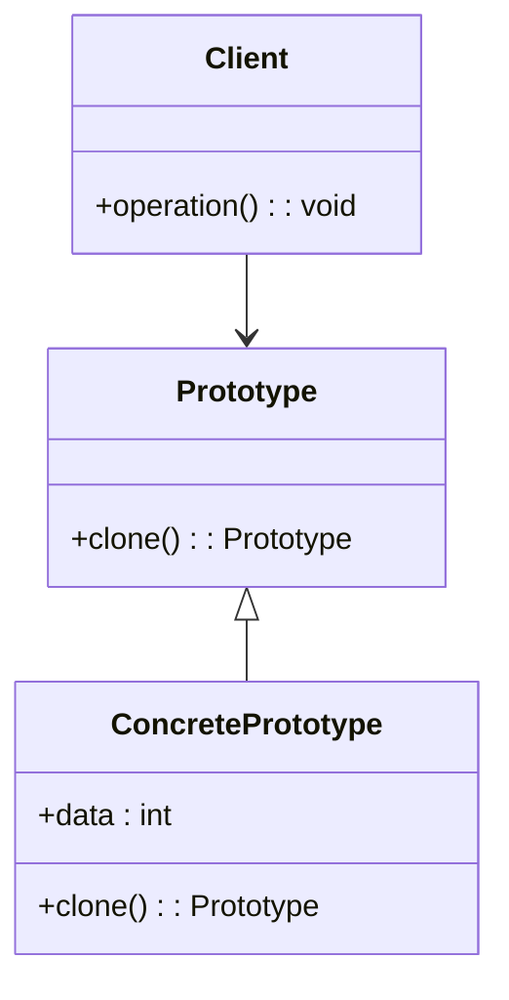

## 4.5 Prototype Pattern

The Prototype Pattern is a creational design pattern that allows you to create new objects by copying an existing object, known as the prototype. This pattern is particularly useful when the cost of creating a new instance of a class is more expensive than copying an existing instance. It also provides a way to avoid subclasses of an object creator in the client application, like the Factory Method Pattern, and offers a way to specify new objects by copying an existing prototype.

### Intent

The intent of the Prototype Pattern is to:

- Specify the kinds of objects to create using a prototypical instance.
- Create new objects by copying this prototype.
- Reduce the need for subclassing.
- Hide the complexities of creating new instances from the client.

### Key Participants

- **Prototype**: Declares an interface for cloning itself.
- **ConcretePrototype**: Implements the cloning operation.
- **Client**: Creates a new object by asking a prototype to clone itself.

### Applicability

Use the Prototype Pattern when:

- A system should be independent of how its products are created, composed, and represented.
- The classes to instantiate are specified at runtime.
- Avoiding the creation of a hierarchy of factory classes is desired.
- Instances of a class can have one of only a few different combinations of state.

### Implementing Cloning via Copy Constructors and `clone` Methods

In C++, cloning can be implemented using copy constructors and `clone` methods. The copy constructor is a special constructor in C++ used to create a new object as a copy of an existing object. The `clone` method is a custom method that you can define to perform the cloning operation.

#### Copy Constructors

A copy constructor is a member function that initializes an object using another object of the same class. Here’s a basic example:

```cpp
class Prototype {
public:
    int data;
    
    // Copy constructor
    Prototype(const Prototype& other) : data(other.data) {
        std::cout << "Copy constructor called" << std::endl;
    }
    
    // Regular constructor
    Prototype(int d) : data(d) {}
};

int main() {
    Prototype original(42);
    Prototype copy = original; // Calls the copy constructor
    std::cout << "Original data: " << original.data << ", Copy data: " << copy.data << std::endl;
    return 0;
}
```

#### Clone Method

The `clone` method provides a more flexible way to implement cloning, especially when dealing with polymorphism. Here’s how you can define and use a `clone` method:

```cpp
class Prototype {
public:
    virtual ~Prototype() {}
    virtual Prototype* clone() const = 0;
};

class ConcretePrototype : public Prototype {
public:
    int data;
    
    ConcretePrototype(int d) : data(d) {}
    
    // Implement the clone method
    Prototype* clone() const override {
        return new ConcretePrototype(*this);
    }
};

int main() {
    ConcretePrototype original(42);
    Prototype* copy = original.clone(); // Calls the clone method
    std::cout << "Original data: " << original.data << ", Copy data: " << static_cast<ConcretePrototype*>(copy)->data << std::endl;
    delete copy; // Don't forget to free the memory
    return 0;
}
```

### Deep Copying vs. Shallow Copying

Understanding the difference between deep copying and shallow copying is crucial when implementing the Prototype Pattern.

- **Shallow Copy**: Copies all the member field values. If the field value is a pointer, only the pointer is copied, not the object it points to.
  
- **Deep Copy**: Copies all fields, and makes copies of dynamically allocated memory pointed to by the fields.

#### Shallow Copy Example

```cpp
class ShallowPrototype {
public:
    int* data;
    
    ShallowPrototype(int value) {
        data = new int(value);
    }
    
    // Shallow copy constructor
    ShallowPrototype(const ShallowPrototype& other) : data(other.data) {}
    
    ~ShallowPrototype() {
        delete data;
    }
};

int main() {
    ShallowPrototype original(42);
    ShallowPrototype copy = original; // Shallow copy
    std::cout << "Original data: " << *original.data << ", Copy data: " << *copy.data << std::endl;
    return 0;
}
```

#### Deep Copy Example

```cpp
class DeepPrototype {
public:
    int* data;
    
    DeepPrototype(int value) {
        data = new int(value);
    }
    
    // Deep copy constructor
    DeepPrototype(const DeepPrototype& other) {
        data = new int(*other.data);
    }
    
    ~DeepPrototype() {
        delete data;
    }
};

int main() {
    DeepPrototype original(42);
    DeepPrototype copy = original; // Deep copy
    std::cout << "Original data: " << *original.data << ", Copy data: " << *copy.data << std::endl;
    return 0;
}
```

### Using Serialization for Cloning

Serialization is another technique for cloning objects, especially when dealing with complex objects or when you need to clone objects across different systems or languages. Serialization involves converting an object into a format that can be easily stored or transmitted and then reconstructing the object from this format.

#### Serialization Example

```cpp
#include <iostream>
#include <sstream>

class SerializablePrototype {
public:
    int data;
    
    SerializablePrototype(int d) : data(d) {}
    
    std::string serialize() const {
        std::ostringstream oss;
        oss << data;
        return oss.str();
    }
    
    static SerializablePrototype deserialize(const std::string& str) {
        std::istringstream iss(str);
        int data;
        iss >> data;
        return SerializablePrototype(data);
    }
};

int main() {
    SerializablePrototype original(42);
    std::string serialized = original.serialize();
    SerializablePrototype copy = SerializablePrototype::deserialize(serialized);
    std::cout << "Original data: " << original.data << ", Copy data: " << copy.data << std::endl;
    return 0;
}
```

### Design Considerations

When implementing the Prototype Pattern, consider the following:

- **Clone Method**: Ensure that the `clone` method is implemented correctly to handle deep copying where necessary.
- **Resource Management**: Be cautious with resource management, especially when dealing with dynamically allocated memory.
- **Performance**: Cloning can be more efficient than creating a new instance from scratch, but it can also be resource-intensive if not managed properly.
- **Polymorphism**: The Prototype Pattern works well with polymorphic classes, allowing for flexible and dynamic object creation.

### Differences and Similarities

The Prototype Pattern is often compared to other creational patterns like the Factory Method and Abstract Factory. Here are some key differences and similarities:

- **Prototype vs. Factory Method**: The Factory Method creates objects through inheritance, while the Prototype Pattern creates objects by copying an existing instance.
- **Prototype vs. Abstract Factory**: Both patterns aim to decouple the creation of objects from their usage. However, the Prototype Pattern uses cloning, whereas the Abstract Factory uses factory methods to create families of related objects.

### Visualizing the Prototype Pattern

To better understand the Prototype Pattern, let's visualize it using a class diagram.



### Try It Yourself

Experiment with the Prototype Pattern by modifying the code examples:

1. **Add More Fields**: Extend the `ConcretePrototype` class with additional fields and ensure the `clone` method handles them correctly.
2. **Implement a New Prototype**: Create a new class that implements the `Prototype` interface and test cloning with different data types.
3. **Test Serialization**: Modify the serialization example to handle more complex data structures or different data types.

### Knowledge Check

To reinforce your understanding, consider the following questions:

- What are the key differences between deep copying and shallow copying?
- How does the Prototype Pattern differ from the Factory Method Pattern?
- What are the potential pitfalls of using the Prototype Pattern in C++?

### Embrace the Journey

Remember, mastering design patterns like the Prototype Pattern is a journey. As you continue to explore and apply these patterns, you'll become more adept at building robust and scalable C++ applications. Keep experimenting, stay curious, and enjoy the process!

## Quiz Time!



### What is the primary purpose of the Prototype Pattern?

- [x] To create new objects by copying existing ones.
- [ ] To define a family of algorithms.
- [ ] To provide a way to access the elements of an aggregate object sequentially.
- [ ] To separate the construction of a complex object from its representation.

> **Explanation:** The Prototype Pattern is used to create new objects by copying existing ones, which is its primary purpose.

### Which of the following is a key participant in the Prototype Pattern?

- [x] Prototype
- [ ] Factory
- [ ] Observer
- [ ] Strategy

> **Explanation:** The Prototype is a key participant in the Prototype Pattern, responsible for declaring an interface for cloning itself.

### What is a shallow copy?

- [x] A copy that duplicates all field values, but not the objects they point to.
- [ ] A copy that duplicates all field values and the objects they point to.
- [ ] A copy that only duplicates primitive data types.
- [ ] A copy that duplicates objects but not their field values.

> **Explanation:** A shallow copy duplicates all field values, but if the field is a pointer, it only copies the pointer, not the object it points to.

### How does a deep copy differ from a shallow copy?

- [x] A deep copy duplicates all fields and the objects they point to.
- [ ] A deep copy only duplicates primitive data types.
- [ ] A deep copy only duplicates objects but not their field values.
- [ ] A deep copy duplicates all field values, but not the objects they point to.

> **Explanation:** A deep copy duplicates all fields and makes copies of dynamically allocated memory pointed to by the fields.

### What method is commonly used in C++ to implement cloning?

- [x] clone()
- [ ] create()
- [ ] build()
- [ ] generate()

> **Explanation:** The `clone()` method is commonly used in C++ to implement cloning in the Prototype Pattern.

### What is the role of the Client in the Prototype Pattern?

- [x] To create new objects by asking a prototype to clone itself.
- [ ] To define a family of algorithms.
- [ ] To provide a way to access the elements of an aggregate object sequentially.
- [ ] To separate the construction of a complex object from its representation.

> **Explanation:** The Client in the Prototype Pattern creates new objects by asking a prototype to clone itself.

### Which pattern is often compared to the Prototype Pattern?

- [x] Factory Method
- [ ] Observer
- [ ] Strategy
- [ ] Singleton

> **Explanation:** The Factory Method Pattern is often compared to the Prototype Pattern, as both deal with object creation.

### What is a common pitfall when using the Prototype Pattern?

- [x] Resource management issues with dynamically allocated memory.
- [ ] Difficulty in defining a family of algorithms.
- [ ] Complexity in separating the construction of a complex object from its representation.
- [ ] Challenges in providing a way to access the elements of an aggregate object sequentially.

> **Explanation:** Resource management issues, especially with dynamically allocated memory, are a common pitfall when using the Prototype Pattern.

### True or False: The Prototype Pattern can be used to avoid subclassing.

- [x] True
- [ ] False

> **Explanation:** True. The Prototype Pattern can be used to avoid subclassing by creating new objects through cloning instead of subclassing.

### Which of the following is NOT a benefit of the Prototype Pattern?

- [x] It provides a way to define a family of algorithms.
- [ ] It reduces the need for subclassing.
- [ ] It hides the complexities of creating new instances from the client.
- [ ] It allows for dynamic and flexible object creation.

> **Explanation:** The Prototype Pattern does not provide a way to define a family of algorithms; this is the role of the Strategy Pattern.


