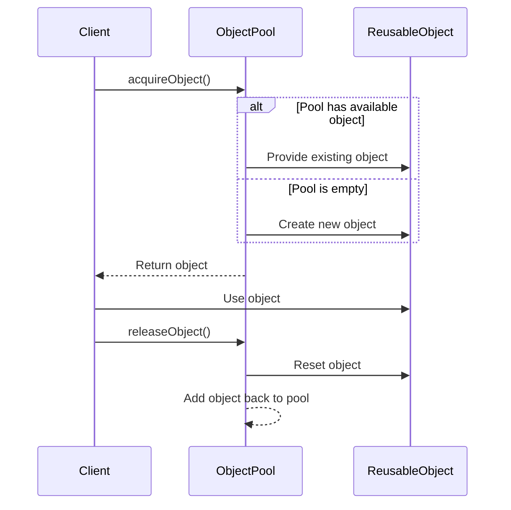

## 4.6 Object Pool Pattern

In the realm of software design patterns, the Object Pool Pattern stands out as a powerful tool for optimizing performance and managing resources efficiently. This pattern is particularly useful in scenarios where the cost of object creation is high, and the application requires a large number of objects that are similar in nature. By reusing objects from a pool rather than creating and destroying them repeatedly, we can significantly enhance the performance of our applications.

### Intent

The primary intent of the Object Pool Pattern is to manage the reuse of objects that are expensive to create. By maintaining a pool of reusable objects, this pattern minimizes the overhead associated with object creation and destruction, thus improving application performance and resource utilization.

### Key Participants

1. **Object Pool**: Manages the lifecycle of pooled objects, including their creation, reuse, and destruction.
2. **Reusable Object**: The object that is being managed by the pool and reused across different parts of the application.
3. **Client**: The entity that requests objects from the pool and returns them after use.

### Applicability

The Object Pool Pattern is applicable in scenarios where:

- Object creation is resource-intensive, involving complex initialization or significant memory allocation.
- A large number of similar objects are required simultaneously.
- The cost of creating and destroying objects frequently is higher than reusing existing ones.
- Applications require efficient resource management, such as in game development, database connections, or network socket management.

### Managing Object Pools for Performance

Managing an object pool involves several key considerations to ensure optimal performance and resource utilization:

1. **Initialization**: Pre-allocate a set of objects during the initialization phase to avoid delays during runtime.
2. **Object Lifecycle Management**: Implement mechanisms to track the availability and usage of objects within the pool.
3. **Dynamic Sizing**: Adjust the size of the pool dynamically based on the application's load and resource availability.
4. **Resource Cleanup**: Ensure proper cleanup of resources when objects are no longer needed or when the application shuts down.

### Synchronization in Multithreaded Environments

In multithreaded environments, synchronization is crucial to ensure that multiple threads can safely access and modify the object pool. Key strategies include:

- **Mutexes and Locks**: Use mutexes or locks to protect critical sections where the pool is accessed or modified.
- **Thread-Safe Data Structures**: Utilize thread-safe data structures to manage the pool efficiently.
- **Atomic Operations**: Leverage atomic operations to perform lock-free updates to the pool's state.

### Sample Code Snippet

Let's explore a simple implementation of the Object Pool Pattern in C++:

```cpp
#include <iostream>
#include <vector>
#include <memory>
#include <mutex>

class ReusableObject {
public:
    void reset() {
        // Reset the object's state
    }
};

class ObjectPool {
private:
    std::vector<std::unique_ptr<ReusableObject>> pool;
    std::mutex poolMutex;

public:
    std::unique_ptr<ReusableObject> acquireObject() {
        std::lock_guard<std::mutex> lock(poolMutex);
        if (!pool.empty()) {
            std::unique_ptr<ReusableObject> obj = std::move(pool.back());
            pool.pop_back();
            return obj;
        }
        return std::make_unique<ReusableObject>();
    }

    void releaseObject(std::unique_ptr<ReusableObject> obj) {
        std::lock_guard<std::mutex> lock(poolMutex);
        obj->reset();
        pool.push_back(std::move(obj));
    }
};

int main() {
    ObjectPool objectPool;
    auto obj = objectPool.acquireObject();
    // Use the object
    objectPool.releaseObject(std::move(obj));
    return 0;
}
```

**Explanation:**

- **ReusableObject**: Represents the object that will be pooled and reused.
- **ObjectPool**: Manages the pool of reusable objects, providing methods to acquire and release objects.
- **Mutex**: Ensures thread-safe access to the pool in a multithreaded environment.

### Design Considerations

When implementing the Object Pool Pattern, consider the following:

- **Pool Size**: Determine an optimal pool size based on the application's requirements and resource constraints.
- **Object Initialization**: Ensure that objects are properly initialized and reset before being reused.
- **Performance Trade-offs**: Balance the overhead of managing the pool with the performance gains from object reuse.
- **Thread Safety**: Implement appropriate synchronization mechanisms to handle concurrent access to the pool.

### Differences and Similarities

The Object Pool Pattern is often compared to other creational patterns such as the Factory Pattern and the Singleton Pattern. Here are some key differences and similarities:

- **Factory Pattern**: Focuses on creating new instances, whereas the Object Pool Pattern emphasizes reusing existing instances.
- **Singleton Pattern**: Ensures a single instance of a class, while the Object Pool Pattern manages multiple instances for reuse.
- **Resource Management**: Both the Object Pool and Singleton Patterns can be used for resource management, but the Object Pool Pattern is more suited for scenarios requiring multiple reusable objects.

### Try It Yourself

To deepen your understanding of the Object Pool Pattern, try modifying the sample code:

- **Experiment with Pool Size**: Adjust the initial pool size and observe the impact on performance.
- **Implement Custom Reset Logic**: Customize the `reset` method in `ReusableObject` to handle specific reset logic for your application.
- **Add Logging**: Introduce logging to track object acquisition and release, helping you analyze the pool's behavior.

### Visualizing the Object Pool Pattern

To better understand the Object Pool Pattern, let's visualize the flow of object acquisition and release using a sequence diagram:



**Diagram Explanation:**

- The client requests an object from the pool.
- If the pool has an available object, it is provided to the client; otherwise, a new object is created.
- The client uses the object and then releases it back to the pool.
- The pool resets the object and adds it back for future reuse.

### Knowledge Check

Before we conclude, let's reinforce our understanding with a few questions:

1. **What is the primary intent of the Object Pool Pattern?**
   - To manage the reuse of objects that are expensive to create.

2. **In what scenarios is the Object Pool Pattern most applicable?**
   - When object creation is resource-intensive, and a large number of similar objects are required.

3. **How can we ensure thread safety in a multithreaded environment when using the Object Pool Pattern?**
   - By using mutexes, locks, and thread-safe data structures.

### Embrace the Journey

Remember, mastering the Object Pool Pattern is just one step in your journey to becoming an expert in C++ design patterns. As you continue to explore and apply these patterns, you'll gain deeper insights into building efficient, scalable, and maintainable software. Keep experimenting, stay curious, and enjoy the process of learning and growing as a software engineer!

## Quiz Time!



### What is the primary purpose of the Object Pool Pattern?

- [x] To manage the reuse of objects that are expensive to create
- [ ] To ensure a class has only one instance
- [ ] To encapsulate object creation logic
- [ ] To provide a unified interface to a set of interfaces

> **Explanation:** The Object Pool Pattern is designed to manage the reuse of objects that are expensive to create, improving performance by minimizing the overhead of object creation and destruction.

### Which of the following is a key participant in the Object Pool Pattern?

- [x] Object Pool
- [ ] Factory
- [ ] Singleton
- [ ] Adapter

> **Explanation:** The Object Pool is a key participant in the Object Pool Pattern, responsible for managing the lifecycle of pooled objects.

### In what scenario is the Object Pool Pattern most applicable?

- [x] When object creation is resource-intensive and a large number of similar objects are required
- [ ] When only one instance of a class is needed
- [ ] When creating families of related objects without specifying concrete classes
- [ ] When providing a unified interface to a set of interfaces

> **Explanation:** The Object Pool Pattern is most applicable when object creation is resource-intensive and a large number of similar objects are required.

### How can we ensure thread safety in a multithreaded environment when using the Object Pool Pattern?

- [x] By using mutexes and locks
- [ ] By using only single-threaded applications
- [ ] By avoiding object reuse
- [ ] By using global variables

> **Explanation:** Thread safety can be ensured by using mutexes and locks to protect critical sections where the pool is accessed or modified.

### What is a potential drawback of the Object Pool Pattern?

- [x] Increased complexity in managing the pool
- [ ] Inability to create new objects
- [ ] Lack of thread safety
- [ ] Limited to single-threaded applications

> **Explanation:** A potential drawback of the Object Pool Pattern is the increased complexity in managing the pool, including synchronization and lifecycle management.

### Which pattern is often compared to the Object Pool Pattern due to its focus on object creation?

- [x] Factory Pattern
- [ ] Singleton Pattern
- [ ] Adapter Pattern
- [ ] Observer Pattern

> **Explanation:** The Factory Pattern is often compared to the Object Pool Pattern due to its focus on object creation, though the Factory Pattern emphasizes creating new instances rather than reusing existing ones.

### What is the role of the Reusable Object in the Object Pool Pattern?

- [x] The object that is being managed by the pool and reused
- [ ] The entity that requests objects from the pool
- [ ] The mechanism for synchronizing access to the pool
- [ ] The interface for creating objects

> **Explanation:** The Reusable Object is the object that is being managed by the pool and reused across different parts of the application.

### What is a common method to track the availability of objects in an Object Pool?

- [x] Using a vector or list to store available objects
- [ ] Using global variables
- [ ] Using a single instance
- [ ] Using inheritance

> **Explanation:** A common method to track the availability of objects in an Object Pool is by using a vector or list to store available objects.

### Which of the following is NOT a benefit of the Object Pool Pattern?

- [x] Ensures only one instance of a class
- [ ] Reduces the overhead of object creation
- [ ] Improves application performance
- [ ] Efficient resource utilization

> **Explanation:** Ensuring only one instance of a class is a benefit of the Singleton Pattern, not the Object Pool Pattern.

### True or False: The Object Pool Pattern can be used in both single-threaded and multithreaded applications.

- [x] True
- [ ] False

> **Explanation:** The Object Pool Pattern can be used in both single-threaded and multithreaded applications, with appropriate synchronization mechanisms for thread safety in multithreaded environments.




