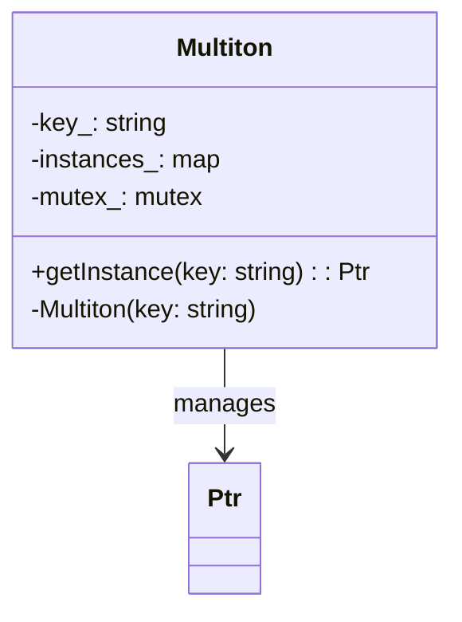

## 4.7 Multiton Pattern

In the world of software design patterns, the Multiton pattern stands out as a powerful tool for managing a limited number of instances of a class. While the Singleton pattern ensures a single instance, the Multiton pattern allows for multiple instances, each identified by a unique key. This pattern is particularly useful in scenarios where multiple instances of a class are needed, but their number should be controlled and managed efficiently.

### Intent

The intent of the Multiton pattern is to ensure that a class has a limited number of instances, each associated with a unique key. It provides a global point of access to these instances, ensuring that the same instance is returned for a given key.

### Key Participants

1. **Multiton Class**: The class that manages the instances.
2. **Instances**: The actual objects being managed.
3. **Key**: A unique identifier for each instance.

### Applicability

Use the Multiton pattern when:

- You need to manage a fixed number of instances of a class.
- Each instance should be uniquely identified by a key.
- You want to ensure that the same instance is returned for a given key.

### Implementing the Multiton Pattern

Let's dive into the implementation of the Multiton pattern in C++. We'll start by defining a class that manages instances using a static map to store and retrieve them based on a unique key.

```cpp
#include <iostream>
#include <map>
#include <memory>
#include <mutex>
#include <string>

class Multiton {
public:
    using Ptr = std::shared_ptr<Multiton>;

    // Static method to get the instance associated with a key
    static Ptr getInstance(const std::string& key) {
        std::lock_guard<std::mutex> lock(mutex_);
        auto it = instances_.find(key);
        if (it == instances_.end()) {
            it = instances_.emplace(key, std::make_shared<Multiton>(key)).first;
        }
        return it->second;
    }

    // Method to demonstrate functionality
    void show() const {
        std::cout << "Instance with key: " << key_ << std::endl;
    }

private:
    // Private constructor to prevent direct instantiation
    Multiton(const std::string& key) : key_(key) {}

    std::string key_;
    static std::map<std::string, Ptr> instances_;
    static std::mutex mutex_;
};

// Initialize static members
std::map<std::string, Multiton::Ptr> Multiton::instances_;
std::mutex Multiton::mutex_;

int main() {
    auto instance1 = Multiton::getInstance("First");
    auto instance2 = Multiton::getInstance("Second");
    auto instance3 = Multiton::getInstance("First");

    instance1->show();
    instance2->show();
    instance3->show();

    return 0;
}
```

#### Explanation

- **Static Map**: We use a static map to store instances of the class, indexed by a unique key.
- **Mutex**: A mutex is used to ensure thread safety when accessing the map.
- **Shared Pointers**: Instances are stored as `std::shared_ptr` to manage their lifetimes automatically.
- **Private Constructor**: The constructor is private to prevent direct instantiation.

### Design Considerations

- **Thread Safety**: Ensure that access to the instance map is thread-safe, especially in a multithreaded environment.
- **Memory Management**: Use smart pointers to manage the lifetimes of instances.
- **Key Management**: Decide on a strategy for generating and managing keys.

### Differences and Similarities

- **Singleton vs. Multiton**: While Singleton restricts a class to a single instance, Multiton allows multiple instances, each identified by a key.
- **Factory Method**: Like the Factory Method, Multiton involves creating instances, but it also manages their uniqueness and lifecycle.

### Use Cases and Examples

#### Configuration Management

In applications where different configurations are needed for different modules, the Multiton pattern can manage configuration instances, each identified by a module name.

```cpp
class Configuration {
public:
    static std::shared_ptr<Configuration> getConfig(const std::string& moduleName) {
        return Multiton::getInstance(moduleName);
    }

    void setParameter(const std::string& param, const std::string& value) {
        parameters_[param] = value;
    }

    std::string getParameter(const std::string& param) const {
        auto it = parameters_.find(param);
        return it != parameters_.end() ? it->second : "";
    }

private:
    Configuration(const std::string& moduleName) : moduleName_(moduleName) {}

    std::string moduleName_;
    std::map<std::string, std::string> parameters_;
};
```

#### Database Connections

For applications requiring multiple database connections, each identified by a connection string or database name, the Multiton pattern can manage these connections efficiently.

```cpp
class DatabaseConnection {
public:
    static std::shared_ptr<DatabaseConnection> getConnection(const std::string& dbName) {
        return Multiton::getInstance(dbName);
    }

    void query(const std::string& sql) {
        std::cout << "Executing query on database " << dbName_ << ": " << sql << std::endl;
    }

private:
    DatabaseConnection(const std::string& dbName) : dbName_(dbName) {}

    std::string dbName_;
};
```

### Visualizing the Multiton Pattern

To better understand the Multiton pattern, let's visualize it using a class diagram.



**Diagram Description**: The diagram shows the Multiton class managing instances through a map, with each instance identified by a key. The `getInstance` method provides access to these instances.

### Try It Yourself

Experiment with the Multiton pattern by modifying the code examples:

- **Add New Keys**: Try adding more keys and retrieving instances for them.
- **Thread Safety**: Test the code in a multithreaded environment to ensure thread safety.
- **Custom Keys**: Implement a custom key generation strategy.

### Knowledge Check

- **What is the primary purpose of the Multiton pattern?**
- **How does the Multiton pattern differ from the Singleton pattern?**
- **What are some common use cases for the Multiton pattern?**

### Embrace the Journey

Remember, mastering design patterns is a journey. As you explore the Multiton pattern, consider how it fits into your software architecture. Keep experimenting, stay curious, and enjoy the process!

### References and Links

- [C++ Reference](https://en.cppreference.com/)
- [Design Patterns: Elements of Reusable Object-Oriented Software](https://en.wikipedia.org/wiki/Design_Patterns)

## Quiz Time!



### What is the primary purpose of the Multiton pattern?

- [x] To manage a limited number of instances of a class, each identified by a unique key.
- [ ] To ensure a class has only one instance.
- [ ] To provide a global point of access to a single instance.
- [ ] To create instances without specifying their concrete classes.

> **Explanation:** The Multiton pattern manages multiple instances of a class, each identified by a unique key, unlike the Singleton pattern which ensures only one instance.

### How does the Multiton pattern differ from the Singleton pattern?

- [x] Multiton allows multiple instances, each identified by a key, while Singleton restricts to a single instance.
- [ ] Multiton restricts to a single instance, while Singleton allows multiple instances.
- [ ] Both patterns restrict to a single instance.
- [ ] Both patterns allow multiple instances.

> **Explanation:** The Singleton pattern restricts a class to a single instance, whereas the Multiton pattern allows multiple instances, each associated with a unique key.

### Which of the following is a common use case for the Multiton pattern?

- [x] Managing database connections identified by connection strings.
- [ ] Ensuring a class has only one instance.
- [ ] Providing a global point of access to a single instance.
- [ ] Creating instances without specifying their concrete classes.

> **Explanation:** The Multiton pattern is useful for managing multiple database connections, each identified by a unique connection string.

### What is a key consideration when implementing the Multiton pattern in a multithreaded environment?

- [x] Ensuring thread safety when accessing the instance map.
- [ ] Using raw pointers to manage instance lifetimes.
- [ ] Allowing direct instantiation of the class.
- [ ] Avoiding the use of unique keys.

> **Explanation:** Thread safety is crucial when multiple threads might access the instance map simultaneously, hence the use of mutexes.

### In the Multiton pattern, what is the role of the key?

- [x] To uniquely identify each instance.
- [ ] To restrict the class to a single instance.
- [ ] To provide a global point of access.
- [ ] To create instances without specifying their concrete classes.

> **Explanation:** The key in the Multiton pattern uniquely identifies each instance, allowing for controlled access and management.

### Which C++ feature is commonly used to manage the lifetimes of instances in the Multiton pattern?

- [x] Smart pointers (e.g., `std::shared_ptr`).
- [ ] Raw pointers.
- [ ] Global variables.
- [ ] Static methods.

> **Explanation:** Smart pointers like `std::shared_ptr` are used to manage the lifetimes of instances automatically, preventing memory leaks.

### What is the purpose of using a mutex in the Multiton pattern?

- [x] To ensure thread safety when accessing shared resources.
- [ ] To allow direct instantiation of the class.
- [ ] To restrict the class to a single instance.
- [ ] To provide a global point of access.

> **Explanation:** A mutex is used to ensure that access to shared resources, like the instance map, is thread-safe in a multithreaded environment.

### How can the Multiton pattern be tested for thread safety?

- [x] By running the code in a multithreaded environment and checking for race conditions.
- [ ] By using raw pointers to manage instances.
- [ ] By allowing direct instantiation of the class.
- [ ] By avoiding the use of unique keys.

> **Explanation:** Testing the Multiton pattern in a multithreaded environment helps identify race conditions and ensure thread safety.

### Which of the following best describes the Multiton pattern?

- [x] A pattern that manages a limited number of instances, each identified by a unique key.
- [ ] A pattern that ensures a class has only one instance.
- [ ] A pattern that provides a global point of access to a single instance.
- [ ] A pattern that creates instances without specifying their concrete classes.

> **Explanation:** The Multiton pattern manages multiple instances, each identified by a unique key, allowing for controlled access and management.

### True or False: The Multiton pattern is suitable for scenarios where only one instance of a class is needed.

- [ ] True
- [x] False

> **Explanation:** The Multiton pattern is not suitable for scenarios where only one instance is needed; the Singleton pattern is more appropriate for such cases.



---
