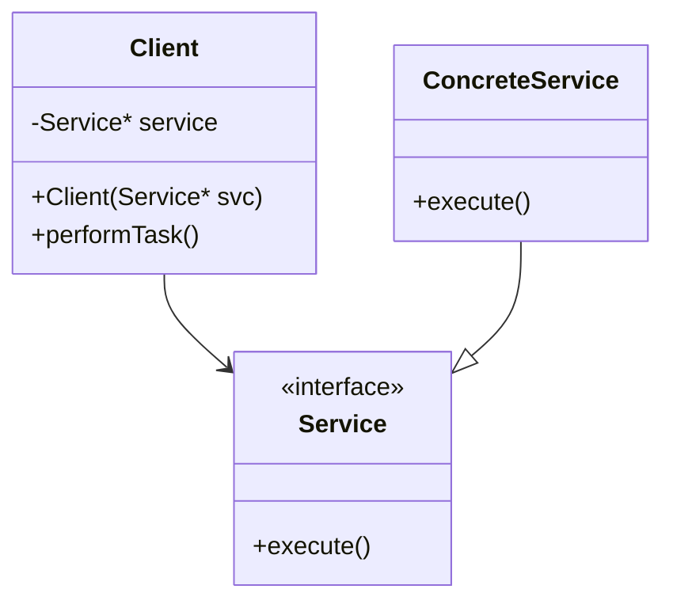

## 4.8 Dependency Injection

In modern software development, managing dependencies between objects is crucial for creating flexible and maintainable code. Dependency Injection (DI) is a design pattern that helps achieve this by decoupling the creation of an object from its dependencies. This section will explore how to implement DI in C++ using various techniques, understand the principles of Inversion of Control (IoC), and introduce DI frameworks available for C++.

### What is Dependency Injection?

Dependency Injection is a design pattern used to implement IoC, allowing the creation of dependent objects outside of a class and providing those objects to a class in various ways. This pattern is essential for creating software that is easy to test, maintain, and extend.

#### Key Concepts

- **Inversion of Control (IoC):** A principle where the control of object creation and lifecycle is inverted from the class itself to an external entity.
- **Dependency Injection Container:** A framework or library that manages object creation and lifecycle, injecting dependencies where needed.

### Types of Dependency Injection

There are three primary types of Dependency Injection:

1. **Constructor Injection:** Dependencies are provided through a class constructor.
2. **Setter Injection:** Dependencies are provided through setter methods.
3. **Interface Injection:** Dependencies are provided through an interface that the class implements.

Let's delve into each type with examples.

#### Constructor Injection

Constructor Injection involves passing dependencies to a class via its constructor. This method ensures that a class is always in a valid state since its dependencies are provided at the time of instantiation.

**Example:**

```cpp
#include <iostream>
#include <memory>

// Interface for a service
class Service {
public:
    virtual void execute() = 0;
};

// Concrete implementation of the service
class ConcreteService : public Service {
public:
    void execute() override {
        std::cout << "Executing ConcreteService" << std::endl;
    }
};

// Client class that depends on the Service
class Client {
private:
    std::shared_ptr<Service> service;

public:
    // Constructor Injection
    Client(std::shared_ptr<Service> svc) : service(svc) {}

    void performTask() {
        service->execute();
    }
};

int main() {
    std::shared_ptr<Service> service = std::make_shared<ConcreteService>();
    Client client(service);
    client.performTask();
    return 0;
}
```

In this example, the `Client` class depends on the `Service` interface. The `ConcreteService` is injected into the `Client` via its constructor, promoting loose coupling.

#### Setter Injection

Setter Injection involves providing dependencies through setter methods after the object is constructed. This approach offers flexibility, allowing dependencies to be changed at runtime.

**Example:**

```cpp
#include <iostream>
#include <memory>

// Interface for a service
class Service {
public:
    virtual void execute() = 0;
};

// Concrete implementation of the service
class ConcreteService : public Service {
public:
    void execute() override {
        std::cout << "Executing ConcreteService" << std::endl;
    }
};

// Client class that depends on the Service
class Client {
private:
    std::shared_ptr<Service> service;

public:
    // Setter Injection
    void setService(std::shared_ptr<Service> svc) {
        service = svc;
    }

    void performTask() {
        if (service) {
            service->execute();
        } else {
            std::cout << "No service available" << std::endl;
        }
    }
};

int main() {
    std::shared_ptr<Service> service = std::make_shared<ConcreteService>();
    Client client;
    client.setService(service);
    client.performTask();
    return 0;
}
```

Here, the `Client` class uses a setter method to receive its dependency. This method allows changing the `Service` implementation without modifying the `Client` class.

#### Interface Injection

Interface Injection requires the class to implement an interface that exposes a method for injecting the dependency. This method is less common in C++ due to the language's static nature.

**Example:**

```cpp
#include <iostream>
#include <memory>

// Interface for a service
class Service {
public:
    virtual void execute() = 0;
};

// Interface for injecting the service
class ServiceInjector {
public:
    virtual void injectService(std::shared_ptr<Service> svc) = 0;
};

// Concrete implementation of the service
class ConcreteService : public Service {
public:
    void execute() override {
        std::cout << "Executing ConcreteService" << std::endl;
    }
};

// Client class that implements the ServiceInjector interface
class Client : public ServiceInjector {
private:
    std::shared_ptr<Service> service;

public:
    // Interface Injection
    void injectService(std::shared_ptr<Service> svc) override {
        service = svc;
    }

    void performTask() {
        if (service) {
            service->execute();
        } else {
            std::cout << "No service available" << std::endl;
        }
    }
};

int main() {
    std::shared_ptr<Service> service = std::make_shared<ConcreteService>();
    Client client;
    client.injectService(service);
    client.performTask();
    return 0;
}
```

In this example, the `Client` class implements the `ServiceInjector` interface, allowing the injection of a `Service` instance.

### Inversion of Control Principles

Inversion of Control (IoC) is a broader concept that encompasses Dependency Injection. It refers to the inversion of the flow of control in a program, where the framework or runtime controls the execution flow, not the application code.

#### Benefits of IoC

- **Decoupling:** IoC decouples the execution of a task from its implementation, making the code more modular.
- **Testability:** By decoupling dependencies, IoC makes unit testing easier.
- **Flexibility:** IoC allows for easy swapping of implementations without changing the dependent code.

### DI Frameworks for C++

Several frameworks facilitate Dependency Injection in C++. Some popular ones include:

#### Poco

Poco is a C++ library that provides a range of functionalities, including Dependency Injection. It offers a flexible and powerful DI container.

#### Spring for C++

Spring for C++ is inspired by the popular Java framework, providing similar DI capabilities for C++ applications.

### Implementing DI with Poco

Poco provides a DI container that can be used to manage dependencies in C++ applications. Here's a simple example of using Poco for Dependency Injection:

```cpp
#include <Poco/DI/Injector.h>
#include <Poco/DI/Provider.h>
#include <iostream>

// Interface for a service
class Service {
public:
    virtual void execute() = 0;
};

// Concrete implementation of the service
class ConcreteService : public Service {
public:
    void execute() override {
        std::cout << "Executing ConcreteService" << std::endl;
    }
};

// Client class that depends on the Service
class Client {
private:
    std::shared_ptr<Service> service;

public:
    // Constructor Injection
    Client(std::shared_ptr<Service> svc) : service(svc) {}

    void performTask() {
        service->execute();
    }
};

int main() {
    Poco::DI::Injector injector;
    injector.registerProvider<Service, ConcreteService>();

    std::shared_ptr<Service> service = injector.get<Service>();
    Client client(service);
    client.performTask();
    return 0;
}
```

In this example, Poco's DI container is used to manage the creation and injection of the `Service` dependency into the `Client` class.

### Design Considerations

When implementing Dependency Injection, consider the following:

- **Complexity:** DI can introduce complexity, especially in large systems. Ensure that the benefits outweigh the added complexity.
- **Performance:** While DI improves flexibility and testability, it may introduce a slight performance overhead due to the indirection of dependency resolution.
- **Configuration:** DI often requires configuration, either through code or external files. Ensure that configuration is manageable and maintainable.

### Differences and Similarities

Dependency Injection is often confused with other patterns like Service Locator. While both manage dependencies, DI injects dependencies directly, whereas Service Locator provides a mechanism to look up dependencies.

### Visualizing Dependency Injection

To better understand Dependency Injection, let's visualize the process using a class diagram.



**Diagram Description:** This class diagram illustrates the relationship between the `Client`, `Service`, and `ConcreteService` classes. The `Client` depends on the `Service` interface, and `ConcreteService` implements this interface. Dependency Injection is used to provide the `ConcreteService` instance to the `Client`.

### Try It Yourself

To deepen your understanding of Dependency Injection, try modifying the examples provided:

- **Experiment with Different Implementations:** Replace `ConcreteService` with another implementation and observe how easy it is to swap dependencies.
- **Combine Injection Methods:** Use both constructor and setter injection in a single class to see how they can complement each other.
- **Implement a Simple DI Container:** Create a basic DI container to manage dependencies in a small project.

### Knowledge Check

Before moving on, let's review some key points about Dependency Injection:

- **What are the three types of Dependency Injection?**
- **How does Dependency Injection promote loose coupling?**
- **What is the role of a DI container?**

### Conclusion

Dependency Injection is a powerful design pattern that enhances the flexibility, testability, and maintainability of C++ applications. By understanding and applying DI principles, you can create software that is easier to manage and extend. As you continue your journey in mastering C++ design patterns, remember that Dependency Injection is just one tool in your toolkit—use it wisely to build robust and scalable applications.

## Quiz Time!



### What is Dependency Injection?

- [x] A design pattern that decouples object creation from its dependencies.
- [ ] A pattern that tightly couples objects.
- [ ] A method for directly accessing global variables.
- [ ] A way to create objects without dependencies.

> **Explanation:** Dependency Injection is a design pattern that decouples the creation of an object from its dependencies, promoting loose coupling.

### Which of the following is NOT a type of Dependency Injection?

- [ ] Constructor Injection
- [ ] Setter Injection
- [x] Factory Injection
- [ ] Interface Injection

> **Explanation:** Factory Injection is not a recognized type of Dependency Injection. The three main types are Constructor, Setter, and Interface Injection.

### What principle does Dependency Injection implement?

- [x] Inversion of Control
- [ ] Single Responsibility Principle
- [ ] Open/Closed Principle
- [ ] Liskov Substitution Principle

> **Explanation:** Dependency Injection implements the Inversion of Control principle by inverting the control of object creation and lifecycle.

### What is the role of a DI container?

- [x] To manage object creation and lifecycle, injecting dependencies where needed.
- [ ] To store all global variables.
- [ ] To execute all functions in a program.
- [ ] To compile the code.

> **Explanation:** A DI container manages object creation and lifecycle, injecting dependencies into classes that require them.

### How does Constructor Injection provide dependencies?

- [x] Through the class constructor.
- [ ] Through setter methods.
- [ ] Through an interface.
- [ ] Through a global variable.

> **Explanation:** Constructor Injection provides dependencies via the class constructor, ensuring that a class is always in a valid state.

### What is a potential drawback of using Dependency Injection?

- [x] It can introduce complexity.
- [ ] It makes code less flexible.
- [ ] It reduces testability.
- [ ] It tightly couples objects.

> **Explanation:** While DI improves flexibility and testability, it can introduce complexity, especially in large systems.

### Which framework is NOT typically used for Dependency Injection in C++?

- [ ] Poco
- [ ] Spring for C++
- [x] Django
- [ ] Boost.DI

> **Explanation:** Django is a web framework for Python, not typically used for Dependency Injection in C++.

### What is the benefit of using a DI container?

- [x] It simplifies dependency management and promotes loose coupling.
- [ ] It increases the complexity of code.
- [ ] It makes testing more difficult.
- [ ] It requires more manual configuration.

> **Explanation:** A DI container simplifies dependency management, promotes loose coupling, and makes testing easier.

### What is Inversion of Control?

- [x] A principle where the control of object creation and lifecycle is inverted from the class itself to an external entity.
- [ ] A method for directly accessing global variables.
- [ ] A way to create objects without dependencies.
- [ ] A pattern that tightly couples objects.

> **Explanation:** Inversion of Control is a principle where the control of object creation and lifecycle is inverted from the class itself to an external entity.

### True or False: Dependency Injection can be implemented using global variables.

- [ ] True
- [x] False

> **Explanation:** Dependency Injection should not be implemented using global variables as it promotes loose coupling and testability, which global variables do not support.


