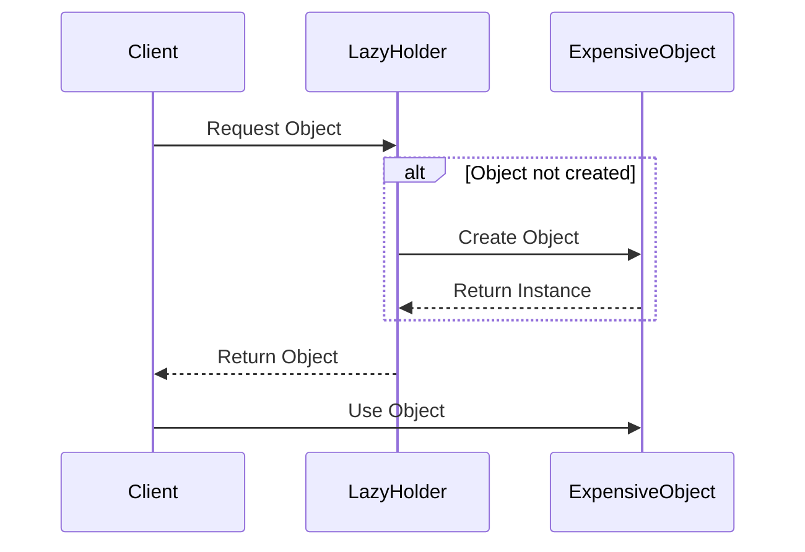

## 4.9 Lazy Initialization

In the realm of software design patterns, **Lazy Initialization** stands out as a powerful technique for optimizing resource usage and improving application performance. By deferring the creation of an object until it is actually needed, lazy initialization can significantly reduce the overhead associated with resource-intensive objects, especially in scenarios where these objects may not always be required during the execution of a program.

### Intent

The primary intent of lazy initialization is to delay the instantiation of an object until it is actually needed. This can lead to improved performance, reduced memory consumption, and better resource management. Lazy initialization is particularly useful in scenarios where the cost of creating an object is high, or when the object may not be used at all during the program's execution.

### Key Participants

- **Client**: The entity that requests the object.
- **Lazy Holder**: The component responsible for managing the lazy initialization of the object.
- **Actual Object**: The object whose creation is deferred until it is needed.

### Applicability

Lazy initialization is applicable in the following scenarios:

- **Resource-Intensive Objects**: When objects are expensive to create in terms of time or memory.
- **Conditional Object Usage**: When objects may not be used during every execution of the program.
- **Optimization**: When optimizing startup time or memory usage is a priority.

### Implementing Lazy Initialization Safely

Implementing lazy initialization in C++ requires careful consideration to ensure thread safety and proper resource management. Let's explore some techniques and best practices for implementing lazy initialization safely.

#### Basic Lazy Initialization

The simplest form of lazy initialization involves checking whether an object has been created before accessing it. If the object has not been created, it is instantiated at that point.

```cpp
class ExpensiveObject {
public:
    ExpensiveObject() {
        // Simulate expensive initialization
        std::cout << "ExpensiveObject created\n";
    }
    void doSomething() {
        std::cout << "Doing something\n";
    }
};

class LazyHolder {
private:
    ExpensiveObject* obj = nullptr;

public:
    ~LazyHolder() {
        delete obj;
    }

    ExpensiveObject* getObject() {
        if (!obj) {
            obj = new ExpensiveObject();
        }
        return obj;
    }
};

int main() {
    LazyHolder holder;
    // Object is created only when needed
    holder.getObject()->doSomething();
    return 0;
}
```

In this example, the `ExpensiveObject` is only created when `getObject()` is called for the first time. This approach is simple but has some drawbacks, such as potential memory leaks and lack of thread safety.

#### Thread-Safe Lazy Initialization

To make lazy initialization thread-safe, we can use synchronization primitives to ensure that the object is created only once, even when accessed by multiple threads.

```cpp
#include <mutex>

class ThreadSafeLazyHolder {
private:
    ExpensiveObject* obj = nullptr;
    std::mutex mtx;

public:
    ~ThreadSafeLazyHolder() {
        delete obj;
    }

    ExpensiveObject* getObject() {
        std::lock_guard<std::mutex> lock(mtx);
        if (!obj) {
            obj = new ExpensiveObject();
        }
        return obj;
    }
};
```

In this version, a `std::mutex` is used to protect the creation of the `ExpensiveObject`, ensuring that it is only created once, even in a multithreaded environment.

#### Using `std::optional`

C++17 introduced `std::optional`, which provides a convenient way to represent optional values. We can use `std::optional` to manage the lazy initialization of an object.

```cpp
#include <optional>

class OptionalLazyHolder {
private:
    std::optional<ExpensiveObject> obj;

public:
    ExpensiveObject& getObject() {
        if (!obj.has_value()) {
            obj.emplace();
        }
        return *obj;
    }
};
```

With `std::optional`, we avoid manual memory management, reducing the risk of memory leaks. The `emplace()` function constructs the object in place, ensuring efficient initialization.

#### Using `std::function`

Another approach to lazy initialization is using `std::function` to encapsulate the creation logic of the object. This can be particularly useful when the initialization logic is complex or involves multiple steps.

```cpp
#include <functional>

class FunctionLazyHolder {
private:
    std::function<ExpensiveObject()> initializer;
    std::optional<ExpensiveObject> obj;

public:
    FunctionLazyHolder(std::function<ExpensiveObject()> init)
        : initializer(init) {}

    ExpensiveObject& getObject() {
        if (!obj.has_value()) {
            obj = initializer();
        }
        return *obj;
    }
};

int main() {
    FunctionLazyHolder holder([]() {
        // Complex initialization logic
        return ExpensiveObject();
    });
    holder.getObject().doSomething();
    return 0;
}
```

In this example, `std::function` is used to encapsulate the initialization logic, providing flexibility in how the object is created.

### Design Considerations

When implementing lazy initialization, consider the following:

- **Thread Safety**: Ensure that the object is created only once in a multithreaded environment.
- **Memory Management**: Use smart pointers or `std::optional` to manage object lifetimes and avoid memory leaks.
- **Performance**: Consider the trade-offs between lazy initialization and eager initialization, especially in performance-critical applications.

### Differences and Similarities

Lazy initialization is often compared to other creational patterns like Singleton. While both patterns involve controlling the instantiation of an object, lazy initialization focuses on deferring creation until necessary, whereas Singleton ensures a single instance of a class.

### Visualizing Lazy Initialization

Let's visualize the lazy initialization process using a sequence diagram to better understand the flow of control.



In this diagram, the `Client` requests the object from the `LazyHolder`. If the object has not been created, the `LazyHolder` creates it and returns the instance to the `Client`.

### Try It Yourself

Experiment with the provided code examples by making the following modifications:

1. **Add Logging**: Introduce logging to track when the object is created and used.
2. **Thread Safety**: Modify the basic lazy initialization example to make it thread-safe.
3. **Complex Initialization**: Use `std::function` to encapsulate a more complex initialization process, such as reading configuration from a file.

### References and Links

For further reading on lazy initialization and related concepts, consider the following resources:

- [C++ Reference for std::optional](https://en.cppreference.com/w/cpp/utility/optional)
- [C++ Reference for std::function](https://en.cppreference.com/w/cpp/utility/functional/function)
- [Concurrency in C++](https://en.cppreference.com/w/cpp/thread)

### Knowledge Check

Let's reinforce your understanding of lazy initialization with some questions and exercises:

- **Question**: What are the benefits of using lazy initialization in a resource-intensive application?
- **Exercise**: Implement a thread-safe lazy initialization for a class that reads data from a database.

### Embrace the Journey

Remember, mastering lazy initialization is just one step in your journey to becoming an expert in C++ design patterns. Keep experimenting, stay curious, and enjoy the process of learning and applying these powerful techniques in your software projects.

## Quiz Time!



### What is the primary intent of lazy initialization?

- [x] To delay the instantiation of an object until it is actually needed
- [ ] To ensure a class has only one instance
- [ ] To encapsulate object creation logic
- [ ] To provide a unified interface to a set of interfaces

> **Explanation:** The primary intent of lazy initialization is to defer the creation of an object until it is actually needed, optimizing resource usage.

### Which C++ feature introduced in C++17 can be used for managing lazy initialization?

- [x] std::optional
- [ ] std::vector
- [ ] std::map
- [ ] std::array

> **Explanation:** C++17 introduced `std::optional`, which can be used to manage optional values and facilitate lazy initialization.

### What is a key consideration when implementing lazy initialization in a multithreaded environment?

- [x] Thread safety
- [ ] Code readability
- [ ] Memory alignment
- [ ] Algorithm complexity

> **Explanation:** Ensuring thread safety is crucial when implementing lazy initialization in a multithreaded environment to prevent race conditions.

### How can `std::function` be useful in lazy initialization?

- [x] It can encapsulate complex initialization logic
- [ ] It provides a way to manage memory automatically
- [ ] It ensures thread safety
- [ ] It simplifies object destruction

> **Explanation:** `std::function` can encapsulate complex initialization logic, allowing for flexible and deferred object creation.

### Which of the following is a drawback of basic lazy initialization without thread safety?

- [x] Potential race conditions
- [ ] Increased memory usage
- [ ] Slower object creation
- [ ] Reduced code readability

> **Explanation:** Basic lazy initialization without thread safety can lead to race conditions when accessed by multiple threads.

### What is the role of the Lazy Holder in lazy initialization?

- [x] To manage the lazy initialization of the object
- [ ] To request the object from the client
- [ ] To perform operations on the object
- [ ] To encapsulate the object's functionality

> **Explanation:** The Lazy Holder is responsible for managing the lazy initialization of the object, ensuring it is created only when needed.

### Which of the following is a benefit of using `std::optional` for lazy initialization?

- [x] Avoids manual memory management
- [ ] Ensures thread safety
- [ ] Simplifies object destruction
- [ ] Provides a unified interface

> **Explanation:** `std::optional` helps avoid manual memory management, reducing the risk of memory leaks.

### What is a common use case for lazy initialization?

- [x] Resource-intensive objects
- [ ] Simple data structures
- [ ] Constant values
- [ ] Static variables

> **Explanation:** Lazy initialization is commonly used for resource-intensive objects to optimize performance and resource usage.

### True or False: Lazy initialization can help improve application startup time.

- [x] True
- [ ] False

> **Explanation:** Lazy initialization can improve application startup time by deferring the creation of resource-intensive objects until they are needed.

### What is a potential pitfall of using lazy initialization?

- [x] Increased complexity in managing object lifetimes
- [ ] Reduced memory usage
- [ ] Simplified code structure
- [ ] Improved performance in all scenarios

> **Explanation:** Lazy initialization can increase complexity in managing object lifetimes, especially in multithreaded environments.


