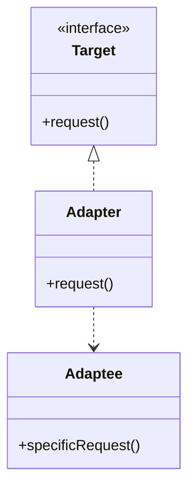
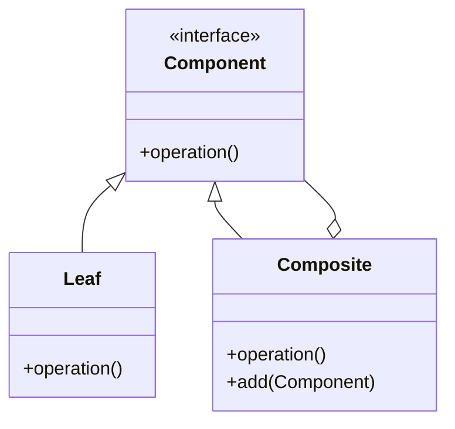

## 5.1 Overview of Structural Patterns

In the realm of software design, structural patterns play a pivotal role in organizing object structures to ensure that systems are both efficient and maintainable. These patterns help developers manage relationships between entities, allowing for more flexible and scalable designs. In this section, we will delve into the world of structural patterns in C++, exploring their intent, key participants, applicability, and how they can be implemented using modern C++ features.

### Understanding Structural Patterns

Structural patterns are concerned with how classes and objects are composed to form larger structures. Unlike creational patterns, which deal with object creation, or behavioral patterns, which focus on object interaction, structural patterns provide solutions for assembling objects and classes into complex systems. They help manage dependencies and relationships, making it easier to extend and modify systems without affecting existing code.

### Key Structural Patterns

Let's explore some of the most commonly used structural patterns in C++:

1. **Adapter Pattern**
2. **Bridge Pattern**
3. **Composite Pattern**
4. **Decorator Pattern**
5. **Facade Pattern**
6. **Flyweight Pattern**
7. **Proxy Pattern**

Each of these patterns addresses specific challenges in software design, and understanding their nuances is crucial for any expert software engineer or architect.

### Adapter Pattern

**Intent:** The Adapter Pattern allows incompatible interfaces to work together. It acts as a bridge between two incompatible interfaces by converting the interface of a class into another interface that clients expect.

**Key Participants:**
- **Target:** Defines the domain-specific interface that the client uses.
- **Adapter:** Adapts the interface of the Adaptee to the Target interface.
- **Adaptee:** Defines an existing interface that needs adapting.
- **Client:** Collaborates with objects conforming to the Target interface.

**Applicability:** Use the Adapter Pattern when you want to use an existing class, and its interface does not match the one you need.

**Sample Code Snippet:**

```cpp
// Target interface
class Target {
public:
    virtual void request() const = 0;
};

// Adaptee class with an incompatible interface
class Adaptee {
public:
    void specificRequest() const {
        std::cout << "Adaptee's specific request." << std::endl;
    }
};

// Adapter class
class Adapter : public Target {
private:
    Adaptee& adaptee;
public:
    Adapter(Adaptee& a) : adaptee(a) {}
    void request() const override {
        adaptee.specificRequest();
    }
};

// Client code
void clientCode(const Target& target) {
    target.request();
}

int main() {
    Adaptee adaptee;
    Adapter adapter(adaptee);
    clientCode(adapter);
    return 0;
}
```

**Design Considerations:** The Adapter Pattern is particularly useful when integrating legacy systems with new components. It allows for the reuse of existing code without modification.

**Differences and Similarities:** The Adapter Pattern is often confused with the Bridge Pattern. While both involve abstraction, the Adapter Pattern is about making two incompatible interfaces compatible, whereas the Bridge Pattern separates abstraction from implementation.

### Bridge Pattern

**Intent:** The Bridge Pattern decouples an abstraction from its implementation, allowing the two to vary independently. It is useful when both the abstractions and their implementations should be extensible by subclassing.

**Key Participants:**
- **Abstraction:** Defines the abstraction's interface and maintains a reference to an object of type Implementor.
- **RefinedAbstraction:** Extends the interface defined by Abstraction.
- **Implementor:** Defines the interface for implementation classes.
- **ConcreteImplementor:** Implements the Implementor interface.

**Applicability:** Use the Bridge Pattern when you want to avoid a permanent binding between an abstraction and its implementation.

**Sample Code Snippet:**

```cpp
// Implementor interface
class Implementor {
public:
    virtual void operationImpl() const = 0;
};

// ConcreteImplementor A
class ConcreteImplementorA : public Implementor {
public:
    void operationImpl() const override {
        std::cout << "ConcreteImplementorA operation." << std::endl;
    }
};

// ConcreteImplementor B
class ConcreteImplementorB : public Implementor {
public:
    void operationImpl() const override {
        std::cout << "ConcreteImplementorB operation." << std::endl;
    }
};

// Abstraction
class Abstraction {
protected:
    Implementor* implementor;
public:
    Abstraction(Implementor* impl) : implementor(impl) {}
    virtual void operation() const {
        implementor->operationImpl();
    }
};

// RefinedAbstraction
class RefinedAbstraction : public Abstraction {
public:
    RefinedAbstraction(Implementor* impl) : Abstraction(impl) {}
    void operation() const override {
        std::cout << "RefinedAbstraction operation." << std::endl;
        implementor->operationImpl();
    }
};

// Client code
int main() {
    ConcreteImplementorA implA;
    RefinedAbstraction refinedA(&implA);
    refinedA.operation();

    ConcreteImplementorB implB;
    RefinedAbstraction refinedB(&implB);
    refinedB.operation();

    return 0;
}
```

**Design Considerations:** The Bridge Pattern is beneficial when you want to share an implementation among multiple objects and hide implementation details from clients.

**Differences and Similarities:** The Bridge Pattern is similar to the Adapter Pattern but focuses on separating abstraction from implementation rather than making incompatible interfaces work together.

### Composite Pattern

**Intent:** The Composite Pattern allows you to compose objects into tree structures to represent part-whole hierarchies. It lets clients treat individual objects and compositions of objects uniformly.

**Key Participants:**
- **Component:** Declares the interface for objects in the composition.
- **Leaf:** Represents leaf objects in the composition.
- **Composite:** Defines behavior for components having children and stores child components.

**Applicability:** Use the Composite Pattern when you want to represent part-whole hierarchies of objects.

**Sample Code Snippet:**

```cpp
// Component interface
class Component {
public:
    virtual void operation() const = 0;
};

// Leaf class
class Leaf : public Component {
public:
    void operation() const override {
        std::cout << "Leaf operation." << std::endl;
    }
};

// Composite class
class Composite : public Component {
private:
    std::vector<Component*> children;
public:
    void add(Component* component) {
        children.push_back(component);
    }
    void operation() const override {
        for (const auto& child : children) {
            child->operation();
        }
    }
};

// Client code
int main() {
    Leaf leaf1, leaf2;
    Composite composite;
    composite.add(&leaf1);
    composite.add(&leaf2);
    composite.operation();

    return 0;
}
```

**Design Considerations:** The Composite Pattern is useful for building complex structures from simple components. It allows for easy addition of new component types.

**Differences and Similarities:** The Composite Pattern is often compared to the Decorator Pattern. While both involve recursive composition, the Composite Pattern focuses on part-whole hierarchies, whereas the Decorator Pattern adds responsibilities to objects.

### Decorator Pattern

**Intent:** The Decorator Pattern attaches additional responsibilities to an object dynamically. It provides a flexible alternative to subclassing for extending functionality.

**Key Participants:**
- **Component:** Defines the interface for objects that can have responsibilities added to them.
- **ConcreteComponent:** Defines an object to which additional responsibilities can be attached.
- **Decorator:** Maintains a reference to a Component object and defines an interface conforming to Component's interface.
- **ConcreteDecorator:** Adds responsibilities to the component.

**Applicability:** Use the Decorator Pattern to add responsibilities to individual objects dynamically and transparently.

**Sample Code Snippet:**

```cpp
// Component interface
class Component {
public:
    virtual void operation() const = 0;
};

// ConcreteComponent class
class ConcreteComponent : public Component {
public:
    void operation() const override {
        std::cout << "ConcreteComponent operation." << std::endl;
    }
};

// Decorator class
class Decorator : public Component {
protected:
    Component* component;
public:
    Decorator(Component* comp) : component(comp) {}
    void operation() const override {
        component->operation();
    }
};

// ConcreteDecorator class
class ConcreteDecorator : public Decorator {
public:
    ConcreteDecorator(Component* comp) : Decorator(comp) {}
    void operation() const override {
        Decorator::operation();
        std::cout << "ConcreteDecorator operation." << std::endl;
    }
};

// Client code
int main() {
    ConcreteComponent component;
    ConcreteDecorator decorator(&component);
    decorator.operation();

    return 0;
}
```

**Design Considerations:** The Decorator Pattern is ideal for adding functionality to objects without affecting other objects of the same class. It provides greater flexibility than static inheritance.

**Differences and Similarities:** The Decorator Pattern is similar to the Composite Pattern but focuses on adding responsibilities rather than composing objects into tree structures.

### Facade Pattern

**Intent:** The Facade Pattern provides a unified interface to a set of interfaces in a subsystem. It defines a higher-level interface that makes the subsystem easier to use.

**Key Participants:**
- **Facade:** Provides a simple interface to the complex subsystem.
- **Subsystem Classes:** Implement subsystem functionality and handle work assigned by the Facade.

**Applicability:** Use the Facade Pattern when you want to provide a simple interface to a complex subsystem.

**Sample Code Snippet:**

```cpp
// Subsystem classes
class SubsystemA {
public:
    void operationA() const {
        std::cout << "SubsystemA operation." << std::endl;
    }
};

class SubsystemB {
public:
    void operationB() const {
        std::cout << "SubsystemB operation." << std::endl;
    }
};

// Facade class
class Facade {
private:
    SubsystemA subsystemA;
    SubsystemB subsystemB;
public:
    void operation() const {
        subsystemA.operationA();
        subsystemB.operationB();
    }
};

// Client code
int main() {
    Facade facade;
    facade.operation();

    return 0;
}
```

**Design Considerations:** The Facade Pattern simplifies the interface of a complex system, making it easier to use. It is particularly useful when working with legacy systems.

**Differences and Similarities:** The Facade Pattern is often compared to the Adapter Pattern. While both provide a simplified interface, the Facade Pattern simplifies a complex subsystem, whereas the Adapter Pattern makes two incompatible interfaces work together.

### Flyweight Pattern

**Intent:** The Flyweight Pattern is used to minimize memory usage by sharing as much data as possible with similar objects. It is particularly useful for large numbers of similar objects.

**Key Participants:**
- **Flyweight:** Declares an interface through which flyweights can receive and act on extrinsic state.
- **ConcreteFlyweight:** Implements the Flyweight interface and stores intrinsic state.
- **FlyweightFactory:** Creates and manages flyweight objects.

**Applicability:** Use the Flyweight Pattern when you need to create a large number of similar objects to save memory.

**Sample Code Snippet:**

```cpp
// Flyweight interface
class Flyweight {
public:
    virtual void operation(int extrinsicState) const = 0;
};

// ConcreteFlyweight class
class ConcreteFlyweight : public Flyweight {
private:
    int intrinsicState;
public:
    ConcreteFlyweight(int state) : intrinsicState(state) {}
    void operation(int extrinsicState) const override {
        std::cout << "ConcreteFlyweight: intrinsic = " << intrinsicState
                  << ", extrinsic = " << extrinsicState << std::endl;
    }
};

// FlyweightFactory class
class FlyweightFactory {
private:
    std::unordered_map<int, Flyweight*> flyweights;
public:
    Flyweight* getFlyweight(int key) {
        if (flyweights.find(key) == flyweights.end()) {
            flyweights[key] = new ConcreteFlyweight(key);
        }
        return flyweights[key];
    }
};

// Client code
int main() {
    FlyweightFactory factory;
    Flyweight* flyweight1 = factory.getFlyweight(1);
    Flyweight* flyweight2 = factory.getFlyweight(2);
    flyweight1->operation(10);
    flyweight2->operation(20);

    return 0;
}
```

**Design Considerations:** The Flyweight Pattern is effective for reducing memory usage, but it requires careful management of shared state.

**Differences and Similarities:** The Flyweight Pattern is similar to the Singleton Pattern in that both aim to reduce memory usage. However, the Flyweight Pattern focuses on sharing state among many objects, whereas the Singleton Pattern ensures a single instance of a class.

### Proxy Pattern

**Intent:** The Proxy Pattern provides a surrogate or placeholder for another object to control access to it. It is useful for lazy initialization, access control, logging, and more.

**Key Participants:**
- **Subject:** Defines the common interface for RealSubject and Proxy.
- **RealSubject:** Represents the real object that the proxy represents.
- **Proxy:** Maintains a reference to the RealSubject and controls access to it.

**Applicability:** Use the Proxy Pattern when you need to control access to an object.

**Sample Code Snippet:**

```cpp
// Subject interface
class Subject {
public:
    virtual void request() const = 0;
};

// RealSubject class
class RealSubject : public Subject {
public:
    void request() const override {
        std::cout << "RealSubject request." << std::endl;
    }
};

// Proxy class
class Proxy : public Subject {
private:
    RealSubject* realSubject;
public:
    Proxy() : realSubject(new RealSubject()) {}
    ~Proxy() {
        delete realSubject;
    }
    void request() const override {
        std::cout << "Proxy request." << std::endl;
        realSubject->request();
    }
};

// Client code
int main() {
    Proxy proxy;
    proxy.request();

    return 0;
}
```

**Design Considerations:** The Proxy Pattern is versatile and can be used for various purposes, including lazy initialization and access control.

**Differences and Similarities:** The Proxy Pattern is similar to the Decorator Pattern, but while the Decorator Pattern adds responsibilities, the Proxy Pattern controls access.

### Visualizing Structural Patterns

To better understand how structural patterns work, let's visualize some of these patterns using Mermaid.js diagrams.

#### Adapter Pattern Diagram



**Description:** This diagram illustrates how the Adapter Pattern works. The Adapter class implements the Target interface and uses an instance of the Adaptee class to fulfill the request.

#### Composite Pattern Diagram



**Description:** This diagram shows the Composite Pattern, where both Leaf and Composite classes implement the Component interface. The Composite class can contain multiple Component objects, forming a tree structure.

### Try It Yourself

To deepen your understanding of structural patterns, try modifying the provided code examples. For instance, in the Adapter Pattern example, add a new method to the Adaptee class and update the Adapter to use it. Experiment with creating more complex tree structures in the Composite Pattern example.

### References and Links

- [Design Patterns: Elements of Reusable Object-Oriented Software](https://en.wikipedia.org/wiki/Design_Patterns) - The original book by the "Gang of Four" that introduced design patterns.
- [C++ Reference](https://en.cppreference.com/) - A comprehensive reference for C++ programming.
- [Mermaid.js Documentation](https://mermaid-js.github.io/mermaid/#/) - Learn more about creating diagrams with Mermaid.js.

### Knowledge Check

Before moving on, take a moment to reflect on what you've learned about structural patterns. How do these patterns help in organizing object structures? What are the key differences between the Adapter and Bridge patterns? Consider these questions as you continue your journey through design patterns.

### Embrace the Journey

Remember, mastering design patterns is a journey, not a destination. As you continue to explore and apply these patterns, you'll gain a deeper understanding of how to create robust and maintainable software systems. Keep experimenting, stay curious, and enjoy the process!

## Quiz Time!



### What is the primary intent of structural patterns in software design?

- [x] To organize object structures and manage relationships between entities.
- [ ] To create objects in a flexible and reusable manner.
- [ ] To define how objects interact with each other.
- [ ] To encapsulate algorithms within objects.

> **Explanation:** Structural patterns focus on organizing object structures and managing relationships between entities, making it easier to extend and modify systems.

### Which pattern is used to make incompatible interfaces work together?

- [x] Adapter Pattern
- [ ] Bridge Pattern
- [ ] Composite Pattern
- [ ] Decorator Pattern

> **Explanation:** The Adapter Pattern allows incompatible interfaces to work together by converting the interface of a class into another interface that clients expect.

### What is the key difference between the Bridge and Adapter patterns?

- [x] The Bridge Pattern separates abstraction from implementation, while the Adapter Pattern makes incompatible interfaces compatible.
- [ ] The Bridge Pattern focuses on part-whole hierarchies, while the Adapter Pattern adds responsibilities to objects.
- [ ] The Bridge Pattern is used for lazy initialization, while the Adapter Pattern is used for access control.
- [ ] The Bridge Pattern simplifies a complex subsystem, while the Adapter Pattern provides a simplified interface.

> **Explanation:** The Bridge Pattern separates abstraction from implementation, allowing them to vary independently, while the Adapter Pattern makes incompatible interfaces compatible.

### Which pattern allows you to compose objects into tree structures to represent part-whole hierarchies?

- [ ] Adapter Pattern
- [ ] Bridge Pattern
- [x] Composite Pattern
- [ ] Decorator Pattern

> **Explanation:** The Composite Pattern allows you to compose objects into tree structures to represent part-whole hierarchies, treating individual objects and compositions uniformly.

### What is the primary purpose of the Decorator Pattern?

- [ ] To provide a unified interface to a set of interfaces in a subsystem.
- [ ] To minimize memory usage by sharing data among objects.
- [x] To attach additional responsibilities to an object dynamically.
- [ ] To control access to an object.

> **Explanation:** The Decorator Pattern attaches additional responsibilities to an object dynamically, providing a flexible alternative to subclassing for extending functionality.

### Which pattern provides a unified interface to a set of interfaces in a subsystem?

- [ ] Adapter Pattern
- [ ] Bridge Pattern
- [ ] Composite Pattern
- [x] Facade Pattern

> **Explanation:** The Facade Pattern provides a unified interface to a set of interfaces in a subsystem, simplifying the subsystem's usage.

### In which pattern does the FlyweightFactory play a crucial role?

- [ ] Adapter Pattern
- [ ] Bridge Pattern
- [x] Flyweight Pattern
- [ ] Proxy Pattern

> **Explanation:** The FlyweightFactory creates and manages flyweight objects, playing a crucial role in the Flyweight Pattern to minimize memory usage.

### Which pattern is often used for lazy initialization and access control?

- [ ] Adapter Pattern
- [ ] Bridge Pattern
- [ ] Composite Pattern
- [x] Proxy Pattern

> **Explanation:** The Proxy Pattern provides a surrogate or placeholder for another object to control access to it, often used for lazy initialization and access control.

### What is a common use case for the Proxy Pattern?

- [ ] To add responsibilities to objects dynamically.
- [ ] To compose objects into tree structures.
- [x] To control access to an object.
- [ ] To provide a simple interface to a complex subsystem.

> **Explanation:** The Proxy Pattern is commonly used to control access to an object, providing a surrogate or placeholder for another object.

### True or False: The Decorator Pattern and Composite Pattern both involve recursive composition.

- [x] True
- [ ] False

> **Explanation:** Both the Decorator Pattern and Composite Pattern involve recursive composition, but they serve different purposes: the Decorator Pattern adds responsibilities, while the Composite Pattern focuses on part-whole hierarchies.




