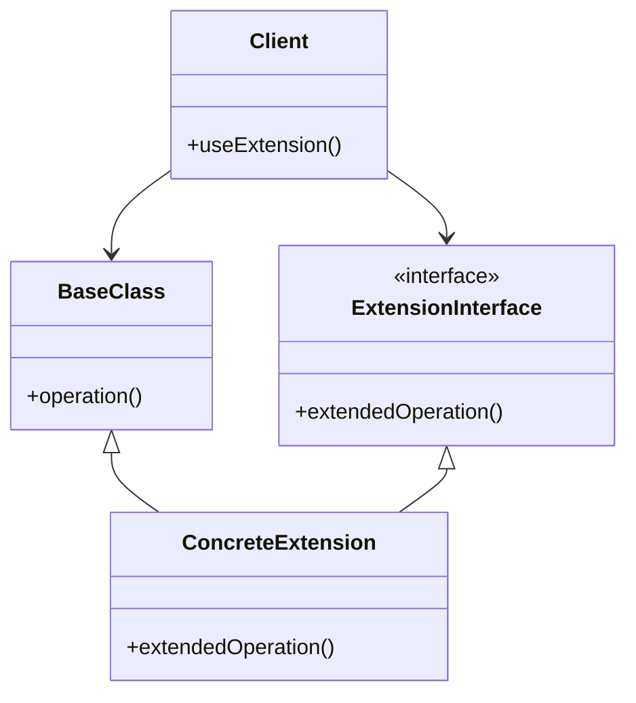
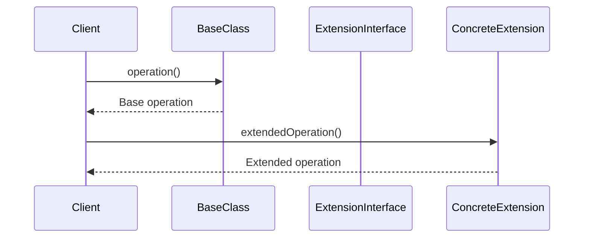

## 5.10 Extension Pattern

In the world of software engineering, one of the key challenges is to design systems that are flexible, maintainable, and scalable. The Extension Pattern is a powerful tool in achieving these goals by allowing developers to add new functionality to existing classes without altering their structure. This pattern is particularly useful in scenarios where modifying the original class is not feasible, either due to constraints such as legacy code, third-party libraries, or simply the desire to adhere to the open/closed principle, which states that software entities should be open for extension but closed for modification.

### Intent

The primary intent of the Extension Pattern is to provide a mechanism for extending the behavior of classes without modifying their source code. This is achieved through the use of various techniques such as inheritance, composition, and the use of friend classes and functions. The Extension Object Pattern, a specific implementation of this concept, allows for dynamic addition of functionality at runtime.

### Key Participants

1. **Base Class**: The original class that requires extension.
2. **Extension Interface**: An interface or abstract class that defines the additional functionality.
3. **Concrete Extension**: A class that implements the extension interface and provides the new functionality.
4. **Client**: The entity that uses the base class and its extensions.

### Applicability

The Extension Pattern is applicable in the following scenarios:

- When you need to add new functionality to a class without modifying its source code.
- When the class to be extended is part of a third-party library or legacy system.
- When adhering to the open/closed principle is a priority.
- When you want to enable dynamic addition of behavior at runtime.

### Using Inheritance and Composition

Inheritance and composition are two fundamental techniques in object-oriented programming that can be used to implement the Extension Pattern.

#### Inheritance

Inheritance allows a new class to inherit the properties and behavior of an existing class. This is a straightforward way to extend functionality but comes with certain limitations, such as increased coupling between the base and derived classes. Here's a simple example:

```cpp
#include <iostream>

// Base class
class Widget {
public:
    virtual void draw() const {
        std::cout << "Drawing a basic widget." << std::endl;
    }
};

// Extended class using inheritance
class ExtendedWidget : public Widget {
public:
    void draw() const override {
        Widget::draw(); // Call base class method
        std::cout << "Adding extended functionality." << std::endl;
    }
};

int main() {
    ExtendedWidget widget;
    widget.draw();
    return 0;
}
```

**Key Points:**
- **Inheritance** allows `ExtendedWidget` to reuse and extend the behavior of `Widget`.
- **Overriding** the `draw` method enables the addition of new functionality.

#### Composition

Composition involves creating a new class that contains an instance of the original class. This approach is often preferred over inheritance as it promotes loose coupling and greater flexibility.

```cpp
#include <iostream>

// Base class
class Widget {
public:
    void draw() const {
        std::cout << "Drawing a basic widget." << std::endl;
    }
};

// Extended class using composition
class ExtendedWidget {
private:
    Widget widget; // Composition

public:
    void draw() const {
        widget.draw(); // Delegate call to the contained object
        std::cout << "Adding extended functionality." << std::endl;
    }
};

int main() {
    ExtendedWidget widget;
    widget.draw();
    return 0;
}
```

**Key Points:**
- **Composition** allows `ExtendedWidget` to use `Widget` without inheriting from it.
- **Delegation** is used to call the `draw` method of the contained `Widget` object.

### The Role of Friend Classes and Functions

Friend classes and functions in C++ provide another way to extend the functionality of a class. By declaring a class or function as a friend, you grant it access to the private and protected members of the class. This can be useful for implementing extensions that require access to the internal state of a class.

```cpp
#include <iostream>

class Widget {
private:
    int value;

public:
    Widget(int v) : value(v) {}

    // Declare a friend function
    friend void printValue(const Widget& widget);
};

// Friend function
void printValue(const Widget& widget) {
    std::cout << "Widget value: " << widget.value << std::endl;
}

int main() {
    Widget widget(42);
    printValue(widget); // Access private member through friend function
    return 0;
}
```

**Key Points:**
- **Friend functions** can access private members of a class, allowing for more flexible extensions.
- **Encapsulation** is partially broken, so use friend functions judiciously.

### The Extension Object Pattern

The Extension Object Pattern is a more sophisticated approach to extending class functionality. It allows for the dynamic addition of behavior at runtime, making it highly flexible and adaptable to changing requirements.

#### Structure



**Description:**
- **BaseClass**: The original class that needs extension.
- **ExtensionInterface**: An interface that defines the additional operations.
- **ConcreteExtension**: Implements the `ExtensionInterface` and provides the extended functionality.
- **Client**: Uses both the `BaseClass` and its extensions.

#### Implementation

Here's how you can implement the Extension Object Pattern in C++:

```cpp
#include <iostream>
#include <memory>
#include <unordered_map>
#include <string>

// Base class
class BaseClass {
public:
    virtual void operation() const {
        std::cout << "Base operation." << std::endl;
    }
};

// Extension interface
class ExtensionInterface {
public:
    virtual ~ExtensionInterface() = default;
    virtual void extendedOperation() const = 0;
};

// Concrete extension
class ConcreteExtension : public ExtensionInterface {
public:
    void extendedOperation() const override {
        std::cout << "Extended operation." << std::endl;
    }
};

// Client class that manages extensions
class Client {
private:
    std::unordered_map<std::string, std::shared_ptr<ExtensionInterface>> extensions;

public:
    void addExtension(const std::string& name, std::shared_ptr<ExtensionInterface> extension) {
        extensions[name] = extension;
    }

    void useExtension(const std::string& name) const {
        if (extensions.find(name) != extensions.end()) {
            extensions.at(name)->extendedOperation();
        } else {
            std::cout << "Extension not found." << std::endl;
        }
    }
};

int main() {
    Client client;
    client.addExtension("ext1", std::make_shared<ConcreteExtension>());
    client.useExtension("ext1");
    return 0;
}
```

**Key Points:**
- **Dynamic Extension**: Extensions can be added and used at runtime.
- **Flexibility**: New extensions can be easily integrated without modifying existing code.

### Design Considerations

When implementing the Extension Pattern, consider the following:

- **Use Inheritance Sparingly**: While inheritance is a straightforward way to extend functionality, it can lead to tight coupling and reduced flexibility. Prefer composition when possible.
- **Encapsulation**: Be cautious when using friend classes and functions, as they can break encapsulation.
- **Runtime Flexibility**: The Extension Object Pattern provides runtime flexibility, making it suitable for applications with dynamic requirements.
- **Performance**: Consider the performance implications of using dynamic extensions, especially in performance-critical applications.

### Differences and Similarities

The Extension Pattern shares similarities with other design patterns, such as the Decorator Pattern and the Strategy Pattern. However, there are key differences:

- **Decorator Pattern**: Focuses on adding responsibilities to objects dynamically, often using composition. The Extension Pattern can achieve similar results but is more focused on extending class behavior.
- **Strategy Pattern**: Encapsulates algorithms or behaviors, allowing them to be interchangeable. The Extension Pattern is more about adding new capabilities rather than swapping existing ones.

### Try It Yourself

To deepen your understanding of the Extension Pattern, try the following exercises:

1. **Modify the Code**: Extend the `ConcreteExtension` class to add additional operations. Experiment with adding multiple extensions to the `Client` class.
2. **Create a New Extension**: Implement a new extension that interacts with the `BaseClass` in a meaningful way.
3. **Performance Analysis**: Measure the performance impact of using dynamic extensions in a sample application.

### Visualizing the Extension Pattern

Let's visualize the Extension Pattern using a sequence diagram to understand the interaction between different components:



**Description:**
- The **Client** interacts with both the **BaseClass** and the **ConcreteExtension**.
- The **BaseClass** performs its base operation, while the **ConcreteExtension** provides the extended functionality.

### References and Links

For further reading on the Extension Pattern and related concepts, consider the following resources:

- [Design Patterns: Elements of Reusable Object-Oriented Software](https://www.amazon.com/Design-Patterns-Elements-Reusable-Object-Oriented/dp/0201633612) by Erich Gamma, Richard Helm, Ralph Johnson, and John Vlissides.
- [C++ Programming Language](https://en.cppreference.com/w/cpp) - A comprehensive reference for C++ programming.
- [Modern C++ Design: Generic Programming and Design Patterns Applied](https://www.amazon.com/Modern-Design-Generic-Programming-Patterns/dp/0201704315) by Andrei Alexandrescu.

### Knowledge Check

Before we wrap up, let's reinforce what we've learned with a few questions:

- How does the Extension Pattern differ from the Decorator Pattern?
- What are the advantages of using composition over inheritance in the Extension Pattern?
- How can friend classes and functions be used to extend class functionality?

### Embrace the Journey

Remember, mastering design patterns is a journey, not a destination. The Extension Pattern is just one tool in your toolkit. As you continue to explore and apply these patterns, you'll gain a deeper understanding of how to design flexible and maintainable software systems. Keep experimenting, stay curious, and enjoy the journey!

## Quiz Time!



### What is the primary intent of the Extension Pattern?

- [x] To add new functionality to a class without modifying its source code.
- [ ] To replace existing class functionality with new behavior.
- [ ] To merge multiple classes into a single class.
- [ ] To remove unnecessary functionality from a class.

> **Explanation:** The Extension Pattern is designed to add new functionality to a class without altering its existing code, adhering to the open/closed principle.

### Which of the following is a key participant in the Extension Pattern?

- [x] Base Class
- [ ] Singleton
- [ ] Factory
- [ ] Adapter

> **Explanation:** The Base Class is the original class that requires extension in the Extension Pattern.

### What is a benefit of using composition over inheritance in the Extension Pattern?

- [x] Promotes loose coupling and greater flexibility.
- [ ] Increases coupling between classes.
- [ ] Requires less code to implement.
- [ ] Automatically inherits all base class methods.

> **Explanation:** Composition promotes loose coupling and flexibility by allowing classes to contain instances of other classes rather than inheriting from them.

### How can friend classes and functions be used in the Extension Pattern?

- [x] By granting access to private and protected members of a class.
- [ ] By automatically inheriting all methods from the base class.
- [ ] By replacing the need for interfaces.
- [ ] By enforcing encapsulation.

> **Explanation:** Friend classes and functions can access private and protected members, allowing for more flexible extensions.

### What is a key advantage of the Extension Object Pattern?

- [x] Allows for dynamic addition of behavior at runtime.
- [ ] Simplifies the class hierarchy.
- [ ] Eliminates the need for interfaces.
- [ ] Automatically optimizes performance.

> **Explanation:** The Extension Object Pattern allows for dynamic addition of behavior at runtime, making it highly flexible.

### Which pattern is often confused with the Extension Pattern?

- [x] Decorator Pattern
- [ ] Singleton Pattern
- [ ] Observer Pattern
- [ ] Factory Pattern

> **Explanation:** The Decorator Pattern is often confused with the Extension Pattern as both involve adding functionality to objects.

### What is a potential drawback of using friend classes and functions?

- [x] They can break encapsulation.
- [ ] They automatically increase code complexity.
- [ ] They require more memory.
- [ ] They enforce strict type checking.

> **Explanation:** Friend classes and functions can break encapsulation by allowing access to private members.

### In the Extension Pattern, what is the role of the Client?

- [x] To use both the BaseClass and its extensions.
- [ ] To modify the BaseClass directly.
- [ ] To enforce encapsulation.
- [ ] To automatically generate extensions.

> **Explanation:** The Client uses both the BaseClass and its extensions to achieve desired functionality.

### True or False: The Extension Pattern is suitable for adding functionality to third-party libraries.

- [x] True
- [ ] False

> **Explanation:** The Extension Pattern is suitable for adding functionality to third-party libraries where modifying the original code is not feasible.

### What is a common use case for the Extension Pattern?

- [x] When adhering to the open/closed principle is a priority.
- [ ] When you need to merge multiple classes.
- [ ] When you want to simplify the class hierarchy.
- [ ] When you need to remove functionality from a class.

> **Explanation:** The Extension Pattern is commonly used when adhering to the open/closed principle is important, allowing for extensions without modifying existing code.


