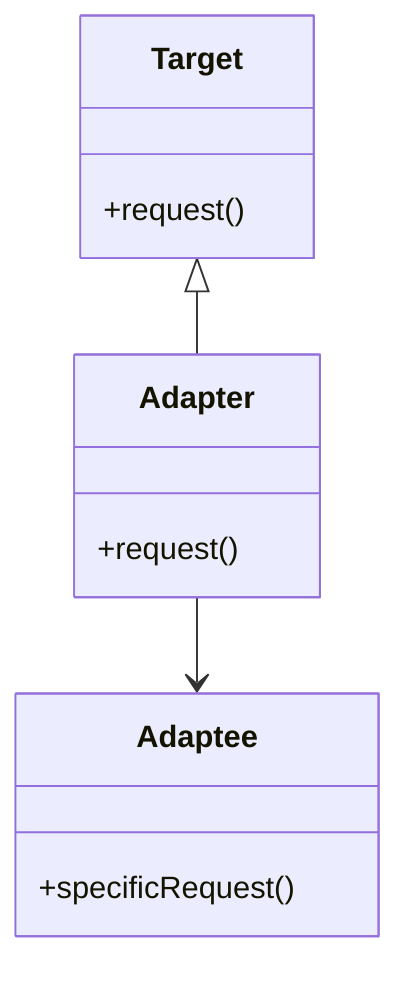

## 5.2 Adapter Pattern

The Adapter Pattern is a structural design pattern that allows objects with incompatible interfaces to work together. It acts as a bridge between two incompatible interfaces, enabling them to communicate seamlessly. This pattern is particularly useful when integrating legacy code with new systems or when using third-party libraries that do not match your application's interface requirements.

### Intent

The primary intent of the Adapter Pattern is to convert the interface of a class into another interface that clients expect. It allows classes to work together that couldn't otherwise because of incompatible interfaces. By using an adapter, we can reuse existing classes without modifying their source code, thus adhering to the open/closed principle.

### Key Participants

- **Target**: Defines the domain-specific interface that the Client uses.
- **Client**: Collaborates with objects conforming to the Target interface.
- **Adaptee**: Defines an existing interface that needs adapting.
- **Adapter**: Adapts the interface of the Adaptee to the Target interface.

### Class Adapter vs. Object Adapter

There are two main types of adapters: class adapters and object adapters. Let's explore each type in detail.

#### Class Adapter

A class adapter uses multiple inheritance to adapt one interface to another. It inherits publicly from the Target interface and privately from the Adaptee. This approach allows the adapter to override the Target's methods and implement them using the Adaptee's methods.

**Advantages:**
- Can override Adaptee's behavior since it is a subclass.
- More efficient than object adapters because it doesn't require an additional level of indirection.

**Disadvantages:**
- Requires multiple inheritance, which can lead to complexity and is not supported in some languages.
- Tightly couples the adapter to the Adaptee, making it less flexible.

#### Object Adapter

An object adapter uses composition to adapt one interface to another. It contains an instance of the Adaptee and implements the Target interface by delegating calls to the Adaptee.

**Advantages:**
- More flexible as it allows the adapter to work with any subclass of Adaptee.
- Does not require multiple inheritance, making it simpler and more portable.

**Disadvantages:**
- Slightly less efficient due to the additional level of indirection.

### Implementing Adapters in C++

Let's delve into implementing both class and object adapters in C++.

#### Class Adapter Implementation

```cpp
#include <iostream>

// Target interface
class Target {
public:
    virtual void request() const {
        std::cout << "Target: Default behavior." << std::endl;
    }
};

// Adaptee class with an incompatible interface
class Adaptee {
public:
    void specificRequest() const {
        std::cout << "Adaptee: Specific behavior." << std::endl;
    }
};

// Class Adapter using multiple inheritance
class ClassAdapter : public Target, private Adaptee {
public:
    void request() const override {
        specificRequest(); // Adapting the interface
    }
};

int main() {
    Target* target = new ClassAdapter();
    target->request(); // Output: Adaptee: Specific behavior.
    delete target;
    return 0;
}
```

In this example, `ClassAdapter` inherits from both `Target` and `Adaptee`. It overrides the `request` method of `Target` to call the `specificRequest` method of `Adaptee`, thus adapting the interface.

#### Object Adapter Implementation

```cpp
#include <iostream>

// Target interface
class Target {
public:
    virtual void request() const {
        std::cout << "Target: Default behavior." << std::endl;
    }
};

// Adaptee class with an incompatible interface
class Adaptee {
public:
    void specificRequest() const {
        std::cout << "Adaptee: Specific behavior." << std::endl;
    }
};

// Object Adapter using composition
class ObjectAdapter : public Target {
private:
    Adaptee* adaptee;
public:
    ObjectAdapter(Adaptee* a) : adaptee(a) {}

    void request() const override {
        adaptee->specificRequest(); // Adapting the interface
    }
};

int main() {
    Adaptee* adaptee = new Adaptee();
    Target* target = new ObjectAdapter(adaptee);
    target->request(); // Output: Adaptee: Specific behavior.
    delete adaptee;
    delete target;
    return 0;
}
```

In this example, `ObjectAdapter` contains an instance of `Adaptee` and delegates the `request` call to the `specificRequest` method of `Adaptee`.

### Using Multiple Inheritance for Class Adapters

C++ supports multiple inheritance, which allows us to implement class adapters. However, multiple inheritance can introduce complexity, such as the diamond problem, where a class inherits from two classes that have a common base class. To mitigate such issues, C++ provides virtual inheritance, which ensures that only one instance of the common base class is inherited.

Here's an example demonstrating multiple inheritance with virtual inheritance:

```cpp
#include <iostream>

// Base class
class Base {
public:
    virtual void baseMethod() const {
        std::cout << "Base method." << std::endl;
    }
};

// Derived class 1
class Derived1 : virtual public Base {
public:
    void derived1Method() const {
        std::cout << "Derived1 method." << std::endl;
    }
};

// Derived class 2
class Derived2 : virtual public Base {
public:
    void derived2Method() const {
        std::cout << "Derived2 method." << std::endl;
    }
};

// Class Adapter inheriting from both Derived1 and Derived2
class MultipleInheritanceAdapter : public Derived1, public Derived2 {
public:
    void request() const {
        baseMethod(); // Accessing Base method
        derived1Method();
        derived2Method();
    }
};

int main() {
    MultipleInheritanceAdapter adapter;
    adapter.request();
    return 0;
}
```

In this example, `MultipleInheritanceAdapter` inherits from both `Derived1` and `Derived2`, which in turn inherit from `Base`. By using virtual inheritance, we ensure that only one instance of `Base` is present in `MultipleInheritanceAdapter`.

### Design Considerations

When deciding to use the Adapter Pattern, consider the following:

- **Compatibility**: Use the adapter pattern when you need to integrate classes with incompatible interfaces.
- **Flexibility**: Object adapters are more flexible than class adapters as they allow for adapting multiple Adaptees.
- **Performance**: Class adapters are more efficient than object adapters due to the lack of indirection.
- **Complexity**: Be cautious with multiple inheritance in class adapters, as it can introduce complexity and maintenance challenges.

### Differences and Similarities

The Adapter Pattern is often confused with the following patterns:

- **Facade Pattern**: Both patterns provide a simplified interface to a complex system. However, the facade pattern defines a new interface, while the adapter pattern adapts an existing one.
- **Decorator Pattern**: Both patterns involve wrapping objects. However, the decorator pattern adds new behavior, while the adapter pattern changes the interface.

### Visualizing the Adapter Pattern

Let's use a Mermaid.js diagram to visualize the relationships in the Adapter Pattern:



**Diagram Description**: This diagram illustrates the relationship between the `Target`, `Adaptee`, and `Adapter` classes. The `Adapter` class implements the `Target` interface and holds a reference to the `Adaptee`, allowing it to adapt the `Adaptee`'s interface to the `Target`.

### Try It Yourself

To deepen your understanding of the Adapter Pattern, try modifying the code examples:

- **Experiment with Class Adapter**: Modify the `ClassAdapter` to add additional functionality before or after calling `specificRequest`.
- **Experiment with Object Adapter**: Create a new `Adaptee` class with a different method and adapt it using the `ObjectAdapter`.
- **Explore Multiple Inheritance**: Add another base class to the `MultipleInheritanceAdapter` and observe how virtual inheritance affects the behavior.

### Knowledge Check

- **What is the primary purpose of the Adapter Pattern?**
- **Explain the difference between class and object adapters.**
- **What are the advantages and disadvantages of using multiple inheritance in class adapters?**

### Summary

The Adapter Pattern is a powerful tool for integrating classes with incompatible interfaces. By understanding the differences between class and object adapters and the implications of using multiple inheritance, you can effectively apply this pattern to solve real-world problems in C++.

Remember, this is just the beginning. As you progress, you'll build more complex and interactive systems. Keep experimenting, stay curious, and enjoy the journey!

## Quiz Time!



### What is the primary purpose of the Adapter Pattern?

- [x] To convert the interface of a class into another interface that clients expect.
- [ ] To provide a simplified interface to a complex system.
- [ ] To add new behavior to existing objects.
- [ ] To manage object lifecycles and dependencies.

> **Explanation:** The Adapter Pattern is used to convert the interface of a class into another interface that clients expect, allowing incompatible interfaces to work together.

### What is the main difference between a class adapter and an object adapter?

- [x] A class adapter uses multiple inheritance, while an object adapter uses composition.
- [ ] A class adapter uses composition, while an object adapter uses multiple inheritance.
- [ ] A class adapter is more flexible, while an object adapter is more efficient.
- [ ] A class adapter is less efficient, while an object adapter is more flexible.

> **Explanation:** A class adapter uses multiple inheritance to adapt interfaces, whereas an object adapter uses composition.

### Which of the following is an advantage of using an object adapter?

- [x] More flexible as it allows the adapter to work with any subclass of Adaptee.
- [ ] More efficient due to lack of indirection.
- [ ] Can override Adaptee's behavior since it is a subclass.
- [ ] Requires multiple inheritance, making it more portable.

> **Explanation:** Object adapters are more flexible because they use composition, allowing them to work with any subclass of Adaptee.

### Why might you choose a class adapter over an object adapter?

- [x] For efficiency, as it doesn't require an additional level of indirection.
- [ ] For flexibility, as it allows the adapter to work with any subclass of Adaptee.
- [ ] To avoid multiple inheritance.
- [ ] To simplify the implementation by using composition.

> **Explanation:** Class adapters are more efficient because they don't require an additional level of indirection.

### What is a potential disadvantage of using multiple inheritance in class adapters?

- [x] It can introduce complexity and maintenance challenges.
- [ ] It makes the adapter less efficient.
- [ ] It limits the adapter's flexibility.
- [ ] It prevents the adapter from overriding Adaptee's behavior.

> **Explanation:** Multiple inheritance can introduce complexity and maintenance challenges, such as the diamond problem.

### How does the Adapter Pattern differ from the Facade Pattern?

- [x] The Adapter Pattern adapts an existing interface, while the Facade Pattern defines a new interface.
- [ ] The Adapter Pattern defines a new interface, while the Facade Pattern adapts an existing one.
- [ ] The Adapter Pattern adds new behavior, while the Facade Pattern changes the interface.
- [ ] The Adapter Pattern manages object lifecycles, while the Facade Pattern simplifies interfaces.

> **Explanation:** The Adapter Pattern adapts an existing interface to match what clients expect, whereas the Facade Pattern provides a simplified interface to a complex system.

### Which design principle does the Adapter Pattern adhere to?

- [x] Open/Closed Principle
- [ ] Single Responsibility Principle
- [ ] Liskov Substitution Principle
- [ ] Dependency Inversion Principle

> **Explanation:** The Adapter Pattern adheres to the Open/Closed Principle by allowing classes to work together without modifying their source code.

### What is the role of the Adapter in the Adapter Pattern?

- [x] Adapts the interface of the Adaptee to the Target interface.
- [ ] Defines the domain-specific interface that the Client uses.
- [ ] Collaborates with objects conforming to the Target interface.
- [ ] Defines an existing interface that needs adapting.

> **Explanation:** The Adapter adapts the interface of the Adaptee to the Target interface, allowing them to work together.

### True or False: Object adapters are more efficient than class adapters.

- [ ] True
- [x] False

> **Explanation:** Object adapters are generally less efficient than class adapters because they require an additional level of indirection.

### True or False: The Adapter Pattern can be used to integrate legacy code with new systems.

- [x] True
- [ ] False

> **Explanation:** The Adapter Pattern is often used to integrate legacy code with new systems by adapting incompatible interfaces.


