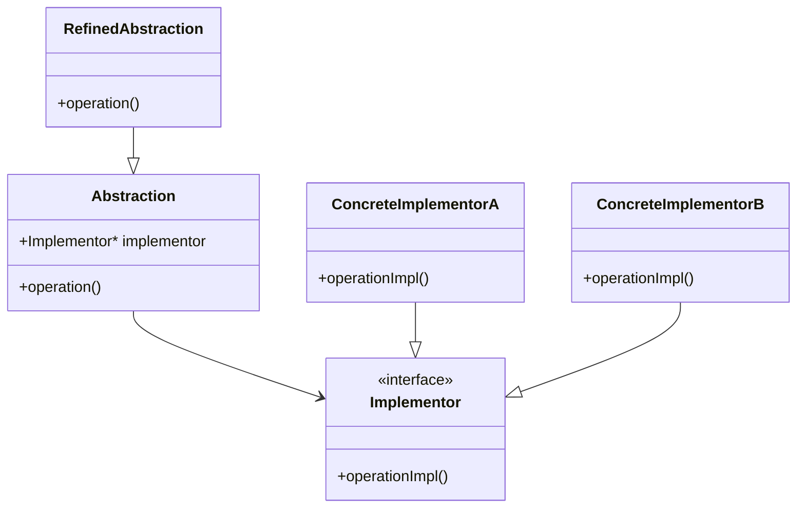

## 5.3 Bridge Pattern

In the realm of software design patterns, the Bridge Pattern stands out as a powerful tool for decoupling abstraction from implementation. This separation allows both sides to evolve independently, enhancing flexibility and scalability. In this section, we will delve into the intricacies of the Bridge Pattern, its implementation in C++, and scenarios where its application is most beneficial.

### Intent

The primary intent of the Bridge Pattern is to separate an abstraction from its implementation so that the two can vary independently. This pattern is particularly useful when both the abstractions and their implementations should be extensible through subclassing.

### Key Participants

1. **Abstraction**: Defines the abstraction's interface and maintains a reference to an object of type Implementor.
2. **RefinedAbstraction**: Extends the interface defined by Abstraction.
3. **Implementor**: Defines the interface for implementation classes. This interface doesn't need to correspond exactly to Abstraction's interface; in fact, the two interfaces can be quite different.
4. **ConcreteImplementor**: Implements the Implementor interface and defines its concrete implementation.

### Diagram

To better understand the Bridge Pattern, let's visualize it with a class diagram:



### Implementing the Bridge Pattern

Let's explore how to implement the Bridge Pattern in C++ through a practical example. Consider a scenario where we have different types of remote controls (abstractions) that can operate various devices (implementations).

#### Step 1: Define the Implementor Interface

The Implementor interface declares methods that the concrete implementations must implement.

```cpp
// Implementor interface
class Device {
public:
    virtual void turnOn() = 0;
    virtual void turnOff() = 0;
    virtual void setVolume(int level) = 0;
    virtual ~Device() = default;
};
```

#### Step 2: Create Concrete Implementors

Concrete Implementors provide specific implementations of the Implementor interface.

```cpp
// ConcreteImplementorA
class TV : public Device {
public:
    void turnOn() override {
        std::cout << "TV is turned on." << std::endl;
    }
    void turnOff() override {
        std::cout << "TV is turned off." << std::endl;
    }
    void setVolume(int level) override {
        std::cout << "TV volume set to " << level << "." << std::endl;
    }
};

// ConcreteImplementorB
class Radio : public Device {
public:
    void turnOn() override {
        std::cout << "Radio is turned on." << std::endl;
    }
    void turnOff() override {
        std::cout << "Radio is turned off." << std::endl;
    }
    void setVolume(int level) override {
        std::cout << "Radio volume set to " << level << "." << std::endl;
    }
};
```

#### Step 3: Define the Abstraction

The Abstraction class maintains a reference to an object of type Implementor.

```cpp
// Abstraction
class RemoteControl {
protected:
    Device* device;
public:
    RemoteControl(Device* dev) : device(dev) {}
    virtual void togglePower() = 0;
    virtual void volumeUp() = 0;
    virtual void volumeDown() = 0;
    virtual ~RemoteControl() = default;
};
```

#### Step 4: Create Refined Abstractions

Refined Abstractions extend the interface defined by Abstraction.

```cpp
// RefinedAbstraction
class BasicRemote : public RemoteControl {
public:
    BasicRemote(Device* dev) : RemoteControl(dev) {}

    void togglePower() override {
        std::cout << "Basic Remote: Power toggle." << std::endl;
        device->turnOn();
    }

    void volumeUp() override {
        std::cout << "Basic Remote: Volume up." << std::endl;
        device->setVolume(10); // Example volume increment
    }

    void volumeDown() override {
        std::cout << "Basic Remote: Volume down." << std::endl;
        device->setVolume(5); // Example volume decrement
    }
};
```

#### Step 5: Use the Bridge Pattern

Now, let's see how we can use the Bridge Pattern to control different devices with different remotes.

```cpp
int main() {
    Device* tv = new TV();
    RemoteControl* remote = new BasicRemote(tv);

    remote->togglePower();
    remote->volumeUp();
    remote->volumeDown();

    delete remote;
    delete tv;

    Device* radio = new Radio();
    remote = new BasicRemote(radio);

    remote->togglePower();
    remote->volumeUp();
    remote->volumeDown();

    delete remote;
    delete radio;

    return 0;
}
```

### When to Use the Bridge Pattern

The Bridge Pattern is particularly useful in the following scenarios:

- **When you want to avoid a permanent binding between an abstraction and its implementation**: This pattern allows you to change the implementation independently of the abstraction.
- **When both the abstractions and their implementations should be extensible through subclassing**: The Bridge Pattern enables you to combine different abstractions with different implementations, making it easier to extend both hierarchies.
- **When changes in the implementation of an abstraction should have no impact on clients**: The Bridge Pattern ensures that clients are not affected by changes in the implementation.
- **When you want to share an implementation among multiple objects**: The Bridge Pattern allows multiple objects to share the same implementation, reducing redundancy.

### Design Considerations

- **Complexity**: The Bridge Pattern can introduce additional complexity due to the creation of multiple classes. It's important to weigh this complexity against the benefits of flexibility and scalability.
- **Performance**: While the Bridge Pattern provides flexibility, it may introduce a slight performance overhead due to the additional layer of abstraction. However, this overhead is often negligible compared to the benefits gained.
- **C++ Specific Features**: In C++, the Bridge Pattern can leverage features such as smart pointers (`std::shared_ptr`, `std::unique_ptr`) to manage the lifetime of objects, ensuring proper resource management.

### Differences and Similarities

The Bridge Pattern is often confused with the Adapter Pattern. While both patterns involve interfaces, they serve different purposes:

- **Bridge Pattern**: Focuses on decoupling abstraction from implementation, allowing both to vary independently.
- **Adapter Pattern**: Focuses on converting one interface into another to make two incompatible interfaces compatible.

### Try It Yourself

Experiment with the Bridge Pattern by modifying the code examples. Try adding new types of devices or remote controls. Observe how easily you can extend the system without modifying existing code.

### Knowledge Check

- **Question**: What is the primary intent of the Bridge Pattern?
- **Question**: How does the Bridge Pattern differ from the Adapter Pattern?
- **Question**: In what scenarios is the Bridge Pattern most beneficial?

### Embrace the Journey

Remember, mastering design patterns is a journey. The Bridge Pattern is just one of many tools in your software design toolkit. As you continue to explore and apply these patterns, you'll build more robust, scalable, and maintainable applications. Keep experimenting, stay curious, and enjoy the journey!

## Quiz Time!



### What is the primary intent of the Bridge Pattern?

- [x] To decouple abstraction from implementation
- [ ] To convert one interface into another
- [ ] To provide a simplified interface to a complex system
- [ ] To ensure a class has only one instance

> **Explanation:** The Bridge Pattern's primary intent is to decouple abstraction from implementation, allowing both to vary independently.

### How does the Bridge Pattern differ from the Adapter Pattern?

- [x] Bridge decouples abstraction from implementation; Adapter converts interfaces
- [ ] Bridge and Adapter both convert interfaces
- [ ] Bridge and Adapter both decouple abstraction from implementation
- [ ] Bridge and Adapter are the same

> **Explanation:** The Bridge Pattern decouples abstraction from implementation, while the Adapter Pattern converts one interface into another.

### When is the Bridge Pattern most beneficial?

- [x] When both abstractions and implementations should be extensible
- [ ] When you need to convert interfaces
- [ ] When you want to simplify a complex system
- [ ] When you need a single instance of a class

> **Explanation:** The Bridge Pattern is beneficial when both abstractions and implementations should be extensible through subclassing.

### What is a key participant in the Bridge Pattern?

- [x] Abstraction
- [ ] Singleton
- [ ] Facade
- [ ] Adapter

> **Explanation:** Abstraction is a key participant in the Bridge Pattern, defining the interface and maintaining a reference to the Implementor.

### Which C++ feature can enhance the Bridge Pattern?

- [x] Smart pointers
- [ ] Macros
- [ ] Global variables
- [ ] Inline functions

> **Explanation:** Smart pointers in C++ can enhance the Bridge Pattern by managing the lifetime of objects and ensuring proper resource management.

### What does the Implementor interface define?

- [x] Methods that concrete implementations must implement
- [ ] The interface for the abstraction
- [ ] A simplified interface to a complex system
- [ ] A single instance of a class

> **Explanation:** The Implementor interface defines methods that concrete implementations must implement, allowing for different implementations.

### What is a potential drawback of the Bridge Pattern?

- [x] Additional complexity
- [ ] Lack of flexibility
- [ ] Inability to extend implementations
- [ ] Difficulty in converting interfaces

> **Explanation:** The Bridge Pattern can introduce additional complexity due to the creation of multiple classes, which should be weighed against its benefits.

### Which pattern is often confused with the Bridge Pattern?

- [x] Adapter Pattern
- [ ] Singleton Pattern
- [ ] Observer Pattern
- [ ] Command Pattern

> **Explanation:** The Adapter Pattern is often confused with the Bridge Pattern, but they serve different purposes.

### What is the role of RefinedAbstraction in the Bridge Pattern?

- [x] Extends the interface defined by Abstraction
- [ ] Implements the Implementor interface
- [ ] Provides a simplified interface to a complex system
- [ ] Ensures a class has only one instance

> **Explanation:** RefinedAbstraction extends the interface defined by Abstraction, allowing for additional functionality.

### True or False: The Bridge Pattern allows for independent variation of abstraction and implementation.

- [x] True
- [ ] False

> **Explanation:** True. The Bridge Pattern allows for independent variation of abstraction and implementation, enhancing flexibility and scalability.


