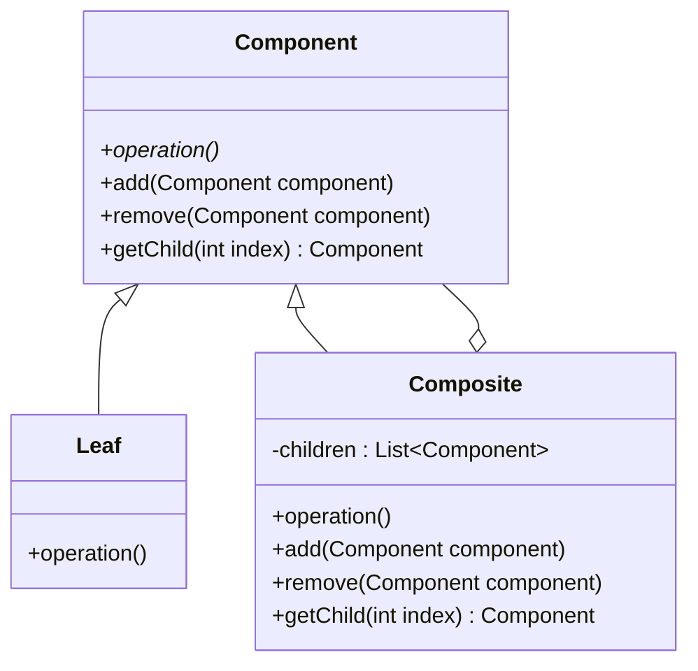

## 5.4 Composite Pattern

The Composite Pattern is a structural design pattern that allows you to compose objects into tree structures to represent part-whole hierarchies. This pattern lets clients treat individual objects and compositions of objects uniformly. It is particularly useful when you need to work with tree-like structures where nodes can be both simple and complex objects.

### Intent

The primary intent of the Composite Pattern is to allow clients to treat individual objects and compositions of objects uniformly. This is achieved by defining a common interface for both simple and composite objects, enabling recursive composition.

### Key Participants

1. **Component**: An abstract class that declares the interface for objects in the composition. It can include methods for accessing and managing child components.
2. **Leaf**: Represents leaf objects in the composition. A leaf has no children.
3. **Composite**: Defines behavior for components having children and stores child components. It implements child-related operations in the Component interface.
4. **Client**: Manipulates objects in the composition through the Component interface.

### Applicability

Use the Composite Pattern when:
- You want to represent part-whole hierarchies of objects.
- You want clients to be able to ignore the difference between compositions of objects and individual objects.
- You need to create a structure where individual objects and compositions are treated uniformly.

### Implementing Composite with Inheritance and Polymorphism

To implement the Composite Pattern in C++, we use inheritance to define the Component interface and polymorphism to allow different implementations for Leaf and Composite objects.

```cpp
#include <iostream>
#include <vector>
#include <memory>

// Component interface
class Component {
public:
    virtual void operation() const = 0;
    virtual void add(std::shared_ptr<Component> component) {}
    virtual void remove(std::shared_ptr<Component> component) {}
    virtual std::shared_ptr<Component> getChild(int index) { return nullptr; }
    virtual ~Component() = default;
};

// Leaf class
class Leaf : public Component {
public:
    void operation() const override {
        std::cout << "Leaf operation" << std::endl;
    }
};

// Composite class
class Composite : public Component {
private:
    std::vector<std::shared_ptr<Component>> children;
public:
    void operation() const override {
        std::cout << "Composite operation" << std::endl;
        for (const auto& child : children) {
            child->operation();
        }
    }

    void add(std::shared_ptr<Component> component) override {
        children.push_back(component);
    }

    void remove(std::shared_ptr<Component> component) override {
        children.erase(std::remove(children.begin(), children.end(), component), children.end());
    }

    std::shared_ptr<Component> getChild(int index) override {
        if (index < 0 || index >= children.size()) {
            return nullptr;
        }
        return children[index];
    }
};

// Client code
void clientCode(std::shared_ptr<Component> component) {
    component->operation();
}

int main() {
    auto leaf1 = std::make_shared<Leaf>();
    auto leaf2 = std::make_shared<Leaf>();
    auto composite = std::make_shared<Composite>();

    composite->add(leaf1);
    composite->add(leaf2);

    clientCode(composite);

    return 0;
}
```

### Managing Collections of Objects

In the Composite Pattern, managing collections of objects is crucial. The Composite class maintains a collection of child components and implements methods to add, remove, and access these children. This allows for flexible and dynamic composition of objects.

#### Safe and Transparent Composites

The Composite Pattern can be implemented in two ways: safe and transparent. 

- **Safe Composite**: The Component interface only includes operations that are meaningful for all components, such as `operation()`. Methods like `add()`, `remove()`, and `getChild()` are only defined in the Composite class. This prevents clients from calling these methods on leaf nodes, ensuring type safety.

- **Transparent Composite**: All methods are declared in the Component interface, allowing clients to treat all components uniformly. However, this approach can lead to runtime errors if clients attempt to add or remove children from leaf nodes.

### Design Considerations

When using the Composite Pattern, consider the following:

- **Uniformity vs. Safety**: Decide whether to prioritize uniformity (transparent composite) or type safety (safe composite).
- **Performance**: Composite structures can become complex and impact performance. Consider the cost of operations like adding or removing children.
- **Memory Management**: Use smart pointers to manage memory and avoid leaks, especially when dealing with dynamic compositions.

### Differences and Similarities

The Composite Pattern is often confused with the Decorator Pattern. While both involve tree structures, the Decorator Pattern focuses on adding responsibilities to objects dynamically, whereas the Composite Pattern focuses on part-whole hierarchies.

### Visualizing Composite Pattern

Below is a class diagram illustrating the Composite Pattern structure:



### Try It Yourself

Experiment with the Composite Pattern by modifying the code example:

- **Add a new type of Leaf**: Create a new class derived from Component and implement a different operation.
- **Implement a method to count the number of children**: Add a method in the Composite class to return the number of child components.
- **Create a more complex tree structure**: Add more levels to the tree and observe how operations are propagated through the hierarchy.

### Knowledge Check

- **What is the primary intent of the Composite Pattern?**
- **How does the Composite Pattern allow for uniform treatment of objects?**
- **What are the key differences between safe and transparent composites?**
- **How can the Composite Pattern impact performance?**

### Embrace the Journey

Remember, mastering design patterns like Composite is a journey. As you practice and apply these patterns, you'll develop a deeper understanding of how to build flexible and maintainable software architectures. Keep experimenting, stay curious, and enjoy the journey!

## Quiz Time!



### What is the primary intent of the Composite Pattern?

- [x] To allow clients to treat individual objects and compositions of objects uniformly.
- [ ] To add responsibilities to objects dynamically.
- [ ] To encapsulate a request as an object.
- [ ] To define a family of algorithms.

> **Explanation:** The Composite Pattern's primary intent is to allow clients to treat individual objects and compositions of objects uniformly by defining a common interface.

### Which of the following is a key participant in the Composite Pattern?

- [x] Component
- [ ] Decorator
- [ ] Adapter
- [ ] Proxy

> **Explanation:** The key participants in the Composite Pattern include Component, Leaf, Composite, and Client.

### What is a safe composite in the Composite Pattern?

- [x] A composite where only meaningful operations are included in the Component interface.
- [ ] A composite that includes all operations in the Component interface.
- [ ] A composite that allows dynamic addition of responsibilities.
- [ ] A composite that uses proxies to control access.

> **Explanation:** A safe composite includes only operations that are meaningful for all components, ensuring type safety.

### How does the Composite Pattern manage collections of objects?

- [x] By using a Composite class that maintains a collection of child components.
- [ ] By using a Decorator class to add responsibilities.
- [ ] By using an Adapter class to bridge interfaces.
- [ ] By using a Proxy class to control access.

> **Explanation:** The Composite class maintains a collection of child components and implements methods to manage them.

### What is a transparent composite?

- [x] A composite where all methods are declared in the Component interface.
- [ ] A composite that only includes meaningful operations in the Component interface.
- [ ] A composite that uses proxies to control access.
- [ ] A composite that includes dynamic addition of responsibilities.

> **Explanation:** A transparent composite declares all methods in the Component interface, allowing uniform treatment but risking runtime errors.

### Which pattern is often confused with the Composite Pattern?

- [x] Decorator Pattern
- [ ] Singleton Pattern
- [ ] Factory Pattern
- [ ] Observer Pattern

> **Explanation:** The Composite Pattern is often confused with the Decorator Pattern, as both involve tree structures.

### What is a potential performance consideration with the Composite Pattern?

- [x] Complexity of operations like adding or removing children.
- [ ] Difficulty in encapsulating requests as objects.
- [ ] Challenges in defining a family of algorithms.
- [ ] Issues with dynamic addition of responsibilities.

> **Explanation:** Composite structures can become complex and impact performance, especially with operations like adding or removing children.

### How can memory management be handled in the Composite Pattern?

- [x] By using smart pointers to manage memory and avoid leaks.
- [ ] By using raw pointers for efficiency.
- [ ] By using global variables for shared state.
- [ ] By using static variables for memory management.

> **Explanation:** Smart pointers are used to manage memory and avoid leaks in dynamic compositions.

### What is the role of the Client in the Composite Pattern?

- [x] To manipulate objects in the composition through the Component interface.
- [ ] To add responsibilities to objects dynamically.
- [ ] To encapsulate requests as objects.
- [ ] To define a family of algorithms.

> **Explanation:** The Client manipulates objects in the composition through the Component interface, treating them uniformly.

### True or False: The Composite Pattern is only applicable to tree structures.

- [x] True
- [ ] False

> **Explanation:** The Composite Pattern is particularly useful for tree-like structures where nodes can be both simple and complex objects.



