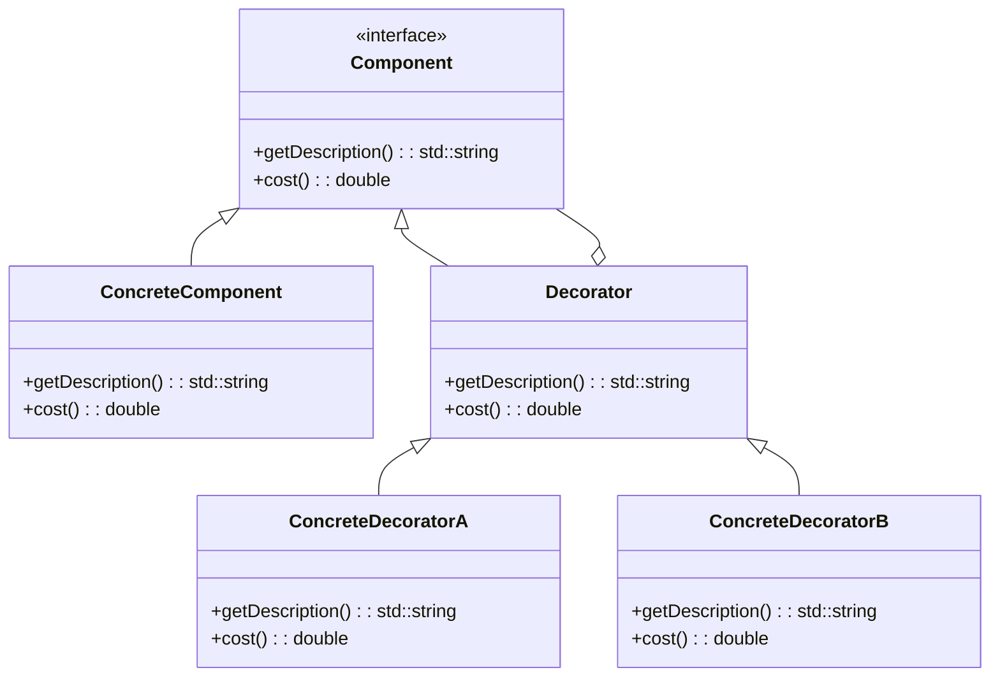

## 5.5 Decorator Pattern

### Introduction

In the realm of software design patterns, the Decorator Pattern stands out as a powerful tool for extending the functionality of objects in a flexible and dynamic manner. This pattern is part of the structural patterns family, which focuses on how classes and objects are composed to form larger structures. The Decorator Pattern allows us to attach additional responsibilities to an object dynamically, providing a flexible alternative to subclassing for extending functionality.

### Intent

The primary intent of the Decorator Pattern is to add new functionality to an object without altering its structure. This is achieved by creating a set of decorator classes that are used to wrap concrete components. The Decorator Pattern is particularly useful when you want to add responsibilities to individual objects, not to an entire class.

### Key Participants

The Decorator Pattern involves several key participants:

- **Component**: This is the interface or abstract class that defines the operations that can be altered by decorators.
- **ConcreteComponent**: This class implements the Component interface and defines the object to which additional responsibilities can be attached.
- **Decorator**: This abstract class implements the Component interface and contains a reference to a Component object. It delegates the operations to the component it decorates.
- **ConcreteDecorator**: This class extends the Decorator class and adds responsibilities to the component.

### Applicability

Consider using the Decorator Pattern when:

- You want to add responsibilities to individual objects dynamically and transparently, without affecting other objects.
- You need to extend the functionality of classes in a way that is flexible and reusable.
- You want to avoid an explosion of subclasses to support every combination of features.

### Implementing Decorators with Inheritance

In C++, the Decorator Pattern can be implemented using inheritance. The key idea is to create a base class that defines the core functionality, and then extend this class with decorators that add additional behavior.

```cpp
#include <iostream>
#include <memory>

// Component interface
class Coffee {
public:
    virtual ~Coffee() = default;
    virtual std::string getDescription() const = 0;
    virtual double cost() const = 0;
};

// ConcreteComponent
class SimpleCoffee : public Coffee {
public:
    std::string getDescription() const override {
        return "Simple Coffee";
    }
    double cost() const override {
        return 5.0;
    }
};

// Decorator
class CoffeeDecorator : public Coffee {
protected:
    std::unique_ptr<Coffee> coffee;
public:
    CoffeeDecorator(std::unique_ptr<Coffee> c) : coffee(std::move(c)) {}
};

// ConcreteDecorator
class MilkDecorator : public CoffeeDecorator {
public:
    MilkDecorator(std::unique_ptr<Coffee> c) : CoffeeDecorator(std::move(c)) {}
    std::string getDescription() const override {
        return coffee->getDescription() + ", Milk";
    }
    double cost() const override {
        return coffee->cost() + 1.5;
    }
};

// Another ConcreteDecorator
class SugarDecorator : public CoffeeDecorator {
public:
    SugarDecorator(std::unique_ptr<Coffee> c) : CoffeeDecorator(std::move(c)) {}
    std::string getDescription() const override {
        return coffee->getDescription() + ", Sugar";
    }
    double cost() const override {
        return coffee->cost() + 0.5;
    }
};

int main() {
    std::unique_ptr<Coffee> myCoffee = std::make_unique<SimpleCoffee>();
    myCoffee = std::make_unique<MilkDecorator>(std::move(myCoffee));
    myCoffee = std::make_unique<SugarDecorator>(std::move(myCoffee));

    std::cout << "Description: " << myCoffee->getDescription() << std::endl;
    std::cout << "Cost: $" << myCoffee->cost() << std::endl;

    return 0;
}
```

In this example, we have a `Coffee` interface that defines the operations `getDescription` and `cost`. The `SimpleCoffee` class is a concrete implementation of this interface. We then create a `CoffeeDecorator` class that holds a reference to a `Coffee` object and delegates the operations to it. The `MilkDecorator` and `SugarDecorator` classes extend `CoffeeDecorator` and add their own behavior.

### Using the Decorator Pattern Over Subclassing

One of the main advantages of the Decorator Pattern is that it provides a more flexible alternative to subclassing. Subclassing can lead to a proliferation of classes, especially when you need to support a wide range of combinations of features. The Decorator Pattern allows you to mix and match features at runtime, creating new combinations on the fly.

Consider a scenario where you have a base class `Window` and you want to add features like scrollbars and borders. Using subclassing, you would need to create a separate subclass for each combination of features, such as `WindowWithScrollbar`, `WindowWithBorder`, and `WindowWithScrollbarAndBorder`. With the Decorator Pattern, you can create a `ScrollbarDecorator` and a `BorderDecorator` and combine them as needed.

### Implementing via Aggregation

In the Decorator Pattern, aggregation is used to compose the decorators with the component they are decorating. This is achieved by holding a reference to the component in the decorator class. Aggregation allows us to dynamically change the behavior of an object by wrapping it with different decorators.

```cpp
#include <iostream>
#include <memory>

// Component interface
class Window {
public:
    virtual ~Window() = default;
    virtual void draw() const = 0;
};

// ConcreteComponent
class SimpleWindow : public Window {
public:
    void draw() const override {
        std::cout << "Drawing a simple window" << std::endl;
    }
};

// Decorator
class WindowDecorator : public Window {
protected:
    std::unique_ptr<Window> window;
public:
    WindowDecorator(std::unique_ptr<Window> w) : window(std::move(w)) {}
};

// ConcreteDecorator
class ScrollbarDecorator : public WindowDecorator {
public:
    ScrollbarDecorator(std::unique_ptr<Window> w) : WindowDecorator(std::move(w)) {}
    void draw() const override {
        window->draw();
        std::cout << "Adding scrollbar" << std::endl;
    }
};

// Another ConcreteDecorator
class BorderDecorator : public WindowDecorator {
public:
    BorderDecorator(std::unique_ptr<Window> w) : WindowDecorator(std::move(w)) {}
    void draw() const override {
        window->draw();
        std::cout << "Adding border" << std::endl;
    }
};

int main() {
    std::unique_ptr<Window> myWindow = std::make_unique<SimpleWindow>();
    myWindow = std::make_unique<ScrollbarDecorator>(std::move(myWindow));
    myWindow = std::make_unique<BorderDecorator>(std::move(myWindow));

    myWindow->draw();

    return 0;
}
```

In this example, we have a `Window` interface and a `SimpleWindow` class that implements it. The `WindowDecorator` class is used to wrap a `Window` object, and the `ScrollbarDecorator` and `BorderDecorator` classes extend `WindowDecorator` to add additional behavior.

### Design Considerations

When implementing the Decorator Pattern, there are several design considerations to keep in mind:

- **Transparency**: The decorators should be transparent to the client. The client should not be aware of whether it is dealing with a decorated or undecorated component.
- **Flexibility**: The Decorator Pattern provides flexibility in adding responsibilities to objects. You can add or remove decorators at runtime, allowing for dynamic behavior changes.
- **Performance**: Be mindful of the performance implications of using multiple decorators. Each decorator adds a layer of indirection, which can impact performance.
- **C++ Specific Features**: In C++, smart pointers like `std::unique_ptr` are often used to manage the lifetime of the component being decorated. This helps prevent memory leaks and ensures proper resource management.

### Differences and Similarities

The Decorator Pattern is often compared to other patterns like the Adapter Pattern and the Proxy Pattern. Here are some key differences and similarities:

- **Adapter Pattern**: The Adapter Pattern is used to convert the interface of a class into another interface that clients expect. It focuses on interface compatibility, whereas the Decorator Pattern focuses on adding responsibilities.
- **Proxy Pattern**: The Proxy Pattern provides a surrogate or placeholder for another object to control access to it. It can be used for access control, caching, and lazy initialization. The Decorator Pattern, on the other hand, is used to add behavior to objects.

### Visualizing the Decorator Pattern

To better understand the Decorator Pattern, let's visualize it using a class diagram:



In this diagram, `Component` is the interface that defines the operations. `ConcreteComponent` is the class that implements the interface. `Decorator` is an abstract class that also implements the interface and contains a reference to a `Component` object. `ConcreteDecoratorA` and `ConcreteDecoratorB` are concrete decorators that extend the `Decorator` class and add their own behavior.

### Try It Yourself

Now that we've covered the basics of the Decorator Pattern, it's time to experiment with it yourself. Here are some suggestions for modifications you can make to the example code:

1. **Add More Decorators**: Create additional decorators, such as `VanillaDecorator` or `CaramelDecorator`, to add more features to the coffee example.
2. **Combine Decorators**: Experiment with different combinations of decorators to see how they interact with each other.
3. **Performance Testing**: Measure the performance impact of using multiple decorators and see how it affects the overall execution time.

### Knowledge Check

- What is the primary intent of the Decorator Pattern?
- How does the Decorator Pattern differ from subclassing?
- What are some design considerations when implementing the Decorator Pattern?
- How does the Decorator Pattern compare to the Adapter and Proxy Patterns?

### Conclusion

The Decorator Pattern is a versatile and powerful tool in the software engineer's toolkit. It allows for the dynamic extension of object functionality, providing a flexible alternative to subclassing. By understanding and applying the Decorator Pattern, you can create more modular, maintainable, and scalable software systems.

Remember, this is just the beginning. As you progress in your journey to mastering C++ design patterns, keep experimenting, stay curious, and enjoy the process of learning and discovery.

## Quiz Time!



### What is the primary intent of the Decorator Pattern?

- [x] To add responsibilities to individual objects dynamically and transparently
- [ ] To convert the interface of a class into another interface that clients expect
- [ ] To provide a surrogate or placeholder for another object to control access to it
- [ ] To define a family of algorithms and make them interchangeable

> **Explanation:** The Decorator Pattern is intended to add responsibilities to individual objects dynamically and transparently, without affecting other objects.

### Which of the following is a key participant in the Decorator Pattern?

- [x] Component
- [ ] Adapter
- [x] Decorator
- [ ] Proxy

> **Explanation:** The key participants in the Decorator Pattern include the Component, ConcreteComponent, Decorator, and ConcreteDecorator.

### How does the Decorator Pattern differ from subclassing?

- [x] It allows for dynamic behavior changes at runtime
- [ ] It requires creating a subclass for each combination of features
- [ ] It is less flexible than subclassing
- [ ] It cannot be used to add responsibilities to objects

> **Explanation:** The Decorator Pattern allows for dynamic behavior changes at runtime, providing more flexibility than subclassing.

### What is a design consideration when implementing the Decorator Pattern?

- [x] Transparency to the client
- [ ] Ensuring the client is aware of decorators
- [ ] Using inheritance exclusively
- [ ] Avoiding the use of smart pointers

> **Explanation:** One design consideration is ensuring that decorators are transparent to the client, meaning the client should not be aware of whether it is dealing with a decorated or undecorated component.

### How does the Decorator Pattern compare to the Adapter Pattern?

- [x] The Decorator Pattern focuses on adding responsibilities, while the Adapter Pattern focuses on interface compatibility
- [ ] The Decorator Pattern provides a surrogate for another object
- [ ] The Adapter Pattern is used to add behavior to objects
- [ ] The Decorator Pattern is used for access control

> **Explanation:** The Decorator Pattern focuses on adding responsibilities to objects, while the Adapter Pattern is used to convert the interface of a class into another interface that clients expect.

### Which C++ feature is often used in the Decorator Pattern to manage the lifetime of the component being decorated?

- [x] Smart pointers
- [ ] Raw pointers
- [ ] Templates
- [ ] Macros

> **Explanation:** Smart pointers, such as `std::unique_ptr`, are often used in the Decorator Pattern to manage the lifetime of the component being decorated.

### What is an advantage of using the Decorator Pattern over subclassing?

- [x] It avoids an explosion of subclasses
- [ ] It requires more classes to be created
- [ ] It is less flexible than subclassing
- [ ] It cannot be used to add responsibilities to objects

> **Explanation:** The Decorator Pattern avoids an explosion of subclasses by allowing features to be mixed and matched at runtime.

### What is the role of the ConcreteDecorator in the Decorator Pattern?

- [x] To extend the Decorator class and add responsibilities to the component
- [ ] To implement the Component interface
- [ ] To convert the interface of a class into another interface
- [ ] To provide a surrogate or placeholder for another object

> **Explanation:** The ConcreteDecorator extends the Decorator class and adds responsibilities to the component.

### What is a potential performance consideration when using the Decorator Pattern?

- [x] Each decorator adds a layer of indirection, which can impact performance
- [ ] Decorators always improve performance
- [ ] Decorators eliminate the need for smart pointers
- [ ] Decorators reduce the number of classes needed

> **Explanation:** Each decorator adds a layer of indirection, which can impact performance, so it's important to be mindful of this when using multiple decorators.

### True or False: The Decorator Pattern can be used to add responsibilities to an entire class.

- [ ] True
- [x] False

> **Explanation:** The Decorator Pattern is used to add responsibilities to individual objects, not to an entire class.


