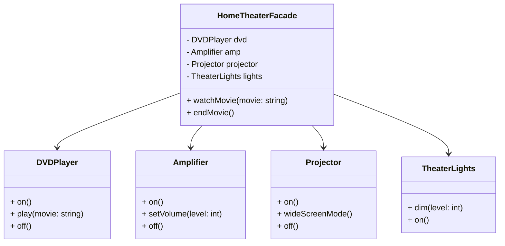

## 5.6 Facade Pattern

In the realm of software design, complexity is often an unavoidable reality. As systems grow, they tend to become more intricate, with numerous components interacting with each other. The Facade Pattern emerges as a powerful tool to manage this complexity by providing a unified interface to a set of interfaces in a subsystem. This pattern is particularly useful in C++ programming, where managing dependencies and interactions between various components can be challenging.

### Intent of the Facade Pattern

The primary intent of the Facade Pattern is to simplify interactions with complex systems by providing a single, simplified interface. This pattern helps in reducing the complexity of the system for the client, making it easier to use and understand. By encapsulating the complexities of the subsystem, the Facade Pattern allows clients to interact with the system without needing to understand its intricate details.

### Key Participants

The Facade Pattern involves the following key participants:

- **Facade**: The main class that provides a simplified interface to the complex subsystem. It delegates client requests to the appropriate subsystem objects.
- **Subsystem Classes**: These are the classes that implement the subsystem's functionality. They handle the actual work but are accessed through the Facade.
- **Client**: The entity that interacts with the Facade instead of directly interacting with the subsystem classes.

### Applicability

Consider using the Facade Pattern when:

- You need to provide a simple interface to a complex subsystem.
- There are many interdependent classes in the subsystem, and you want to simplify the interactions for the client.
- You want to layer your subsystems. The Facade Pattern can be used to define entry points for each subsystem level.

### Implementing the Facade Pattern

Let's delve into how we can implement the Facade Pattern in C++. We'll start with a simple example and gradually build upon it to illustrate the pattern's power and flexibility.

#### Example: Home Theater System

Imagine a complex home theater system with various components such as a DVD player, amplifier, projector, and lights. Each component has its own interface and functionality. The Facade Pattern can be used to create a simple interface to control the entire system.

```cpp
#include <iostream>
#include <string>

// Subsystem classes
class DVDPlayer {
public:
    void on() { std::cout << "DVD Player is on.\n"; }
    void play(const std::string& movie) { std::cout << "Playing movie: " << movie << "\n"; }
    void off() { std::cout << "DVD Player is off.\n"; }
};

class Amplifier {
public:
    void on() { std::cout << "Amplifier is on.\n"; }
    void setVolume(int level) { std::cout << "Setting volume to " << level << "\n"; }
    void off() { std::cout << "Amplifier is off.\n"; }
};

class Projector {
public:
    void on() { std::cout << "Projector is on.\n"; }
    void wideScreenMode() { std::cout << "Projector in widescreen mode.\n"; }
    void off() { std::cout << "Projector is off.\n"; }
};

class TheaterLights {
public:
    void dim(int level) { std::cout << "Dimming lights to " << level << "%\n"; }
    void on() { std::cout << "Lights are on.\n"; }
};

// Facade class
class HomeTheaterFacade {
private:
    DVDPlayer& dvd;
    Amplifier& amp;
    Projector& projector;
    TheaterLights& lights;

public:
    HomeTheaterFacade(DVDPlayer& dvd, Amplifier& amp, Projector& projector, TheaterLights& lights)
        : dvd(dvd), amp(amp), projector(projector), lights(lights) {}

    void watchMovie(const std::string& movie) {
        std::cout << "Get ready to watch a movie...\n";
        lights.dim(10);
        projector.on();
        projector.wideScreenMode();
        amp.on();
        amp.setVolume(5);
        dvd.on();
        dvd.play(movie);
    }

    void endMovie() {
        std::cout << "Shutting movie theater down...\n";
        lights.on();
        projector.off();
        amp.off();
        dvd.off();
    }
};

// Client code
int main() {
    DVDPlayer dvd;
    Amplifier amp;
    Projector projector;
    TheaterLights lights;

    HomeTheaterFacade homeTheater(dvd, amp, projector, lights);

    homeTheater.watchMovie("Inception");
    homeTheater.endMovie();

    return 0;
}
```

In this example, the `HomeTheaterFacade` class provides a simplified interface to control the entire home theater system. The client interacts with the `HomeTheaterFacade` instead of dealing with each component individually.

### Design Considerations

When implementing the Facade Pattern, consider the following:

- **Simplicity vs. Flexibility**: The Facade Pattern simplifies the interface for the client but may limit flexibility. Ensure that the facade does not hide too much functionality that the client might need.
- **Subsystem Independence**: The Facade Pattern does not prevent clients from accessing subsystem classes directly if needed. It merely provides a convenient interface.
- **Performance**: Be mindful of performance implications. The facade should not introduce unnecessary overhead.

### Differences and Similarities

The Facade Pattern is often confused with the Adapter Pattern. While both patterns provide a simplified interface, they serve different purposes:

- **Facade Pattern**: Simplifies the interface of a complex subsystem.
- **Adapter Pattern**: Converts the interface of a class into another interface that clients expect.

### Visualizing the Facade Pattern

To better understand the Facade Pattern, let's visualize the relationships between the components using a class diagram.



This diagram illustrates how the `HomeTheaterFacade` interacts with the subsystem classes (`DVDPlayer`, `Amplifier`, `Projector`, and `TheaterLights`) to provide a unified interface for the client.

### Try It Yourself

Experiment with the provided code by adding new components to the home theater system, such as a `StreamingService` or `GameConsole`. Modify the `HomeTheaterFacade` to include these new components and observe how the facade simplifies interactions with the expanded system.

### Knowledge Check

- **Question**: What is the primary purpose of the Facade Pattern?
- **Question**: How does the Facade Pattern differ from the Adapter Pattern?
- **Question**: What are some design considerations when implementing the Facade Pattern?

### Embrace the Journey

Remember, mastering design patterns is a journey. The Facade Pattern is just one tool in your toolkit. As you continue to explore and apply design patterns, you'll gain deeper insights into building robust, scalable, and maintainable software systems. Keep experimenting, stay curious, and enjoy the journey!

## Quiz Time!



### What is the primary purpose of the Facade Pattern?

- [x] To provide a simplified interface to a complex subsystem
- [ ] To convert the interface of a class into another interface
- [ ] To ensure a class has only one instance
- [ ] To define a family of algorithms

> **Explanation:** The Facade Pattern is designed to provide a simplified interface to a complex subsystem, making it easier for clients to interact with the system.

### How does the Facade Pattern differ from the Adapter Pattern?

- [x] The Facade Pattern simplifies the interface of a complex subsystem, while the Adapter Pattern converts the interface of a class into another interface.
- [ ] The Facade Pattern ensures a class has only one instance, while the Adapter Pattern defines a family of algorithms.
- [ ] The Facade Pattern is used for creating objects, while the Adapter Pattern is used for structuring code.
- [ ] The Facade Pattern is used for managing dependencies, while the Adapter Pattern is used for simplifying interfaces.

> **Explanation:** The Facade Pattern simplifies the interface of a complex subsystem, whereas the Adapter Pattern is used to convert the interface of a class into another interface that clients expect.

### When should you consider using the Facade Pattern?

- [x] When you need to provide a simple interface to a complex subsystem
- [ ] When you need to convert the interface of a class into another interface
- [ ] When you need to ensure a class has only one instance
- [ ] When you need to define a family of algorithms

> **Explanation:** The Facade Pattern is ideal for providing a simple interface to a complex subsystem, making it easier for clients to interact with the system.

### What is a key benefit of using the Facade Pattern?

- [x] It reduces the complexity of the system for the client.
- [ ] It ensures a class has only one instance.
- [ ] It allows for the conversion of interfaces.
- [ ] It defines a family of algorithms.

> **Explanation:** The Facade Pattern reduces the complexity of the system for the client by providing a simplified interface to interact with the subsystem.

### Can the Facade Pattern prevent clients from accessing subsystem classes directly?

- [ ] Yes, it prevents direct access to subsystem classes.
- [x] No, it does not prevent direct access to subsystem classes.
- [ ] Yes, but only in certain cases.
- [ ] No, it always prevents direct access.

> **Explanation:** The Facade Pattern does not prevent clients from accessing subsystem classes directly. It merely provides a convenient interface.

### What should be considered when implementing the Facade Pattern?

- [x] Simplicity vs. Flexibility
- [ ] Ensuring a class has only one instance
- [ ] Defining a family of algorithms
- [ ] Converting interfaces

> **Explanation:** When implementing the Facade Pattern, it's important to balance simplicity and flexibility, ensuring that the facade does not hide too much functionality that the client might need.

### What is a common misconception about the Facade Pattern?

- [x] That it prevents clients from accessing subsystem classes directly.
- [ ] That it simplifies the interface of a complex subsystem.
- [ ] That it provides a unified interface.
- [ ] That it reduces complexity for the client.

> **Explanation:** A common misconception is that the Facade Pattern prevents clients from accessing subsystem classes directly, but it actually does not restrict direct access.

### What is the role of the Facade in the Facade Pattern?

- [x] To provide a simplified interface to the complex subsystem
- [ ] To ensure a class has only one instance
- [ ] To convert the interface of a class into another interface
- [ ] To define a family of algorithms

> **Explanation:** The Facade's role is to provide a simplified interface to the complex subsystem, making it easier for clients to interact with the system.

### Is the Facade Pattern a creational pattern?

- [ ] True
- [x] False

> **Explanation:** The Facade Pattern is a structural pattern, not a creational pattern. It focuses on simplifying the structure of a complex system by providing a unified interface.

### Can the Facade Pattern be used to layer subsystems?

- [x] True
- [ ] False

> **Explanation:** The Facade Pattern can be used to define entry points for each subsystem level, effectively layering subsystems.


