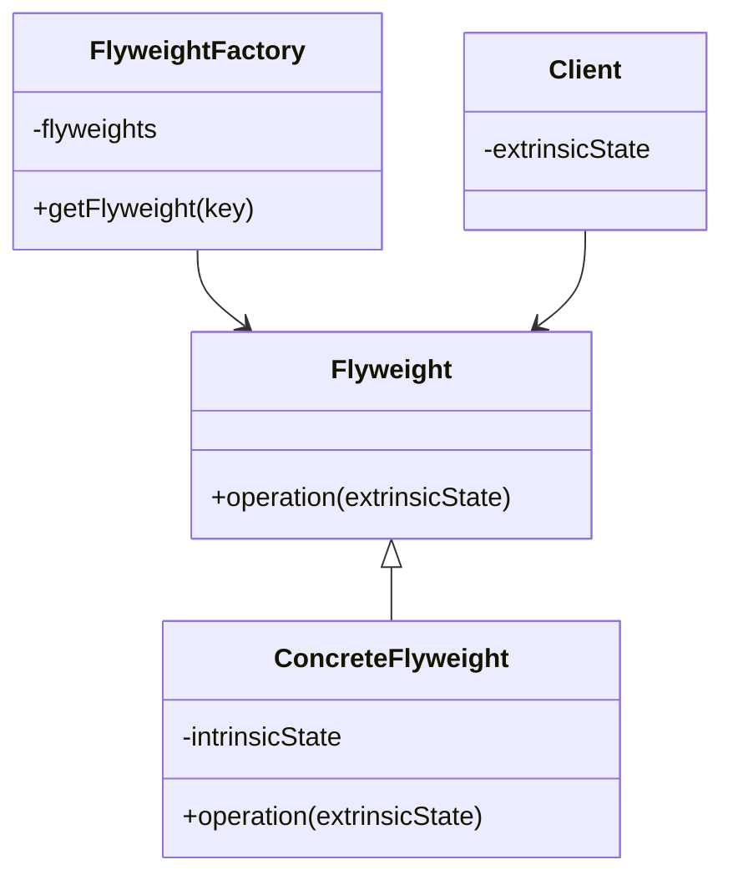

## 5.7 Flyweight Pattern

In the world of software engineering, efficiency is key, especially when dealing with large numbers of objects that share common data. The Flyweight Pattern is a structural design pattern that helps minimize memory usage by sharing as much data as possible with similar objects. This pattern is particularly useful in scenarios where a large number of objects are created, and many of them share common properties.

### Intent

The Flyweight Pattern aims to reduce the memory footprint of an application by sharing common data among multiple objects. It achieves this by separating the intrinsic state (shared data) from the extrinsic state (unique data) of objects. By doing so, it allows for the reuse of the intrinsic state across many objects, thereby optimizing memory usage.

### Key Participants

1. **Flyweight**: Declares an interface through which flyweights can receive and act on extrinsic state.
2. **ConcreteFlyweight**: Implements the Flyweight interface and stores intrinsic state. This object must be sharable.
3. **UnsharedConcreteFlyweight**: Not all Flyweight subclasses need to be shared. The Flyweight interface enables sharing, but it doesn't enforce it.
4. **FlyweightFactory**: Creates and manages flyweight objects. Ensures that flyweights are shared properly.
5. **Client**: Maintains references to flyweights and computes or stores extrinsic state.

### Applicability

Use the Flyweight Pattern when:
- You have a large number of objects that consume a lot of memory.
- The majority of the object state can be made extrinsic.
- You can identify and separate the intrinsic and extrinsic states of objects.
- The application does not depend on object identity.

### Implementing Flyweights for Performance

To implement the Flyweight Pattern, we need to identify the intrinsic and extrinsic states of the objects involved. The intrinsic state is the data that can be shared across objects, while the extrinsic state is the data that is unique to each object.

#### Example: Text Formatting

Consider a text editor where each character is an object. If we store font, size, and style information for each character, it would consume a significant amount of memory. Instead, we can use the Flyweight Pattern to share these properties among characters.

```cpp
#include <iostream>
#include <unordered_map>
#include <string>

// Flyweight interface
class Character {
public:
    virtual void display(int row, int column) const = 0;
};

// ConcreteFlyweight
class ConcreteCharacter : public Character {
private:
    char symbol; // Intrinsic state

public:
    ConcreteCharacter(char symbol) : symbol(symbol) {}

    void display(int row, int column) const override {
        std::cout << "Character: " << symbol << " at (" << row << ", " << column << ")\n";
    }
};

// FlyweightFactory
class CharacterFactory {
private:
    std::unordered_map<char, Character*> characters;

public:
    ~CharacterFactory() {
        for (auto& pair : characters) {
            delete pair.second;
        }
    }

    Character* getCharacter(char symbol) {
        if (characters.find(symbol) == characters.end()) {
            characters[symbol] = new ConcreteCharacter(symbol);
        }
        return characters[symbol];
    }
};

// Client code
int main() {
    CharacterFactory factory;
    Character* a = factory.getCharacter('a');
    Character* b = factory.getCharacter('b');
    Character* a2 = factory.getCharacter('a');

    a->display(1, 1);
    b->display(1, 2);
    a2->display(2, 1);

    return 0;
}
```

In this example, the `CharacterFactory` ensures that each character is only created once, and shared among different instances. The intrinsic state is the character symbol, while the extrinsic state (position) is passed as a parameter to the `display` method.

### Handling Extrinsic and Intrinsic State

The key to implementing the Flyweight Pattern effectively is to distinguish between intrinsic and extrinsic states. 

- **Intrinsic State**: This is the information that can be shared across objects. It is stored in the flyweight object and is immutable.
- **Extrinsic State**: This is the information that is unique to each object. It is computed or stored by the client and passed to the flyweight when needed.

#### Example: Chess Pieces

In a chess game, each piece type (e.g., pawn, knight) can be represented as a flyweight. The position of each piece on the board is extrinsic.

```cpp
#include <iostream>
#include <unordered_map>
#include <string>

// Flyweight interface
class ChessPiece {
public:
    virtual void move(int x, int y) const = 0;
};

// ConcreteFlyweight
class ConcreteChessPiece : public ChessPiece {
private:
    std::string type; // Intrinsic state

public:
    ConcreteChessPiece(const std::string& type) : type(type) {}

    void move(int x, int y) const override {
        std::cout << "Moving " << type << " to (" << x << ", " << y << ")\n";
    }
};

// FlyweightFactory
class ChessPieceFactory {
private:
    std::unordered_map<std::string, ChessPiece*> pieces;

public:
    ~ChessPieceFactory() {
        for (auto& pair : pieces) {
            delete pair.second;
        }
    }

    ChessPiece* getPiece(const std::string& type) {
        if (pieces.find(type) == pieces.end()) {
            pieces[type] = new ConcreteChessPiece(type);
        }
        return pieces[type];
    }
};

// Client code
int main() {
    ChessPieceFactory factory;
    ChessPiece* pawn = factory.getPiece("Pawn");
    ChessPiece* knight = factory.getPiece("Knight");
    ChessPiece* pawn2 = factory.getPiece("Pawn");

    pawn->move(1, 1);
    knight->move(2, 2);
    pawn2->move(1, 2);

    return 0;
}
```

In this chess example, the `ChessPieceFactory` creates and manages the flyweights. The intrinsic state is the type of the piece, while the extrinsic state is the position on the board.

### Flyweight Factories and Caching

The Flyweight Factory is responsible for creating and managing flyweight objects. It ensures that flyweights are shared properly and that new flyweights are created only when necessary.

#### Caching Flyweights

Caching is an essential part of the Flyweight Pattern. By caching flyweight objects, we can ensure that they are reused, reducing memory usage and improving performance.

- **Cache Management**: The factory maintains a cache of flyweight objects. When a client requests a flyweight, the factory checks the cache first. If the flyweight exists, it returns it; otherwise, it creates a new one, adds it to the cache, and returns it.
- **Memory Management**: Proper memory management is crucial when implementing the Flyweight Pattern. The factory should handle the lifecycle of flyweight objects, ensuring that they are deleted when no longer needed.

### Design Considerations

When implementing the Flyweight Pattern, consider the following:

- **Granularity**: The pattern is most effective when the objects are fine-grained and numerous.
- **State Separation**: Clearly separate intrinsic and extrinsic states to maximize sharing.
- **Performance**: While the pattern can reduce memory usage, it may introduce additional complexity and overhead in managing extrinsic state.
- **Thread Safety**: Ensure that the flyweight factory and flyweight objects are thread-safe if used in a multithreaded environment.

### Differences and Similarities

The Flyweight Pattern is often confused with other patterns, such as:

- **Singleton Pattern**: While both patterns involve sharing, the Singleton Pattern ensures a single instance of a class, whereas the Flyweight Pattern allows multiple shared instances.
- **Prototype Pattern**: The Prototype Pattern involves copying existing objects, while the Flyweight Pattern involves sharing existing objects.

### Visualizing the Flyweight Pattern

Let's visualize the Flyweight Pattern using a class diagram to better understand the relationships between the components.



**Diagram Description**: The diagram illustrates the Flyweight Pattern, showing the Flyweight interface, ConcreteFlyweight class with intrinsic state, FlyweightFactory managing flyweights, and the Client maintaining extrinsic state.

### Try It Yourself

Now that we've covered the Flyweight Pattern, let's encourage you to experiment with the code examples. Try modifying the examples to:

- Add more types of chess pieces or characters.
- Implement a new example using the Flyweight Pattern, such as a graphical application with shared graphical elements.
- Experiment with thread safety by making the factory and flyweights thread-safe.

### Knowledge Check

Before we conclude, let's reinforce what we've learned with a few questions and exercises:

1. What is the primary purpose of the Flyweight Pattern?
2. How do intrinsic and extrinsic states differ in the Flyweight Pattern?
3. What role does the Flyweight Factory play in the pattern?
4. Can the Flyweight Pattern be used in a multithreaded environment? What considerations must be made?
5. How does the Flyweight Pattern differ from the Singleton Pattern?

### Embrace the Journey

Remember, mastering design patterns like the Flyweight Pattern is a journey. As you progress, you'll find more opportunities to apply these patterns in your projects, optimizing performance and memory usage. Keep experimenting, stay curious, and enjoy the journey!

## Quiz Time!



### What is the primary purpose of the Flyweight Pattern?

- [x] To reduce memory usage by sharing common data among many objects.
- [ ] To ensure a class has only one instance.
- [ ] To encapsulate object creation logic.
- [ ] To define a family of algorithms.

> **Explanation:** The Flyweight Pattern is used to minimize memory usage by sharing as much data as possible with similar objects.

### In the Flyweight Pattern, what is the intrinsic state?

- [x] The data that can be shared across objects.
- [ ] The data that is unique to each object.
- [ ] The data that is computed at runtime.
- [ ] The data that is stored in the client.

> **Explanation:** The intrinsic state is the information that can be shared across objects and is stored in the flyweight object.

### What role does the Flyweight Factory play in the pattern?

- [x] It creates and manages flyweight objects.
- [ ] It maintains references to flyweights and computes extrinsic state.
- [ ] It encapsulates requests as objects.
- [ ] It provides a unified interface to a set of interfaces.

> **Explanation:** The Flyweight Factory is responsible for creating and managing flyweight objects, ensuring they are shared properly.

### How does the Flyweight Pattern differ from the Singleton Pattern?

- [x] The Flyweight Pattern allows multiple shared instances, while the Singleton Pattern ensures a single instance.
- [ ] The Flyweight Pattern ensures a single instance, while the Singleton Pattern allows multiple shared instances.
- [ ] Both patterns ensure a single instance of a class.
- [ ] Both patterns allow multiple shared instances.

> **Explanation:** The Flyweight Pattern allows multiple shared instances, whereas the Singleton Pattern ensures a single instance of a class.

### Can the Flyweight Pattern be used in a multithreaded environment?

- [x] Yes, but thread safety must be ensured.
- [ ] No, it cannot be used in multithreaded environments.
- [ ] Yes, without any additional considerations.
- [ ] No, it is only suitable for single-threaded applications.

> **Explanation:** The Flyweight Pattern can be used in multithreaded environments, but care must be taken to ensure thread safety.

### What is the extrinsic state in the Flyweight Pattern?

- [x] The data that is unique to each object.
- [ ] The data that can be shared across objects.
- [ ] The data that is stored in the flyweight object.
- [ ] The data that is immutable.

> **Explanation:** The extrinsic state is the data that is unique to each object and is computed or stored by the client.

### Which of the following is NOT a key participant in the Flyweight Pattern?

- [ ] Flyweight
- [ ] ConcreteFlyweight
- [ ] FlyweightFactory
- [x] Singleton

> **Explanation:** The Singleton is not a key participant in the Flyweight Pattern. The key participants are Flyweight, ConcreteFlyweight, FlyweightFactory, and Client.

### What is a potential drawback of using the Flyweight Pattern?

- [x] It may introduce additional complexity and overhead in managing extrinsic state.
- [ ] It increases memory usage.
- [ ] It ensures a single instance of a class.
- [ ] It encapsulates requests as objects.

> **Explanation:** While the Flyweight Pattern reduces memory usage, it may introduce additional complexity and overhead in managing extrinsic state.

### Which pattern is often confused with the Flyweight Pattern?

- [ ] Singleton Pattern
- [ ] Prototype Pattern
- [ ] Factory Pattern
- [x] Both Singleton and Prototype Patterns

> **Explanation:** The Flyweight Pattern is often confused with both the Singleton and Prototype Patterns due to similarities in object sharing and creation.

### The Flyweight Pattern is most effective when:

- [x] The objects are fine-grained and numerous.
- [ ] The objects are coarse-grained and few.
- [ ] The objects have no shared state.
- [ ] The objects require unique instances.

> **Explanation:** The Flyweight Pattern is most effective when the objects are fine-grained and numerous, allowing for significant memory savings through shared state.


