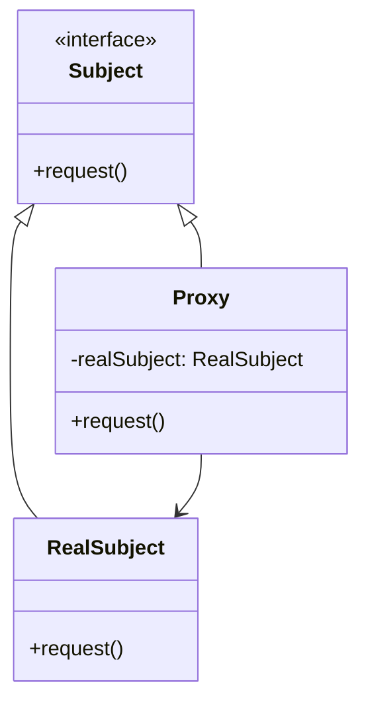

## 5.8 Proxy Pattern

In the world of software design patterns, the Proxy Pattern stands out as a powerful structural pattern that provides a surrogate or placeholder for another object to control access to it. This pattern is particularly useful in scenarios where direct access to an object is either not possible or not desirable. In this comprehensive guide, we will delve into the Proxy Pattern, exploring its various forms, implementation techniques, and practical use cases in C++ programming.

### Intent

The primary intent of the Proxy Pattern is to provide a substitute or placeholder for another object to control access to it. This can be beneficial for a variety of reasons, including:

- **Lazy Initialization**: Deferring the full cost of object creation and initialization until the object is actually needed.
- **Access Control**: Restricting access to certain methods or properties of an object.
- **Remote Access**: Providing a local representative for an object that exists in a different address space.
- **Logging and Auditing**: Keeping track of the usage of an object for debugging or auditing purposes.

### Key Participants

The Proxy Pattern involves several key participants:

- **Subject**: Defines the common interface for RealSubject and Proxy so that a Proxy can be used anywhere a RealSubject is expected.
- **RealSubject**: Represents the real object that the proxy is representing.
- **Proxy**: Maintains a reference to the RealSubject and controls access to it. It may also be responsible for creating and managing the lifecycle of the RealSubject.

### Types of Proxies

There are several variations of the Proxy Pattern, each serving a different purpose:

1. **Virtual Proxy**: Used to defer the creation and initialization of an expensive object until it is actually needed.
2. **Remote Proxy**: Represents an object that exists in a different address space, such as in a different process or on a different machine.
3. **Protection Proxy**: Controls access to the methods of an object based on access rights.
4. **Smart Proxy**: Provides additional functionality such as reference counting, logging, or caching.

### Visualizing the Proxy Pattern

Let's visualize the Proxy Pattern using a class diagram to better understand the relationships between its components.



**Diagram Description**: The diagram illustrates the relationship between the `Subject`, `RealSubject`, and `Proxy`. The `Proxy` class implements the `Subject` interface and maintains a reference to a `RealSubject` object, controlling access to it.

### Implementing the Proxy Pattern in C++

Let's explore how to implement the Proxy Pattern in C++ by examining each type of proxy.

#### Virtual Proxy

A Virtual Proxy is used to defer the creation and initialization of an expensive object until it is actually needed. This can be particularly useful in scenarios where the object may not be used at all, saving resources.

```cpp
#include <iostream>
#include <memory>

// Subject interface
class Image {
public:
    virtual void display() const = 0;
    virtual ~Image() = default;
};

// RealSubject
class RealImage : public Image {
public:
    RealImage(const std::string& filename) : filename_(filename) {
        loadFromDisk();
    }

    void display() const override {
        std::cout << "Displaying " << filename_ << std::endl;
    }

private:
    void loadFromDisk() const {
        std::cout << "Loading " << filename_ << " from disk..." << std::endl;
    }

    std::string filename_;
};

// Proxy
class ProxyImage : public Image {
public:
    ProxyImage(const std::string& filename) : filename_(filename) {}

    void display() const override {
        if (!realImage_) {
            realImage_ = std::make_unique<RealImage>(filename_);
        }
        realImage_->display();
    }

private:
    mutable std::unique_ptr<RealImage> realImage_;
    std::string filename_;
};

int main() {
    ProxyImage image("test_image.jpg");
    std::cout << "Image will be loaded and displayed on first access:" << std::endl;
    image.display(); // Loads and displays the image
    std::cout << "Image will be displayed again without loading:" << std::endl;
    image.display(); // Displays the image without loading
    return 0;
}
```

**Code Explanation**: In this example, the `ProxyImage` class acts as a virtual proxy for the `RealImage` class. The `RealImage` is only loaded from disk when the `display` method is called for the first time, demonstrating lazy initialization.

#### Remote Proxy

A Remote Proxy is used to represent an object that exists in a different address space. This is commonly used in distributed systems where objects may reside on different machines.

```cpp
#include <iostream>
#include <string>

// Subject interface
class RemoteService {
public:
    virtual std::string fetchData() const = 0;
    virtual ~RemoteService() = default;
};

// RealSubject
class RealRemoteService : public RemoteService {
public:
    std::string fetchData() const override {
        return "Data from remote service";
    }
};

// Proxy
class RemoteProxy : public RemoteService {
public:
    RemoteProxy() : realService_(nullptr) {}

    std::string fetchData() const override {
        if (!realService_) {
            std::cout << "Connecting to remote service..." << std::endl;
            realService_ = std::make_unique<RealRemoteService>();
        }
        return realService_->fetchData();
    }

private:
    mutable std::unique_ptr<RealRemoteService> realService_;
};

int main() {
    RemoteProxy proxy;
    std::cout << "Fetching data through proxy:" << std::endl;
    std::cout << proxy.fetchData() << std::endl;
    return 0;
}
```

**Code Explanation**: In this example, the `RemoteProxy` class acts as a proxy for the `RealRemoteService`. The connection to the remote service is established only when the `fetchData` method is called, simulating remote access.

#### Protection Proxy

A Protection Proxy controls access to the methods of an object based on access rights. This can be useful in scenarios where different users have different levels of access.

```cpp
#include <iostream>
#include <string>

// Subject interface
class Document {
public:
    virtual void display() const = 0;
    virtual void edit() = 0;
    virtual ~Document() = default;
};

// RealSubject
class RealDocument : public Document {
public:
    void display() const override {
        std::cout << "Displaying document content." << std::endl;
    }

    void edit() override {
        std::cout << "Editing document content." << std::endl;
    }
};

// Proxy
class ProtectionProxy : public Document {
public:
    ProtectionProxy(std::shared_ptr<Document> document, bool hasEditRights)
        : document_(document), hasEditRights_(hasEditRights) {}

    void display() const override {
        document_->display();
    }

    void edit() override {
        if (hasEditRights_) {
            document_->edit();
        } else {
            std::cout << "Access denied: You do not have edit rights." << std::endl;
        }
    }

private:
    std::shared_ptr<Document> document_;
    bool hasEditRights_;
};

int main() {
    auto document = std::make_shared<RealDocument>();
    ProtectionProxy proxy(document, false);

    std::cout << "Attempting to display document:" << std::endl;
    proxy.display();

    std::cout << "Attempting to edit document:" << std::endl;
    proxy.edit();

    return 0;
}
```

**Code Explanation**: In this example, the `ProtectionProxy` class controls access to the `edit` method of the `RealDocument` class based on the user's access rights.

### Implementing Copy-on-Write with Proxy

The Copy-on-Write (CoW) technique is an optimization strategy where a copy of an object is only made when modifications are necessary. This can be efficiently implemented using the Proxy Pattern.

```cpp
#include <iostream>
#include <memory>
#include <string>

// Subject interface
class Text {
public:
    virtual void setText(const std::string& newText) = 0;
    virtual void display() const = 0;
    virtual ~Text() = default;
};

// RealSubject
class RealText : public Text {
public:
    RealText(const std::string& text) : text_(text) {}

    void setText(const std::string& newText) override {
        text_ = newText;
    }

    void display() const override {
        std::cout << "Text: " << text_ << std::endl;
    }

private:
    std::string text_;
};

// Proxy
class CopyOnWriteProxy : public Text {
public:
    CopyOnWriteProxy(const std::string& text)
        : realText_(std::make_shared<RealText>(text)) {}

    void setText(const std::string& newText) override {
        if (!realText_.unique()) {
            realText_ = std::make_shared<RealText>(*realText_);
        }
        realText_->setText(newText);
    }

    void display() const override {
        realText_->display();
    }

private:
    std::shared_ptr<RealText> realText_;
};

int main() {
    CopyOnWriteProxy textProxy("Hello, World!");
    textProxy.display();

    CopyOnWriteProxy anotherTextProxy = textProxy;
    anotherTextProxy.setText("Hello, C++!");

    textProxy.display();
    anotherTextProxy.display();

    return 0;
}
```

**Code Explanation**: In this example, the `CopyOnWriteProxy` class ensures that a new copy of the `RealText` object is created only when a modification is made, optimizing memory usage.

### Use Cases for the Proxy Pattern

The Proxy Pattern is versatile and can be applied in various scenarios:

- **Lazy Loading**: Deferring the loading of large objects until they are needed, as demonstrated with the Virtual Proxy.
- **Access Control**: Restricting access to certain operations based on user permissions, as shown with the Protection Proxy.
- **Remote Access**: Providing a local interface for remote objects, useful in distributed systems.
- **Logging and Monitoring**: Tracking the usage of objects for debugging or auditing purposes.
- **Copy-on-Write Optimization**: Reducing unnecessary copying of objects by deferring the copy operation until a write occurs.

### Design Considerations

When implementing the Proxy Pattern, consider the following:

- **Performance Overhead**: Introducing a proxy can add overhead, so it should be justified by the benefits it provides.
- **Complexity**: The pattern can increase the complexity of the codebase, so it should be used judiciously.
- **Thread Safety**: Ensure that the proxy implementation is thread-safe if it will be used in a multithreaded environment.
- **C++ Specific Features**: Utilize C++ features such as smart pointers and move semantics to implement efficient proxies.

### Differences and Similarities with Other Patterns

The Proxy Pattern is often confused with other patterns such as:

- **Decorator Pattern**: Both patterns involve adding functionality to an object, but the Proxy Pattern controls access, while the Decorator Pattern adds behavior.
- **Adapter Pattern**: The Adapter Pattern changes the interface of an object, while the Proxy Pattern provides the same interface but with controlled access.
- **Facade Pattern**: The Facade Pattern provides a simplified interface to a set of interfaces, while the Proxy Pattern provides controlled access to a single object.

### Try It Yourself

Experiment with the Proxy Pattern by modifying the provided code examples:

- Implement a logging proxy that logs every method call on the `RealSubject`.
- Create a caching proxy that caches the results of expensive operations.
- Extend the `ProtectionProxy` to support different levels of access for different users.

### Knowledge Check

- What are the key participants in the Proxy Pattern?
- How does a Virtual Proxy differ from a Remote Proxy?
- In what scenarios would you use a Protection Proxy?
- What is the primary benefit of using the Copy-on-Write technique with a proxy?

### Embrace the Journey

Remember, mastering design patterns is a journey. As you explore the Proxy Pattern and its variations, you'll gain insights into how to control access to objects effectively. Keep experimenting, stay curious, and enjoy the journey of becoming a proficient C++ developer!

## Quiz Time!



### What is the primary intent of the Proxy Pattern?

- [x] To provide a substitute or placeholder for another object to control access to it.
- [ ] To add new functionality to an existing object.
- [ ] To change the interface of an existing object.
- [ ] To simplify the interface of a complex system.

> **Explanation:** The Proxy Pattern provides a substitute or placeholder for another object to control access to it, which is its primary intent.

### Which type of proxy is used to defer the creation and initialization of an expensive object until it is actually needed?

- [x] Virtual Proxy
- [ ] Remote Proxy
- [ ] Protection Proxy
- [ ] Smart Proxy

> **Explanation:** A Virtual Proxy is used to defer the creation and initialization of an expensive object until it is actually needed.

### What is a key difference between the Proxy Pattern and the Decorator Pattern?

- [x] The Proxy Pattern controls access, while the Decorator Pattern adds behavior.
- [ ] The Proxy Pattern changes the interface, while the Decorator Pattern provides a simplified interface.
- [ ] The Proxy Pattern provides a simplified interface, while the Decorator Pattern controls access.
- [ ] The Proxy Pattern adds behavior, while the Decorator Pattern changes the interface.

> **Explanation:** The Proxy Pattern controls access to an object, while the Decorator Pattern adds behavior to an object.

### In the context of the Proxy Pattern, what is a Protection Proxy used for?

- [x] Controlling access to the methods of an object based on access rights.
- [ ] Providing a local representative for an object that exists in a different address space.
- [ ] Deferring the creation and initialization of an expensive object.
- [ ] Adding additional functionality such as logging or caching.

> **Explanation:** A Protection Proxy is used to control access to the methods of an object based on access rights.

### Which C++ feature is particularly useful for implementing efficient proxies?

- [x] Smart pointers
- [ ] Macros
- [ ] Global variables
- [ ] Preprocessor directives

> **Explanation:** Smart pointers are particularly useful for implementing efficient proxies in C++.

### What is the primary benefit of using the Copy-on-Write technique with a proxy?

- [x] Reducing unnecessary copying of objects by deferring the copy operation until a write occurs.
- [ ] Simplifying the interface of a complex system.
- [ ] Adding new functionality to an existing object.
- [ ] Changing the interface of an existing object.

> **Explanation:** The primary benefit of using the Copy-on-Write technique with a proxy is reducing unnecessary copying of objects by deferring the copy operation until a write occurs.

### Which type of proxy provides a local interface for remote objects?

- [x] Remote Proxy
- [ ] Virtual Proxy
- [ ] Protection Proxy
- [ ] Smart Proxy

> **Explanation:** A Remote Proxy provides a local interface for remote objects.

### What is a potential drawback of using the Proxy Pattern?

- [x] Introducing performance overhead
- [ ] Simplifying the codebase
- [ ] Reducing code complexity
- [ ] Eliminating the need for access control

> **Explanation:** A potential drawback of using the Proxy Pattern is introducing performance overhead.

### True or False: The Proxy Pattern and the Adapter Pattern serve the same purpose.

- [ ] True
- [x] False

> **Explanation:** False. The Proxy Pattern controls access to an object, while the Adapter Pattern changes the interface of an object.

### What is a common use case for the Proxy Pattern?

- [x] Lazy Loading
- [ ] Data Serialization
- [ ] Event Handling
- [ ] Template Metaprogramming

> **Explanation:** Lazy Loading is a common use case for the Proxy Pattern, where the loading of large objects is deferred until they are needed.


