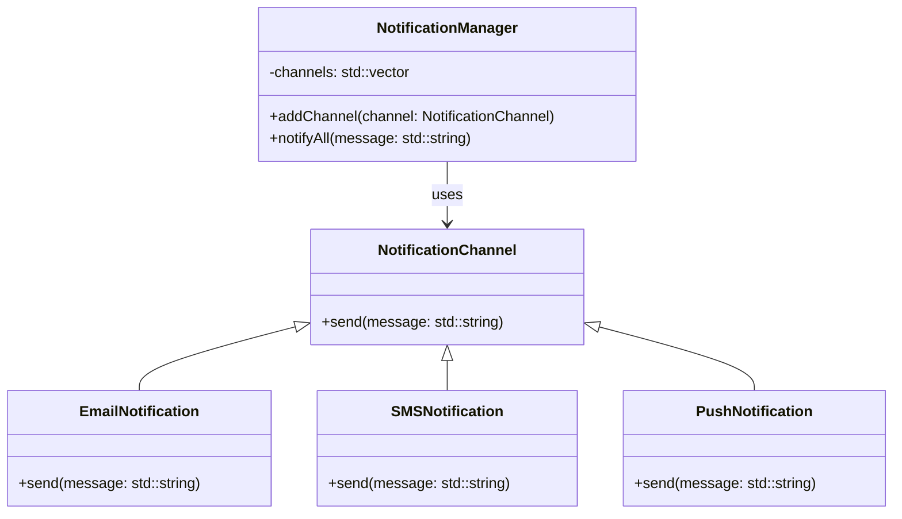

## 5.9 Composite Reuse Principle

In the world of software engineering, the Composite Reuse Principle (CRP) is a fundamental guideline that encourages developers to favor composition over inheritance when designing systems. This principle is pivotal in creating flexible, maintainable, and scalable software architectures. In this section, we will delve into the intricacies of the Composite Reuse Principle, explore its application in C++ design, and highlight the advantages of using composition over inheritance.

### Understanding the Composite Reuse Principle

The Composite Reuse Principle is a design principle that suggests using composition as a primary means of reusing code, rather than relying on inheritance. Composition involves assembling objects to create complex functionalities, whereas inheritance involves creating a new class based on an existing class, inheriting its properties and behaviors.

#### Key Concepts

- **Composition**: This is the process of building complex objects by combining simpler objects. It allows for dynamic behavior changes at runtime and promotes code reuse by delegating tasks to other objects.
- **Inheritance**: This is a mechanism where a new class (derived class) inherits properties and behaviors from an existing class (base class). While inheritance can be powerful, it can also lead to rigid and tightly coupled designs.

### Why Favor Composition Over Inheritance?

1. **Flexibility**: Composition allows for greater flexibility as it enables the behavior of a class to be changed at runtime by composing it with different objects.
2. **Encapsulation**: Composition promotes encapsulation by keeping the internal details of an object hidden and exposing only what is necessary.
3. **Reduced Coupling**: By using composition, classes are less dependent on each other, which reduces coupling and increases modularity.
4. **Reusability**: Composition encourages code reuse by allowing objects to be reused across different contexts without modification.
5. **Avoiding Inheritance Pitfalls**: Inheritance can lead to complex hierarchies that are difficult to manage and understand. Composition avoids these pitfalls by simplifying the relationships between objects.

### Applying the Composite Reuse Principle in C++ Design

Let's explore how we can apply the Composite Reuse Principle in C++ design through practical examples and code snippets.

#### Example: Designing a Flexible Notification System

Imagine we are designing a notification system that sends alerts via different channels such as email, SMS, and push notifications. Using inheritance, we might create a class hierarchy where each notification type is a subclass of a base `Notification` class. However, this approach can become cumbersome as the number of notification types grows.

Instead, let's use composition to design a more flexible system.

```cpp
#include <iostream>
#include <vector>
#include <memory>

// Abstract interface for notification channels
class NotificationChannel {
public:
    virtual void send(const std::string& message) = 0;
    virtual ~NotificationChannel() = default;
};

// Concrete implementation for Email notifications
class EmailNotification : public NotificationChannel {
public:
    void send(const std::string& message) override {
        std::cout << "Sending Email: " << message << std::endl;
    }
};

// Concrete implementation for SMS notifications
class SMSNotification : public NotificationChannel {
public:
    void send(const std::string& message) override {
        std::cout << "Sending SMS: " << message << std::endl;
    }
};

// Concrete implementation for Push notifications
class PushNotification : public NotificationChannel {
public:
    void send(const std::string& message) override {
        std::cout << "Sending Push Notification: " << message << std::endl;
    }
};

// NotificationManager uses composition to manage multiple notification channels
class NotificationManager {
private:
    std::vector<std::shared_ptr<NotificationChannel>> channels;
public:
    void addChannel(const std::shared_ptr<NotificationChannel>& channel) {
        channels.push_back(channel);
    }

    void notifyAll(const std::string& message) {
        for (const auto& channel : channels) {
            channel->send(message);
        }
    }
};

int main() {
    NotificationManager manager;
    manager.addChannel(std::make_shared<EmailNotification>());
    manager.addChannel(std::make_shared<SMSNotification>());
    manager.addChannel(std::make_shared<PushNotification>());

    manager.notifyAll("This is a test notification.");
    return 0;
}
```

In this example, the `NotificationManager` class uses composition to manage a collection of `NotificationChannel` objects. This design allows us to easily add new notification types without modifying existing code, demonstrating the flexibility and extensibility of composition.

### Advantages of Composition

#### 1. Dynamic Behavior Changes

Composition allows objects to change their behavior at runtime. By composing objects with different components, you can dynamically alter their functionality without altering their structure.

#### 2. Improved Encapsulation

With composition, each component can encapsulate its own behavior and state, reducing the exposure of internal details. This leads to cleaner and more maintainable code.

#### 3. Enhanced Reusability

Components can be reused across different parts of an application or even in different projects. This reuse is facilitated by the loose coupling between components, which is a hallmark of composition.

#### 4. Simplified Testing

Testing individual components is easier when using composition, as each component can be tested in isolation. This modular approach simplifies unit testing and improves code reliability.

### Visualizing the Composite Reuse Principle

To better understand the relationships and interactions in a composition-based design, let's visualize the notification system using a class diagram.



In this diagram, we see that `NotificationManager` uses composition to interact with `NotificationChannel` objects, while `EmailNotification`, `SMSNotification`, and `PushNotification` are concrete implementations of the `NotificationChannel` interface.

### Design Considerations

When applying the Composite Reuse Principle, consider the following:

- **Interface Design**: Ensure that components expose clear and concise interfaces that define their behavior.
- **Dependency Management**: Manage dependencies carefully to avoid tight coupling between components.
- **Performance**: Be mindful of the performance implications of composition, especially when dealing with large numbers of components.
- **Complexity**: While composition can simplify certain aspects of design, it can also introduce complexity if not managed properly. Strive for a balance between flexibility and simplicity.

### Differences and Similarities with Inheritance

While both composition and inheritance are used to achieve code reuse, they have distinct characteristics:

- **Inheritance**:
  - Establishes an "is-a" relationship.
  - Often leads to tightly coupled code.
  - Can result in complex class hierarchies.

- **Composition**:
  - Establishes a "has-a" relationship.
  - Promotes loose coupling and modularity.
  - Encourages the reuse of components across different contexts.

### Try It Yourself

To deepen your understanding, try modifying the notification system example:

- Add a new notification type, such as `SlackNotification`.
- Implement a method in `NotificationManager` to remove a notification channel.
- Experiment with different compositions of notification channels to see how the system behaves.

### Knowledge Check

- What are the main advantages of using composition over inheritance?
- How does composition promote encapsulation and modularity?
- What are some potential drawbacks of using composition?

### Embrace the Journey

Remember, mastering the Composite Reuse Principle is just the beginning. As you continue to explore C++ design patterns, you'll discover new ways to create robust and scalable software. Keep experimenting, stay curious, and enjoy the journey!

## Quiz Time!



### What is the primary benefit of using composition over inheritance?

- [x] Flexibility and dynamic behavior changes
- [ ] Simplicity and reduced code size
- [ ] Faster execution time
- [ ] Easier syntax

> **Explanation:** Composition allows for greater flexibility by enabling dynamic behavior changes at runtime, unlike inheritance which is static.

### Which relationship does composition establish between objects?

- [x] "Has-a" relationship
- [ ] "Is-a" relationship
- [ ] "Uses-a" relationship
- [ ] "Belongs-to" relationship

> **Explanation:** Composition establishes a "has-a" relationship, meaning one object contains or is composed of other objects.

### What is a potential drawback of using composition?

- [x] Increased complexity if not managed properly
- [ ] Tightly coupled code
- [ ] Inability to reuse code
- [ ] Lack of flexibility

> **Explanation:** While composition offers many benefits, it can introduce complexity if not managed properly, especially in large systems.

### How does composition enhance encapsulation?

- [x] By keeping internal details hidden and exposing only necessary interfaces
- [ ] By sharing all internal details with other components
- [ ] By using inheritance to define behavior
- [ ] By reducing the number of classes

> **Explanation:** Composition enhances encapsulation by keeping internal details hidden and exposing only the necessary interfaces, leading to cleaner and more maintainable code.

### Which of the following is NOT an advantage of composition?

- [ ] Flexibility
- [ ] Encapsulation
- [ ] Reusability
- [x] Tightly coupled code

> **Explanation:** Composition promotes loose coupling, not tight coupling, which is one of its main advantages.

### In the notification system example, what role does the `NotificationManager` class play?

- [x] It uses composition to manage multiple notification channels
- [ ] It inherits from the `NotificationChannel` class
- [ ] It defines the interface for notification channels
- [ ] It acts as a concrete implementation of a notification channel

> **Explanation:** The `NotificationManager` class uses composition to manage multiple notification channels, allowing for flexible and dynamic behavior.

### What is a common pitfall of using inheritance?

- [x] Creating complex class hierarchies that are difficult to manage
- [ ] Lack of code reuse
- [ ] Inability to change behavior at runtime
- [ ] Reduced encapsulation

> **Explanation:** Inheritance can lead to complex class hierarchies that are difficult to manage and understand, which is a common pitfall.

### How can you modify the notification system to add a new notification type?

- [x] Implement a new class that inherits from `NotificationChannel` and add it to `NotificationManager`
- [ ] Modify the `NotificationManager` class to include the new type
- [ ] Change the existing notification classes to accommodate the new type
- [ ] Use a different design pattern

> **Explanation:** To add a new notification type, implement a new class that inherits from `NotificationChannel` and add it to `NotificationManager`, demonstrating the flexibility of composition.

### What type of relationship does inheritance establish?

- [ ] "Has-a" relationship
- [x] "Is-a" relationship
- [ ] "Uses-a" relationship
- [ ] "Belongs-to" relationship

> **Explanation:** Inheritance establishes an "is-a" relationship, meaning the derived class is a type of the base class.

### True or False: Composition allows for behavior changes at runtime.

- [x] True
- [ ] False

> **Explanation:** True. Composition allows for behavior changes at runtime by composing objects with different components, unlike inheritance which is static.


