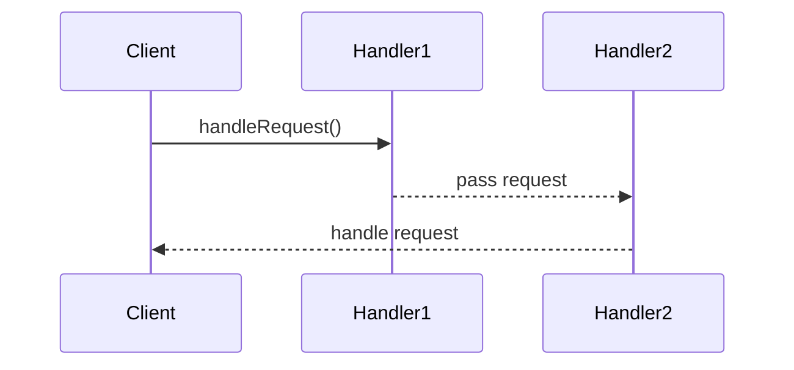

## 6.1 Overview of Behavioral Patterns

Behavioral design patterns are a critical component of software engineering, especially in C++ programming. These patterns focus on the interaction and responsibility of objects, providing solutions for managing algorithms, relationships, and responsibilities between objects. By using behavioral patterns, we can create systems that are more flexible, scalable, and easier to maintain.

### Understanding Behavioral Patterns

Behavioral patterns are concerned with algorithms and the assignment of responsibilities between objects. They help in defining how objects communicate and interact with each other. These patterns are essential for creating a clear separation of concerns, which leads to a more organized and manageable codebase.

#### Key Concepts

- **Algorithm Encapsulation**: Behavioral patterns often encapsulate algorithms, allowing them to be interchangeable and reusable.
- **Object Communication**: They define how objects interact, ensuring that communication is efficient and effective.
- **Responsibility Assignment**: These patterns help in assigning responsibilities to different objects, promoting a clean and organized architecture.

### Importance of Behavioral Patterns in C++

In C++, behavioral patterns are particularly important due to the language's complexity and power. C++ allows for fine-grained control over system resources, which can lead to intricate interactions between objects. Behavioral patterns provide a framework for managing these interactions, ensuring that systems remain robust and maintainable.

### Common Behavioral Patterns

Let's explore some of the most common behavioral patterns used in C++ programming:

1. **Chain of Responsibility Pattern**: This pattern allows a request to be passed along a chain of handlers. Each handler can either process the request or pass it to the next handler in the chain.

2. **Command Pattern**: Encapsulates a request as an object, thereby allowing for parameterization of clients with queues, requests, and operations.

3. **Interpreter Pattern**: Defines a representation for a language's grammar along with an interpreter that uses this representation to interpret sentences in the language.

4. **Iterator Pattern**: Provides a way to access the elements of an aggregate object sequentially without exposing its underlying representation.

5. **Mediator Pattern**: Defines an object that encapsulates how a set of objects interact, promoting loose coupling by keeping objects from referring to each other explicitly.

6. **Memento Pattern**: Captures and externalizes an object's internal state so that the object can be restored to this state later.

7. **Observer Pattern**: Defines a one-to-many dependency between objects so that when one object changes state, all its dependents are notified and updated automatically.

8. **State Pattern**: Allows an object to alter its behavior when its internal state changes. The object will appear to change its class.

9. **Strategy Pattern**: Defines a family of algorithms, encapsulates each one, and makes them interchangeable. This pattern lets the algorithm vary independently from clients that use it.

10. **Template Method Pattern**: Defines the skeleton of an algorithm in an operation, deferring some steps to subclasses.

11. **Visitor Pattern**: Represents an operation to be performed on the elements of an object structure. It lets you define a new operation without changing the classes of the elements on which it operates.

12. **Null Object Pattern**: Provides an object as a surrogate for the lack of an object of a given type.

13. **Event Handling and Delegation**: Implements events and callbacks using function pointers, functors, and lambdas.

14. **Policy-Based Design**: Creates flexible designs using policies implemented with templates.

15. **Reactive Programming Patterns**: Implements reactive systems in C++ using observables and reactive streams.

### Detailed Exploration of Behavioral Patterns

#### Chain of Responsibility Pattern

**Intent**: Avoid coupling the sender of a request to its receiver by giving more than one object a chance to handle the request. Chain the receiving objects and pass the request along the chain until an object handles it.

**Key Participants**:
- **Handler**: Defines an interface for handling requests.
- **ConcreteHandler**: Handles requests it is responsible for. Can access its successor.
- **Client**: Initiates the request to a ConcreteHandler object on the chain.

**Applicability**: Use this pattern when more than one object can handle a request and the handler isn't known a priori.

**Sample Code Snippet**:

```cpp
#include <iostream>
#include <memory>

// Base class for handling requests
class Handler {
public:
    virtual ~Handler() = default;
    virtual void setNext(std::shared_ptr<Handler> nextHandler) = 0;
    virtual void handleRequest(int request) = 0;
};

// Concrete handler that processes requests
class ConcreteHandler1 : public Handler {
private:
    std::shared_ptr<Handler> next;
public:
    void setNext(std::shared_ptr<Handler> nextHandler) override {
        next = nextHandler;
    }
    void handleRequest(int request) override {
        if (request < 10) {
            std::cout << "ConcreteHandler1 handled request " << request << std::endl;
        } else if (next) {
            next->handleRequest(request);
        }
    }
};

// Another concrete handler
class ConcreteHandler2 : public Handler {
private:
    std::shared_ptr<Handler> next;
public:
    void setNext(std::shared_ptr<Handler> nextHandler) override {
        next = nextHandler;
    }
    void handleRequest(int request) override {
        if (request >= 10) {
            std::cout << "ConcreteHandler2 handled request " << request << std::endl;
        } else if (next) {
            next->handleRequest(request);
        }
    }
};

int main() {
    auto handler1 = std::make_shared<ConcreteHandler1>();
    auto handler2 = std::make_shared<ConcreteHandler2>();
    handler1->setNext(handler2);

    handler1->handleRequest(5);
    handler1->handleRequest(15);

    return 0;
}
```

**Design Considerations**: Consider using this pattern when you want to decouple the sender and receiver of a request. Ensure that the chain is not too long to avoid performance issues.

#### Command Pattern

**Intent**: Encapsulate a request as an object, thereby allowing for parameterization of clients with queues, requests, and operations.

**Key Participants**:
- **Command**: Declares an interface for executing an operation.
- **ConcreteCommand**: Defines a binding between a Receiver object and an action.
- **Invoker**: Asks the command to carry out the request.
- **Receiver**: Knows how to perform the operations associated with carrying out a request.

**Applicability**: Use this pattern when you want to parameterize objects by an action to perform, queue requests, or support undoable operations.

**Sample Code Snippet**:

```cpp
#include <iostream>
#include <memory>
#include <vector>

// Command interface
class Command {
public:
    virtual ~Command() = default;
    virtual void execute() = 0;
};

// Receiver class
class Light {
public:
    void turnOn() {
        std::cout << "Light is on" << std::endl;
    }
    void turnOff() {
        std::cout << "Light is off" << std::endl;
    }
};

// Concrete command to turn on the light
class LightOnCommand : public Command {
private:
    std::shared_ptr<Light> light;
public:
    LightOnCommand(std::shared_ptr<Light> light) : light(light) {}
    void execute() override {
        light->turnOn();
    }
};

// Concrete command to turn off the light
class LightOffCommand : public Command {
private:
    std::shared_ptr<Light> light;
public:
    LightOffCommand(std::shared_ptr<Light> light) : light(light) {}
    void execute() override {
        light->turnOff();
    }
};

// Invoker class
class RemoteControl {
private:
    std::vector<std::shared_ptr<Command>> commands;
public:
    void setCommand(std::shared_ptr<Command> command) {
        commands.push_back(command);
    }
    void pressButton() {
        for (auto& command : commands) {
            command->execute();
        }
    }
};

int main() {
    auto light = std::make_shared<Light>();
    auto lightOn = std::make_shared<LightOnCommand>(light);
    auto lightOff = std::make_shared<LightOffCommand>(light);

    RemoteControl remote;
    remote.setCommand(lightOn);
    remote.setCommand(lightOff);

    remote.pressButton();

    return 0;
}
```

**Design Considerations**: Use the Command pattern to decouple the object that invokes the operation from the one that knows how to perform it. This pattern is especially useful for implementing undoable operations.

### Visualizing Behavioral Patterns

To better understand how behavioral patterns work, let's visualize the interaction between objects using the Chain of Responsibility pattern as an example.



**Diagram Description**: This sequence diagram illustrates how a request is passed along a chain of handlers. The client sends a request to `Handler1`, which processes the request if possible. If `Handler1` cannot handle the request, it passes it to `Handler2`, which then handles the request.

### Differences and Similarities

Behavioral patterns are often confused with each other due to their focus on object interactions. Here are some distinctions:

- **Chain of Responsibility vs. Command**: The Chain of Responsibility pattern involves passing a request along a chain of handlers, while the Command pattern encapsulates a request as an object.

- **Observer vs. Mediator**: The Observer pattern defines a one-to-many dependency between objects, while the Mediator pattern centralizes complex communications between objects.

- **Strategy vs. State**: The Strategy pattern defines a family of algorithms and makes them interchangeable, whereas the State pattern allows an object to alter its behavior when its internal state changes.

### Knowledge Check

- **Question**: What is the primary purpose of behavioral patterns?
  - **Answer**: To manage algorithms and object interactions.

- **Question**: How does the Chain of Responsibility pattern differ from the Command pattern?
  - **Answer**: The Chain of Responsibility pattern passes a request along a chain of handlers, while the Command pattern encapsulates a request as an object.

### Try It Yourself

To deepen your understanding of behavioral patterns, try modifying the code examples provided:

- **Chain of Responsibility**: Add a new handler to the chain and see how it affects the request handling process.
- **Command**: Implement a new command that performs a different action, such as dimming the light.

### Embrace the Journey

Remember, mastering behavioral patterns is a journey. As you continue to explore these patterns, you'll discover new ways to enhance the flexibility and communication of your software systems. Keep experimenting, stay curious, and enjoy the journey!

## Quiz Time!



### What is the primary focus of behavioral patterns in C++?

- [x] Managing algorithms and object interactions
- [ ] Managing object creation
- [ ] Structuring object composition
- [ ] Optimizing memory usage

> **Explanation:** Behavioral patterns focus on managing algorithms and object interactions, ensuring efficient communication and responsibility assignment.


### Which pattern encapsulates a request as an object?

- [ ] Chain of Responsibility
- [x] Command
- [ ] Observer
- [ ] Strategy

> **Explanation:** The Command pattern encapsulates a request as an object, allowing for parameterization of clients with queues, requests, and operations.


### In the Chain of Responsibility pattern, what happens if a handler cannot process a request?

- [x] It passes the request to the next handler in the chain
- [ ] It returns an error
- [ ] It processes the request partially
- [ ] It terminates the request

> **Explanation:** If a handler cannot process a request, it passes the request to the next handler in the chain, allowing for flexible request handling.


### Which pattern is useful for implementing undoable operations?

- [ ] Chain of Responsibility
- [x] Command
- [ ] Observer
- [ ] Strategy

> **Explanation:** The Command pattern is useful for implementing undoable operations by encapsulating requests as objects.


### What is the key benefit of the Mediator pattern?

- [x] Reducing coupling between components
- [ ] Increasing object creation efficiency
- [ ] Simplifying object composition
- [ ] Enhancing memory management

> **Explanation:** The Mediator pattern reduces coupling between components by centralizing complex communications, promoting loose coupling.


### Which pattern allows an object to alter its behavior when its internal state changes?

- [ ] Strategy
- [ ] Command
- [x] State
- [ ] Observer

> **Explanation:** The State pattern allows an object to alter its behavior when its internal state changes, making it appear to change its class.


### What is the primary role of the Observer pattern?

- [x] Defining a one-to-many dependency between objects
- [ ] Encapsulating requests as objects
- [ ] Passing requests along a chain of handlers
- [ ] Centralizing complex communications

> **Explanation:** The Observer pattern defines a one-to-many dependency between objects, ensuring that dependents are notified and updated automatically.


### Which pattern is best suited for implementing publish-subscribe mechanisms?

- [ ] Command
- [x] Observer
- [ ] Strategy
- [ ] State

> **Explanation:** The Observer pattern is best suited for implementing publish-subscribe mechanisms, allowing for efficient event-driven systems.


### What is a common use case for the Strategy pattern?

- [x] Defining a family of algorithms and making them interchangeable
- [ ] Capturing and restoring object state
- [ ] Centralizing complex communications
- [ ] Managing object creation

> **Explanation:** The Strategy pattern is used for defining a family of algorithms and making them interchangeable, allowing for flexible algorithm selection.


### True or False: The Null Object pattern provides a surrogate for the lack of an object.

- [x] True
- [ ] False

> **Explanation:** True. The Null Object pattern provides an object as a surrogate for the lack of an object of a given type, reducing null checks.


