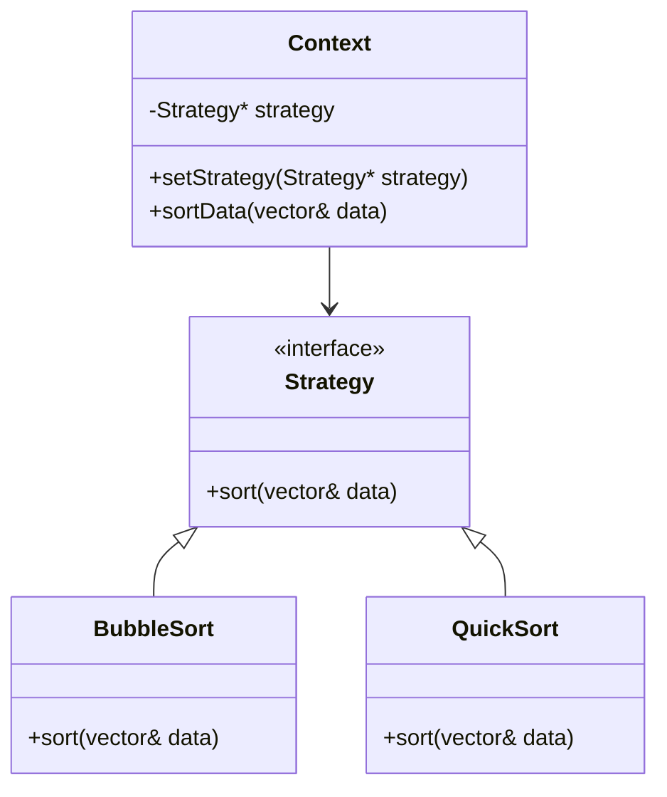

## 6.10 Strategy Pattern

The Strategy Pattern is a behavioral design pattern that enables selecting an algorithm's behavior at runtime. This pattern defines a family of algorithms, encapsulates each one, and makes them interchangeable. The Strategy Pattern allows the algorithm to vary independently from clients that use it, promoting flexibility and reusability in code.

### Intent

The primary intent of the Strategy Pattern is to define a set of algorithms, encapsulate each one, and make them interchangeable. This pattern allows the algorithm to vary independently from the clients that use it. By encapsulating the algorithm, the Strategy Pattern promotes the Open/Closed Principle, enabling new strategies to be added without altering existing code.

### Key Participants

1. **Strategy**: This is an interface common to all supported algorithms. The `Strategy` interface declares operations common to all supported versions of some algorithm.

2. **ConcreteStrategy**: These are classes that implement the `Strategy` interface. Each `ConcreteStrategy` implements a specific algorithm.

3. **Context**: This class maintains a reference to a `Strategy` object and is configured with a `ConcreteStrategy` object. The `Context` class interacts with the `Strategy` interface to execute an algorithm defined by a `ConcreteStrategy`.

### Applicability

Use the Strategy Pattern when:

- You have a family of algorithms and need to choose one at runtime.
- You want to avoid exposing complex, algorithm-specific data structures.
- You need to replace conditional statements with polymorphism.
- You want to encapsulate algorithms in a way that allows them to be interchangeable.

### Sample Code Snippet

Let's consider a simple example where we have different strategies for sorting a list of integers. We will define a `Strategy` interface, concrete strategies for different sorting algorithms, and a `Context` class to use these strategies.

```cpp
#include <iostream>
#include <vector>
#include <algorithm>

// Strategy Interface
class SortStrategy {
public:
    virtual ~SortStrategy() {}
    virtual void sort(std::vector<int>& data) = 0;
};

// Concrete Strategy for Bubble Sort
class BubbleSort : public SortStrategy {
public:
    void sort(std::vector<int>& data) override {
        for (size_t i = 0; i < data.size(); ++i) {
            for (size_t j = 0; j < data.size() - i - 1; ++j) {
                if (data[j] > data[j + 1]) {
                    std::swap(data[j], data[j + 1]);
                }
            }
        }
    }
};

// Concrete Strategy for Quick Sort
class QuickSort : public SortStrategy {
public:
    void sort(std::vector<int>& data) override {
        quickSort(data, 0, data.size() - 1);
    }

private:
    void quickSort(std::vector<int>& data, int low, int high) {
        if (low < high) {
            int pi = partition(data, low, high);
            quickSort(data, low, pi - 1);
            quickSort(data, pi + 1, high);
        }
    }

    int partition(std::vector<int>& data, int low, int high) {
        int pivot = data[high];
        int i = (low - 1);
        for (int j = low; j <= high - 1; j++) {
            if (data[j] < pivot) {
                i++;
                std::swap(data[i], data[j]);
            }
        }
        std::swap(data[i + 1], data[high]);
        return (i + 1);
    }
};

// Context
class SortContext {
private:
    SortStrategy* strategy;

public:
    SortContext(SortStrategy* strategy) : strategy(strategy) {}

    void setStrategy(SortStrategy* strategy) {
        this->strategy = strategy;
    }

    void sortData(std::vector<int>& data) {
        strategy->sort(data);
    }
};

// Client Code
int main() {
    std::vector<int> data = {34, 7, 23, 32, 5, 62};

    SortContext context(new BubbleSort());
    std::cout << "Using Bubble Sort:\n";
    context.sortData(data);
    for (int num : data) {
        std::cout << num << " ";
    }
    std::cout << std::endl;

    data = {34, 7, 23, 32, 5, 62};
    context.setStrategy(new QuickSort());
    std::cout << "Using Quick Sort:\n";
    context.sortData(data);
    for (int num : data) {
        std::cout << num << " ";
    }
    std::cout << std::endl;

    return 0;
}
```

### Design Considerations

- **Encapsulation**: The Strategy Pattern encapsulates the algorithm, allowing the client to choose which algorithm to use at runtime.
- **Open/Closed Principle**: New strategies can be added without modifying existing code, adhering to the Open/Closed Principle.
- **Polymorphism**: The Strategy Pattern uses polymorphism to switch between different algorithms.
- **Performance**: Consider the performance implications of switching strategies at runtime, especially if the strategy changes frequently.

### Differences and Similarities

The Strategy Pattern is often confused with the State Pattern. While both patterns involve changing behavior at runtime, the Strategy Pattern is used to switch between algorithms, whereas the State Pattern is used to change the behavior of an object based on its state.

### Visualizing the Strategy Pattern

Let's use a diagram to visualize the relationships between the `Context`, `Strategy`, and `ConcreteStrategy` classes.



### Try It Yourself

Experiment with the code by adding a new sorting strategy, such as Merge Sort. Implement the `MergeSort` class that inherits from `SortStrategy` and integrate it into the `SortContext`.

### References and Links

- [Strategy Pattern on Wikipedia](https://en.wikipedia.org/wiki/Strategy_pattern)
- [C++ Polymorphism - GeeksforGeeks](https://www.geeksforgeeks.org/polymorphism-in-c/)
- [Design Patterns: Elements of Reusable Object-Oriented Software](https://en.wikipedia.org/wiki/Design_Patterns)

### Knowledge Check

- What is the primary intent of the Strategy Pattern?
- How does the Strategy Pattern promote the Open/Closed Principle?
- What is the difference between the Strategy Pattern and the State Pattern?

### Embrace the Journey

Remember, mastering design patterns is a journey. As you explore the Strategy Pattern, consider how it can be applied to your projects to enhance flexibility and maintainability. Keep experimenting, stay curious, and enjoy the process of learning and applying design patterns in C++.

## Quiz Time!



### What is the primary intent of the Strategy Pattern?

- [x] To define a family of algorithms, encapsulate each one, and make them interchangeable.
- [ ] To allow an object to alter its behavior when its internal state changes.
- [ ] To provide a way to access the elements of an aggregate object sequentially.
- [ ] To define a one-to-many dependency between objects.

> **Explanation:** The Strategy Pattern's primary intent is to define a family of algorithms, encapsulate each one, and make them interchangeable, allowing the algorithm to vary independently from clients that use it.

### Which of the following is a key participant in the Strategy Pattern?

- [x] Strategy
- [x] ConcreteStrategy
- [x] Context
- [ ] Observer

> **Explanation:** The key participants in the Strategy Pattern are Strategy, ConcreteStrategy, and Context. Observer is not part of the Strategy Pattern.

### How does the Strategy Pattern promote the Open/Closed Principle?

- [x] By allowing new strategies to be added without modifying existing code.
- [ ] By ensuring that all algorithms are implemented in a single class.
- [ ] By using inheritance to extend the functionality of existing classes.
- [ ] By defining a fixed set of algorithms at compile time.

> **Explanation:** The Strategy Pattern promotes the Open/Closed Principle by allowing new strategies to be added without modifying existing code, thus making the system open for extension but closed for modification.

### What is the difference between the Strategy Pattern and the State Pattern?

- [x] The Strategy Pattern is used to switch between algorithms, while the State Pattern is used to change behavior based on an object's state.
- [ ] The Strategy Pattern is used for creating objects, while the State Pattern is used for managing object lifecycles.
- [ ] The Strategy Pattern is used for managing object relationships, while the State Pattern is used for managing data flow.
- [ ] The Strategy Pattern is used for defining interfaces, while the State Pattern is used for implementing interfaces.

> **Explanation:** The Strategy Pattern is used to switch between algorithms, whereas the State Pattern is used to change behavior based on an object's state.

### In the provided code example, which class is responsible for executing the sorting algorithm?

- [x] SortContext
- [ ] SortStrategy
- [ ] BubbleSort
- [ ] QuickSort

> **Explanation:** In the provided code example, the `SortContext` class is responsible for executing the sorting algorithm by interacting with the `SortStrategy` interface.

### Which of the following is NOT a benefit of using the Strategy Pattern?

- [ ] Promotes code reusability
- [ ] Allows algorithms to vary independently from clients
- [x] Increases code duplication
- [ ] Simplifies unit testing

> **Explanation:** The Strategy Pattern does not increase code duplication; rather, it helps in reducing duplication by encapsulating algorithms and promoting code reusability.

### What is the role of the `ConcreteStrategy` in the Strategy Pattern?

- [x] To implement a specific algorithm defined by the Strategy interface.
- [ ] To maintain a reference to a Strategy object.
- [ ] To define the interface common to all supported algorithms.
- [ ] To provide a unified interface to a set of interfaces.

> **Explanation:** The `ConcreteStrategy` implements a specific algorithm defined by the Strategy interface.

### How can you add a new sorting algorithm to the provided code example?

- [x] By creating a new class that implements the `SortStrategy` interface.
- [ ] By modifying the `SortContext` class to include the new algorithm.
- [ ] By adding a new method to the `SortStrategy` interface.
- [ ] By changing the existing `ConcreteStrategy` classes.

> **Explanation:** To add a new sorting algorithm, you create a new class that implements the `SortStrategy` interface, allowing it to be used interchangeably with other strategies.

### What is the advantage of using polymorphism in the Strategy Pattern?

- [x] It allows for dynamic selection of algorithms at runtime.
- [ ] It ensures that all algorithms are implemented in a single class.
- [ ] It provides a way to access elements of an aggregate object sequentially.
- [ ] It defines a one-to-many dependency between objects.

> **Explanation:** Polymorphism allows for dynamic selection of algorithms at runtime, which is a key advantage of the Strategy Pattern.

### True or False: The Strategy Pattern can be used to replace conditional statements with polymorphism.

- [x] True
- [ ] False

> **Explanation:** True. The Strategy Pattern can be used to replace conditional statements with polymorphism, allowing for cleaner and more maintainable code.


