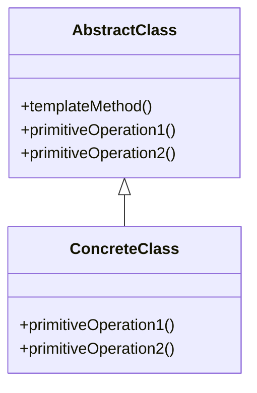
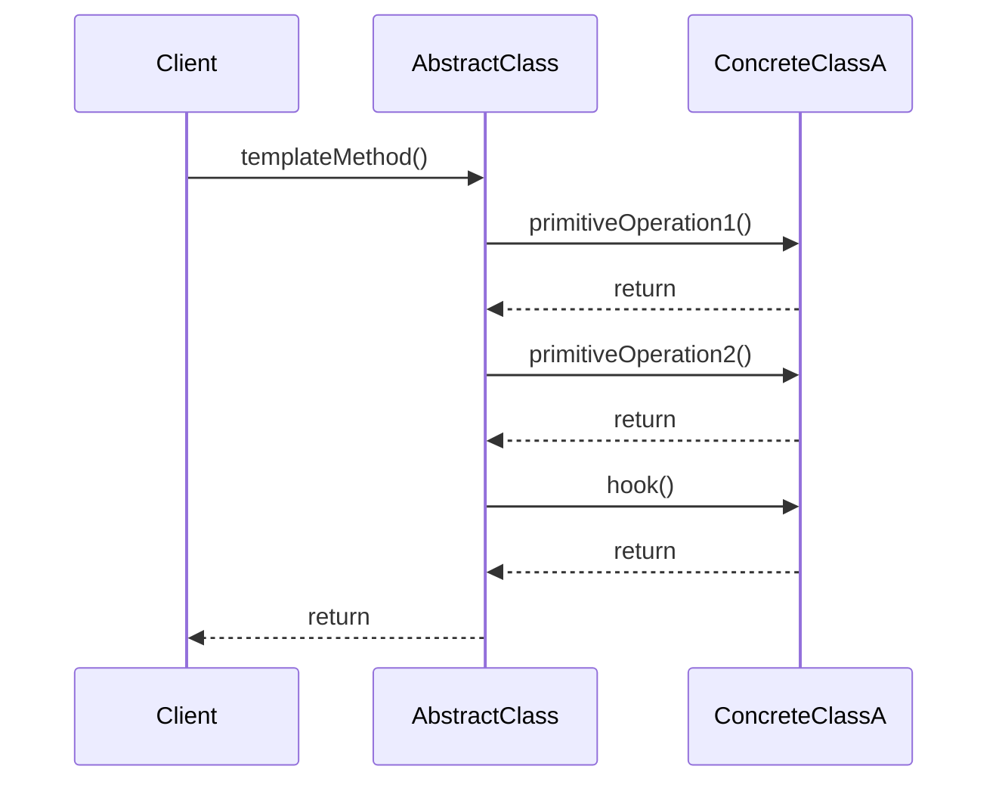

## 6.11 Template Method Pattern

The Template Method Pattern is a behavioral design pattern that defines the skeleton of an algorithm in a method, deferring some steps to subclasses. It allows subclasses to redefine certain steps of an algorithm without changing its structure. This pattern is particularly useful when you have a fixed sequence of steps, but some steps require customization.

### Intent

The primary intent of the Template Method Pattern is to define the overall structure of an algorithm while allowing subclasses to alter specific steps. This pattern promotes code reuse and enforces a consistent algorithm structure across different implementations.

### Key Participants

1. **Abstract Class**: Declares the template method and defines the algorithm's skeleton. It may also provide default implementations for some steps.
2. **Concrete Class**: Implements the abstract class and overrides specific steps of the algorithm as needed.

### Applicability

Use the Template Method Pattern when:
- You want to implement the invariant parts of an algorithm once and allow subclasses to provide specific behaviors.
- You have several classes that contain similar algorithms with minor differences.
- You want to control the extensions of certain steps in an algorithm.

### Structure

Here's a class diagram illustrating the Template Method Pattern:



### Implementing the Template Method Pattern in C++

Let's delve into the implementation details of the Template Method Pattern in C++. We'll start by defining an abstract class with a template method and then create concrete classes that override specific steps.

#### Abstract Class

The abstract class defines the template method and declares the primitive operations that subclasses must implement.

```cpp
#include <iostream>

class AbstractClass {
public:
    // The template method defines the skeleton of an algorithm.
    void templateMethod() {
        primitiveOperation1();
        primitiveOperation2();
        hook();
    }

    // Primitive operations to be implemented by subclasses.
    virtual void primitiveOperation1() = 0;
    virtual void primitiveOperation2() = 0;

    // A hook method that can be overridden by subclasses.
    virtual void hook() {}
};
```

#### Concrete Classes

Concrete classes implement the primitive operations and can override the hook method if needed.

```cpp
class ConcreteClassA : public AbstractClass {
public:
    void primitiveOperation1() override {
        std::cout << "ConcreteClassA: Implementing Operation 1" << std::endl;
    }

    void primitiveOperation2() override {
        std::cout << "ConcreteClassA: Implementing Operation 2" << std::endl;
    }
};

class ConcreteClassB : public AbstractClass {
public:
    void primitiveOperation1() override {
        std::cout << "ConcreteClassB: Implementing Operation 1" << std::endl;
    }

    void primitiveOperation2() override {
        std::cout << "ConcreteClassB: Implementing Operation 2" << std::endl;
    }

    void hook() override {
        std::cout << "ConcreteClassB: Overriding Hook Method" << std::endl;
    }
};
```

#### Client Code

The client code interacts with the abstract class, allowing the template method to execute the algorithm with the specific steps provided by concrete classes.

```cpp
int main() {
    ConcreteClassA classA;
    ConcreteClassB classB;

    std::cout << "Executing Template Method for ConcreteClassA:" << std::endl;
    classA.templateMethod();

    std::cout << "\nExecuting Template Method for ConcreteClassB:" << std::endl;
    classB.templateMethod();

    return 0;
}
```

### Design Considerations

- **Invariant Parts**: The template method should encapsulate the invariant parts of an algorithm, ensuring that the overall structure remains consistent across subclasses.
- **Hook Methods**: Use hook methods to provide optional extension points in the algorithm. Subclasses can override these methods to add additional behavior.
- **C++ Specific Features**: Leverage C++ features such as virtual functions and inheritance to implement the Template Method Pattern effectively.

### Differences and Similarities

The Template Method Pattern is often confused with the Strategy Pattern. While both patterns involve defining a family of algorithms, the Template Method Pattern defines the algorithm's skeleton in a superclass, allowing subclasses to override specific steps. In contrast, the Strategy Pattern defines a family of algorithms, encapsulates each one, and makes them interchangeable.

### Try It Yourself

To deepen your understanding of the Template Method Pattern, try modifying the code examples provided. Here are some suggestions:
- Add a new concrete class that implements the abstract class and provides a unique implementation for the primitive operations.
- Introduce additional hook methods in the abstract class and override them in the concrete classes.
- Experiment with different algorithm structures by altering the sequence of steps in the template method.

### Visualizing the Template Method Pattern

To further illustrate the Template Method Pattern, let's visualize the flow of control when the template method is called:



In this sequence diagram, the client calls the `templateMethod` on the abstract class, which then delegates specific operations to the concrete class.

### Knowledge Check

Before we conclude, let's reinforce the key concepts of the Template Method Pattern with a few questions:

- What is the primary purpose of the Template Method Pattern?
- How does the Template Method Pattern promote code reuse?
- What role do hook methods play in the Template Method Pattern?

### Embrace the Journey

Remember, mastering design patterns like the Template Method Pattern is a journey. As you continue to explore and implement these patterns, you'll gain a deeper understanding of how to create flexible and maintainable software architectures. Keep experimenting, stay curious, and enjoy the process!

### References and Links

For further reading on the Template Method Pattern and related design patterns, consider exploring the following resources:
- [Design Patterns: Elements of Reusable Object-Oriented Software](https://en.wikipedia.org/wiki/Design_Patterns) by Erich Gamma, Richard Helm, Ralph Johnson, and John Vlissides.
- [C++ Programming Language](https://www.stroustrup.com/C++.html) by Bjarne Stroustrup.

## Quiz Time!



### What is the main purpose of the Template Method Pattern?

- [x] To define the skeleton of an algorithm and allow subclasses to override specific steps.
- [ ] To encapsulate algorithms and make them interchangeable.
- [ ] To provide a unified interface to a set of interfaces.
- [ ] To attach additional responsibilities to an object dynamically.

> **Explanation:** The Template Method Pattern is designed to define the skeleton of an algorithm, allowing subclasses to override specific steps without altering the overall structure.

### Which class declares the template method in the Template Method Pattern?

- [x] Abstract Class
- [ ] Concrete Class
- [ ] Client Class
- [ ] Interface Class

> **Explanation:** The abstract class declares the template method, which defines the algorithm's skeleton and calls the primitive operations.

### What is a hook method in the Template Method Pattern?

- [x] A method that provides optional extension points in the algorithm.
- [ ] A method that encapsulates the entire algorithm.
- [ ] A method that defines the invariant parts of the algorithm.
- [ ] A method that is always overridden by subclasses.

> **Explanation:** Hook methods are optional methods that can be overridden by subclasses to add additional behavior without changing the algorithm's structure.

### How does the Template Method Pattern promote code reuse?

- [x] By defining the invariant parts of an algorithm in a single place and allowing subclasses to customize specific steps.
- [ ] By encapsulating algorithms and making them interchangeable.
- [ ] By providing a unified interface to a set of interfaces.
- [ ] By attaching additional responsibilities to an object dynamically.

> **Explanation:** The Template Method Pattern promotes code reuse by defining the invariant parts of an algorithm in a single place, allowing subclasses to customize specific steps.

### What is the difference between the Template Method Pattern and the Strategy Pattern?

- [x] The Template Method Pattern defines the algorithm's skeleton in a superclass, while the Strategy Pattern defines a family of algorithms and makes them interchangeable.
- [ ] The Template Method Pattern encapsulates algorithms, while the Strategy Pattern provides a unified interface.
- [ ] The Template Method Pattern allows subclasses to override specific steps, while the Strategy Pattern attaches additional responsibilities dynamically.
- [ ] The Template Method Pattern provides optional extension points, while the Strategy Pattern defines the invariant parts of an algorithm.

> **Explanation:** The Template Method Pattern defines the algorithm's skeleton in a superclass, allowing subclasses to override specific steps, while the Strategy Pattern defines a family of algorithms and makes them interchangeable.

### Which of the following is a key participant in the Template Method Pattern?

- [x] Abstract Class
- [ ] Singleton Class
- [ ] Observer Class
- [ ] Facade Class

> **Explanation:** The abstract class is a key participant in the Template Method Pattern, as it declares the template method and defines the algorithm's skeleton.

### What is the role of the concrete class in the Template Method Pattern?

- [x] To implement the abstract class and override specific steps of the algorithm.
- [ ] To declare the template method and define the algorithm's skeleton.
- [ ] To provide a unified interface to a set of interfaces.
- [ ] To encapsulate algorithms and make them interchangeable.

> **Explanation:** The concrete class implements the abstract class and overrides specific steps of the algorithm as needed.

### How can hook methods be used in the Template Method Pattern?

- [x] To provide optional extension points in the algorithm that can be overridden by subclasses.
- [ ] To encapsulate the entire algorithm and make it interchangeable.
- [ ] To define the invariant parts of the algorithm.
- [ ] To always be overridden by subclasses.

> **Explanation:** Hook methods provide optional extension points in the algorithm that can be overridden by subclasses to add additional behavior.

### What is the benefit of using the Template Method Pattern in C++?

- [x] It allows for a consistent algorithm structure while enabling customization of specific steps.
- [ ] It provides a unified interface to a set of interfaces.
- [ ] It encapsulates algorithms and makes them interchangeable.
- [ ] It attaches additional responsibilities to an object dynamically.

> **Explanation:** The Template Method Pattern allows for a consistent algorithm structure while enabling customization of specific steps, promoting code reuse and flexibility.

### True or False: The Template Method Pattern allows subclasses to change the overall structure of an algorithm.

- [ ] True
- [x] False

> **Explanation:** False. The Template Method Pattern defines the overall structure of an algorithm in the abstract class, allowing subclasses to override specific steps without changing the overall structure.




