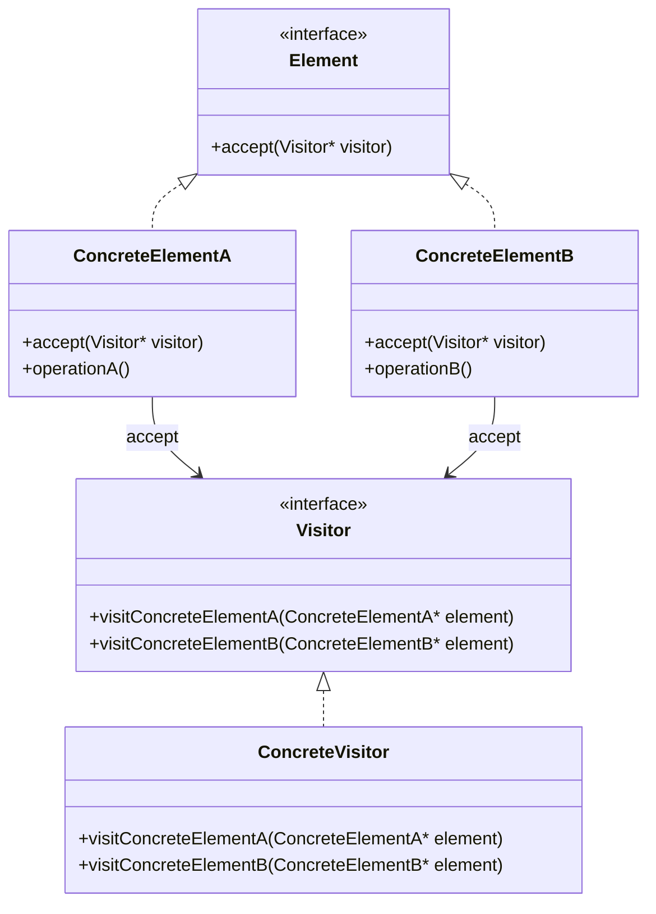

## 6.12 Visitor Pattern

The Visitor Pattern is a powerful behavioral design pattern that allows you to define new operations on an object structure without modifying the objects themselves. This pattern is particularly useful when dealing with complex object structures and type hierarchies. It enables you to separate algorithms from the objects on which they operate, facilitating cleaner and more maintainable code.

### Intent

The primary intent of the Visitor Pattern is to separate an algorithm from the object structure it operates on. This separation allows you to add new operations without altering the classes of the elements on which it operates. The pattern is especially useful for operations that need to be performed on a group of related objects, where the operation might vary based on the object's type.

### Key Participants

1. **Visitor**: Declares a `visit` operation for each class of `ConcreteElement` in the object structure. The operation's name and signature identify the class that sends the `visit` request to the visitor.

2. **ConcreteVisitor**: Implements each operation declared by `Visitor`. Each operation implements a fragment of the algorithm defined for the corresponding class of object in the structure.

3. **Element**: Defines an `accept` operation that takes a visitor as an argument.

4. **ConcreteElement**: Implements the `accept` operation that takes a visitor as an argument.

5. **ObjectStructure**: Can enumerate its elements and may provide a high-level interface to allow the visitor to visit its elements.

### Applicability

Use the Visitor Pattern when:

- An object structure contains many classes of objects with differing interfaces, and you want to perform operations on these objects that depend on their concrete classes.
- Many distinct and unrelated operations need to be performed on objects in an object structure, and you want to avoid "polluting" their classes with these operations.
- The classes defining the object structure rarely change, but you often want to define new operations over the structure.

### Implementing Double Dispatch

Double dispatch is a technique that allows a function to be dynamically dispatched based on the runtime types of two objects. In the context of the Visitor Pattern, double dispatch is used to call a method on a visitor object that is specific to the type of the element being visited.

### Sample Code Snippet

Let's illustrate the Visitor Pattern with a simple example in C++:

```cpp
#include <iostream>
#include <vector>
#include <memory>

// Forward declarations
class ConcreteElementA;
class ConcreteElementB;

// Visitor interface
class Visitor {
public:
    virtual void visitConcreteElementA(ConcreteElementA* element) = 0;
    virtual void visitConcreteElementB(ConcreteElementB* element) = 0;
};

// Element interface
class Element {
public:
    virtual ~Element() = default;
    virtual void accept(Visitor* visitor) = 0;
};

// ConcreteElementA
class ConcreteElementA : public Element {
public:
    void accept(Visitor* visitor) override {
        visitor->visitConcreteElementA(this);
    }
    void operationA() {
        std::cout << "ConcreteElementA operation.\n";
    }
};

// ConcreteElementB
class ConcreteElementB : public Element {
public:
    void accept(Visitor* visitor) override {
        visitor->visitConcreteElementB(this);
    }
    void operationB() {
        std::cout << "ConcreteElementB operation.\n";
    }
};

// ConcreteVisitor
class ConcreteVisitor : public Visitor {
public:
    void visitConcreteElementA(ConcreteElementA* element) override {
        std::cout << "Visiting ConcreteElementA.\n";
        element->operationA();
    }
    void visitConcreteElementB(ConcreteElementB* element) override {
        std::cout << "Visiting ConcreteElementB.\n";
        element->operationB();
    }
};

int main() {
    std::vector<std::unique_ptr<Element>> elements;
    elements.push_back(std::make_unique<ConcreteElementA>());
    elements.push_back(std::make_unique<ConcreteElementB>());

    ConcreteVisitor visitor;
    for (auto& element : elements) {
        element->accept(&visitor);
    }

    return 0;
}
```

### Explanation of the Code

1. **Visitor Interface**: Defines the `visit` methods for each `ConcreteElement`. This allows the visitor to perform operations on each type of element.

2. **ConcreteVisitor**: Implements the `visit` methods. Each method performs an operation on the element it visits.

3. **Element Interface**: Declares the `accept` method, which takes a visitor as an argument.

4. **ConcreteElementA and ConcreteElementB**: Implement the `accept` method, which calls the appropriate `visit` method on the visitor.

5. **Main Function**: Creates a list of elements and a visitor. It then iterates over the elements, allowing the visitor to perform operations on each one.

### Design Considerations

- **When to Use**: The Visitor Pattern is ideal when you have a stable class hierarchy and need to add new operations frequently. It allows you to keep the operations separate from the object structure, enhancing maintainability.

- **C++ Specific Features**: In C++, the Visitor Pattern can take advantage of polymorphism and dynamic dispatch to achieve double dispatch. The use of smart pointers (`std::unique_ptr`) ensures proper memory management.

- **Pitfalls**: The Visitor Pattern can become cumbersome if the object structure changes frequently, as each change requires updating the visitor interface and all concrete visitors.

### Differences and Similarities

- **Similar to Strategy Pattern**: Both patterns encapsulate algorithms, but the Visitor Pattern is more about performing operations on a set of objects, while the Strategy Pattern is about selecting algorithms at runtime.

- **Different from Command Pattern**: The Command Pattern encapsulates a request as an object, allowing parameterization of clients with queues, requests, and operations. The Visitor Pattern focuses on separating operations from the objects they operate on.

### Visualizing the Visitor Pattern

Below is a class diagram illustrating the Visitor Pattern:



### Try It Yourself

To deepen your understanding of the Visitor Pattern, try modifying the code example:

- **Add a new ConcreteElement**: Implement a new element class and update the visitor to handle it.
- **Add a new Visitor**: Create a new visitor class that performs different operations on the elements.
- **Experiment with Smart Pointers**: Replace `std::unique_ptr` with `std::shared_ptr` and observe the changes.

### Knowledge Check

- **What is the primary intent of the Visitor Pattern?**
- **How does the Visitor Pattern achieve double dispatch?**
- **What are the key participants in the Visitor Pattern?**

### Summary

The Visitor Pattern is a versatile tool in the software engineer's toolkit, allowing for the separation of algorithms from the objects they operate on. By using double dispatch, it enables operations to be performed on objects based on their concrete types, facilitating cleaner and more maintainable code. As you continue to explore design patterns, consider how the Visitor Pattern might be applied to your projects to enhance flexibility and extensibility.

### Further Reading

- [Design Patterns: Elements of Reusable Object-Oriented Software](https://en.wikipedia.org/wiki/Design_Patterns) by Erich Gamma, Richard Helm, Ralph Johnson, and John Vlissides.
- [Visitor Pattern - Wikipedia](https://en.wikipedia.org/wiki/Visitor_pattern)

## Quiz Time!



### What is the primary intent of the Visitor Pattern?

- [x] To separate algorithms from the objects on which they operate
- [ ] To encapsulate a request as an object
- [ ] To define a family of algorithms
- [ ] To provide a unified interface to a set of interfaces

> **Explanation:** The Visitor Pattern's primary intent is to separate algorithms from the object structure they operate on, allowing new operations to be added without modifying the objects.

### How does the Visitor Pattern achieve double dispatch?

- [x] By using the `accept` method to call the `visit` method on the visitor
- [ ] By encapsulating requests as objects
- [ ] By defining a family of algorithms
- [ ] By providing a unified interface to a set of interfaces

> **Explanation:** The Visitor Pattern achieves double dispatch by using the `accept` method in the element to call the `visit` method on the visitor, allowing operations to be performed based on the element's type.

### What are the key participants in the Visitor Pattern?

- [x] Visitor, ConcreteVisitor, Element, ConcreteElement
- [ ] Strategy, Context, ConcreteStrategy
- [ ] Command, Receiver, Invoker
- [ ] Facade, Subsystem

> **Explanation:** The key participants in the Visitor Pattern are Visitor, ConcreteVisitor, Element, and ConcreteElement.

### When should you use the Visitor Pattern?

- [x] When you need to perform operations on objects in an object structure that depend on their concrete classes
- [ ] When you need to encapsulate a request as an object
- [ ] When you need to define a family of algorithms
- [ ] When you need to provide a unified interface to a set of interfaces

> **Explanation:** The Visitor Pattern is used when you need to perform operations on objects in an object structure that depend on their concrete classes.

### What is a potential pitfall of the Visitor Pattern?

- [x] It can become cumbersome if the object structure changes frequently
- [ ] It can lead to tight coupling between classes
- [ ] It can make code difficult to understand
- [ ] It can lead to excessive memory usage

> **Explanation:** A potential pitfall of the Visitor Pattern is that it can become cumbersome if the object structure changes frequently, as each change requires updating the visitor interface and all concrete visitors.

### Which pattern is similar to the Visitor Pattern in encapsulating algorithms?

- [x] Strategy Pattern
- [ ] Command Pattern
- [ ] Facade Pattern
- [ ] Singleton Pattern

> **Explanation:** The Strategy Pattern is similar to the Visitor Pattern in that both encapsulate algorithms, but they are used in different contexts.

### Which pattern focuses on separating operations from the objects they operate on?

- [x] Visitor Pattern
- [ ] Command Pattern
- [ ] Strategy Pattern
- [ ] Facade Pattern

> **Explanation:** The Visitor Pattern focuses on separating operations from the objects they operate on, allowing new operations to be added without modifying the objects.

### What is double dispatch in the context of the Visitor Pattern?

- [x] A technique that allows a function to be dynamically dispatched based on the runtime types of two objects
- [ ] A technique that encapsulates a request as an object
- [ ] A technique that defines a family of algorithms
- [ ] A technique that provides a unified interface to a set of interfaces

> **Explanation:** Double dispatch is a technique that allows a function to be dynamically dispatched based on the runtime types of two objects, used in the Visitor Pattern to call a method on a visitor object specific to the type of the element being visited.

### What is the role of the `accept` method in the Visitor Pattern?

- [x] To take a visitor as an argument and call the appropriate `visit` method
- [ ] To encapsulate a request as an object
- [ ] To define a family of algorithms
- [ ] To provide a unified interface to a set of interfaces

> **Explanation:** The `accept` method in the Visitor Pattern takes a visitor as an argument and calls the appropriate `visit` method, enabling double dispatch.

### True or False: The Visitor Pattern is ideal for frequently changing object structures.

- [ ] True
- [x] False

> **Explanation:** False. The Visitor Pattern is not ideal for frequently changing object structures, as each change requires updating the visitor interface and all concrete visitors.


