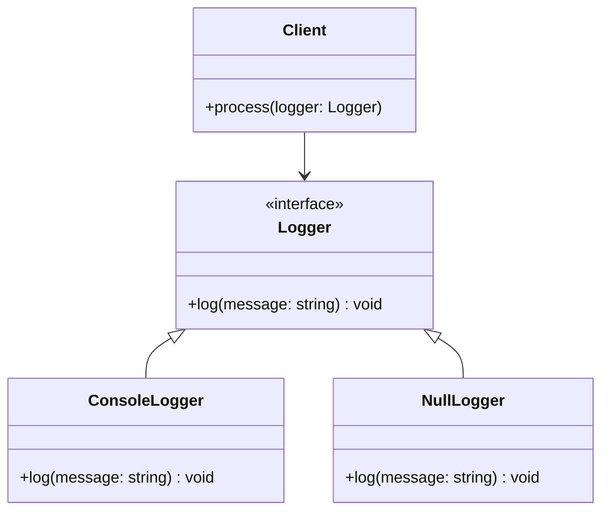

## 6.13 Null Object Pattern

In the realm of software design, handling null references gracefully is a common challenge. The Null Object Pattern offers an elegant solution by providing a default behavior for null references, thereby reducing the need for explicit null checks. This pattern is particularly useful in C++ programming, where null pointers can lead to undefined behavior and runtime errors. Let's delve into the Null Object Pattern, exploring its intent, key participants, applicability, and implementation in C++.

### Intent

The Null Object Pattern aims to encapsulate the absence of an object by providing a default, do-nothing behavior. This pattern helps in avoiding null references and simplifies client code by eliminating the need for null checks.

### Key Participants

1. **Abstract Class or Interface**: Defines the common interface for both real and null objects.
2. **Real Object**: Implements the actual behavior of the interface.
3. **Null Object**: Provides a do-nothing implementation of the interface.
4. **Client**: Interacts with objects through the interface, unaware of whether it is dealing with a real or null object.

### Applicability

Use the Null Object Pattern when:

- You want to avoid null checks and simplify client code.
- You need a default behavior for null references.
- You want to adhere to the Open/Closed Principle by extending behavior without modifying existing code.

### Sample Code Snippet

Let's explore a practical implementation of the Null Object Pattern in C++. We'll create a simple logging system where the logger can either log messages or do nothing (null object).

```cpp
#include <iostream>
#include <memory>

// Abstract Logger Interface
class Logger {
public:
    virtual ~Logger() = default;
    virtual void log(const std::string& message) const = 0;
};

// Real Logger Implementation
class ConsoleLogger : public Logger {
public:
    void log(const std::string& message) const override {
        std::cout << "Log: " << message << std::endl;
    }
};

// Null Logger Implementation
class NullLogger : public Logger {
public:
    void log(const std::string& message) const override {
        // Do nothing
    }
};

// Client Code
void process(const std::shared_ptr<Logger>& logger) {
    logger->log("Processing started.");
    // Perform some operations
    logger->log("Processing completed.");
}

int main() {
    std::shared_ptr<Logger> logger = std::make_shared<ConsoleLogger>();
    process(logger); // Logs messages to the console

    std::shared_ptr<Logger> nullLogger = std::make_shared<NullLogger>();
    process(nullLogger); // Does nothing
}
```

### Design Considerations

- **When to Use**: Use the Null Object Pattern when null checks clutter the code and a default behavior can be defined.
- **C++ Specific Features**: Utilize smart pointers (`std::shared_ptr`) to manage object lifetimes and avoid manual memory management.
- **Pitfalls**: Ensure that the null object truly represents a valid default behavior and does not introduce unexpected side effects.

### Differences and Similarities

- **Similar Patterns**: The Null Object Pattern is similar to the Strategy Pattern, where different strategies (including a null strategy) can be applied.
- **Differences**: Unlike the Strategy Pattern, the Null Object Pattern specifically addresses the absence of an object, providing a default behavior rather than a choice among multiple behaviors.

### Visualizing the Null Object Pattern

To better understand the Null Object Pattern, let's visualize the relationships between the key participants using a class diagram.



**Diagram Description**: The class diagram illustrates the `Logger` interface, which is implemented by both `ConsoleLogger` and `NullLogger`. The `Client` interacts with the `Logger` interface, unaware of whether it is dealing with a real or null object.

### Implementing Default Behavior with Null Objects

The Null Object Pattern allows us to define a default behavior for null references, which can be particularly useful in scenarios where an operation should be performed regardless of the presence of a real object. By implementing a null object, we ensure that the operation is executed without any side effects.

### Reducing Null Checks

One of the primary benefits of the Null Object Pattern is the reduction of null checks in client code. By providing a null object that adheres to the same interface as real objects, we eliminate the need for conditional statements that check for null references.

### Try It Yourself

To gain a deeper understanding of the Null Object Pattern, try modifying the code example provided above. Experiment with different implementations of the `Logger` interface, such as a `FileLogger` that writes messages to a file. Observe how the client code remains unchanged, demonstrating the flexibility and extensibility of the pattern.

### Knowledge Check

- **Question**: What is the primary intent of the Null Object Pattern?
- **Question**: How does the Null Object Pattern adhere to the Open/Closed Principle?
- **Exercise**: Implement a `Notification` system using the Null Object Pattern, where notifications can be sent via email, SMS, or not sent at all (null object).

### Embrace the Journey

Remember, mastering design patterns is a journey. As you continue to explore and apply the Null Object Pattern in your projects, you'll discover new ways to simplify and enhance your code. Keep experimenting, stay curious, and enjoy the process of becoming a more proficient C++ developer.

### References and Links

- [Null Object Pattern on Wikipedia](https://en.wikipedia.org/wiki/Null_object_pattern)
- [Design Patterns: Elements of Reusable Object-Oriented Software](https://www.amazon.com/Design-Patterns-Elements-Reusable-Object-Oriented/dp/0201633612) by Erich Gamma et al.

## Quiz Time!



### What is the primary intent of the Null Object Pattern?

- [x] To provide a default behavior for null references
- [ ] To enhance performance by avoiding object creation
- [ ] To implement complex algorithms
- [ ] To facilitate multithreading

> **Explanation:** The Null Object Pattern provides a default behavior for null references, simplifying client code by eliminating null checks.

### How does the Null Object Pattern adhere to the Open/Closed Principle?

- [x] By allowing behavior extension without modifying existing code
- [ ] By improving performance through caching
- [ ] By using inheritance to create new classes
- [ ] By reducing memory usage

> **Explanation:** The Null Object Pattern adheres to the Open/Closed Principle by allowing new behaviors to be added (e.g., new null objects) without altering existing code.

### Which of the following is a key participant in the Null Object Pattern?

- [x] Null Object
- [ ] Singleton
- [ ] Proxy
- [ ] Decorator

> **Explanation:** The Null Object is a key participant in the Null Object Pattern, providing a do-nothing implementation of an interface.

### What is a potential pitfall of using the Null Object Pattern?

- [x] Introducing unexpected side effects if the null object does not represent a valid default behavior
- [ ] Increasing the complexity of the code
- [ ] Making the code less readable
- [ ] Reducing performance

> **Explanation:** A potential pitfall is that the null object might not represent a valid default behavior, leading to unexpected side effects.

### In the provided C++ code example, what does the `NullLogger` class do?

- [x] Provides a do-nothing implementation of the `Logger` interface
- [ ] Logs messages to a file
- [ ] Sends log messages over the network
- [ ] Formats log messages

> **Explanation:** The `NullLogger` class provides a do-nothing implementation of the `Logger` interface, effectively ignoring log messages.

### Which design pattern is similar to the Null Object Pattern?

- [x] Strategy Pattern
- [ ] Observer Pattern
- [ ] Factory Pattern
- [ ] Adapter Pattern

> **Explanation:** The Strategy Pattern is similar to the Null Object Pattern, as both involve selecting different behaviors at runtime.

### How can the Null Object Pattern reduce null checks in client code?

- [x] By providing a null object that adheres to the same interface as real objects
- [ ] By using conditional statements to check for null references
- [ ] By implementing complex algorithms
- [ ] By enhancing performance through caching

> **Explanation:** The Null Object Pattern reduces null checks by providing a null object that adheres to the same interface as real objects, eliminating the need for conditional statements.

### What is a common use case for the Null Object Pattern?

- [x] Providing default behavior for optional operations
- [ ] Implementing complex algorithms
- [ ] Enhancing performance through caching
- [ ] Facilitating multithreading

> **Explanation:** A common use case is providing default behavior for optional operations, ensuring that operations are executed without side effects.

### True or False: The Null Object Pattern can help avoid runtime errors caused by null pointers.

- [x] True
- [ ] False

> **Explanation:** True. By providing a default behavior for null references, the Null Object Pattern helps avoid runtime errors caused by null pointers.

### Which of the following is NOT a benefit of the Null Object Pattern?

- [ ] Reducing null checks
- [x] Improving multithreading performance
- [ ] Simplifying client code
- [ ] Providing default behavior for null references

> **Explanation:** The Null Object Pattern does not specifically improve multithreading performance; its benefits include reducing null checks, simplifying client code, and providing default behavior for null references.




