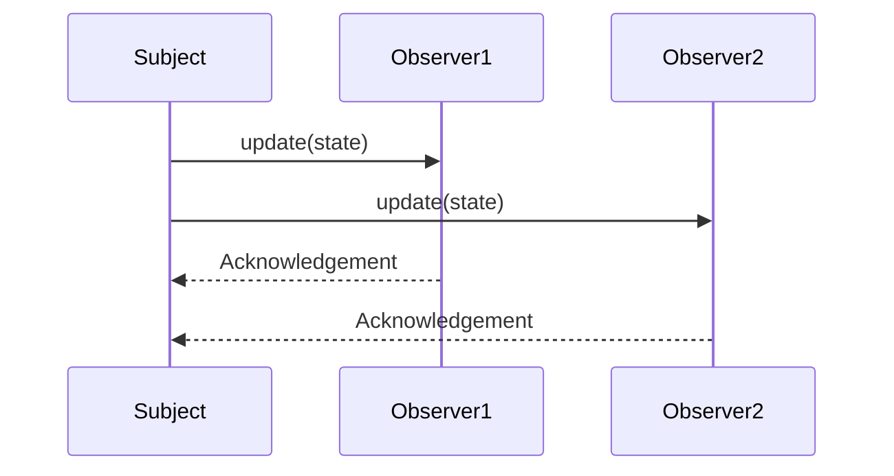

## 6.14 Event Handling and Delegation

In modern software development, event-driven programming is a paradigm that allows systems to respond to user actions, sensor outputs, or messages from other programs. This approach is crucial in developing interactive applications, real-time systems, and distributed systems. In C++, event handling and delegation are implemented using various techniques, including function pointers, functors, and lambdas. This section will guide you through these concepts, providing a comprehensive understanding of how to implement robust event-driven systems using delegation patterns.

### Understanding Event Handling

Event handling is a programming construct that allows a program to react to events, such as user inputs or system-generated notifications. In C++, this is typically achieved through callbacks, which are functions that are called in response to an event.

#### Implementing Callbacks

Callbacks in C++ can be implemented using:

1. **Function Pointers**: These are pointers that point to the address of a function. They can be used to call functions indirectly, allowing for dynamic function invocation.

2. **Functors (Function Objects)**: These are objects that can be called as if they were functions. They are instances of classes that overload the `operator()`.

3. **Lambdas**: Introduced in C++11, lambdas are anonymous functions that can capture variables from their surrounding scope.

Let's delve deeper into each of these methods.

### Function Pointers

Function pointers are one of the oldest methods for implementing callbacks in C++. They provide a way to store the address of a function and call it later. Here's a simple example:

```cpp
#include <iostream>

// Define a function that matches the signature
void onEvent(int eventCode) {
    std::cout << "Event received with code: " << eventCode << std::endl;
}

// Function that takes a callback
void registerCallback(void (*callback)(int)) {
    // Simulate an event
    int eventCode = 42;
    callback(eventCode); // Call the callback
}

int main() {
    // Register the callback
    registerCallback(onEvent);
    return 0;
}
```

In this example, `registerCallback` takes a function pointer as a parameter and calls it when an event occurs. The function `onEvent` is passed as a callback, which gets executed with the event code.

### Functors (Function Objects)

Functors provide more flexibility than function pointers because they can maintain state. They are objects of classes that overload the `operator()`. Here's an example:

```cpp
#include <iostream>

// Define a functor class
class EventHandler {
public:
    void operator()(int eventCode) const {
        std::cout << "Handling event with code: " << eventCode << std::endl;
    }
};

// Function that takes a functor
template <typename Callback>
void registerCallback(Callback callback) {
    int eventCode = 42;
    callback(eventCode); // Call the functor
}

int main() {
    EventHandler handler;
    registerCallback(handler);
    return 0;
}
```

In this example, `EventHandler` is a functor that can be used as a callback. The `registerCallback` function is templated to accept any callable object, including functors.

### Lambdas

Lambdas provide a concise way to define inline callbacks. They can capture variables from their surrounding scope, making them very powerful. Here's how you can use lambdas for event handling:

```cpp
#include <iostream>

// Function that takes a lambda
template <typename Callback>
void registerCallback(Callback callback) {
    int eventCode = 42;
    callback(eventCode); // Call the lambda
}

int main() {
    int multiplier = 2;
    // Define a lambda that captures the multiplier
    auto lambdaHandler = [multiplier](int eventCode) {
        std::cout << "Event code multiplied: " << eventCode * multiplier << std::endl;
    };

    registerCallback(lambdaHandler);
    return 0;
}
```

In this example, the lambda captures the `multiplier` variable from its surrounding scope and uses it within the callback.

### Delegation Patterns

Delegation is a design pattern that allows an object to hand off tasks to other helper objects. In the context of event handling, delegation patterns can be used to decouple the event source from the event handler, promoting modularity and reusability.

#### Observer Pattern

The Observer pattern is a common delegation pattern used in event-driven systems. It defines a one-to-many dependency between objects so that when one object changes state, all its dependents are notified and updated automatically.

**Key Participants:**

- **Subject**: The object that holds the state and notifies observers of changes.
- **Observer**: The interface or abstract class that defines the update method.
- **ConcreteObserver**: Implements the Observer interface and defines the action to be taken when notified.

**Applicability:**

Use the Observer pattern when:

- An abstraction has two aspects, one dependent on the other.
- A change to one object requires changing others, and you don't know how many objects need to be changed.
- An object should be able to notify other objects without making assumptions about who these objects are.

**Sample Code Snippet:**

```cpp
#include <iostream>
#include <vector>
#include <algorithm>

// Observer interface
class Observer {
public:
    virtual void update(int state) = 0;
};

// Subject class
class Subject {
    std::vector<Observer*> observers;
    int state;
public:
    void attach(Observer* observer) {
        observers.push_back(observer);
    }

    void detach(Observer* observer) {
        observers.erase(std::remove(observers.begin(), observers.end(), observer), observers.end());
    }

    void notify() {
        for (auto observer : observers) {
            observer->update(state);
        }
    }

    void setState(int newState) {
        state = newState;
        notify();
    }
};

// ConcreteObserver class
class ConcreteObserver : public Observer {
    std::string name;
public:
    ConcreteObserver(const std::string& n) : name(n) {}

    void update(int state) override {
        std::cout << name << " received state: " << state << std::endl;
    }
};

int main() {
    Subject subject;
    ConcreteObserver observer1("Observer1");
    ConcreteObserver observer2("Observer2");

    subject.attach(&observer1);
    subject.attach(&observer2);

    subject.setState(10);
    subject.setState(20);

    subject.detach(&observer1);
    subject.setState(30);

    return 0;
}
```

In this example, the `Subject` class maintains a list of observers and notifies them of state changes. The `ConcreteObserver` class implements the `Observer` interface and defines the action to be taken when notified.

### Design Considerations

When implementing event handling and delegation in C++, consider the following:

- **Performance**: Function pointers are the fastest but least flexible. Functors and lambdas offer more flexibility at a slight performance cost.
- **State Management**: Use functors or lambdas if you need to maintain state across callback invocations.
- **Decoupling**: Delegation patterns like the Observer pattern help decouple components, making your code more modular and easier to maintain.
- **Thread Safety**: Ensure that your event handling mechanism is thread-safe if your application is multithreaded.

### Differences and Similarities

- **Function Pointers vs. Functors**: Function pointers are simple and fast but lack the ability to maintain state. Functors can maintain state but are slightly more complex to implement.
- **Functors vs. Lambdas**: Both can maintain state, but lambdas provide a more concise syntax and can capture variables from their surrounding scope.
- **Observer Pattern vs. Other Patterns**: The Observer pattern is specifically designed for event notification, while other patterns like the Strategy pattern focus on behavior encapsulation.

### Visualizing Event Handling and Delegation

To better understand the flow of event handling and delegation, consider the following sequence diagram that illustrates the interaction between the subject and observers in the Observer pattern:



**Diagram Description**: This sequence diagram shows the `Subject` notifying `Observer1` and `Observer2` of a state change. Each observer acknowledges the update.

### Try It Yourself

Experiment with the code examples provided by:

- Modifying the `eventCode` in the function pointer example to see how different callbacks react.
- Adding more state variables to the functor and lambda examples to explore state management.
- Implementing additional observers in the Observer pattern example to see how the system scales.

### References and Links

For further reading on event handling and delegation in C++, consider the following resources:

- [C++ Function Pointers and Callbacks](https://www.learncpp.com/cpp-tutorial/function-pointers/)
- [C++ Functors](https://www.learncpp.com/cpp-tutorial/functors/)
- [C++ Lambdas](https://en.cppreference.com/w/cpp/language/lambda)
- [Observer Pattern](https://refactoring.guru/design-patterns/observer/cpp/example)

### Knowledge Check

To reinforce your understanding, consider the following questions:

1. What are the advantages of using lambdas over function pointers for event handling?
2. How does the Observer pattern promote decoupling in an event-driven system?
3. What are the key differences between functors and lambdas in C++?
4. Why is thread safety important in event handling mechanisms?

### Embrace the Journey

Remember, mastering event handling and delegation in C++ is a journey. As you progress, you'll build more complex and interactive systems. Keep experimenting, stay curious, and enjoy the journey!

## Quiz Time!



### What is a primary advantage of using lambdas over function pointers in C++?

- [x] Lambdas can capture variables from their surrounding scope.
- [ ] Lambdas are faster than function pointers.
- [ ] Lambdas do not require a specific signature.
- [ ] Lambdas are automatically thread-safe.

> **Explanation:** Lambdas can capture variables from their surrounding scope, providing more flexibility than function pointers.

### Which pattern is specifically designed for event notification in C++?

- [ ] Strategy Pattern
- [x] Observer Pattern
- [ ] Factory Pattern
- [ ] Singleton Pattern

> **Explanation:** The Observer pattern is designed for event notification, allowing a subject to notify multiple observers of state changes.

### What is a functor in C++?

- [x] An object that can be called as if it were a function.
- [ ] A pointer to a function.
- [ ] A type of lambda expression.
- [ ] A template class.

> **Explanation:** A functor is an object that can be called as if it were a function, typically by overloading the `operator()`.

### How does the Observer pattern promote decoupling?

- [x] By allowing subjects to notify observers without knowing their details.
- [ ] By using inheritance to share behavior.
- [ ] By encapsulating algorithms in classes.
- [ ] By using global variables for state management.

> **Explanation:** The Observer pattern allows subjects to notify observers without knowing their details, promoting decoupling.

### What is a key difference between functors and lambdas?

- [x] Lambdas provide a more concise syntax and can capture variables.
- [ ] Functors are faster than lambdas.
- [ ] Lambdas cannot maintain state.
- [ ] Functors cannot be used as callbacks.

> **Explanation:** Lambdas provide a more concise syntax and can capture variables from their surrounding scope, whereas functors are objects that overload `operator()`.

### Why is thread safety important in event handling mechanisms?

- [x] To prevent data races and ensure correct behavior in multithreaded applications.
- [ ] To improve the speed of event handling.
- [ ] To simplify the implementation of callbacks.
- [ ] To reduce memory usage.

> **Explanation:** Thread safety is important to prevent data races and ensure correct behavior in multithreaded applications.

### What is the role of the `Subject` in the Observer pattern?

- [x] To maintain state and notify observers of changes.
- [ ] To encapsulate algorithms.
- [ ] To provide a unified interface to a set of interfaces.
- [ ] To manage the lifecycle of objects.

> **Explanation:** The `Subject` maintains state and notifies observers of changes in the Observer pattern.

### How can you ensure that a functor maintains state across invocations?

- [x] By storing state in member variables of the functor class.
- [ ] By using global variables.
- [ ] By capturing variables in a lambda.
- [ ] By using static variables in the functor.

> **Explanation:** A functor can maintain state across invocations by storing state in member variables of the functor class.

### What is the purpose of the `operator()` in a functor?

- [x] To allow the functor to be called like a function.
- [ ] To overload arithmetic operations.
- [ ] To define the destructor of the functor.
- [ ] To implement comparison operations.

> **Explanation:** The `operator()` allows the functor to be called like a function.

### True or False: Function pointers can maintain state across invocations.

- [ ] True
- [x] False

> **Explanation:** Function pointers cannot maintain state across invocations; they simply point to a function's address.


