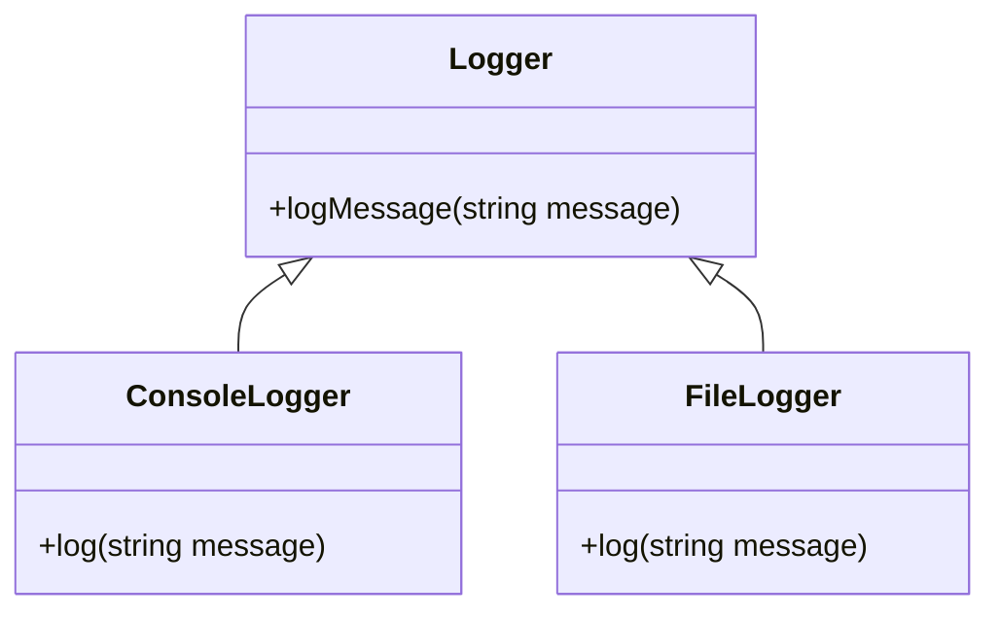

## 6.15 Policy-Based Design

In the realm of C++ programming, flexibility and efficiency are paramount. Policy-Based Design is a powerful technique that leverages the strengths of C++ templates to create highly flexible and efficient software architectures. This approach allows developers to define policies—small, interchangeable components that encapsulate specific behaviors or strategies—and compose them to form complex systems. In this section, we'll delve into the intricacies of Policy-Based Design, exploring its implementation using templates and static polymorphism, particularly through the Curiously Recurring Template Pattern (CRTP).

### Understanding Policy-Based Design

**Policy-Based Design** is a design paradigm that promotes the separation of concerns by defining policies as independent components. These policies encapsulate specific behaviors or strategies, allowing developers to mix and match them to achieve desired functionality. This approach is particularly useful in scenarios where flexibility and customization are required, such as in libraries or frameworks.

#### Key Concepts

- **Policies**: Small, interchangeable components that define specific behaviors or strategies.
- **Templates**: C++ feature that allows for generic programming, enabling the creation of flexible and reusable code.
- **Static Polymorphism**: A compile-time mechanism that allows for polymorphic behavior without the overhead of dynamic polymorphism.
- **CRTP (Curiously Recurring Template Pattern)**: A technique used to achieve static polymorphism by having a class derive from a template instantiation of itself.

### Implementing Policies with Templates

Templates are the cornerstone of Policy-Based Design in C++. They allow developers to define generic classes or functions that can operate with any data type. By using templates, we can create policies that are type-agnostic and easily interchangeable.

#### Example: A Simple Policy-Based Design

Let's start with a simple example to illustrate the concept of Policy-Based Design. Suppose we want to create a logging system that can log messages to different outputs (e.g., console, file). We can define policies for each logging strategy and use templates to compose them.

```cpp
#include <iostream>
#include <fstream>
#include <string>

// Policy for console logging
struct ConsoleLogger {
    void log(const std::string& message) {
        std::cout << "Console: " << message << std::endl;
    }
};

// Policy for file logging
struct FileLogger {
    std::ofstream file;
    FileLogger(const std::string& filename) : file(filename) {}
    void log(const std::string& message) {
        file << "File: " << message << std::endl;
    }
};

// Logger class that uses a policy
template <typename LoggerPolicy>
class Logger : public LoggerPolicy {
public:
    using LoggerPolicy::LoggerPolicy; // Inherit constructor
    void logMessage(const std::string& message) {
        this->log(message);
    }
};

int main() {
    Logger<ConsoleLogger> consoleLogger;
    consoleLogger.logMessage("Hello, Console!");

    Logger<FileLogger> fileLogger("log.txt");
    fileLogger.logMessage("Hello, File!");

    return 0;
}
```

In this example, `ConsoleLogger` and `FileLogger` are policies that define different logging strategies. The `Logger` class is a template that takes a policy as a template parameter and uses it to log messages. This design allows us to easily switch logging strategies by changing the policy.

### Static Polymorphism and CRTP

Static polymorphism is a technique that allows for polymorphic behavior at compile time. It is achieved using templates and the Curiously Recurring Template Pattern (CRTP). CRTP is a design pattern where a class derives from a template instantiation of itself.

#### CRTP Example

Let's explore how CRTP can be used to achieve static polymorphism in a Policy-Based Design.

```cpp
#include <iostream>

// Base class template using CRTP
template <typename Derived>
class Shape {
public:
    void draw() {
        // Call the derived class's draw method
        static_cast<Derived*>(this)->draw();
    }
};

// Derived class implementing the draw method
class Circle : public Shape<Circle> {
public:
    void draw() {
        std::cout << "Drawing a Circle" << std::endl;
    }
};

// Another derived class
class Square : public Shape<Square> {
public:
    void draw() {
        std::cout << "Drawing a Square" << std::endl;
    }
};

int main() {
    Circle circle;
    Square square;

    circle.draw(); // Output: Drawing a Circle
    square.draw(); // Output: Drawing a Square

    return 0;
}
```

In this example, `Shape` is a base class template that uses CRTP. The `draw` method calls the derived class's `draw` method using `static_cast`. This allows for polymorphic behavior without the overhead of virtual functions.

### Combining Policies and CRTP

By combining Policy-Based Design with CRTP, we can create highly flexible and efficient systems. Policies can be used to define specific behaviors, while CRTP provides a mechanism for static polymorphism.

#### Advanced Example: Policy-Based Design with CRTP

Let's create a more advanced example that combines Policy-Based Design with CRTP to implement a flexible shape drawing system.

```cpp
#include <iostream>

// Policy for drawing shapes
struct DrawCirclePolicy {
    void draw() {
        std::cout << "Drawing a Circle" << std::endl;
    }
};

struct DrawSquarePolicy {
    void draw() {
        std::cout << "Drawing a Square" << std::endl;
    }
};

// Base class template using CRTP
template <typename Derived, typename DrawPolicy>
class Shape : public DrawPolicy {
public:
    void drawShape() {
        static_cast<Derived*>(this)->draw();
    }
};

// Derived classes
class Circle : public Shape<Circle, DrawCirclePolicy> {};
class Square : public Shape<Square, DrawSquarePolicy> {};

int main() {
    Circle circle;
    Square square;

    circle.drawShape(); // Output: Drawing a Circle
    square.drawShape(); // Output: Drawing a Square

    return 0;
}
```

In this example, `DrawCirclePolicy` and `DrawSquarePolicy` are policies that define how to draw different shapes. The `Shape` class template uses CRTP to achieve static polymorphism, allowing derived classes to specify their drawing behavior through policies.

### Design Considerations

When using Policy-Based Design, it's important to consider the following:

- **Flexibility**: Policies should be designed to be easily interchangeable, allowing for maximum flexibility.
- **Efficiency**: Static polymorphism eliminates the overhead of dynamic polymorphism, making Policy-Based Design suitable for performance-critical applications.
- **Complexity**: While Policy-Based Design offers flexibility, it can also introduce complexity. It's important to balance flexibility with simplicity.

### Differences and Similarities with Other Patterns

Policy-Based Design is often compared to other design patterns, such as Strategy and Template Method. Here are some key differences and similarities:

- **Strategy Pattern**: Both Policy-Based Design and Strategy Pattern involve defining interchangeable behaviors. However, Policy-Based Design uses templates for compile-time flexibility, while Strategy Pattern typically uses inheritance and dynamic polymorphism.
- **Template Method Pattern**: Template Method Pattern defines a skeleton of an algorithm, allowing subclasses to implement specific steps. Policy-Based Design, on the other hand, focuses on defining interchangeable behaviors through policies.

### Try It Yourself

To deepen your understanding of Policy-Based Design, try modifying the examples provided:

- **Experiment with Different Policies**: Create new policies for different behaviors and integrate them into the existing examples.
- **Combine Multiple Policies**: Implement a system that uses multiple policies to achieve complex behavior.
- **Explore CRTP Further**: Create additional examples using CRTP to achieve static polymorphism in different contexts.

### Visualizing Policy-Based Design

To better understand the structure of Policy-Based Design, let's visualize the relationship between policies, templates, and CRTP using a class diagram.



This diagram illustrates how the `Logger` class uses policies (`ConsoleLogger` and `FileLogger`) to define different logging strategies.

### References and Further Reading

For more information on Policy-Based Design and related concepts, consider exploring the following resources:

- [C++ Templates: The Complete Guide](https://www.amazon.com/C-Templates-Complete-Guide-2nd/dp/0321714121) by David Vandevoorde and Nicolai M. Josuttis
- [Modern C++ Design: Generic Programming and Design Patterns Applied](https://www.amazon.com/Modern-Design-Generic-Programming-Patterns/dp/0201704315) by Andrei Alexandrescu
- [C++ Programming Language](https://www.stroustrup.com/4th.html) by Bjarne Stroustrup

### Knowledge Check

To reinforce your understanding of Policy-Based Design, consider the following questions:

- What are the key benefits of using Policy-Based Design in C++?
- How does CRTP enable static polymorphism?
- What are some potential drawbacks of using Policy-Based Design?

### Embrace the Journey

Remember, mastering Policy-Based Design is just one step in your journey as a C++ developer. As you continue to explore and experiment with different design patterns, you'll gain a deeper understanding of how to create flexible and efficient software architectures. Keep experimenting, stay curious, and enjoy the journey!

## Quiz Time!



### What is a key benefit of Policy-Based Design?

- [x] Flexibility and reusability of components
- [ ] Simplified code without templates
- [ ] Dynamic polymorphism
- [ ] Reduced compile-time

> **Explanation:** Policy-Based Design allows for flexibility and reusability by defining interchangeable components (policies) that can be mixed and matched.

### How does CRTP achieve static polymorphism?

- [x] By having a class derive from a template instantiation of itself
- [ ] By using virtual functions
- [ ] By implementing interfaces
- [ ] By using dynamic_cast

> **Explanation:** CRTP achieves static polymorphism by having a class derive from a template instantiation of itself, allowing for polymorphic behavior at compile time.

### What is the main difference between Policy-Based Design and Strategy Pattern?

- [x] Policy-Based Design uses templates, while Strategy Pattern uses inheritance
- [ ] Both use dynamic polymorphism
- [ ] Strategy Pattern is more flexible
- [ ] Policy-Based Design is less efficient

> **Explanation:** Policy-Based Design uses templates for compile-time flexibility, whereas Strategy Pattern typically uses inheritance and dynamic polymorphism.

### What is a potential drawback of Policy-Based Design?

- [x] Increased complexity
- [ ] Lack of flexibility
- [ ] Inefficient runtime performance
- [ ] Limited to dynamic polymorphism

> **Explanation:** While Policy-Based Design offers flexibility, it can also introduce complexity, making it important to balance flexibility with simplicity.

### In the provided example, what does the Logger class template do?

- [x] It uses a policy to log messages
- [ ] It directly implements logging logic
- [ ] It uses dynamic polymorphism for logging
- [ ] It logs messages to a database

> **Explanation:** The Logger class template uses a policy to log messages, allowing for interchangeable logging strategies.

### What is the role of templates in Policy-Based Design?

- [x] To enable generic programming and flexibility
- [ ] To enforce dynamic polymorphism
- [ ] To simplify code without parameters
- [ ] To reduce runtime errors

> **Explanation:** Templates enable generic programming and flexibility, allowing for the creation of interchangeable components in Policy-Based Design.

### How can you modify the provided examples to explore Policy-Based Design further?

- [x] Create new policies and integrate them
- [ ] Use only dynamic polymorphism
- [ ] Avoid using templates
- [ ] Implement all logic in a single class

> **Explanation:** By creating new policies and integrating them into the examples, you can explore the flexibility and potential of Policy-Based Design.

### What does the class diagram illustrate in the context of Policy-Based Design?

- [x] The relationship between Logger and its policies
- [ ] The entire architecture of a software system
- [ ] The dynamic behavior of the system
- [ ] The runtime performance of the system

> **Explanation:** The class diagram illustrates the relationship between the Logger class and its policies, showing how different logging strategies are defined.

### What is a key consideration when using Policy-Based Design?

- [x] Balancing flexibility with simplicity
- [ ] Avoiding the use of templates
- [ ] Prioritizing dynamic polymorphism
- [ ] Reducing compile-time

> **Explanation:** While Policy-Based Design offers flexibility, it's important to balance it with simplicity to avoid unnecessary complexity.

### True or False: Policy-Based Design is limited to dynamic polymorphism.

- [ ] True
- [x] False

> **Explanation:** Policy-Based Design is not limited to dynamic polymorphism; it leverages static polymorphism through templates and CRTP for compile-time flexibility.


