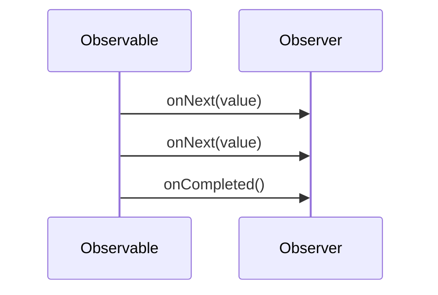

## 6.16 Reactive Programming Patterns

Reactive programming is a programming paradigm oriented around data flows and the propagation of change. This paradigm allows developers to express static or dynamic data flows with ease, and automatically propagate changes through the data flow. In this section, we will delve into the world of reactive programming in C++, focusing on the use of observables and reactive streams with the RxCpp library.

### Introduction to Reactive Programming

Reactive programming is a declarative programming paradigm concerned with data streams and the propagation of change. It is particularly useful in scenarios where systems need to react to a continuous flow of data, such as user interfaces, real-time data processing, and event-driven architectures.

#### Key Concepts

- **Data Streams**: Sequences of ongoing events ordered in time.
- **Propagation of Change**: Automatic updating of dependent computations when their sources change.
- **Observables**: Entities that emit data over time.
- **Observers**: Entities that receive data emitted by observables.
- **Schedulers**: Control the execution context of the reactive operations.

### Reactive Programming in C++

C++ is traditionally an imperative language, but with the advent of libraries like RxCpp, it is possible to implement reactive programming paradigms. RxCpp is a library that brings the power of reactive programming to C++, allowing developers to work with asynchronous data streams and event-driven programming.

#### Why Use RxCpp?

- **Asynchronous Programming**: Simplifies handling asynchronous operations.
- **Composability**: Allows complex operations to be composed from simpler ones.
- **Concurrency**: Provides tools to handle concurrency in a declarative manner.
- **Error Handling**: Offers robust error handling mechanisms.

### Understanding Observables and Observers

In reactive programming, an observable is a data source that emits a sequence of values over time. Observers subscribe to observables to receive these values.

#### Creating Observables

In RxCpp, observables can be created using various factory functions. Here's a simple example:

```cpp
#include <rxcpp/rx.hpp>
#include <iostream>

int main() {
    // Create an observable that emits integers from 1 to 5
    auto values = rxcpp::observable<>::range(1, 5);

    // Subscribe to the observable and print each emitted value
    values.subscribe(
        [](int v) { std::cout << "OnNext: " << v << std::endl; },
        []() { std::cout << "OnCompleted" << std::endl; }
    );

    return 0;
}
```

**Explanation**: This code creates an observable that emits integers from 1 to 5. The `subscribe` method is used to define actions for each emitted value (`OnNext`) and when the sequence completes (`OnCompleted`).

#### Key Participants

- **Observable**: The source of data.
- **Observer**: The consumer of data.
- **Subscription**: The link between an observable and an observer.

### Reactive Streams

Reactive streams are a powerful abstraction for asynchronous data processing. They allow you to process data as it arrives, rather than waiting for all data to be available.

#### Implementing Reactive Streams

Reactive streams in RxCpp can be implemented using operators that transform, filter, and combine data streams.

```cpp
#include <rxcpp/rx.hpp>
#include <iostream>

int main() {
    // Create an observable from a range of integers
    auto values = rxcpp::observable<>::range(1, 10)
        .filter([](int v) { return v % 2 == 0; }) // Filter even numbers
        .map([](int v) { return v * v; }); // Square each number

    // Subscribe to the observable
    values.subscribe(
        [](int v) { std::cout << "OnNext: " << v << std::endl; },
        []() { std::cout << "OnCompleted" << std::endl; }
    );

    return 0;
}
```

**Explanation**: This example demonstrates the use of `filter` and `map` operators to create a reactive stream that filters even numbers and then squares them.

### Schedulers and Concurrency

Schedulers in RxCpp control the execution context of operations. They allow you to specify whether operations should run on the current thread, a new thread, or a specific thread pool.

#### Using Schedulers

```cpp
#include <rxcpp/rx.hpp>
#include <iostream>
#include <thread>

int main() {
    // Create an observable that emits values on a new thread
    auto values = rxcpp::observable<>::range(1, 5)
        .subscribe_on(rxcpp::synchronize_new_thread());

    // Subscribe to the observable
    values.subscribe(
        [](int v) { std::cout << "OnNext: " << v << " on thread " << std::this_thread::get_id() << std::endl; },
        []() { std::cout << "OnCompleted" << std::endl; }
    );

    // Wait for the observable to complete
    std::this_thread::sleep_for(std::chrono::seconds(1));

    return 0;
}
```

**Explanation**: This code uses `subscribe_on` to specify that the observable should emit values on a new thread.

### Error Handling in Reactive Programming

Error handling is a crucial aspect of reactive programming. RxCpp provides several operators to handle errors gracefully.

#### Handling Errors

```cpp
#include <rxcpp/rx.hpp>
#include <iostream>

int main() {
    // Create an observable that emits an error
    auto values = rxcpp::observable<>::create<int>([](rxcpp::subscriber<int> s) {
        s.on_next(1);
        s.on_error(std::runtime_error("An error occurred"));
    });

    // Subscribe to the observable with error handling
    values.subscribe(
        [](int v) { std::cout << "OnNext: " << v << std::endl; },
        [](std::exception_ptr ep) {
            try {
                std::rethrow_exception(ep);
            } catch (const std::exception& e) {
                std::cout << "OnError: " << e.what() << std::endl;
            }
        },
        []() { std::cout << "OnCompleted" << std::endl; }
    );

    return 0;
}
```

**Explanation**: This example demonstrates how to handle errors using the `subscribe` method's error callback.

### Advanced Reactive Patterns

Reactive programming in C++ can be extended to more complex patterns, such as combining multiple observables, using subjects, and applying backpressure.

#### Combining Observables

```cpp
#include <rxcpp/rx.hpp>
#include <iostream>

int main() {
    // Create two observables
    auto obs1 = rxcpp::observable<>::just(1, 2, 3);
    auto obs2 = rxcpp::observable<>::just(4, 5, 6);

    // Combine the observables using the merge operator
    auto merged = obs1.merge(obs2);

    // Subscribe to the merged observable
    merged.subscribe(
        [](int v) { std::cout << "OnNext: " << v << std::endl; },
        []() { std::cout << "OnCompleted" << std::endl; }
    );

    return 0;
}
```

**Explanation**: This example shows how to merge two observables into a single stream using the `merge` operator.

#### Using Subjects

Subjects act as both an observable and an observer. They can multicast values to multiple subscribers.

```cpp
#include <rxcpp/rx.hpp>
#include <iostream>

int main() {
    // Create a subject
    auto subject = rxcpp::subjects::subject<int>();

    // Subscribe to the subject
    subject.get_observable().subscribe(
        [](int v) { std::cout << "Subscriber 1: " << v << std::endl; }
    );

    subject.get_observable().subscribe(
        [](int v) { std::cout << "Subscriber 2: " << v << std::endl; }
    );

    // Emit values to subscribers
    subject.get_subscriber().on_next(1);
    subject.get_subscriber().on_next(2);

    return 0;
}
```

**Explanation**: This code demonstrates the use of a subject to multicast values to multiple subscribers.

### Design Considerations

When implementing reactive systems in C++, consider the following:

- **Performance**: Reactive programming can introduce overhead due to the abstraction layers. Profiling and optimization may be necessary.
- **Complexity**: While reactive programming simplifies certain tasks, it can also introduce complexity in understanding data flows.
- **Thread Safety**: Ensure that operations on observables are thread-safe, especially when dealing with shared resources.

### Differences and Similarities with Other Patterns

Reactive programming shares similarities with event-driven programming but differs in its declarative nature and focus on data streams. It is often compared to the observer pattern, but reactive programming provides more powerful abstractions for handling asynchronous data flows.

### Try It Yourself

To deepen your understanding of reactive programming in C++, try modifying the code examples provided:

- **Experiment with Different Operators**: Try using other operators such as `concat`, `zip`, or `combine_latest`.
- **Implement Custom Observables**: Create your own observable that emits a sequence of custom objects.
- **Explore Error Handling**: Implement more sophisticated error handling strategies using operators like `retry` or `catch`.

### Visualizing Reactive Programming

To better understand the flow of data in reactive programming, let's visualize a simple reactive stream using a sequence diagram.



**Diagram Description**: This sequence diagram illustrates the interaction between an observable and an observer. The observable emits values to the observer, followed by a completion signal.

### References and Further Reading

- [ReactiveX Documentation](http://reactivex.io/documentation/observable.html)
- [RxCpp GitHub Repository](https://github.com/ReactiveX/RxCpp)
- [C++ Concurrency in Action](https://www.manning.com/books/c-plus-plus-concurrency-in-action)

### Knowledge Check

- **What is the primary purpose of reactive programming?**
- **How does RxCpp handle concurrency?**
- **What are the key differences between observables and observers?**

### Embrace the Journey

Remember, mastering reactive programming in C++ is a journey. As you progress, you'll build more complex and interactive systems. Keep experimenting, stay curious, and enjoy the journey!

## Quiz Time!



### What is the primary purpose of reactive programming?

- [x] To handle asynchronous data streams and propagate changes automatically.
- [ ] To simplify synchronous programming.
- [ ] To replace traditional object-oriented programming.
- [ ] To eliminate the need for error handling.

> **Explanation:** Reactive programming is designed to handle asynchronous data streams and automatically propagate changes through the system.

### How does RxCpp handle concurrency?

- [x] Through the use of schedulers that control the execution context.
- [ ] By running all operations on the main thread.
- [ ] By using global locks to manage concurrency.
- [ ] By avoiding concurrency altogether.

> **Explanation:** RxCpp uses schedulers to manage the execution context of operations, allowing for concurrent execution.

### What are observables in reactive programming?

- [x] Data sources that emit a sequence of values over time.
- [ ] Consumers of data emitted by observers.
- [ ] Static data structures that do not change.
- [ ] Functions that handle errors in reactive streams.

> **Explanation:** Observables are data sources that emit values over time, which observers can subscribe to.

### Which operator would you use to combine two observables into one?

- [x] merge
- [ ] filter
- [ ] map
- [ ] reduce

> **Explanation:** The `merge` operator is used to combine two observables into a single observable stream.

### What is a subject in RxCpp?

- [x] An entity that acts as both an observable and an observer.
- [ ] A special type of observable that cannot be subscribed to.
- [ ] A function that handles errors in reactive streams.
- [ ] A data structure used to store emitted values.

> **Explanation:** A subject in RxCpp acts as both an observable and an observer, allowing it to multicast values to multiple subscribers.

### What is the role of an observer in reactive programming?

- [x] To receive and process data emitted by observables.
- [ ] To emit data to other observers.
- [ ] To manage the execution context of operations.
- [ ] To handle errors in reactive streams.

> **Explanation:** Observers receive and process data emitted by observables.

### How can you handle errors in RxCpp?

- [x] By using the error callback in the `subscribe` method.
- [ ] By ignoring errors and continuing execution.
- [ ] By using global exception handlers.
- [ ] By terminating the program.

> **Explanation:** Errors in RxCpp can be handled using the error callback provided in the `subscribe` method.

### What is the benefit of using reactive streams?

- [x] They allow processing of data as it arrives, rather than waiting for all data to be available.
- [ ] They eliminate the need for error handling.
- [ ] They simplify synchronous programming.
- [ ] They replace traditional object-oriented programming.

> **Explanation:** Reactive streams allow for the processing of data as it arrives, enabling more responsive and efficient systems.

### Which operator is used to filter values in a reactive stream?

- [x] filter
- [ ] map
- [ ] merge
- [ ] concat

> **Explanation:** The `filter` operator is used to filter values in a reactive stream based on a predicate.

### True or False: Reactive programming is only applicable to user interface development.

- [ ] True
- [x] False

> **Explanation:** Reactive programming is applicable to a wide range of domains, including real-time data processing, event-driven architectures, and more.


