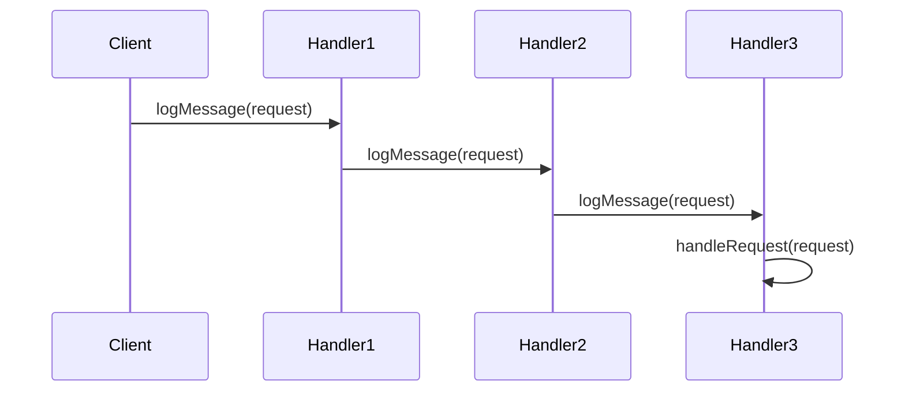

## 6.2 Chain of Responsibility Pattern

The Chain of Responsibility pattern is a behavioral design pattern that allows a request to be passed along a chain of handlers. Each handler in the chain has the opportunity to process the request or pass it to the next handler. This pattern is particularly useful in scenarios where multiple objects can handle a request, but the handler is not known in advance. By decoupling the sender and receiver, the Chain of Responsibility pattern promotes flexibility and reusability in your code.

### Intent

The primary intent of the Chain of Responsibility pattern is to avoid coupling the sender of a request to its receiver by giving more than one object a chance to handle the request. The pattern chains the receiving objects and passes the request along the chain until an object handles it.

### Key Participants

1. **Handler**: Defines an interface for handling requests. It may implement a method to set the next handler in the chain.
2. **ConcreteHandler**: Handles requests it is responsible for and can access its successor. If the ConcreteHandler can handle the request, it does so; otherwise, it forwards the request to its successor.
3. **Client**: Initiates the request to a handler in the chain.

### Applicability

Use the Chain of Responsibility pattern when:
- More than one object can handle a request, and the handler is not known in advance.
- You want to issue a request to one of several objects without specifying the receiver explicitly.
- The set of objects that can handle a request should be specified dynamically.

### Sample Code Snippet

Let's explore a practical example of the Chain of Responsibility pattern in C++. We'll implement a simple logging system where different log levels (INFO, DEBUG, ERROR) are handled by different handlers.

```cpp
#include <iostream>
#include <string>
#include <memory>

// Abstract Handler
class Logger {
protected:
    std::shared_ptr<Logger> nextLogger;
public:
    void setNextLogger(std::shared_ptr<Logger> nextLogger) {
        this->nextLogger = nextLogger;
    }
    void logMessage(int level, const std::string& message) {
        if (this->canHandle(level)) {
            this->write(message);
        }
        if (nextLogger != nullptr) {
            nextLogger->logMessage(level, message);
        }
    }
    virtual bool canHandle(int level) = 0;
    virtual void write(const std::string& message) = 0;
};

// Concrete Handlers
class InfoLogger : public Logger {
public:
    bool canHandle(int level) override {
        return level == 1;
    }
    void write(const std::string& message) override {
        std::cout << "INFO: " << message << std::endl;
    }
};

class DebugLogger : public Logger {
public:
    bool canHandle(int level) override {
        return level == 2;
    }
    void write(const std::string& message) override {
        std::cout << "DEBUG: " << message << std::endl;
    }
};

class ErrorLogger : public Logger {
public:
    bool canHandle(int level) override {
        return level == 3;
    }
    void write(const std::string& message) override {
        std::cout << "ERROR: " << message << std::endl;
    }
};

// Client code
int main() {
    auto errorLogger = std::make_shared<ErrorLogger>();
    auto debugLogger = std::make_shared<DebugLogger>();
    auto infoLogger = std::make_shared<InfoLogger>();

    infoLogger->setNextLogger(debugLogger);
    debugLogger->setNextLogger(errorLogger);

    infoLogger->logMessage(1, "This is an information.");
    infoLogger->logMessage(2, "This is a debug level information.");
    infoLogger->logMessage(3, "This is an error information.");

    return 0;
}
```

### Design Considerations

- **Flexibility**: The Chain of Responsibility pattern allows you to add or remove handlers dynamically, providing flexibility in handling requests.
- **Decoupling**: By decoupling the sender and receiver, this pattern reduces the dependency between components, making the system more modular.
- **Performance**: Be cautious of long chains, as they can lead to performance issues. Ensure that the chain is not unnecessarily long and that each handler performs its task efficiently.

### Differences and Similarities

The Chain of Responsibility pattern is often confused with the Command pattern. While both involve handling requests, the Chain of Responsibility pattern focuses on passing a request along a chain of potential handlers, whereas the Command pattern encapsulates a request as an object, allowing for parameterization and queuing of requests.

### Implementing Responsibility Chains in C++

When implementing the Chain of Responsibility pattern in C++, consider the following steps:

1. **Define the Handler Interface**: Create an abstract base class or interface that defines the method for handling requests and setting the next handler in the chain.

2. **Create Concrete Handlers**: Implement concrete classes that extend the handler interface. Each concrete handler should decide whether to handle the request or pass it to the next handler.

3. **Set Up the Chain**: In the client code, create instances of the concrete handlers and link them together to form a chain.

4. **Process Requests**: Initiate the request by calling the handler method on the first handler in the chain. The request will be passed along the chain until a handler processes it.

### Avoiding Coupling Between Sender and Receiver

One of the main advantages of the Chain of Responsibility pattern is its ability to decouple the sender and receiver. This is achieved by:

- **Abstracting the Handler**: The sender only interacts with the handler interface, not the concrete handlers. This abstraction allows for flexibility in changing the chain without affecting the sender.
- **Dynamic Handler Configuration**: The chain can be configured dynamically, allowing for different handlers to be added or removed as needed without changing the sender's code.

### Visualizing the Chain of Responsibility Pattern

To better understand the Chain of Responsibility pattern, let's visualize it using a sequence diagram. This diagram illustrates how a request is passed along a chain of handlers.



**Diagram Description**: The sequence diagram shows a client sending a request to the first handler in the chain. Each handler checks if it can handle the request. If not, it passes the request to the next handler in the chain. This process continues until a handler processes the request.

### Try It Yourself

Experiment with the provided code example by adding a new log level, such as WARNING. Implement a new `WarningLogger` class that handles this log level. Update the chain to include the new handler and test the functionality by logging a warning message.

### Knowledge Check

- What is the primary intent of the Chain of Responsibility pattern?
- How does the Chain of Responsibility pattern promote flexibility in handling requests?
- What are the key participants in the Chain of Responsibility pattern?
- How can you avoid coupling between the sender and receiver in the Chain of Responsibility pattern?

### Embrace the Journey

Remember, mastering design patterns like the Chain of Responsibility is a journey. As you continue to explore and implement these patterns, you'll gain a deeper understanding of how to build flexible, maintainable, and scalable software systems. Keep experimenting, stay curious, and enjoy the journey!

## Quiz Time!



### What is the primary intent of the Chain of Responsibility pattern?

- [x] To avoid coupling the sender of a request to its receiver by giving more than one object a chance to handle the request.
- [ ] To encapsulate a request as an object, allowing for parameterization and queuing of requests.
- [ ] To define a family of algorithms, encapsulate each one, and make them interchangeable.
- [ ] To provide a way to access the elements of an aggregate object sequentially without exposing its underlying representation.

> **Explanation:** The Chain of Responsibility pattern aims to avoid coupling the sender of a request to its receiver by allowing multiple objects to handle the request.

### Which of the following is a key participant in the Chain of Responsibility pattern?

- [x] Handler
- [ ] Command
- [ ] Strategy
- [ ] Iterator

> **Explanation:** The key participants in the Chain of Responsibility pattern include the Handler, ConcreteHandler, and Client.

### How does the Chain of Responsibility pattern promote flexibility?

- [x] By allowing the chain of handlers to be configured dynamically.
- [ ] By encapsulating requests as objects.
- [ ] By defining a family of algorithms.
- [ ] By providing a way to access elements sequentially.

> **Explanation:** The Chain of Responsibility pattern promotes flexibility by allowing the chain of handlers to be configured dynamically.

### What is the role of the Client in the Chain of Responsibility pattern?

- [x] To initiate the request to a handler in the chain.
- [ ] To handle requests it is responsible for.
- [ ] To define an interface for handling requests.
- [ ] To encapsulate a request as an object.

> **Explanation:** The Client initiates the request to a handler in the chain, which is then passed along the chain of handlers.

### In the provided code example, what does the `setNextLogger` method do?

- [x] It sets the next handler in the chain.
- [ ] It logs a message to the console.
- [ ] It processes the request.
- [ ] It initiates the request to a handler.

> **Explanation:** The `setNextLogger` method sets the next handler in the chain, allowing the request to be passed along the chain.

### Which of the following is a benefit of using the Chain of Responsibility pattern?

- [x] Decoupling the sender and receiver.
- [ ] Encapsulating requests as objects.
- [ ] Defining a family of algorithms.
- [ ] Providing a way to access elements sequentially.

> **Explanation:** One of the benefits of the Chain of Responsibility pattern is that it decouples the sender and receiver, promoting modularity.

### What is a potential drawback of the Chain of Responsibility pattern?

- [x] Long chains can lead to performance issues.
- [ ] It tightly couples the sender and receiver.
- [ ] It limits the number of handlers in the chain.
- [ ] It requires encapsulating requests as objects.

> **Explanation:** A potential drawback of the Chain of Responsibility pattern is that long chains can lead to performance issues.

### How can you avoid coupling between the sender and receiver in the Chain of Responsibility pattern?

- [x] By abstracting the handler interface.
- [ ] By encapsulating requests as objects.
- [ ] By defining a family of algorithms.
- [ ] By providing a way to access elements sequentially.

> **Explanation:** You can avoid coupling between the sender and receiver by abstracting the handler interface, allowing for flexibility in changing the chain.

### What is a common misconception about the Chain of Responsibility pattern?

- [x] It is often confused with the Command pattern.
- [ ] It is used to define a family of algorithms.
- [ ] It encapsulates requests as objects.
- [ ] It provides a way to access elements sequentially.

> **Explanation:** A common misconception is that the Chain of Responsibility pattern is often confused with the Command pattern, although they serve different purposes.

### True or False: The Chain of Responsibility pattern allows for dynamic configuration of handlers.

- [x] True
- [ ] False

> **Explanation:** True. The Chain of Responsibility pattern allows for dynamic configuration of handlers, providing flexibility in handling requests.


