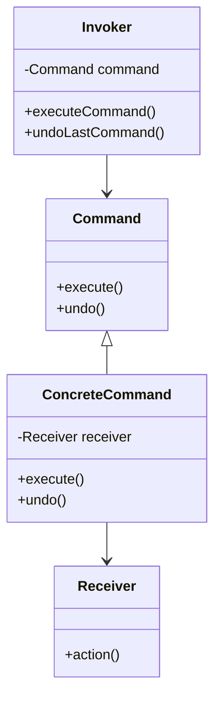

## 6.3 Command Pattern

In the realm of software design patterns, the Command Pattern stands out as a powerful tool for encapsulating requests as objects. This pattern is particularly useful in scenarios where you need to parameterize objects with operations, queue operations, and support undoable operations. In this section, we will delve into the intricacies of the Command Pattern, exploring its implementation in C++ and its applications in GUI development, undo/redo functionality, and macro commands.

### Intent

The primary intent of the Command Pattern is to encapsulate a request as an object, thereby allowing for parameterization of clients with queues, requests, and operations. This encapsulation also facilitates the implementation of undoable operations, making it a versatile pattern in software design.

### Key Participants

1. **Command**: Declares an interface for executing an operation.
2. **ConcreteCommand**: Defines a binding between a Receiver object and an action. It implements the Execute method by invoking the corresponding operations on the Receiver.
3. **Client**: Creates a ConcreteCommand object and sets its Receiver.
4. **Invoker**: Asks the command to carry out the request.
5. **Receiver**: Knows how to perform the operations associated with carrying out a request. Any class can serve as a Receiver.

### Applicability

Use the Command Pattern when you want to:
- Parameterize objects with operations.
- Specify, queue, and execute requests at different times.
- Support undoable operations.
- Structure a system around high-level operations built on primitives.

### Sample Code Snippet

Let's explore a simple implementation of the Command Pattern in C++.

```cpp
#include <iostream>
#include <vector>
#include <memory>

// Command Interface
class Command {
public:
    virtual ~Command() {}
    virtual void execute() = 0;
    virtual void undo() = 0;
};

// Receiver Class
class Light {
public:
    void on() {
        std::cout << "The light is on.\n";
    }
    void off() {
        std::cout << "The light is off.\n";
    }
};

// Concrete Command for turning the light on
class LightOnCommand : public Command {
private:
    Light& light;
public:
    LightOnCommand(Light& light) : light(light) {}
    void execute() override {
        light.on();
    }
    void undo() override {
        light.off();
    }
};

// Concrete Command for turning the light off
class LightOffCommand : public Command {
private:
    Light& light;
public:
    LightOffCommand(Light& light) : light(light) {}
    void execute() override {
        light.off();
    }
    void undo() override {
        light.on();
    }
};

// Invoker Class
class RemoteControl {
private:
    std::vector<std::shared_ptr<Command>> history;
public:
    void executeCommand(std::shared_ptr<Command> command) {
        command->execute();
        history.push_back(command);
    }
    void undoLastCommand() {
        if (!history.empty()) {
            history.back()->undo();
            history.pop_back();
        }
    }
};

int main() {
    Light livingRoomLight;
    auto lightOn = std::make_shared<LightOnCommand>(livingRoomLight);
    auto lightOff = std::make_shared<LightOffCommand>(livingRoomLight);

    RemoteControl remote;
    remote.executeCommand(lightOn);
    remote.undoLastCommand();
    remote.executeCommand(lightOff);
    remote.undoLastCommand();

    return 0;
}
```

### Design Considerations

When implementing the Command Pattern in C++, consider the following:
- **Command Interface**: Define a base class or interface for all commands. This ensures that all commands implement the `execute` and `undo` methods.
- **Receiver**: The receiver class should contain the actual business logic that needs to be executed.
- **Invoker**: The invoker class should maintain a history of executed commands to facilitate undo operations.
- **Memory Management**: Use smart pointers to manage the lifecycle of command objects, ensuring that resources are properly released.

### Differences and Similarities

The Command Pattern is often compared to other behavioral patterns such as the Strategy Pattern. While both patterns encapsulate behavior, the Command Pattern focuses on encapsulating requests as objects, whereas the Strategy Pattern encapsulates algorithms. The Command Pattern is also similar to the Memento Pattern in that it can store the state of an object for undo functionality.

### Implementing Undo/Redo Functionality

One of the most powerful applications of the Command Pattern is in implementing undo/redo functionality. By maintaining a history of executed commands, you can easily reverse operations by calling the `undo` method on the last executed command.

#### Example: Undo/Redo with Command Pattern

Let's extend our previous example to include redo functionality.

```cpp
#include <stack>

// Extending RemoteControl to support redo
class EnhancedRemoteControl {
private:
    std::stack<std::shared_ptr<Command>> undoStack;
    std::stack<std::shared_ptr<Command>> redoStack;
public:
    void executeCommand(std::shared_ptr<Command> command) {
        command->execute();
        undoStack.push(command);
        while (!redoStack.empty()) redoStack.pop(); // Clear redo stack
    }
    void undoLastCommand() {
        if (!undoStack.empty()) {
            auto command = undoStack.top();
            command->undo();
            undoStack.pop();
            redoStack.push(command);
        }
    }
    void redoLastCommand() {
        if (!redoStack.empty()) {
            auto command = redoStack.top();
            command->execute();
            redoStack.pop();
            undoStack.push(command);
        }
    }
};

int main() {
    Light livingRoomLight;
    auto lightOn = std::make_shared<LightOnCommand>(livingRoomLight);
    auto lightOff = std::make_shared<LightOffCommand>(livingRoomLight);

    EnhancedRemoteControl remote;
    remote.executeCommand(lightOn);
    remote.undoLastCommand();
    remote.redoLastCommand();
    remote.executeCommand(lightOff);
    remote.undoLastCommand();
    remote.redoLastCommand();

    return 0;
}
```

### Command Pattern in GUI Applications

In GUI applications, the Command Pattern is invaluable for implementing menu actions, toolbar buttons, and other user interactions. Each user action can be encapsulated as a command, allowing for flexible and maintainable code.

#### Example: Command Pattern in a GUI Application

Consider a simple text editor where we want to implement copy, paste, and undo functionality using the Command Pattern.

```cpp
#include <iostream>
#include <string>
#include <stack>
#include <memory>

// Receiver Class
class TextEditor {
private:
    std::string text;
public:
    void appendText(const std::string& newText) {
        text += newText;
        std::cout << "Text: " << text << "\n";
    }
    void removeText(size_t length) {
        if (length <= text.size()) {
            text.erase(text.size() - length);
            std::cout << "Text: " << text << "\n";
        }
    }
    const std::string& getText() const {
        return text;
    }
};

// Concrete Command for appending text
class AppendTextCommand : public Command {
private:
    TextEditor& editor;
    std::string textToAppend;
public:
    AppendTextCommand(TextEditor& editor, const std::string& text) 
        : editor(editor), textToAppend(text) {}
    void execute() override {
        editor.appendText(textToAppend);
    }
    void undo() override {
        editor.removeText(textToAppend.size());
    }
};

// Invoker Class
class TextEditorInvoker {
private:
    std::stack<std::shared_ptr<Command>> undoStack;
public:
    void executeCommand(std::shared_ptr<Command> command) {
        command->execute();
        undoStack.push(command);
    }
    void undoLastCommand() {
        if (!undoStack.empty()) {
            auto command = undoStack.top();
            command->undo();
            undoStack.pop();
        }
    }
};

int main() {
    TextEditor editor;
    auto appendHello = std::make_shared<AppendTextCommand>(editor, "Hello ");
    auto appendWorld = std::make_shared<AppendTextCommand>(editor, "World!");

    TextEditorInvoker invoker;
    invoker.executeCommand(appendHello);
    invoker.executeCommand(appendWorld);
    invoker.undoLastCommand();
    invoker.undoLastCommand();

    return 0;
}
```

### Macro Commands and Transactions

Macro commands allow you to group multiple commands into a single command, enabling batch processing of operations. This is particularly useful in scenarios where you need to execute a series of operations as a single transaction.

#### Example: Macro Commands

Let's implement a macro command that combines multiple text editing operations.

```cpp
#include <vector>

// Macro Command Class
class MacroCommand : public Command {
private:
    std::vector<std::shared_ptr<Command>> commands;
public:
    void addCommand(std::shared_ptr<Command> command) {
        commands.push_back(command);
    }
    void execute() override {
        for (auto& command : commands) {
            command->execute();
        }
    }
    void undo() override {
        for (auto it = commands.rbegin(); it != commands.rend(); ++it) {
            (*it)->undo();
        }
    }
};

int main() {
    TextEditor editor;
    auto appendHello = std::make_shared<AppendTextCommand>(editor, "Hello ");
    auto appendWorld = std::make_shared<AppendTextCommand>(editor, "World!");

    MacroCommand macro;
    macro.addCommand(appendHello);
    macro.addCommand(appendWorld);

    TextEditorInvoker invoker;
    invoker.executeCommand(std::make_shared<MacroCommand>(macro));
    invoker.undoLastCommand();

    return 0;
}
```

### Visualizing the Command Pattern

To better understand the Command Pattern, let's visualize its structure using a class diagram.



**Diagram Description**: This class diagram illustrates the relationships between the key participants in the Command Pattern. The `Command` interface is implemented by `ConcreteCommand`, which interacts with the `Receiver` to perform actions. The `Invoker` holds a reference to a `Command` and is responsible for executing and undoing commands.

### Design Considerations for Macro Commands

When implementing macro commands, consider the following:
- **Atomicity**: Ensure that the entire macro command executes as a single unit. If any command in the macro fails, you may need to roll back the entire operation.
- **Performance**: Be mindful of the performance implications of executing multiple commands in sequence, especially if they involve complex operations.

### Try It Yourself

Experiment with the provided code examples by modifying the commands and receivers. Try implementing additional commands, such as a `DeleteTextCommand`, and see how they integrate with the existing structure. Consider adding more complex macro commands that involve multiple receivers.

### Knowledge Check

Before we wrap up, let's reinforce what we've learned:

- **What is the primary purpose of the Command Pattern?**
- **How does the Command Pattern facilitate undo/redo functionality?**
- **What are macro commands, and how do they differ from regular commands?**

### Embrace the Journey

Remember, mastering design patterns is a journey. The Command Pattern is just one of many tools in your software design toolkit. As you continue to explore and apply these patterns, you'll gain a deeper understanding of how to build robust, scalable, and maintainable software systems.

### References and Links

For further reading on the Command Pattern and its applications, consider exploring the following resources:

- [Design Patterns: Elements of Reusable Object-Oriented Software](https://en.wikipedia.org/wiki/Design_Patterns) by Erich Gamma, Richard Helm, Ralph Johnson, and John Vlissides.
- [C++ Programming Language](https://www.stroustrup.com/) by Bjarne Stroustrup.
- [Modern C++ Design: Generic Programming and Design Patterns Applied](https://en.wikipedia.org/wiki/Modern_C%2B%2B_Design) by Andrei Alexandrescu.

## Quiz Time!



### What is the primary intent of the Command Pattern?

- [x] To encapsulate a request as an object
- [ ] To provide a way to access elements of a collection sequentially
- [ ] To define a family of algorithms
- [ ] To compose objects into tree structures

> **Explanation:** The Command Pattern encapsulates a request as an object, allowing for parameterization of clients with queues, requests, and operations.

### Which of the following is a key participant in the Command Pattern?

- [x] Command
- [x] Invoker
- [x] Receiver
- [ ] Context

> **Explanation:** The key participants in the Command Pattern are Command, ConcreteCommand, Client, Invoker, and Receiver.

### How does the Command Pattern facilitate undo functionality?

- [x] By maintaining a history of executed commands
- [ ] By storing the state of an object
- [ ] By using a proxy to control access to objects
- [ ] By defining a one-to-many dependency between objects

> **Explanation:** The Command Pattern facilitates undo functionality by maintaining a history of executed commands, allowing for reversal of operations.

### What is a macro command?

- [x] A command that groups multiple commands into a single command
- [ ] A command that executes asynchronously
- [ ] A command that encapsulates a request as an object
- [ ] A command that defines a family of algorithms

> **Explanation:** A macro command groups multiple commands into a single command, enabling batch processing of operations.

### In the Command Pattern, what role does the Invoker play?

- [x] It asks the command to carry out the request
- [ ] It knows how to perform the operations associated with carrying out a request
- [ ] It declares an interface for executing an operation
- [ ] It creates a ConcreteCommand object and sets its Receiver

> **Explanation:** The Invoker in the Command Pattern is responsible for asking the command to carry out the request.

### Which of the following is a use case for the Command Pattern?

- [x] Implementing undo/redo functionality
- [x] Command pattern in GUI applications
- [ ] Managing object pools for performance
- [ ] Creating families of related objects without specifying concrete classes

> **Explanation:** The Command Pattern is used for implementing undo/redo functionality and in GUI applications.

### What is the difference between a regular command and a macro command?

- [x] A macro command groups multiple commands into a single command
- [ ] A regular command executes asynchronously
- [ ] A macro command encapsulates a request as an object
- [ ] A regular command defines a family of algorithms

> **Explanation:** A macro command groups multiple commands into a single command, enabling batch processing of operations.

### Which of the following is NOT a key participant in the Command Pattern?

- [ ] Command
- [ ] Invoker
- [ ] Receiver
- [x] Observer

> **Explanation:** Observer is not a key participant in the Command Pattern; it is part of the Observer Pattern.

### What is the role of the Receiver in the Command Pattern?

- [x] It knows how to perform the operations associated with carrying out a request
- [ ] It asks the command to carry out the request
- [ ] It declares an interface for executing an operation
- [ ] It creates a ConcreteCommand object and sets its Receiver

> **Explanation:** The Receiver in the Command Pattern knows how to perform the operations associated with carrying out a request.

### True or False: The Command Pattern can be used to implement transactions.

- [x] True
- [ ] False

> **Explanation:** The Command Pattern can be used to implement transactions by grouping multiple commands into a macro command.



Remember, this is just the beginning. As you progress, you'll build more complex and interactive applications using the Command Pattern. Keep experimenting, stay curious, and enjoy the journey!
