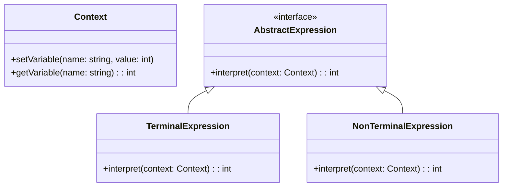

## 6.4 Interpreter Pattern

The Interpreter Pattern is a behavioral design pattern that provides a way to evaluate language grammar or expressions. It is particularly useful in scenarios where you need to interpret or execute a language or expression defined by a grammar. This pattern is commonly used in the development of scripting languages, data validation, and other areas where a language needs to be parsed and executed.

### Intent

The primary intent of the Interpreter Pattern is to define a representation for a language's grammar and provide an interpreter to process and execute the language. This pattern is particularly useful for languages with a simple grammar that can be easily represented using a tree structure.

### Key Participants

1. **AbstractExpression**: Declares an abstract `interpret` operation that is common to all nodes in the abstract syntax tree.
2. **TerminalExpression**: Implements an `interpret` operation associated with terminal symbols in the grammar.
3. **NonTerminalExpression**: Implements an `interpret` operation for non-terminal symbols in the grammar.
4. **Context**: Contains information that is global to the interpreter.
5. **Client**: Builds the abstract syntax tree representing a particular sentence in the language defined by the grammar.

### Applicability

The Interpreter Pattern is applicable in the following scenarios:

- When the grammar of the language is simple and can be easily represented using a tree structure.
- When efficiency is not a primary concern, as the pattern can be less efficient for complex grammars.
- When you need to interpret expressions or languages dynamically at runtime.

### Sample Code Snippet

Let's consider a simple example where we define a language for arithmetic expressions consisting of addition and subtraction. We'll implement an interpreter for this language using the Interpreter Pattern.

```cpp
#include <iostream>
#include <string>
#include <map>
#include <memory>

// Context class
class Context {
public:
    void setVariable(const std::string& name, int value) {
        variables[name] = value;
    }

    int getVariable(const std::string& name) const {
        return variables.at(name);
    }

private:
    std::map<std::string, int> variables;
};

// AbstractExpression class
class AbstractExpression {
public:
    virtual ~AbstractExpression() = default;
    virtual int interpret(const Context& context) const = 0;
};

// TerminalExpression class
class NumberExpression : public AbstractExpression {
public:
    explicit NumberExpression(int number) : number(number) {}

    int interpret(const Context& context) const override {
        return number;
    }

private:
    int number;
};

// NonTerminalExpression class
class AddExpression : public AbstractExpression {
public:
    AddExpression(std::unique_ptr<AbstractExpression> left, std::unique_ptr<AbstractExpression> right)
        : left(std::move(left)), right(std::move(right)) {}

    int interpret(const Context& context) const override {
        return left->interpret(context) + right->interpret(context);
    }

private:
    std::unique_ptr<AbstractExpression> left;
    std::unique_ptr<AbstractExpression> right;
};

class SubtractExpression : public AbstractExpression {
public:
    SubtractExpression(std::unique_ptr<AbstractExpression> left, std::unique_ptr<AbstractExpression> right)
        : left(std::move(left)), right(std::move(right)) {}

    int interpret(const Context& context) const override {
        return left->interpret(context) - right->interpret(context);
    }

private:
    std::unique_ptr<AbstractExpression> left;
    std::unique_ptr<AbstractExpression> right;
};

int main() {
    // Create a context
    Context context;

    // Create an expression tree representing "5 + (10 - 3)"
    std::unique_ptr<AbstractExpression> expression = std::make_unique<AddExpression>(
        std::make_unique<NumberExpression>(5),
        std::make_unique<SubtractExpression>(
            std::make_unique<NumberExpression>(10),
            std::make_unique<NumberExpression>(3)
        )
    );

    // Interpret the expression
    int result = expression->interpret(context);
    std::cout << "Result: " << result << std::endl; // Output: Result: 12

    return 0;
}
```

### Design Considerations

When using the Interpreter Pattern, consider the following:

- **Complexity**: The pattern can become complex and inefficient for large grammars. Consider using other parsing techniques for more complex languages.
- **Extensibility**: The pattern is easy to extend with new expressions by adding new classes.
- **Performance**: The pattern may not be suitable for performance-critical applications due to its recursive nature.

### Differences and Similarities

The Interpreter Pattern is often confused with the Visitor Pattern. While both patterns involve traversing a structure, the Interpreter Pattern focuses on evaluating expressions, whereas the Visitor Pattern is used to perform operations on elements of an object structure.

### Implementing Parsers and Interpreters

To implement a parser and interpreter using the Interpreter Pattern, follow these steps:

1. **Define the Grammar**: Start by defining the grammar of the language you want to interpret. This includes identifying terminal and non-terminal symbols.

2. **Create Expression Classes**: Implement classes for each terminal and non-terminal symbol in the grammar. Each class should implement the `interpret` method.

3. **Build the Syntax Tree**: Use the expression classes to build a syntax tree representing the input expression.

4. **Interpret the Expression**: Traverse the syntax tree and evaluate the expression using the `interpret` method of each node.

### Use Cases in Scripting and Data Validation

The Interpreter Pattern is widely used in scripting languages and data validation. Here are some common use cases:

- **Scripting Languages**: Many scripting languages, such as SQL and regular expressions, use the Interpreter Pattern to parse and execute scripts.

- **Data Validation**: The pattern can be used to validate data against a set of rules defined by a grammar.

- **Configuration Files**: Interpreters can be used to parse and execute configuration files, allowing for dynamic configuration of applications.

### Try It Yourself

To gain a deeper understanding of the Interpreter Pattern, try modifying the code example above. Here are some suggestions:

- Add support for multiplication and division operations.
- Implement a variable expression that retrieves values from the context.
- Extend the language to support parentheses for grouping expressions.

### Visualizing the Interpreter Pattern

Below is a diagram illustrating the structure of the Interpreter Pattern:



### Knowledge Check

1. What is the primary intent of the Interpreter Pattern?
2. How does the Interpreter Pattern differ from the Visitor Pattern?
3. What are the key participants in the Interpreter Pattern?
4. In what scenarios is the Interpreter Pattern most applicable?
5. What are some common use cases for the Interpreter Pattern?

### Embrace the Journey

Remember, mastering design patterns is a journey. The Interpreter Pattern is just one tool in your toolkit. As you continue to explore and apply design patterns, you'll become more adept at designing robust and maintainable software systems. Keep experimenting, stay curious, and enjoy the journey!

## Quiz Time!



### What is the primary intent of the Interpreter Pattern?

- [x] To define a representation for a language's grammar and provide an interpreter to process and execute the language.
- [ ] To separate the construction of a complex object from its representation.
- [ ] To provide a way to access the elements of an aggregate object sequentially.
- [ ] To define a one-to-many dependency between objects.

> **Explanation:** The Interpreter Pattern is used to define a representation for a language's grammar and provide an interpreter to process and execute the language.

### Which of the following is a key participant in the Interpreter Pattern?

- [x] AbstractExpression
- [ ] Builder
- [ ] Iterator
- [ ] Singleton

> **Explanation:** AbstractExpression is a key participant in the Interpreter Pattern, representing the abstract syntax tree nodes.

### In which scenarios is the Interpreter Pattern most applicable?

- [x] When the grammar of the language is simple and can be easily represented using a tree structure.
- [ ] When performance is the primary concern.
- [ ] When the language has a complex grammar.
- [ ] When the language requires a highly optimized parser.

> **Explanation:** The Interpreter Pattern is most applicable when the grammar of the language is simple and can be easily represented using a tree structure.

### How does the Interpreter Pattern differ from the Visitor Pattern?

- [x] The Interpreter Pattern focuses on evaluating expressions, while the Visitor Pattern is used to perform operations on elements of an object structure.
- [ ] The Interpreter Pattern is used for creating complex objects, while the Visitor Pattern is used for parsing expressions.
- [ ] The Interpreter Pattern is used for managing object lifecycles, while the Visitor Pattern is used for managing dependencies.
- [ ] The Interpreter Pattern is used for defining interfaces, while the Visitor Pattern is used for implementing algorithms.

> **Explanation:** The Interpreter Pattern focuses on evaluating expressions, whereas the Visitor Pattern is used to perform operations on elements of an object structure.

### What is a common use case for the Interpreter Pattern?

- [x] Scripting languages
- [ ] Memory management
- [ ] Network communication
- [ ] User interface design

> **Explanation:** The Interpreter Pattern is commonly used in scripting languages to parse and execute scripts.

### Which class in the Interpreter Pattern contains information that is global to the interpreter?

- [x] Context
- [ ] TerminalExpression
- [ ] NonTerminalExpression
- [ ] AbstractExpression

> **Explanation:** The Context class contains information that is global to the interpreter.

### What is a potential drawback of using the Interpreter Pattern?

- [x] It can become complex and inefficient for large grammars.
- [ ] It is not extensible.
- [ ] It cannot be used with object-oriented languages.
- [ ] It is difficult to implement.

> **Explanation:** The Interpreter Pattern can become complex and inefficient for large grammars.

### What method must be implemented by all expression classes in the Interpreter Pattern?

- [x] interpret
- [ ] build
- [ ] execute
- [ ] parse

> **Explanation:** All expression classes in the Interpreter Pattern must implement the `interpret` method.

### True or False: The Interpreter Pattern is suitable for performance-critical applications.

- [ ] True
- [x] False

> **Explanation:** The Interpreter Pattern is not suitable for performance-critical applications due to its recursive nature and potential inefficiency for complex grammars.

### What is the role of the Client in the Interpreter Pattern?

- [x] To build the abstract syntax tree representing a particular sentence in the language defined by the grammar.
- [ ] To execute the interpreted expression.
- [ ] To manage global information for the interpreter.
- [ ] To define terminal and non-terminal expressions.

> **Explanation:** The Client builds the abstract syntax tree representing a particular sentence in the language defined by the grammar.


