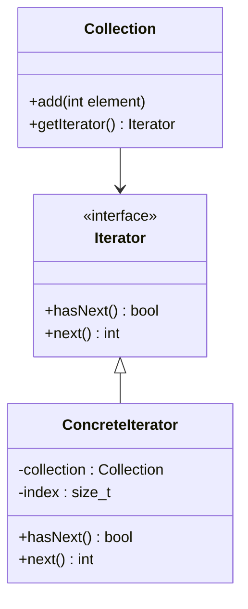

## 6.5 Iterator Pattern

The Iterator Pattern is a fundamental design pattern in software engineering that provides a way to access elements of a collection sequentially without exposing the underlying representation. In C++, iterators are a core component of the Standard Template Library (STL), enabling developers to traverse containers such as vectors, lists, and maps efficiently. This section delves into the intricacies of the Iterator Pattern, exploring its implementation in custom containers, its role in the STL, and the differences between external and internal iterators.

### Intent

The primary intent of the Iterator Pattern is to provide a standard way to traverse a collection of elements without exposing the internal structure of the collection. This abstraction allows for flexibility and encapsulation, enabling developers to iterate over different types of collections in a uniform manner.

### Key Participants

- **Iterator**: Defines an interface for accessing and traversing elements.
- **ConcreteIterator**: Implements the Iterator interface and maintains the current position in the traversal.
- **Aggregate**: Defines an interface for creating an Iterator object.
- **ConcreteAggregate**: Implements the Aggregate interface and returns an instance of the ConcreteIterator.

### Applicability

Use the Iterator Pattern when:

- You need to access elements of a collection without exposing its internal structure.
- You want to provide a uniform interface for iterating over different types of collections.
- You need to support multiple traversals of a collection.
- You want to provide a way to iterate over a collection in different ways (e.g., forward, backward, etc.).

### Implementing Iterators in Custom Containers

To implement iterators in custom containers, you must define an iterator class that adheres to the iterator interface. This involves implementing methods such as `begin()`, `end()`, `operator++`, `operator*`, and `operator!=`. Let's walk through an example of implementing an iterator for a custom container.

#### Example: Custom Container with Iterator

```cpp
#include <iostream>
#include <vector>

template <typename T>
class CustomContainer {
public:
    using iterator = typename std::vector<T>::iterator;
    using const_iterator = typename std::vector<T>::const_iterator;

    void add(const T& element) {
        elements.push_back(element);
    }

    iterator begin() {
        return elements.begin();
    }

    iterator end() {
        return elements.end();
    }

    const_iterator begin() const {
        return elements.begin();
    }

    const_iterator end() const {
        return elements.end();
    }

private:
    std::vector<T> elements;
};

int main() {
    CustomContainer<int> container;
    container.add(1);
    container.add(2);
    container.add(3);

    for (auto it = container.begin(); it != container.end(); ++it) {
        std::cout << *it << " ";
    }
    std::cout << std::endl;

    return 0;
}
```

In this example, `CustomContainer` is a simple wrapper around `std::vector`, providing an interface to add elements and iterate over them. The iterator methods `begin()` and `end()` return iterators to the start and end of the container, respectively.

### Iterators in the STL

The STL provides a rich set of iterators that are integral to its design. These iterators are categorized into five types based on their capabilities:

1. **Input Iterators**: Read elements from a sequence.
2. **Output Iterators**: Write elements to a sequence.
3. **Forward Iterators**: Read and write elements, supporting multiple passes.
4. **Bidirectional Iterators**: Move forward and backward through a sequence.
5. **Random Access Iterators**: Access elements at arbitrary positions.

#### Example: Using STL Iterators

```cpp
#include <iostream>
#include <vector>
#include <algorithm>

int main() {
    std::vector<int> numbers = {1, 2, 3, 4, 5};

    // Using an iterator to traverse the vector
    for (std::vector<int>::iterator it = numbers.begin(); it != numbers.end(); ++it) {
        std::cout << *it << " ";
    }
    std::cout << std::endl;

    // Using STL algorithms with iterators
    std::for_each(numbers.begin(), numbers.end(), [](int n) {
        std::cout << n * n << " ";
    });
    std::cout << std::endl;

    return 0;
}
```

In this example, we use an iterator to traverse a `std::vector` and apply an STL algorithm (`std::for_each`) to perform an operation on each element.

### External vs. Internal Iterators

Iterators can be classified into two categories: external and internal. Understanding the differences between these two types is crucial for implementing efficient and flexible iteration mechanisms.

#### External Iterators

External iterators are controlled by the client code. The client explicitly advances the iterator and accesses elements. This approach provides more control over the iteration process, allowing for complex traversal logic.

#### Internal Iterators

Internal iterators encapsulate the iteration logic within the collection itself. The client provides a function or callback, and the collection applies this function to each element. This approach simplifies the client code but offers less control over the iteration process.

#### Example: External vs. Internal Iterators

```cpp
#include <iostream>
#include <vector>
#include <functional>

class Collection {
public:
    void add(int element) {
        elements.push_back(element);
    }

    // External iterator
    class Iterator {
    public:
        Iterator(Collection& collection) : collection(collection), index(0) {}

        bool hasNext() {
            return index < collection.elements.size();
        }

        int next() {
            return collection.elements[index++];
        }

    private:
        Collection& collection;
        size_t index;
    };

    Iterator getIterator() {
        return Iterator(*this);
    }

    // Internal iterator
    void forEach(std::function<void(int)> func) {
        for (int element : elements) {
            func(element);
        }
    }

private:
    std::vector<int> elements;
};

int main() {
    Collection collection;
    collection.add(1);
    collection.add(2);
    collection.add(3);

    // Using external iterator
    Collection::Iterator it = collection.getIterator();
    while (it.hasNext()) {
        std::cout << it.next() << " ";
    }
    std::cout << std::endl;

    // Using internal iterator
    collection.forEach([](int element) {
        std::cout << element * 2 << " ";
    });
    std::cout << std::endl;

    return 0;
}
```

In this example, `Collection` provides both an external iterator (`Iterator` class) and an internal iterator (`forEach` method). The external iterator gives the client control over the iteration process, while the internal iterator simplifies iteration by applying a function to each element.

### Design Considerations

When implementing the Iterator Pattern, consider the following:

- **Performance**: Iterators should be efficient, especially for large collections. Avoid unnecessary copying and ensure that operations like `operator++` are lightweight.
- **Consistency**: Ensure that iterators behave consistently across different types of collections. This includes supporting operations like `begin()`, `end()`, and `operator!=`.
- **Safety**: Iterators should be robust against changes to the underlying collection during iteration. Consider using mechanisms like invalidation checks to prevent undefined behavior.

### Differences and Similarities

The Iterator Pattern is often compared to other patterns like the Composite Pattern and the Visitor Pattern. While all these patterns involve traversing a collection of elements, they differ in their intent and implementation.

- **Composite Pattern**: Focuses on treating individual objects and compositions uniformly, often used to represent tree structures.
- **Visitor Pattern**: Separates operations from the objects they operate on, allowing new operations to be added without modifying existing classes.

The Iterator Pattern, in contrast, is primarily concerned with providing a uniform way to access elements in a collection, regardless of the collection's structure.

### Try It Yourself

To deepen your understanding of the Iterator Pattern, try modifying the code examples provided:

- Implement a bidirectional iterator for the `CustomContainer` class, allowing traversal in both directions.
- Create a custom container that supports random access iterators and implement the necessary methods.
- Experiment with different STL algorithms and observe how iterators enable their functionality.

### Visualizing the Iterator Pattern

Let's visualize the Iterator Pattern using a class diagram to understand the relationships between the key participants.



In this diagram, `Iterator` is an interface that defines the methods for traversing elements. `ConcreteIterator` implements this interface and maintains the current position in the collection. `Collection` provides a method to obtain an iterator.

### References and Links

For further reading on the Iterator Pattern and its applications in C++, consider the following resources:

- [C++ Reference: Iterators](https://en.cppreference.com/w/cpp/iterator)
- [Design Patterns: Elements of Reusable Object-Oriented Software](https://en.wikipedia.org/wiki/Design_Patterns) by Erich Gamma, Richard Helm, Ralph Johnson, and John Vlissides (Gang of Four)
- [STL Iterators and Algorithms](https://www.cplusplus.com/reference/iterator/)

### Knowledge Check

To reinforce your understanding of the Iterator Pattern, consider the following questions:

- What are the key differences between external and internal iterators?
- How do STL iterators differ from custom iterators?
- What are the advantages of using the Iterator Pattern in software design?

### Embrace the Journey

Remember, mastering the Iterator Pattern is just one step in your journey as a C++ developer. As you continue to explore design patterns and advanced C++ features, you'll gain the skills needed to build robust and efficient software. Keep experimenting, stay curious, and enjoy the process of learning and growing as a developer!

## Quiz Time!



### What is the primary intent of the Iterator Pattern?

- [x] To provide a way to access elements of a collection sequentially without exposing the underlying representation.
- [ ] To allow multiple objects to communicate with each other.
- [ ] To define a family of algorithms and make them interchangeable.
- [ ] To encapsulate a request as an object.

> **Explanation:** The Iterator Pattern is designed to provide a standard way to traverse a collection of elements without exposing the internal structure of the collection.

### Which of the following is NOT a type of STL iterator?

- [ ] Input Iterator
- [ ] Output Iterator
- [ ] Forward Iterator
- [x] Reverse Iterator

> **Explanation:** While STL provides reverse iterators, they are not categorized as a separate type like input, output, forward, bidirectional, and random access iterators.

### What is a key difference between external and internal iterators?

- [x] External iterators are controlled by the client, while internal iterators encapsulate iteration logic within the collection.
- [ ] External iterators are faster than internal iterators.
- [ ] Internal iterators require more memory than external iterators.
- [ ] Internal iterators are only used in functional programming.

> **Explanation:** External iterators give control to the client code, whereas internal iterators handle iteration within the collection itself.

### In C++, which operator is commonly overloaded to advance an iterator?

- [x] operator++
- [ ] operator--
- [ ] operator*
- [ ] operator+

> **Explanation:** The `operator++` is typically overloaded to advance an iterator to the next element in the collection.

### What is the role of the `begin()` method in a collection class?

- [x] It returns an iterator to the first element of the collection.
- [ ] It initializes the collection.
- [ ] It checks if the collection is empty.
- [ ] It returns the size of the collection.

> **Explanation:** The `begin()` method returns an iterator pointing to the first element of the collection, allowing iteration to start.

### Which STL algorithm can be used with iterators to apply a function to each element in a collection?

- [x] std::for_each
- [ ] std::transform
- [ ] std::accumulate
- [ ] std::copy

> **Explanation:** `std::for_each` applies a given function to each element in a range defined by iterators.

### How does a bidirectional iterator differ from a forward iterator?

- [x] A bidirectional iterator can move both forward and backward, while a forward iterator can only move forward.
- [ ] A bidirectional iterator is faster than a forward iterator.
- [ ] A forward iterator can access elements randomly, while a bidirectional iterator cannot.
- [ ] A bidirectional iterator requires more memory than a forward iterator.

> **Explanation:** Bidirectional iterators support both forward and backward traversal, unlike forward iterators which only support forward movement.

### What is a common use case for the Iterator Pattern?

- [x] Traversing elements in a collection without exposing its internal structure.
- [ ] Sorting elements in a collection.
- [ ] Searching for an element in a collection.
- [ ] Modifying elements in a collection.

> **Explanation:** The Iterator Pattern is used to traverse elements in a collection while keeping the collection's internal structure hidden.

### Which of the following is a benefit of using the Iterator Pattern?

- [x] It provides a uniform interface for iterating over different types of collections.
- [ ] It increases the speed of accessing elements in a collection.
- [ ] It reduces the memory usage of collections.
- [ ] It simplifies the implementation of collections.

> **Explanation:** The Iterator Pattern provides a consistent way to iterate over various collections, regardless of their specific implementations.

### True or False: The Iterator Pattern can only be used with collections that support random access.

- [ ] True
- [x] False

> **Explanation:** The Iterator Pattern can be applied to any collection, including those that do not support random access, such as linked lists.


