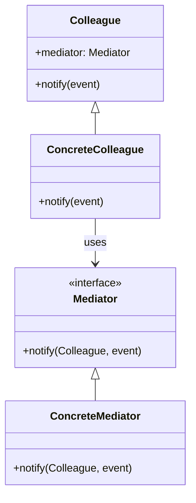

## 6.6 Mediator Pattern

In the realm of software design patterns, the Mediator Pattern stands out as a powerful tool for reducing the complexity of communication between components. By centralizing control, it minimizes dependencies and enhances maintainability. In this section, we will delve into the Mediator Pattern, exploring its intent, key participants, applicability, and implementation in C++, particularly in GUI applications.

### Intent

The primary intent of the Mediator Pattern is to define an object that encapsulates how a set of objects interact. This pattern promotes loose coupling by preventing objects from referring to each other explicitly and allowing their interaction to be varied independently.

### Key Participants

1. **Mediator**: Defines an interface for communicating with Colleague objects.
2. **ConcreteMediator**: Implements cooperative behavior by coordinating Colleague objects and knows and maintains its colleagues.
3. **Colleague**: Each Colleague class knows its Mediator object and communicates with its Mediator whenever it would have otherwise communicated with another Colleague.

### Applicability

The Mediator Pattern is particularly useful when:

- A set of objects communicate in well-defined but complex ways.
- Reusing an object is difficult because it refers to and communicates with many other objects.
- You want to customize a behavior that is distributed between several classes without subclassing.

### Reducing Coupling Between Components

In complex systems, components often need to communicate with each other. Direct communication can lead to a tangled web of dependencies, making the system hard to maintain and extend. The Mediator Pattern addresses this by introducing a mediator object that handles communication between components.

#### Example: Chat Room

Consider a chat room where users can send messages to each other. Without a mediator, each user would need to know about every other user to send messages. By introducing a mediator, each user only needs to know about the mediator, which handles message distribution.

```cpp
#include <iostream>
#include <vector>
#include <string>

// Forward declaration
class User;

// Mediator Interface
class ChatRoomMediator {
public:
    virtual void showMessage(User* user, const std::string& message) = 0;
};

// Colleague
class User {
protected:
    ChatRoomMediator* mediator;
    std::string name;
public:
    User(ChatRoomMediator* med, const std::string& name) : mediator(med), name(name) {}
    virtual void sendMessage(const std::string& message) = 0;
    virtual std::string getName() const { return name; }
};

// Concrete Colleague
class ConcreteUser : public User {
public:
    ConcreteUser(ChatRoomMediator* med, const std::string& name) : User(med, name) {}
    void sendMessage(const std::string& message) override {
        mediator->showMessage(this, message);
    }
};

// Concrete Mediator
class ChatRoom : public ChatRoomMediator {
private:
    std::vector<User*> users;
public:
    void addUser(User* user) {
        users.push_back(user);
    }
    void showMessage(User* user, const std::string& message) override {
        std::cout << user->getName() << ": " << message << std::endl;
    }
};

int main() {
    ChatRoom* chatRoom = new ChatRoom();

    User* user1 = new ConcreteUser(chatRoom, "Alice");
    User* user2 = new ConcreteUser(chatRoom, "Bob");

    chatRoom->addUser(user1);
    chatRoom->addUser(user2);

    user1->sendMessage("Hello Bob!");
    user2->sendMessage("Hi Alice!");

    delete user1;
    delete user2;
    delete chatRoom;

    return 0;
}
```

### Centralizing Complex Communications

The Mediator Pattern centralizes communication logic, which simplifies the system's design and makes it easier to understand and maintain. This is especially beneficial in systems where components frequently interact in complex ways.

#### Implementing Mediator in GUI Applications

Graphical User Interfaces (GUIs) often involve numerous components that need to interact, such as buttons, text fields, and sliders. The Mediator Pattern can be used to manage these interactions, reducing the coupling between components.

Consider a dialog box with several widgets. Without a mediator, each widget would need to know about the others to coordinate actions. By introducing a mediator, each widget only communicates with the mediator, which orchestrates the interactions.

```cpp
#include <iostream>
#include <string>

// Forward declaration
class Button;
class TextBox;

// Mediator Interface
class DialogMediator {
public:
    virtual void notify(Button* sender, const std::string& event) = 0;
    virtual void notify(TextBox* sender, const std::string& event) = 0;
};

// Colleague
class Widget {
protected:
    DialogMediator* mediator;
public:
    Widget(DialogMediator* med) : mediator(med) {}
};

// Concrete Colleague
class Button : public Widget {
public:
    Button(DialogMediator* med) : Widget(med) {}
    void click() {
        std::cout << "Button clicked." << std::endl;
        mediator->notify(this, "click");
    }
};

// Concrete Colleague
class TextBox : public Widget {
private:
    std::string text;
public:
    TextBox(DialogMediator* med) : Widget(med) {}
    void setText(const std::string& txt) {
        text = txt;
        std::cout << "TextBox text set to: " << text << std::endl;
        mediator->notify(this, "textChanged");
    }
    std::string getText() const { return text; }
};

// Concrete Mediator
class Dialog : public DialogMediator {
private:
    Button* button;
    TextBox* textBox;
public:
    Dialog(Button* btn, TextBox* txtBox) : button(btn), textBox(txtBox) {}
    void notify(Button* sender, const std::string& event) override {
        if (event == "click") {
            std::cout << "Dialog handling button click." << std::endl;
            textBox->setText("Button was clicked!");
        }
    }
    void notify(TextBox* sender, const std::string& event) override {
        if (event == "textChanged") {
            std::cout << "Dialog handling text change: " << sender->getText() << std::endl;
        }
    }
};

int main() {
    Button* button = new Button(nullptr);
    TextBox* textBox = new TextBox(nullptr);
    Dialog* dialog = new Dialog(button, textBox);

    button->click();
    textBox->setText("New Text");

    delete button;
    delete textBox;
    delete dialog;

    return 0;
}
```

### Design Considerations

When implementing the Mediator Pattern, consider the following:

- **Complexity**: While the Mediator Pattern reduces the complexity of communication between components, it can increase the complexity of the mediator itself. Ensure the mediator remains manageable.
- **Single Responsibility Principle**: The mediator should only handle communication between components. Avoid adding unrelated functionality to the mediator.
- **Performance**: Centralizing communication can introduce a bottleneck if the mediator becomes overloaded. Ensure the mediator can handle the expected load.

### Differences and Similarities

The Mediator Pattern is often confused with the Observer Pattern. While both patterns involve communication between components, they serve different purposes:

- **Mediator Pattern**: Centralizes communication, reducing dependencies between components.
- **Observer Pattern**: Allows components to be notified of changes in other components.

### Visualizing the Mediator Pattern

Let's visualize the Mediator Pattern to better understand its structure and interactions.



### Try It Yourself

Now that we've explored the Mediator Pattern, try implementing it in a different context. For example, create a traffic control system where traffic lights and pedestrian signals communicate through a mediator. Experiment with adding new features or modifying existing ones to see how the mediator handles changes.

### Knowledge Check

- **What is the primary intent of the Mediator Pattern?**
- **How does the Mediator Pattern reduce coupling between components?**
- **What are the key participants in the Mediator Pattern?**
- **How can the Mediator Pattern be applied to GUI applications?**
- **What are some design considerations when implementing the Mediator Pattern?**

### Embrace the Journey

Remember, mastering design patterns is a journey. As you continue to explore and apply these patterns, you'll gain a deeper understanding of software architecture and design. Keep experimenting, stay curious, and enjoy the journey!

## Quiz Time!



### What is the primary intent of the Mediator Pattern?

- [x] To define an object that encapsulates how a set of objects interact.
- [ ] To allow objects to communicate directly with each other.
- [ ] To create a one-to-many dependency between objects.
- [ ] To provide a unified interface to a set of interfaces.

> **Explanation:** The Mediator Pattern's primary intent is to encapsulate the interactions between a set of objects, promoting loose coupling.

### How does the Mediator Pattern reduce coupling between components?

- [x] By centralizing communication through a mediator object.
- [ ] By allowing direct communication between components.
- [ ] By creating a dependency graph of components.
- [ ] By using inheritance to manage communication.

> **Explanation:** The Mediator Pattern reduces coupling by centralizing communication, so components only need to know about the mediator, not each other.

### Which of the following is a key participant in the Mediator Pattern?

- [x] Mediator
- [ ] Observer
- [x] Colleague
- [ ] Adapter

> **Explanation:** The key participants in the Mediator Pattern are the Mediator and Colleague classes.

### In which scenario is the Mediator Pattern particularly useful?

- [x] When a set of objects communicate in well-defined but complex ways.
- [ ] When objects need to communicate directly with each other.
- [ ] When there is no need for communication between objects.
- [ ] When objects are independent and do not interact.

> **Explanation:** The Mediator Pattern is useful when objects communicate in complex ways, as it centralizes and simplifies the communication.

### What is a potential drawback of the Mediator Pattern?

- [x] The mediator can become a bottleneck if overloaded.
- [ ] It increases the number of dependencies between components.
- [ ] It makes the system harder to maintain.
- [ ] It requires direct communication between components.

> **Explanation:** A potential drawback is that the mediator can become a bottleneck if it handles too much communication.

### How does the Mediator Pattern differ from the Observer Pattern?

- [x] The Mediator Pattern centralizes communication, while the Observer Pattern allows for notifications.
- [ ] The Mediator Pattern creates a one-to-many dependency, while the Observer Pattern centralizes communication.
- [ ] The Mediator Pattern is used for direct communication, while the Observer Pattern is used for indirect communication.
- [ ] The Mediator Pattern is only used in GUI applications, while the Observer Pattern is used in all applications.

> **Explanation:** The Mediator Pattern centralizes communication, while the Observer Pattern allows components to be notified of changes.

### What is a common application of the Mediator Pattern in GUI development?

- [x] Managing interactions between widgets in a dialog box.
- [ ] Rendering graphics on the screen.
- [ ] Handling user input events.
- [ ] Managing memory allocation for GUI components.

> **Explanation:** In GUI development, the Mediator Pattern is commonly used to manage interactions between widgets, reducing coupling.

### What should the mediator focus on according to the Single Responsibility Principle?

- [x] Handling communication between components.
- [ ] Managing the lifecycle of components.
- [ ] Rendering components on the screen.
- [ ] Allocating resources for components.

> **Explanation:** According to the Single Responsibility Principle, the mediator should focus on handling communication between components.

### What is a key benefit of using the Mediator Pattern?

- [x] It simplifies the system's design by centralizing communication.
- [ ] It increases the complexity of communication between components.
- [ ] It requires more dependencies between components.
- [ ] It makes the system harder to maintain.

> **Explanation:** A key benefit of the Mediator Pattern is that it simplifies the system's design by centralizing communication.

### True or False: The Mediator Pattern allows components to communicate directly with each other.

- [ ] True
- [x] False

> **Explanation:** False. The Mediator Pattern prevents direct communication between components, centralizing it through a mediator.



By exploring the Mediator Pattern, we gain insights into how to manage complex interactions in software systems. As you continue to apply this pattern, you'll discover its versatility and power in creating maintainable and scalable applications.
