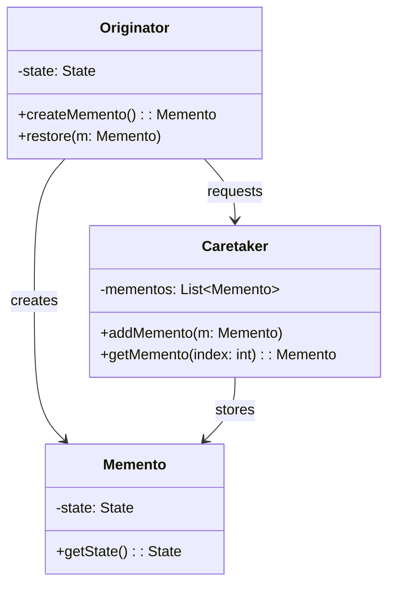
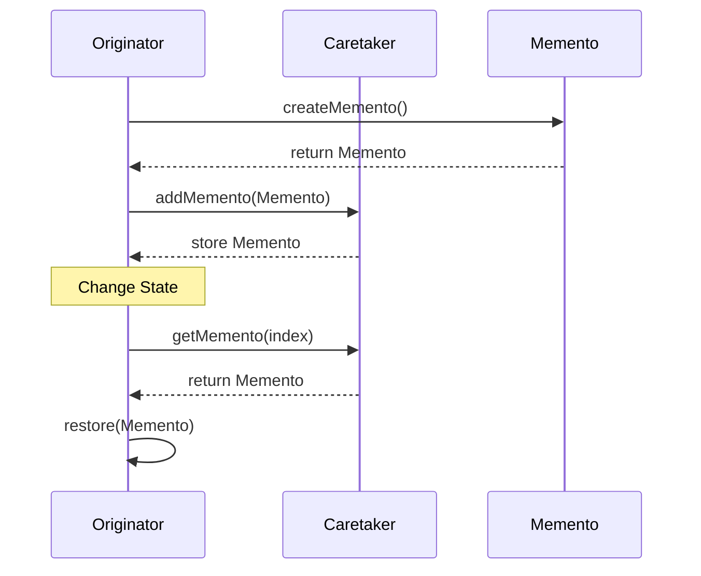

## 6.7 Memento Pattern

In the realm of software design patterns, the Memento Pattern stands out as a powerful tool for capturing and restoring the state of an object. This pattern is particularly useful when you need to implement undo functionality, manage state history, or provide a way to revert an object to a previous state without exposing its internal structure. In this section, we will delve into the intricacies of the Memento Pattern, exploring its key components, applicability, and implementation in C++.

### Intent

The primary intent of the Memento Pattern is to capture and externalize an object's internal state so that the object can be restored to this state later. This pattern is essential in scenarios where you need to provide undo mechanisms or maintain a history of states for objects. By using the Memento Pattern, you can encapsulate the state of an object without violating encapsulation principles, allowing the object's state to be saved and restored without exposing its internal details.

### Key Participants

The Memento Pattern involves three key participants:

1. **Originator**: The object whose state needs to be saved and restored. The Originator creates a Memento containing a snapshot of its current state and can use the Memento to restore its state later.

2. **Memento**: A representation of the Originator's state. The Memento is an opaque object that stores the internal state of the Originator. It provides no operations that can alter its state, ensuring that the state remains unchanged once captured.

3. **Caretaker**: The object responsible for managing the Mementos. The Caretaker requests a Memento from the Originator, stores it, and later uses it to restore the Originator's state. The Caretaker does not modify or inspect the contents of the Memento.

### Applicability

The Memento Pattern is applicable in the following scenarios:

- **Undo Mechanisms**: When you need to implement undo functionality in applications, such as text editors, where users can revert changes to a previous state.

- **State History Management**: When you need to maintain a history of states for objects, allowing you to navigate through previous states.

- **Snapshot Functionality**: When you need to take a snapshot of an object's state for later restoration, such as in serialization or checkpointing systems.

### Diagram

Let's visualize the interaction between the participants in the Memento Pattern using a class diagram:



### Implementing the Memento Pattern in C++

To implement the Memento Pattern in C++, we will create classes for the Originator, Memento, and Caretaker. Let's walk through the implementation step by step.

#### Step 1: Define the State

First, we need to define the state that we want to capture. For simplicity, let's assume our state is represented by a simple integer value.

```cpp
// State.h
#ifndef STATE_H
#define STATE_H

class State {
public:
    int value;
    State(int val) : value(val) {}
};

#endif // STATE_H
```

#### Step 2: Implement the Memento Class

The Memento class will encapsulate the state of the Originator. It should provide a way to retrieve the stored state but not modify it.

```cpp
// Memento.h
#ifndef MEMENTO_H
#define MEMENTO_H

#include "State.h"

class Memento {
private:
    State state;

public:
    Memento(const State& state) : state(state) {}

    State getState() const {
        return state;
    }
};

#endif // MEMENTO_H
```

#### Step 3: Implement the Originator Class

The Originator class is responsible for creating Mementos and restoring its state from them.

```cpp
// Originator.h
#ifndef ORIGINATOR_H
#define ORIGINATOR_H

#include "Memento.h"

class Originator {
private:
    State state;

public:
    Originator(int value) : state(value) {}

    void setState(int value) {
        state.value = value;
    }

    int getState() const {
        return state.value;
    }

    Memento createMemento() const {
        return Memento(state);
    }

    void restore(const Memento& memento) {
        state = memento.getState();
    }
};

#endif // ORIGINATOR_H
```

#### Step 4: Implement the Caretaker Class

The Caretaker class manages the Mementos. It stores them and can retrieve them when needed.

```cpp
// Caretaker.h
#ifndef CARETAKER_H
#define CARETAKER_H

#include <vector>
#include "Memento.h"

class Caretaker {
private:
    std::vector<Memento> mementos;

public:
    void addMemento(const Memento& memento) {
        mementos.push_back(memento);
    }

    Memento getMemento(int index) const {
        if (index < 0 || index >= mementos.size()) {
            throw std::out_of_range("Invalid memento index");
        }
        return mementos[index];
    }
};

#endif // CARETAKER_H
```

#### Step 5: Demonstrate the Memento Pattern

Now, let's demonstrate the Memento Pattern in action with a simple example.

```cpp
#include <iostream>
#include "Originator.h"
#include "Caretaker.h"

int main() {
    Originator originator(42);
    Caretaker caretaker;

    std::cout << "Initial State: " << originator.getState() << std::endl;

    // Save the state
    caretaker.addMemento(originator.createMemento());

    // Change the state
    originator.setState(84);
    std::cout << "State after change: " << originator.getState() << std::endl;

    // Restore the state
    originator.restore(caretaker.getMemento(0));
    std::cout << "State after restore: " << originator.getState() << std::endl;

    return 0;
}
```

### Design Considerations

When using the Memento Pattern, consider the following:

- **Memory Usage**: Storing multiple Mementos can consume significant memory, especially if the state is large. Consider strategies to limit the number of stored Mementos or compress the state.

- **Encapsulation**: The Memento Pattern preserves encapsulation by not exposing the internal state of the Originator. Ensure that the Memento class does not provide any operations that can alter its state.

- **Complexity**: The Memento Pattern can add complexity to your codebase. Use it judiciously, especially in scenarios where simpler solutions might suffice.

### Differences and Similarities

The Memento Pattern is often confused with the Command Pattern, as both can be used to implement undo functionality. However, they serve different purposes:

- **Memento Pattern**: Focuses on capturing and restoring the state of an object. It is state-centric and does not involve executing commands.

- **Command Pattern**: Encapsulates a request as an object, allowing you to parameterize clients with queues, requests, and operations. It is action-centric and involves executing commands.

### Try It Yourself

To deepen your understanding of the Memento Pattern, try modifying the code example:

- **Add Multiple States**: Extend the `State` class to include multiple attributes, such as a string or a vector, and update the Memento and Originator classes accordingly.

- **Implement a History Feature**: Modify the Caretaker class to maintain a history of states, allowing you to navigate through previous states and revert changes.

- **Optimize Memory Usage**: Implement a mechanism to limit the number of stored Mementos, such as a fixed-size buffer or a time-based expiration policy.

### Visualizing State Changes

To further illustrate the Memento Pattern, let's visualize the process of capturing and restoring state changes using a sequence diagram:



### Knowledge Check

Before we conclude, let's reinforce your understanding with a few questions:

- What is the primary purpose of the Memento Pattern?
- How does the Memento Pattern preserve encapsulation?
- In what scenarios is the Memento Pattern particularly useful?
- What are the key differences between the Memento and Command Patterns?

### Embrace the Journey

Remember, mastering design patterns is a journey. As you continue to explore and apply these patterns, you'll gain a deeper understanding of their nuances and how they can enhance your software design. Keep experimenting, stay curious, and enjoy the journey!

## Quiz Time!



### What is the primary purpose of the Memento Pattern?

- [x] To capture and restore an object's state
- [ ] To encapsulate a request as an object
- [ ] To define a family of algorithms
- [ ] To provide a way to access elements of an aggregate object sequentially

> **Explanation:** The Memento Pattern is specifically designed to capture and restore an object's state without violating encapsulation.

### Which participant in the Memento Pattern is responsible for storing the Memento?

- [ ] Originator
- [x] Caretaker
- [ ] Memento
- [ ] Client

> **Explanation:** The Caretaker is responsible for storing and managing the Mementos, while the Originator creates them.

### How does the Memento Pattern preserve encapsulation?

- [x] By not exposing the internal state of the Originator
- [ ] By using inheritance and polymorphism
- [ ] By providing a unified interface to a set of interfaces
- [ ] By decoupling abstraction from implementation

> **Explanation:** The Memento Pattern preserves encapsulation by ensuring that the internal state of the Originator is not exposed through the Memento.

### In what scenario is the Memento Pattern particularly useful?

- [x] Implementing undo functionality
- [ ] Defining a family of algorithms
- [ ] Providing a way to access elements of an aggregate object sequentially
- [ ] Encapsulating a request as an object

> **Explanation:** The Memento Pattern is particularly useful for implementing undo functionality, as it allows the state of an object to be saved and restored.

### What is the key difference between the Memento and Command Patterns?

- [x] Memento focuses on state, while Command focuses on actions
- [ ] Memento encapsulates requests, while Command captures state
- [x] Memento is state-centric, while Command is action-centric
- [ ] Memento and Command are identical in purpose

> **Explanation:** The Memento Pattern is state-centric, focusing on capturing and restoring an object's state, while the Command Pattern is action-centric, focusing on encapsulating requests as objects.

### Which class in the Memento Pattern is responsible for creating the Memento?

- [x] Originator
- [ ] Caretaker
- [ ] Memento
- [ ] Client

> **Explanation:** The Originator is responsible for creating the Memento, as it contains the state that needs to be captured.

### What is a potential drawback of using the Memento Pattern?

- [x] Increased memory usage
- [ ] Violation of encapsulation
- [ ] Lack of flexibility
- [ ] Difficulty in implementation

> **Explanation:** A potential drawback of the Memento Pattern is increased memory usage, especially when storing multiple Mementos with large states.

### How can the Memento Pattern be optimized for memory usage?

- [x] By limiting the number of stored Mementos
- [ ] By exposing the internal state of the Originator
- [ ] By using inheritance and polymorphism
- [ ] By providing a unified interface to a set of interfaces

> **Explanation:** To optimize memory usage, you can limit the number of stored Mementos, such as by implementing a fixed-size buffer or expiration policy.

### What is the role of the Caretaker in the Memento Pattern?

- [x] To manage and store Mementos
- [ ] To create and restore Mementos
- [ ] To encapsulate the state of the Originator
- [ ] To provide a way to access elements of an aggregate object sequentially

> **Explanation:** The Caretaker's role is to manage and store Mementos, ensuring that they can be retrieved for restoring the Originator's state.

### True or False: The Memento Pattern can be used to implement undo functionality in applications.

- [x] True
- [ ] False

> **Explanation:** True. The Memento Pattern is well-suited for implementing undo functionality, as it allows the state of an object to be saved and restored.


