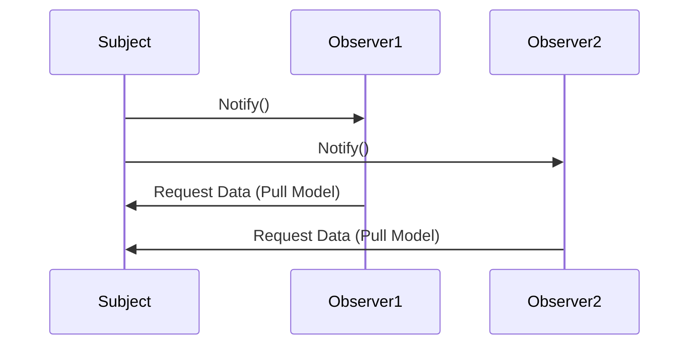

## 6.8 Observer Pattern

### Introduction

The Observer Pattern is a fundamental design pattern in software engineering, particularly useful in scenarios where a change in one object requires notifying and updating multiple dependent objects. This pattern is pivotal in event-driven systems, where it facilitates the implementation of publish-subscribe mechanisms. In this section, we will delve into the intricacies of the Observer Pattern, explore its implementation in C++, and discuss its applicability in modern software design.

### Intent

The primary intent of the Observer Pattern is to define a one-to-many dependency between objects so that when one object changes state, all its dependents are notified and updated automatically. This pattern promotes loose coupling between the subject (the object being observed) and the observers (the objects that need to be updated).

### Key Participants

1. **Subject**: The core entity being observed. It maintains a list of observers and provides methods to attach, detach, and notify them.
2. **Observer**: An interface or abstract class defining the update method, which is called when the subject's state changes.
3. **ConcreteSubject**: A class that extends the subject and holds the state of interest to the observers.
4. **ConcreteObserver**: A class that implements the observer interface and defines the update method to reflect changes in the subject.

### Applicability

The Observer Pattern is applicable in various scenarios, including:

- **Event-driven systems**: Where components need to react to changes in other components.
- **GUI frameworks**: To update the display when the underlying data changes.
- **Real-time systems**: Where timely updates are crucial for system integrity.
- **Distributed systems**: To propagate changes across different nodes or services.

### Implementing the Observer Pattern in C++

Let's explore how to implement the Observer Pattern in C++ using a simple example of a weather station that notifies multiple displays of temperature changes.

#### Step 1: Define the Observer Interface

First, we define an abstract class `Observer` that declares the `update` method.

```cpp
class Observer {
public:
    virtual ~Observer() {}
    virtual void update(float temperature) = 0;
};
```

#### Step 2: Define the Subject Interface

Next, we create an abstract class `Subject` that provides methods to attach, detach, and notify observers.

```cpp
#include <vector>
#include <algorithm>

class Subject {
public:
    virtual ~Subject() {}
    virtual void attach(Observer* observer) {
        observers.push_back(observer);
    }
    virtual void detach(Observer* observer) {
        observers.erase(std::remove(observers.begin(), observers.end(), observer), observers.end());
    }
    virtual void notify(float temperature) {
        for (Observer* observer : observers) {
            observer->update(temperature);
        }
    }

protected:
    std::vector<Observer*> observers;
};
```

#### Step 3: Implement the ConcreteSubject

The `WeatherStation` class extends `Subject` and holds the temperature state.

```cpp
class WeatherStation : public Subject {
public:
    void setTemperature(float temp) {
        temperature = temp;
        notify(temperature);
    }

private:
    float temperature;
};
```

#### Step 4: Implement the ConcreteObserver

Finally, we implement a `Display` class that updates its display based on the temperature changes.

```cpp
#include <iostream>

class Display : public Observer {
public:
    void update(float temperature) override {
        std::cout << "Display updated with temperature: " << temperature << std::endl;
    }
};
```

#### Step 5: Demonstrate the Pattern

Here's how you can use the above classes to demonstrate the Observer Pattern.

```cpp
int main() {
    WeatherStation station;
    Display display1, display2;

    station.attach(&display1);
    station.attach(&display2);

    station.setTemperature(25.0f);
    station.setTemperature(30.0f);

    station.detach(&display1);
    station.setTemperature(35.0f);

    return 0;
}
```

### Push vs. Pull Models

In the Observer Pattern, two primary models dictate how data is communicated between the subject and observers: the push model and the pull model.

#### Push Model

In the push model, the subject sends detailed information to the observers. This approach can lead to inefficiencies if the observers do not need all the data being pushed.

**Advantages:**
- Immediate data availability.
- Simplified observer logic.

**Disadvantages:**
- Potential for unnecessary data transmission.
- Increased coupling between subject and observers.

#### Pull Model

In the pull model, the subject only notifies observers of a change, and the observers are responsible for querying the subject for the specific data they need.

**Advantages:**
- Reduced data transmission.
- Greater flexibility for observers.

**Disadvantages:**
- Increased complexity in observer logic.
- Potential for stale data if not managed carefully.

### Observer Pattern in Event-Driven Systems

The Observer Pattern is a cornerstone of event-driven systems, where it facilitates the decoupling of event producers and consumers. This decoupling allows for more flexible and maintainable systems.

#### Example: Event System in a GUI Framework

Consider a GUI framework where user interactions (e.g., button clicks) need to trigger updates in various components.

```cpp
class Button : public Subject {
public:
    void click() {
        std::cout << "Button clicked!" << std::endl;
        notify();
    }
};

class Logger : public Observer {
public:
    void update() override {
        std::cout << "Logger: Button was clicked." << std::endl;
    }
};

int main() {
    Button button;
    Logger logger;

    button.attach(&logger);
    button.click();

    return 0;
}
```

### Design Considerations

When implementing the Observer Pattern, consider the following:

- **Memory Management**: Ensure that observers are properly detached before being destroyed to avoid dangling pointers.
- **Thread Safety**: In multithreaded environments, protect the observer list with synchronization mechanisms.
- **Performance**: Be mindful of the potential performance impact of notifying a large number of observers.

### Differences and Similarities with Other Patterns

The Observer Pattern is often compared with the following patterns:

- **Mediator Pattern**: While both patterns facilitate communication between objects, the Mediator Pattern centralizes communication logic, whereas the Observer Pattern decentralizes it.
- **Event Bus**: Similar to the Observer Pattern, but typically involves a centralized event dispatcher.
- **Publish-Subscribe**: A broader architectural pattern that encompasses the Observer Pattern but often includes message brokers for decoupling.

### Visualizing the Observer Pattern

To better understand the interaction between the subject and observers, let's visualize the Observer Pattern using a sequence diagram.



### Try It Yourself

Experiment with the Observer Pattern by modifying the code examples:

- **Add More Observers**: Implement additional observer classes that react differently to state changes.
- **Switch Models**: Try implementing both push and pull models to see their effects.
- **Thread Safety**: Introduce multithreading and ensure the observer list is safely accessed.

### References and Links

- [C++ Reference](https://en.cppreference.com/)
- [Design Patterns: Elements of Reusable Object-Oriented Software](https://en.wikipedia.org/wiki/Design_Patterns) by Erich Gamma et al.
- [Observer Pattern on Wikipedia](https://en.wikipedia.org/wiki/Observer_pattern)

### Knowledge Check

Before we conclude, let's reinforce your understanding with a few questions:

1. What are the key participants in the Observer Pattern?
2. How does the push model differ from the pull model?
3. In what scenarios is the Observer Pattern particularly useful?
4. How can you ensure thread safety when implementing the Observer Pattern in C++?

### Conclusion

The Observer Pattern is a powerful tool for managing dependencies and facilitating communication in complex systems. By mastering this pattern, you can design more flexible and maintainable software architectures. Remember, this is just the beginning. As you progress, you'll build more complex systems that leverage the full potential of design patterns. Keep experimenting, stay curious, and enjoy the journey!

## Quiz Time!



### What is the primary intent of the Observer Pattern?

- [x] To define a one-to-many dependency between objects
- [ ] To encapsulate a request as an object
- [ ] To provide a way to access elements of a collection sequentially
- [ ] To allow an object to alter its behavior when its internal state changes

> **Explanation:** The Observer Pattern defines a one-to-many dependency between objects so that when one object changes state, all its dependents are notified and updated automatically.

### Which of the following is NOT a key participant in the Observer Pattern?

- [ ] Subject
- [ ] Observer
- [x] Mediator
- [ ] ConcreteObserver

> **Explanation:** The Mediator is not a key participant in the Observer Pattern. The key participants are Subject, Observer, ConcreteSubject, and ConcreteObserver.

### In the push model, what does the subject send to the observers?

- [x] Detailed information
- [ ] A simple notification
- [ ] A request for data
- [ ] An acknowledgment

> **Explanation:** In the push model, the subject sends detailed information to the observers, which can lead to inefficiencies if the observers do not need all the data being pushed.

### What is a disadvantage of the pull model?

- [ ] Reduced data transmission
- [ ] Greater flexibility for observers
- [x] Increased complexity in observer logic
- [ ] Immediate data availability

> **Explanation:** A disadvantage of the pull model is the increased complexity in observer logic, as observers must query the subject for the specific data they need.

### Which pattern is often compared with the Observer Pattern?

- [x] Mediator Pattern
- [ ] Singleton Pattern
- [ ] Factory Pattern
- [ ] Builder Pattern

> **Explanation:** The Mediator Pattern is often compared with the Observer Pattern, as both facilitate communication between objects but in different ways.

### How can you ensure thread safety in the Observer Pattern?

- [x] Protect the observer list with synchronization mechanisms
- [ ] Use global variables
- [ ] Avoid using pointers
- [ ] Implement a single-threaded application

> **Explanation:** To ensure thread safety in the Observer Pattern, protect the observer list with synchronization mechanisms, especially in multithreaded environments.

### What is a common use case for the Observer Pattern?

- [x] Event-driven systems
- [ ] Singleton management
- [ ] Object cloning
- [ ] Resource pooling

> **Explanation:** A common use case for the Observer Pattern is in event-driven systems, where components need to react to changes in other components.

### What is a potential performance impact of the Observer Pattern?

- [ ] Improved memory usage
- [x] Notifying a large number of observers
- [ ] Faster execution times
- [ ] Reduced code complexity

> **Explanation:** A potential performance impact of the Observer Pattern is the overhead of notifying a large number of observers, which can affect system performance.

### True or False: The Observer Pattern is only applicable in GUI frameworks.

- [ ] True
- [x] False

> **Explanation:** False. The Observer Pattern is applicable in various scenarios, including event-driven systems, real-time systems, and distributed systems, not just GUI frameworks.

### What is a benefit of using the Observer Pattern?

- [x] Loose coupling between subject and observers
- [ ] Tight integration between components
- [ ] Simplified subject logic
- [ ] Reduced number of classes

> **Explanation:** A benefit of using the Observer Pattern is the loose coupling between the subject and observers, allowing for more flexible and maintainable systems.


