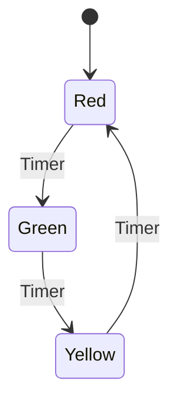

## 6.9 State Pattern

The State Pattern is a behavioral design pattern that allows an object to alter its behavior when its internal state changes. This pattern is particularly useful in scenarios where an object must change its behavior based on its state, such as in state machines. By encapsulating states as objects, the State Pattern helps avoid complex conditional statements and enhances code maintainability and scalability.

### Intent

The primary intent of the State Pattern is to allow an object to change its behavior when its internal state changes. This pattern encapsulates state-specific behavior within state objects and delegates state-dependent behavior to the current state object.

### Key Participants

1. **Context**: Maintains an instance of a ConcreteState subclass that defines the current state.
2. **State**: Defines an interface for encapsulating the behavior associated with a particular state of the Context.
3. **ConcreteState**: Implements behavior associated with a state of the Context.

### Applicability

Use the State Pattern when:

- An object's behavior depends on its state, and it must change its behavior at runtime depending on that state.
- Operations have large, multipart conditional statements that depend on the object's state.

### Implementing State Machines

State machines are a common use case for the State Pattern. They consist of states, transitions, and events that trigger transitions. The State Pattern provides a structured way to implement state machines by encapsulating states as objects.

#### Example: Traffic Light System

Let's consider a simple traffic light system with three states: Red, Green, and Yellow. Each state has a specific behavior, and the traffic light transitions between these states.

```cpp
#include <iostream>
#include <memory>

// Forward declaration
class TrafficLight;

// State interface
class State {
public:
    virtual ~State() = default;
    virtual void handle(TrafficLight& light) = 0;
};

// Context class
class TrafficLight {
private:
    std::unique_ptr<State> state;
public:
    TrafficLight(std::unique_ptr<State> initialState) : state(std::move(initialState)) {}
    void setState(std::unique_ptr<State> newState) {
        state = std::move(newState);
    }
    void request() {
        state->handle(*this);
    }
};

// Concrete states
class RedState : public State {
public:
    void handle(TrafficLight& light) override;
};

class GreenState : public State {
public:
    void handle(TrafficLight& light) override;
};

class YellowState : public State {
public:
    void handle(TrafficLight& light) override;
};

// Implementations of state transitions
void RedState::handle(TrafficLight& light) {
    std::cout << "Red Light - Stop!" << std::endl;
    light.setState(std::make_unique<GreenState>());
}

void GreenState::handle(TrafficLight& light) {
    std::cout << "Green Light - Go!" << std::endl;
    light.setState(std::make_unique<YellowState>());
}

void YellowState::handle(TrafficLight& light) {
    std::cout << "Yellow Light - Caution!" << std::endl;
    light.setState(std::make_unique<RedState>());
}

int main() {
    TrafficLight light(std::make_unique<RedState>());
    for (int i = 0; i < 6; ++i) {
        light.request();
    }
    return 0;
}
```

### Encapsulating States as Objects

In the State Pattern, each state is represented as a separate class that encapsulates the behavior associated with that state. This encapsulation allows for easy addition of new states and modifications to existing states without altering the Context class.

#### Benefits of Encapsulation

- **Modularity**: Each state is a separate class, making it easy to manage and extend.
- **Maintainability**: Changes to a state's behavior do not affect other states or the Context.
- **Scalability**: New states can be added with minimal impact on existing code.

### Avoiding Conditional Statements

The State Pattern helps eliminate complex conditional statements that are often used to manage state transitions. By delegating state-specific behavior to state objects, the pattern simplifies the logic within the Context class.

#### Example: Vending Machine

Consider a vending machine with different states: Idle, Selecting, Dispensing, and OutOfStock. Each state has its own behavior, and the machine transitions between these states based on user actions.

```cpp
#include <iostream>
#include <memory>

// Forward declaration
class VendingMachine;

// State interface
class VendingState {
public:
    virtual ~VendingState() = default;
    virtual void handle(VendingMachine& machine) = 0;
};

// Context class
class VendingMachine {
private:
    std::unique_ptr<VendingState> state;
public:
    VendingMachine(std::unique_ptr<VendingState> initialState) : state(std::move(initialState)) {}
    void setState(std::unique_ptr<VendingState> newState) {
        state = std::move(newState);
    }
    void request() {
        state->handle(*this);
    }
};

// Concrete states
class IdleState : public VendingState {
public:
    void handle(VendingMachine& machine) override;
};

class SelectingState : public VendingState {
public:
    void handle(VendingMachine& machine) override;
};

class DispensingState : public VendingState {
public:
    void handle(VendingMachine& machine) override;
};

class OutOfStockState : public VendingState {
public:
    void handle(VendingMachine& machine) override;
};

// Implementations of state transitions
void IdleState::handle(VendingMachine& machine) {
    std::cout << "Machine is idle. Please select an item." << std::endl;
    machine.setState(std::make_unique<SelectingState>());
}

void SelectingState::handle(VendingMachine& machine) {
    std::cout << "Selecting item. Please wait..." << std::endl;
    machine.setState(std::make_unique<DispensingState>());
}

void DispensingState::handle(VendingMachine& machine) {
    std::cout << "Dispensing item. Thank you!" << std::endl;
    machine.setState(std::make_unique<IdleState>());
}

void OutOfStockState::handle(VendingMachine& machine) {
    std::cout << "Out of stock. Please try later." << std::endl;
}

int main() {
    VendingMachine machine(std::make_unique<IdleState>());
    for (int i = 0; i < 3; ++i) {
        machine.request();
    }
    return 0;
}
```

### Design Considerations

When implementing the State Pattern, consider the following:

- **State Transition Logic**: Ensure that transitions between states are well-defined and logical.
- **State Initialization**: Initialize the Context with an appropriate initial state.
- **State-Specific Behavior**: Encapsulate behavior that varies by state within the state classes.

#### C++ Specific Features

- **Smart Pointers**: Use smart pointers (`std::unique_ptr`) to manage state objects and ensure proper memory management.
- **Polymorphism**: Leverage polymorphism to delegate behavior to state objects.

### Differences and Similarities

The State Pattern is often compared to the Strategy Pattern. While both patterns encapsulate behavior, the key difference is that the State Pattern is used when an object's behavior changes based on its state, whereas the Strategy Pattern is used to select an algorithm at runtime.

### Visualizing the State Pattern

Let's visualize the State Pattern using a state diagram for the traffic light system:



**Diagram Description:** The state diagram illustrates the transitions between the Red, Green, and Yellow states of the traffic light system. Each transition is triggered by a timer event.

### Try It Yourself

Experiment with the provided code examples by:

- Adding new states to the traffic light or vending machine systems.
- Modifying state transitions to introduce new behavior.
- Implementing a different system using the State Pattern.

### Knowledge Check

- What are the key participants in the State Pattern?
- How does the State Pattern help avoid complex conditional statements?
- What is the difference between the State Pattern and the Strategy Pattern?

### Embrace the Journey

Remember, mastering design patterns is a journey. As you continue to explore and apply the State Pattern, you'll gain a deeper understanding of how to manage state-dependent behavior in your applications. Keep experimenting, stay curious, and enjoy the journey!

## Quiz Time!



### What is the primary intent of the State Pattern?

- [x] To allow an object to change its behavior when its internal state changes.
- [ ] To encapsulate algorithms within classes.
- [ ] To provide a way to access elements of an aggregate object sequentially.
- [ ] To define a family of algorithms.

> **Explanation:** The State Pattern allows an object to change its behavior when its internal state changes, encapsulating state-specific behavior within state objects.

### Which of the following is NOT a key participant in the State Pattern?

- [ ] Context
- [ ] State
- [x] Observer
- [ ] ConcreteState

> **Explanation:** The Observer is not a participant in the State Pattern. The key participants are Context, State, and ConcreteState.

### How does the State Pattern help avoid complex conditional statements?

- [x] By delegating state-specific behavior to state objects.
- [ ] By using inheritance to manage behavior.
- [ ] By encapsulating algorithms within classes.
- [ ] By defining a family of algorithms.

> **Explanation:** The State Pattern avoids complex conditional statements by delegating state-specific behavior to state objects, simplifying the logic within the Context class.

### In the State Pattern, what role does the Context class play?

- [x] It maintains an instance of a ConcreteState subclass that defines the current state.
- [ ] It defines an interface for encapsulating behavior associated with a state.
- [ ] It implements behavior associated with a state.
- [ ] It provides a way to access elements of an aggregate object sequentially.

> **Explanation:** The Context class maintains an instance of a ConcreteState subclass that defines the current state and delegates state-dependent behavior to it.

### What is a common use case for the State Pattern?

- [x] Implementing state machines.
- [ ] Encapsulating algorithms within classes.
- [ ] Providing a way to access elements of an aggregate object sequentially.
- [ ] Defining a family of algorithms.

> **Explanation:** A common use case for the State Pattern is implementing state machines, where an object's behavior changes based on its state.

### How does the State Pattern differ from the Strategy Pattern?

- [x] The State Pattern is used when an object's behavior changes based on its state, while the Strategy Pattern is used to select an algorithm at runtime.
- [ ] The State Pattern encapsulates algorithms within classes, while the Strategy Pattern defines a family of algorithms.
- [ ] The State Pattern provides a way to access elements of an aggregate object sequentially, while the Strategy Pattern encapsulates algorithms.
- [ ] The State Pattern defines a family of algorithms, while the Strategy Pattern is used to change behavior based on state.

> **Explanation:** The State Pattern is used when an object's behavior changes based on its state, while the Strategy Pattern is used to select an algorithm at runtime.

### What is the benefit of encapsulating states as objects in the State Pattern?

- [x] It enhances modularity, maintainability, and scalability.
- [ ] It simplifies algorithm selection.
- [ ] It provides a way to access elements of an aggregate object sequentially.
- [ ] It defines a family of algorithms.

> **Explanation:** Encapsulating states as objects enhances modularity, maintainability, and scalability by separating state-specific behavior into distinct classes.

### What C++ feature is commonly used in the State Pattern to manage state objects?

- [x] Smart pointers (`std::unique_ptr`)
- [ ] Templates
- [ ] Iterators
- [ ] Functors

> **Explanation:** Smart pointers (`std::unique_ptr`) are commonly used in the State Pattern to manage state objects and ensure proper memory management.

### Which of the following is a benefit of using the State Pattern?

- [x] It eliminates complex conditional statements.
- [ ] It provides a way to access elements of an aggregate object sequentially.
- [ ] It defines a family of algorithms.
- [ ] It encapsulates algorithms within classes.

> **Explanation:** The State Pattern eliminates complex conditional statements by delegating state-specific behavior to state objects.

### True or False: The State Pattern is only applicable in object-oriented programming languages.

- [x] True
- [ ] False

> **Explanation:** The State Pattern is primarily applicable in object-oriented programming languages, as it relies on encapsulating state-specific behavior within state objects.


