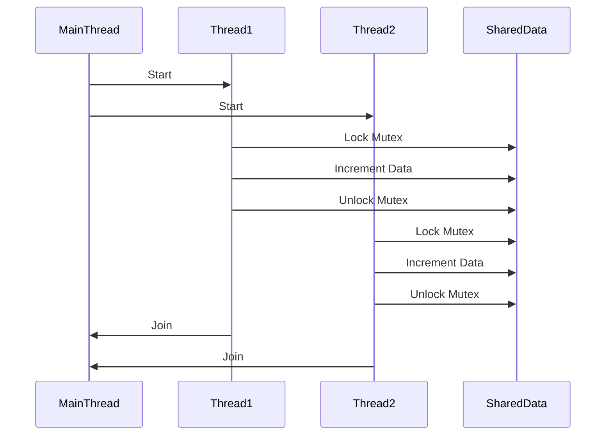

## 7.1 Overview of Concurrency in C++

Concurrency in C++ is a powerful tool that allows developers to build applications capable of performing multiple tasks simultaneously. This section provides an in-depth exploration of concurrency in C++, covering the challenges, considerations, and the C++ memory model. By understanding these concepts, you will be equipped to design robust and efficient concurrent applications.

### Introduction to Concurrency

Concurrency refers to the ability of a program to execute multiple tasks simultaneously. In C++, concurrency is achieved through multithreading, where multiple threads run in parallel, sharing the same process space. This can significantly improve the performance of applications, especially on multi-core processors.

Concurrency is essential in modern software development, enabling applications to handle multiple tasks such as processing user inputs, performing computations, and managing I/O operations concurrently. However, it also introduces complexity, requiring careful management of shared resources and synchronization to avoid issues such as race conditions and deadlocks.

### Challenges in Concurrent Programming

Concurrent programming in C++ presents several challenges that developers must address to ensure the correctness and performance of their applications:

1. **Race Conditions**: Occur when two or more threads access shared data simultaneously, and at least one of the accesses is a write. This can lead to inconsistent or incorrect results.

2. **Deadlocks**: Happen when two or more threads are waiting indefinitely for resources held by each other, causing the program to hang.

3. **Livelocks**: Similar to deadlocks, but the threads are actively changing states in response to each other without making progress.

4. **Starvation**: Occurs when a thread is perpetually denied access to resources, preventing it from making progress.

5. **Data Races**: A specific type of race condition where two threads access the same variable concurrently, and at least one of the accesses is a write.

6. **Complexity in Debugging**: Concurrent programs can be difficult to debug due to non-deterministic behavior, where the order of thread execution can vary between runs.

### Considerations for Concurrent Programming

When designing concurrent applications in C++, several considerations must be taken into account to ensure efficiency and correctness:

- **Thread Management**: Efficiently managing the lifecycle of threads, including creation, synchronization, and termination, is crucial. C++ provides the `std::thread` class for creating and managing threads.

- **Synchronization**: Proper synchronization is necessary to prevent race conditions and ensure data consistency. C++ offers synchronization primitives such as `std::mutex`, `std::lock_guard`, and `std::condition_variable`.

- **Atomic Operations**: Use atomic operations to perform thread-safe modifications to shared data without explicit locks. The `std::atomic` library provides atomic types and operations.

- **Memory Consistency**: Ensure that memory operations are visible to all threads in a consistent manner. This is where the C++ memory model plays a crucial role.

- **Performance Optimization**: Balance the overhead of synchronization with the need for data consistency. Over-synchronization can lead to performance bottlenecks.

### The C++ Memory Model

The C++ memory model defines the rules for how memory operations are performed in a concurrent environment. It provides a framework for understanding the visibility and ordering of memory operations across different threads.

#### Memory Ordering

Memory ordering specifies the order in which memory operations (reads and writes) are observed by different threads. C++ provides several memory orderings:

- **Relaxed Ordering**: No guarantees on the order of operations, allowing maximum optimization by the compiler and hardware.

- **Acquire-Release Ordering**: Ensures that operations before the acquire are visible to operations after the release.

- **Sequential Consistency**: Provides a total order of operations, ensuring that all threads observe memory operations in the same order.

#### Atomic Operations

Atomic operations are indivisible operations that ensure thread-safe access to shared data without the need for explicit locks. C++ provides atomic types and operations through the `std::atomic` library.

```cpp
#include <atomic>
#include <iostream>
#include <thread>
#include <vector>

std::atomic<int> counter(0);

void incrementCounter() {
    for (int i = 0; i < 1000; ++i) {
        ++counter; // Atomic increment
    }
}

int main() {
    std::vector<std::thread> threads;
    for (int i = 0; i < 10; ++i) {
        threads.emplace_back(incrementCounter);
    }

    for (auto& thread : threads) {
        thread.join();
    }

    std::cout << "Final counter value: " << counter << std::endl;
    return 0;
}
```

In this example, the `counter` variable is incremented atomically by multiple threads, ensuring that the final value is consistent.

### Synchronization Primitives

C++ provides several synchronization primitives to manage access to shared resources:

- **Mutexes**: Used to protect shared data by allowing only one thread to access the data at a time. The `std::mutex` class provides basic locking mechanisms.

- **Lock Guards**: A RAII-style mechanism to ensure that a mutex is properly locked and unlocked. The `std::lock_guard` class automatically releases the mutex when it goes out of scope.

- **Condition Variables**: Used to block a thread until a particular condition is met. The `std::condition_variable` class allows threads to wait for notifications.

#### Example: Using Mutex and Lock Guard

```cpp
#include <iostream>
#include <mutex>
#include <thread>
#include <vector>

std::mutex mtx;
int sharedData = 0;

void incrementData() {
    for (int i = 0; i < 1000; ++i) {
        std::lock_guard<std::mutex> lock(mtx);
        ++sharedData; // Protected by mutex
    }
}

int main() {
    std::vector<std::thread> threads;
    for (int i = 0; i < 10; ++i) {
        threads.emplace_back(incrementData);
    }

    for (auto& thread : threads) {
        thread.join();
    }

    std::cout << "Final shared data value: " << sharedData << std::endl;
    return 0;
}
```

In this example, the `sharedData` variable is protected by a mutex, ensuring that only one thread can modify it at a time.

### Try It Yourself

Experiment with the code examples by modifying the number of threads or iterations. Observe how the final values change with different configurations. Try removing the mutex or using different synchronization primitives to see their effects on data consistency.

### Visualizing Concurrency in C++

To better understand the flow of concurrent operations, let's visualize the interaction between threads and shared data using a sequence diagram.



This diagram illustrates how threads interact with shared data using mutexes to ensure safe access.

### Knowledge Check

- **What is a race condition, and how can it be prevented?**
- **Explain the difference between deadlocks and livelocks.**
- **What are atomic operations, and why are they important in concurrent programming?**
- **How does the C++ memory model ensure memory consistency across threads?**

### Embrace the Journey

Concurrency in C++ is a complex but rewarding area of study. As you continue to explore and experiment with concurrent programming, remember that practice and experience are key to mastering these concepts. Keep experimenting, stay curious, and enjoy the journey of building efficient and robust concurrent applications.

### References and Links

- [C++ Reference: std::thread](https://en.cppreference.com/w/cpp/thread/thread)
- [C++ Reference: std::mutex](https://en.cppreference.com/w/cpp/thread/mutex)
- [C++ Reference: std::atomic](https://en.cppreference.com/w/cpp/atomic/atomic)
- [C++ Reference: Memory Model](https://en.cppreference.com/w/cpp/atomic/memory_order)

## Quiz Time!



### What is a race condition?

- [x] A situation where two or more threads access shared data simultaneously, and at least one access is a write
- [ ] A situation where threads are waiting indefinitely for resources
- [ ] A situation where threads are actively changing states without making progress
- [ ] A situation where a thread is denied access to resources

> **Explanation:** A race condition occurs when two or more threads access shared data simultaneously, and at least one of the accesses is a write, leading to inconsistent results.

### Which of the following is a synchronization primitive in C++?

- [x] std::mutex
- [ ] std::vector
- [ ] std::string
- [ ] std::array

> **Explanation:** `std::mutex` is a synchronization primitive used to protect shared data by allowing only one thread to access it at a time.

### What is the purpose of a lock guard in C++?

- [x] To automatically lock and unlock a mutex
- [ ] To create a new thread
- [ ] To manage memory allocation
- [ ] To perform atomic operations

> **Explanation:** A lock guard is a RAII-style mechanism that automatically locks a mutex when it is created and unlocks it when it goes out of scope.

### What is the C++ memory model used for?

- [x] To define the rules for memory operations in a concurrent environment
- [ ] To manage dynamic memory allocation
- [ ] To create and manage threads
- [ ] To handle exceptions

> **Explanation:** The C++ memory model defines the rules for how memory operations are performed in a concurrent environment, ensuring memory consistency across threads.

### How can deadlocks be avoided?

- [x] By ensuring that all threads acquire locks in a consistent order
- [ ] By using more threads
- [ ] By increasing the number of shared resources
- [ ] By using atomic operations

> **Explanation:** Deadlocks can be avoided by ensuring that all threads acquire locks in a consistent order, preventing circular wait conditions.

### What is an atomic operation?

- [x] An indivisible operation that ensures thread-safe access to shared data
- [ ] An operation that creates a new thread
- [ ] An operation that manages memory allocation
- [ ] An operation that performs I/O tasks

> **Explanation:** An atomic operation is an indivisible operation that ensures thread-safe access to shared data without the need for explicit locks.

### What is the difference between relaxed and sequential consistency in memory ordering?

- [x] Relaxed ordering allows maximum optimization, while sequential consistency provides a total order of operations
- [ ] Relaxed ordering provides a total order of operations, while sequential consistency allows maximum optimization
- [ ] Both provide the same level of memory ordering
- [ ] Neither provides any memory ordering

> **Explanation:** Relaxed ordering allows maximum optimization by the compiler and hardware, while sequential consistency provides a total order of operations, ensuring all threads observe memory operations in the same order.

### What is a livelock?

- [x] A situation where threads are actively changing states in response to each other without making progress
- [ ] A situation where threads are waiting indefinitely for resources
- [ ] A situation where two or more threads access shared data simultaneously
- [ ] A situation where a thread is denied access to resources

> **Explanation:** A livelock occurs when threads are actively changing states in response to each other without making progress, similar to a deadlock but with active state changes.

### Why is thread management important in concurrent programming?

- [x] To efficiently manage the lifecycle of threads, including creation, synchronization, and termination
- [ ] To perform atomic operations
- [ ] To manage memory allocation
- [ ] To handle exceptions

> **Explanation:** Thread management is important to efficiently manage the lifecycle of threads, including their creation, synchronization, and termination, ensuring the correct and efficient execution of concurrent applications.

### True or False: The C++ memory model provides guarantees on the visibility and ordering of memory operations across different threads.

- [x] True
- [ ] False

> **Explanation:** True. The C++ memory model provides guarantees on the visibility and ordering of memory operations across different threads, ensuring memory consistency in concurrent environments.


