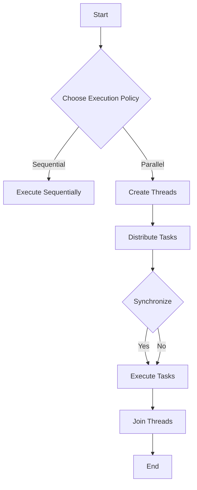

## 7.10 Parallel Algorithms and Execution Policies

In the world of modern software development, performance and efficiency are paramount. As systems grow in complexity and data volumes increase, the ability to process tasks concurrently becomes a crucial skill for software engineers and architects. C++17 introduced a powerful feature set that allows developers to harness the full potential of parallel computing: parallel algorithms and execution policies. This section will guide you through the concepts, implementation, and optimization of parallel algorithms using execution policies in C++.

### Introduction to Parallel Algorithms

Parallel algorithms in C++ are designed to execute operations concurrently, leveraging multiple cores and processors to improve performance. By utilizing parallel algorithms, you can significantly reduce the execution time of computationally intensive tasks. C++17 introduced parallel versions of many standard algorithms, enabling developers to easily switch from sequential to parallel execution.

#### Key Concepts

- **Concurrency**: The ability of a system to execute multiple tasks simultaneously.
- **Parallelism**: A type of concurrency where tasks are executed simultaneously on multiple processors or cores.
- **Parallel Algorithms**: Algorithms that are designed to be executed in parallel, taking advantage of multiple processing units.

### Execution Policies

Execution policies in C++ provide a mechanism to specify how algorithms should be executed. They are part of the `std::execution` namespace and allow you to control whether an algorithm runs sequentially, in parallel, or in a vectorized manner.

#### Types of Execution Policies

1. **`std::execution::seq`**: Specifies that the algorithm should be executed sequentially. This is the default policy if no other policy is specified.
2. **`std::execution::par`**: Specifies that the algorithm should be executed in parallel, utilizing multiple threads.
3. **`std::execution::par_unseq`**: Specifies that the algorithm should be executed in parallel and may be vectorized, allowing for additional optimizations.

### Using C++17 Parallel Algorithms

C++17 extends the Standard Template Library (STL) with parallel versions of many algorithms. These algorithms can be used with execution policies to control their behavior. Let's explore some common parallel algorithms and how to use them.

#### Example: Parallel `std::for_each`

The `std::for_each` algorithm applies a function to each element in a range. By using an execution policy, you can run this algorithm in parallel.

```cpp
#include <iostream>
#include <vector>
#include <algorithm>
#include <execution>

int main() {
    std::vector<int> data = {1, 2, 3, 4, 5};

    // Apply a function to each element in parallel
    std::for_each(std::execution::par, data.begin(), data.end(), [](int& n) {
        n *= 2; // Double each element
    });

    // Print the modified vector
    for (const auto& n : data) {
        std::cout << n << " ";
    }
    return 0;
}
```

**Key Points:**

- The `std::execution::par` policy is used to execute the algorithm in parallel.
- The lambda function doubles each element in the vector.

#### Example: Parallel `std::transform`

The `std::transform` algorithm applies a function to each element in a range and stores the result in another range. This can also be parallelized.

```cpp
#include <iostream>
#include <vector>
#include <algorithm>
#include <execution>

int main() {
    std::vector<int> input = {1, 2, 3, 4, 5};
    std::vector<int> output(input.size());

    // Transform input to output in parallel
    std::transform(std::execution::par, input.begin(), input.end(), output.begin(), [](int n) {
        return n * n; // Square each element
    });

    // Print the transformed vector
    for (const auto& n : output) {
        std::cout << n << " ";
    }
    return 0;
}
```

**Key Points:**

- The `std::execution::par` policy enables parallel execution.
- The lambda function squares each element from the input vector and stores it in the output vector.

### Customizing Parallel Execution

While the standard execution policies provide a good starting point, there are scenarios where you might need more control over parallel execution. Customizing parallel execution involves understanding the underlying hardware and optimizing the use of resources.

#### Thread Management

Managing threads efficiently is crucial for optimizing parallel execution. C++ provides several tools for thread management, including `std::thread`, `std::mutex`, and `std::condition_variable`. Understanding these tools will help you fine-tune your parallel algorithms.

#### Load Balancing

Load balancing ensures that work is evenly distributed across all available processors. This can be achieved by dividing tasks into smaller chunks and assigning them dynamically to threads.

#### Synchronization

Synchronization is essential to prevent data races and ensure the correctness of parallel algorithms. Use synchronization primitives like mutexes and locks to manage access to shared resources.

### Performance Considerations

When working with parallel algorithms, it's important to consider the performance implications. Here are some key factors to keep in mind:

- **Overhead**: Parallel execution introduces overhead due to thread management and synchronization. Ensure that the performance gains outweigh the overhead.
- **Scalability**: Test your algorithms on different hardware configurations to ensure they scale well with the number of available cores.
- **Data Locality**: Optimize data access patterns to take advantage of cache hierarchies and minimize memory access latency.

### Visualizing Parallel Execution

To better understand the flow of parallel execution, let's visualize the process using a flowchart. This flowchart represents the execution of a parallel algorithm with a focus on thread management and synchronization.



**Diagram Description:**

- The flowchart illustrates the decision-making process for choosing an execution policy.
- It shows the creation and management of threads for parallel execution.
- Synchronization ensures that tasks are executed correctly and threads are joined at the end.

### Try It Yourself

Now that we've covered the basics of parallel algorithms and execution policies, it's time to experiment. Try modifying the code examples to explore different execution policies and observe the performance impact. Here are some suggestions:

- Change the execution policy from `std::execution::par` to `std::execution::par_unseq` and observe any differences in execution time.
- Implement a parallel version of a different algorithm, such as `std::sort`, and compare its performance to the sequential version.
- Experiment with different data sizes and observe how the performance scales with the number of elements.

### Further Reading and Resources

To deepen your understanding of parallel algorithms and execution policies, consider exploring the following resources:

- [C++ Standard Library Documentation](https://en.cppreference.com/w/cpp/algorithm)
- [Concurrency in C++](https://en.cppreference.com/w/cpp/thread)
- [Parallel Programming with C++](https://www.boost.org/doc/libs/1_75_0/libs/compute/doc/html/index.html)

### Knowledge Check

Before we wrap up, let's reinforce what we've learned with a few questions:

1. What is the primary benefit of using parallel algorithms in C++?
2. How does the `std::execution::par` policy differ from `std::execution::seq`?
3. Why is synchronization important in parallel algorithms?
4. What are some common synchronization primitives used in C++?
5. How can load balancing improve the performance of parallel algorithms?

### Conclusion

Parallel algorithms and execution policies in C++ provide a powerful toolset for optimizing performance and leveraging modern hardware capabilities. By understanding and applying these concepts, you can design efficient, scalable applications that take full advantage of concurrent execution. Remember, this is just the beginning. As you continue to explore and experiment, you'll discover new ways to enhance your software's performance and efficiency. Keep learning, stay curious, and enjoy the journey!

## Quiz Time!



### What is the primary benefit of using parallel algorithms in C++?

- [x] Improved performance through concurrent execution
- [ ] Simplified code structure
- [ ] Enhanced readability
- [ ] Reduced memory usage

> **Explanation:** Parallel algorithms improve performance by executing tasks concurrently, leveraging multiple cores and processors.

### How does the `std::execution::par` policy differ from `std::execution::seq`?

- [x] `std::execution::par` executes algorithms in parallel, while `std::execution::seq` executes them sequentially.
- [ ] `std::execution::par` is slower than `std::execution::seq`.
- [ ] `std::execution::par` is used for vectorized execution.
- [ ] `std::execution::par` is the default execution policy.

> **Explanation:** `std::execution::par` allows algorithms to run in parallel, whereas `std::execution::seq` runs them sequentially.

### Why is synchronization important in parallel algorithms?

- [x] To prevent data races and ensure correctness
- [ ] To increase execution speed
- [ ] To reduce memory usage
- [ ] To simplify code

> **Explanation:** Synchronization prevents data races and ensures that parallel algorithms execute correctly.

### What are some common synchronization primitives used in C++?

- [x] Mutexes and locks
- [ ] Arrays and vectors
- [ ] Pointers and references
- [ ] Streams and files

> **Explanation:** Mutexes and locks are common synchronization primitives used to manage access to shared resources.

### How can load balancing improve the performance of parallel algorithms?

- [x] By evenly distributing work across processors
- [ ] By reducing code complexity
- [ ] By increasing memory usage
- [ ] By simplifying algorithm design

> **Explanation:** Load balancing ensures that work is evenly distributed, improving performance by utilizing all available processors efficiently.

### What is the role of execution policies in parallel algorithms?

- [x] To specify how algorithms should be executed
- [ ] To define the algorithm's logic
- [ ] To manage memory allocation
- [ ] To simplify code syntax

> **Explanation:** Execution policies specify whether algorithms should run sequentially, in parallel, or vectorized.

### Which execution policy allows for vectorized execution in C++?

- [x] `std::execution::par_unseq`
- [ ] `std::execution::seq`
- [ ] `std::execution::par`
- [ ] `std::execution::unseq`

> **Explanation:** `std::execution::par_unseq` allows for parallel and vectorized execution.

### What is a potential drawback of using parallel algorithms?

- [x] Increased overhead due to thread management
- [ ] Reduced code readability
- [ ] Decreased performance on single-core systems
- [ ] Simplified debugging

> **Explanation:** Parallel execution introduces overhead from managing threads and synchronization.

### Which C++ version introduced parallel algorithms?

- [x] C++17
- [ ] C++11
- [ ] C++14
- [ ] C++20

> **Explanation:** C++17 introduced parallel algorithms as part of the Standard Template Library.

### True or False: `std::execution::seq` is the default execution policy if none is specified.

- [x] True
- [ ] False

> **Explanation:** If no execution policy is specified, algorithms default to sequential execution with `std::execution::seq`.


