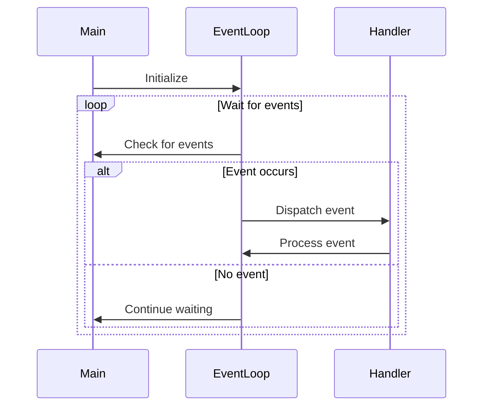

## 7.11 Event Loop Patterns

In the realm of modern software development, event-driven programming has become a cornerstone for building responsive and efficient applications. The event loop pattern is a fundamental concept that enables applications to handle events, such as user inputs or network messages, asynchronously. This section delves into the intricacies of event loop patterns in C++, exploring how they can be implemented, the role of asynchronous I/O, and the benefits of non-blocking operations.

### Understanding Event-Driven Programming

Event-driven programming is a paradigm where the flow of the program is determined by events such as user actions, sensor outputs, or messages from other programs. This approach contrasts with traditional sequential programming, where the program follows a predetermined path.

#### Key Concepts

- **Event**: An occurrence that the program can respond to, such as a mouse click or a network packet arrival.
- **Event Handler**: A function or method that processes an event.
- **Event Loop**: A construct that waits for and dispatches events or messages in a program.

### The Role of Event Loops

An event loop is a programming construct that waits for events and then dispatches them to the appropriate handlers. It is central to event-driven programming and is used extensively in GUI applications, network servers, and real-time systems.

#### How Event Loops Work

1. **Initialization**: Set up the necessary resources and register event handlers.
2. **Event Waiting**: Continuously wait for events to occur.
3. **Event Dispatching**: When an event occurs, dispatch it to the appropriate handler.
4. **Processing**: Execute the handler code to process the event.
5. **Looping**: Return to the waiting state to handle the next event.

### Implementing Event Loops in C++

In C++, implementing an event loop involves using constructs that can wait for events and then execute the corresponding handlers. The Standard Library provides some support for this, but often, additional libraries like Boost.Asio are used for more complex scenarios.

#### Basic Event Loop Example

```cpp
#include <iostream>
#include <functional>
#include <map>
#include <queue>
#include <string>

// Define an Event type
struct Event {
    std::string type;
    std::function<void()> handler;
};

// Event loop class
class EventLoop {
public:
    void addEvent(const std::string& eventType, std::function<void()> handler) {
        eventHandlers[eventType] = handler;
    }

    void triggerEvent(const std::string& eventType) {
        if (eventHandlers.find(eventType) != eventHandlers.end()) {
            eventQueue.push(eventHandlers[eventType]);
        }
    }

    void run() {
        while (!eventQueue.empty()) {
            auto handler = eventQueue.front();
            eventQueue.pop();
            handler();
        }
    }

private:
    std::map<std::string, std::function<void()>> eventHandlers;
    std::queue<std::function<void()>> eventQueue;
};

int main() {
    EventLoop loop;

    loop.addEvent("sayHello", []() {
        std::cout << "Hello, World!" << std::endl;
    });

    loop.triggerEvent("sayHello");
    loop.run();

    return 0;
}
```

In this example, we define a simple event loop that can register events and their handlers, trigger events, and process them in a queue.

### Asynchronous I/O and Non-blocking Operations

Asynchronous I/O is a form of input/output processing that allows other processing to continue before the transmission has finished. Non-blocking operations are crucial for building responsive applications that can handle multiple tasks simultaneously without waiting for each to complete sequentially.

#### Benefits of Asynchronous I/O

- **Improved Responsiveness**: Applications remain responsive to user inputs or other events while waiting for I/O operations to complete.
- **Better Resource Utilization**: CPU resources are not wasted waiting for I/O operations, allowing other tasks to execute.
- **Scalability**: Applications can handle more simultaneous connections or tasks.

#### Implementing Asynchronous I/O in C++

C++ provides several ways to implement asynchronous I/O, including using threads, the `std::async` function, and libraries like Boost.Asio.

##### Using Boost.Asio for Asynchronous I/O

Boost.Asio is a cross-platform C++ library for network and low-level I/O programming that provides a consistent asynchronous model.

```cpp
#include <boost/asio.hpp>
#include <iostream>

void print(const boost::system::error_code& /*e*/,
           boost::asio::steady_timer* t, int* count) {
    if (*count < 5) {
        std::cout << *count << std::endl;
        ++(*count);

        t->expires_at(t->expiry() + boost::asio::chrono::seconds(1));
        t->async_wait(std::bind(print, std::placeholders::_1, t, count));
    }
}

int main() {
    boost::asio::io_context io;
    int count = 0;
    boost::asio::steady_timer t(io, boost::asio::chrono::seconds(1));
    t.async_wait(std::bind(print, std::placeholders::_1, &t, &count));

    io.run();

    std::cout << "Final count is " << count << std::endl;

    return 0;
}
```

In this example, Boost.Asio is used to create an asynchronous timer that prints a count every second. The `io_context` object is the core of Boost.Asio's I/O services, and it runs the event loop.

### Non-blocking Operations

Non-blocking operations allow a program to initiate an operation and then continue executing other code without waiting for the operation to complete. This is particularly useful in I/O-bound applications where waiting for data can introduce significant delays.

#### Implementing Non-blocking Operations

Non-blocking operations can be implemented using various techniques, such as polling, callbacks, or futures.

##### Example: Non-blocking Socket I/O

```cpp
#include <iostream>
#include <boost/asio.hpp>

int main() {
    try {
        boost::asio::io_context io_context;

        boost::asio::ip::tcp::resolver resolver(io_context);
        boost::asio::ip::tcp::socket socket(io_context);

        auto endpoints = resolver.resolve("example.com", "http");
        boost::asio::connect(socket, endpoints);

        socket.non_blocking(true);

        boost::system::error_code ec;
        while (true) {
            char data[512];
            size_t length = socket.read_some(boost::asio::buffer(data), ec);

            if (ec == boost::asio::error::would_block) {
                // Perform other tasks while waiting for data
                std::cout << "Waiting for data..." << std::endl;
                continue;
            }

            if (ec) {
                throw boost::system::system_error(ec);
            }

            std::cout.write(data, length);
        }
    } catch (std::exception& e) {
        std::cerr << "Exception: " << e.what() << std::endl;
    }

    return 0;
}
```

In this example, a non-blocking socket is used to connect to a server and read data. The `would_block` error code indicates that no data is currently available, allowing the program to perform other tasks while waiting.

### Visualizing Event Loop Patterns

To better understand the flow of an event loop, let's visualize the process using a sequence diagram.



**Diagram Description**: This sequence diagram illustrates the flow of an event loop. The main program initializes the event loop, which continuously waits for events. When an event occurs, it is dispatched to the appropriate handler for processing.

### Design Considerations

When implementing event loops and asynchronous I/O in C++, consider the following:

- **Thread Safety**: Ensure that shared resources are protected when accessed by multiple threads.
- **Error Handling**: Implement robust error handling to manage exceptions and errors gracefully.
- **Performance**: Optimize the event loop to minimize latency and maximize throughput.
- **Scalability**: Design the system to handle an increasing number of events or connections efficiently.

### Differences and Similarities

Event loops are often compared to other concurrency patterns like threads and futures. While threads provide parallel execution, event loops focus on handling events asynchronously within a single thread. Futures are used for managing asynchronous results, which can be integrated into event loops for more complex workflows.

### Try It Yourself

To deepen your understanding of event loops, try modifying the code examples provided:

- **Experiment with Different Events**: Add more event types and handlers to the basic event loop example.
- **Implement a Network Server**: Use Boost.Asio to create a simple TCP server that handles multiple client connections asynchronously.
- **Explore Non-blocking I/O**: Modify the non-blocking socket example to handle multiple sockets using a single event loop.

### Knowledge Check

- **What is the primary purpose of an event loop in an event-driven application?**
- **How does asynchronous I/O improve application performance?**
- **What are some common challenges when implementing non-blocking operations?**

### Embrace the Journey

Remember, mastering event loop patterns in C++ is a journey. As you experiment and apply these concepts, you'll build more efficient and responsive applications. Stay curious, keep experimenting, and enjoy the process!

## Quiz Time!



### What is the primary role of an event loop in an event-driven application?

- [x] To wait for and dispatch events to appropriate handlers
- [ ] To execute tasks in parallel using multiple threads
- [ ] To manage memory allocation and deallocation
- [ ] To compile and link code

> **Explanation:** An event loop waits for events and dispatches them to the appropriate handlers, which is essential in event-driven programming.

### How does asynchronous I/O benefit application performance?

- [x] By allowing other tasks to execute while waiting for I/O operations
- [ ] By reducing the need for memory allocation
- [ ] By increasing the number of threads in use
- [ ] By simplifying code structure

> **Explanation:** Asynchronous I/O allows applications to remain responsive and utilize CPU resources efficiently by not blocking on I/O operations.

### Which library is commonly used in C++ for implementing asynchronous I/O?

- [x] Boost.Asio
- [ ] STL
- [ ] OpenMP
- [ ] Qt

> **Explanation:** Boost.Asio is a popular library for implementing asynchronous I/O in C++.

### What is a common error code used to indicate that a non-blocking operation would block?

- [x] `boost::asio::error::would_block`
- [ ] `std::error::timeout`
- [ ] `std::error::not_found`
- [ ] `boost::asio::error::connection_refused`

> **Explanation:** The `boost::asio::error::would_block` error code indicates that a non-blocking operation would block if it were allowed to.

### What is the main advantage of using non-blocking operations?

- [x] They allow the program to perform other tasks while waiting for an operation to complete
- [ ] They increase the speed of data transmission
- [ ] They simplify error handling
- [ ] They reduce the need for event handlers

> **Explanation:** Non-blocking operations enable the program to continue executing other code without waiting for the operation to complete, enhancing responsiveness.

### Which of the following is NOT a benefit of using event loops?

- [ ] Improved responsiveness
- [ ] Better resource utilization
- [ ] Scalability
- [x] Increased memory usage

> **Explanation:** Event loops improve responsiveness, resource utilization, and scalability, but they do not inherently increase memory usage.

### What is a key consideration when designing an event loop?

- [x] Thread safety
- [ ] Memory alignment
- [ ] Compiler optimization
- [ ] Code readability

> **Explanation:** Ensuring thread safety is crucial when designing an event loop to prevent data races and ensure correct behavior.

### What is a potential challenge when implementing non-blocking operations?

- [x] Managing state and error handling
- [ ] Increasing CPU usage
- [ ] Reducing code complexity
- [ ] Simplifying the event loop

> **Explanation:** Managing state and error handling can be challenging in non-blocking operations due to the asynchronous nature of execution.

### Which of the following is a common use case for event loops?

- [x] GUI applications
- [ ] Memory management
- [ ] File compression
- [ ] Data encryption

> **Explanation:** Event loops are commonly used in GUI applications to handle user inputs and other events asynchronously.

### True or False: Event loops can only be used in single-threaded applications.

- [ ] True
- [x] False

> **Explanation:** Event loops can be used in both single-threaded and multi-threaded applications, though they are often associated with single-threaded environments.


