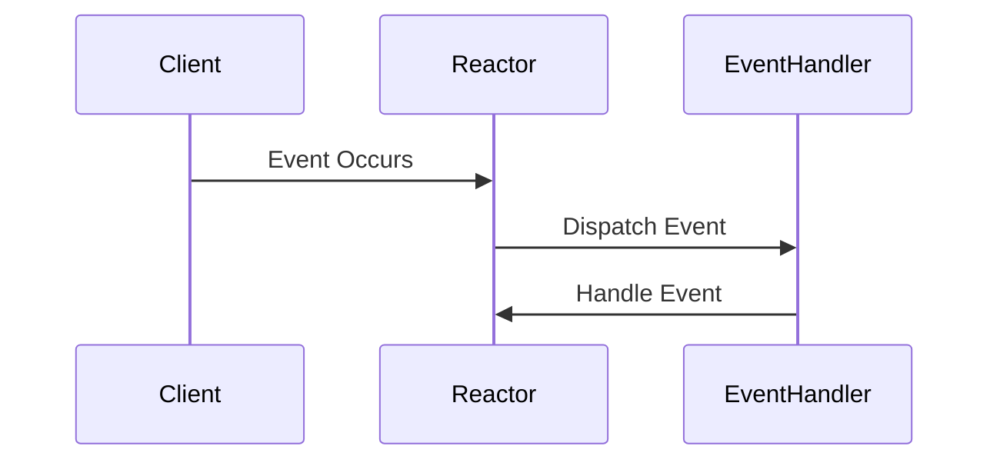
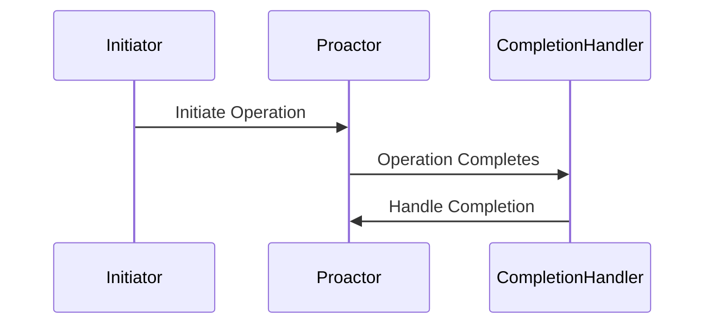

## 7.12 Reactor and Proactor Patterns

Concurrency and multithreading are critical aspects of modern software development, especially when it comes to building scalable and responsive systems. In this section, we will delve into two powerful design patterns that facilitate efficient event handling in concurrent systems: the Reactor and Proactor patterns. These patterns are instrumental in managing I/O operations and are widely used in network programming and systems that require high throughput and low latency.

### Reactor Pattern

#### Intent

The Reactor pattern is designed to handle service requests that are delivered concurrently to an application by one or more clients. It demultiplexes and dispatches these requests to the appropriate request handlers. The pattern is particularly useful for synchronous event handling, where events are processed as they occur.

#### Key Participants

- **Event Demultiplexer**: Waits for events to occur on a set of handles.
- **Event Handler**: Defines an interface for handling events.
- **Concrete Event Handler**: Implements the event handling interface.
- **Reactor**: Manages the registration of event handlers and dispatches events to the appropriate handlers.

#### Applicability

Use the Reactor pattern when you need to handle multiple service requests that arrive concurrently and require synchronous processing. It is ideal for applications where the number of clients is large, but the number of active clients at any given time is small.

#### Implementing the Reactor Pattern

The Reactor pattern can be implemented using mechanisms such as `select`, `poll`, or `epoll` in Linux. These system calls allow a program to monitor multiple file descriptors to see if I/O is possible on any of them.

```cpp
#include <iostream>
#include <sys/epoll.h>
#include <unistd.h>
#include <vector>
#include <cstring>

class EventHandler {
public:
    virtual void handleEvent(uint32_t events) = 0;
    virtual int getHandle() const = 0;
    virtual ~EventHandler() = default;
};

class Reactor {
public:
    void registerHandler(EventHandler* handler) {
        struct epoll_event ev;
        ev.events = EPOLLIN; // Interested in read events
        ev.data.ptr = handler;
        if (epoll_ctl(epoll_fd, EPOLL_CTL_ADD, handler->getHandle(), &ev) == -1) {
            std::cerr << "Failed to add handler: " << strerror(errno) << std::endl;
        }
    }

    void handleEvents() {
        std::vector<struct epoll_event> events(max_events);
        while (true) {
            int nfds = epoll_wait(epoll_fd, events.data(), max_events, -1);
            for (int n = 0; n < nfds; ++n) {
                EventHandler* handler = static_cast<EventHandler*>(events[n].data.ptr);
                handler->handleEvent(events[n].events);
            }
        }
    }

    Reactor() : epoll_fd(epoll_create1(0)), max_events(10) {
        if (epoll_fd == -1) {
            std::cerr << "Failed to create epoll file descriptor: " << strerror(errno) << std::endl;
        }
    }

    ~Reactor() {
        close(epoll_fd);
    }

private:
    int epoll_fd;
    const int max_events;
};

// Example concrete event handler
class ConcreteEventHandler : public EventHandler {
public:
    explicit ConcreteEventHandler(int fd) : fd(fd) {}

    void handleEvent(uint32_t events) override {
        if (events & EPOLLIN) {
            char buffer[1024];
            ssize_t bytes = read(fd, buffer, sizeof(buffer));
            if (bytes > 0) {
                std::cout << "Read " << bytes << " bytes: " << buffer << std::endl;
            }
        }
    }

    int getHandle() const override {
        return fd;
    }

private:
    int fd;
};

int main() {
    Reactor reactor;
    int fd = /* file descriptor to monitor */;
    ConcreteEventHandler handler(fd);
    reactor.registerHandler(&handler);
    reactor.handleEvents();
    return 0;
}
```

In this example, the `Reactor` class uses `epoll` to monitor file descriptors for read events. The `ConcreteEventHandler` class implements the `EventHandler` interface and processes the events.

#### Design Considerations

- **Scalability**: The Reactor pattern is well-suited for applications with a large number of clients but a small number of active connections.
- **Complexity**: Managing state and handling events can become complex as the number of event types and handlers increases.
- **Blocking Operations**: Ensure that event handlers do not perform blocking operations, as this can delay the processing of other events.

### Proactor Pattern

#### Intent

The Proactor pattern is designed to handle asynchronous event handling. It allows an application to initiate an operation and then be notified upon its completion. This pattern is particularly useful for operations that can be performed asynchronously, such as I/O operations.

#### Key Participants

- **Initiator**: Initiates an asynchronous operation.
- **Completion Handler**: Defines an interface for handling the completion of an operation.
- **Asynchronous Operation Processor**: Executes the operation asynchronously and notifies the completion handler upon completion.
- **Proactor**: Manages the registration of completion handlers and dispatches completion events.

#### Applicability

Use the Proactor pattern when you need to handle operations that can be performed asynchronously, such as file I/O or network communication. It is ideal for applications that require high throughput and low latency.

#### Implementing the Proactor Pattern

The Proactor pattern can be implemented using overlapped I/O and completion ports on Windows or using asynchronous I/O libraries on other platforms.

```cpp
#include <iostream>
#include <asio.hpp>

class CompletionHandler {
public:
    virtual void handleCompletion(const asio::error_code& error, std::size_t bytes_transferred) = 0;
    virtual ~CompletionHandler() = default;
};

class Proactor {
public:
    void registerHandler(CompletionHandler* handler) {
        handlers.push_back(handler);
    }

    void handleEvents() {
        io_context.run();
    }

    asio::io_context& getContext() {
        return io_context;
    }

private:
    asio::io_context io_context;
    std::vector<CompletionHandler*> handlers;
};

// Example concrete completion handler
class ConcreteCompletionHandler : public CompletionHandler {
public:
    void handleCompletion(const asio::error_code& error, std::size_t bytes_transferred) override {
        if (!error) {
            std::cout << "Operation completed successfully, bytes transferred: " << bytes_transferred << std::endl;
        } else {
            std::cerr << "Error: " << error.message() << std::endl;
        }
    }
};

int main() {
    Proactor proactor;
    asio::ip::tcp::socket socket(proactor.getContext());
    ConcreteCompletionHandler handler;
    proactor.registerHandler(&handler);

    // Example of an asynchronous operation
    socket.async_read_some(asio::buffer(data, max_length),
        [&](const asio::error_code& error, std::size_t bytes_transferred) {
            handler.handleCompletion(error, bytes_transferred);
        });

    proactor.handleEvents();
    return 0;
}
```

In this example, the `Proactor` class uses the `asio` library to manage asynchronous operations. The `ConcreteCompletionHandler` class implements the `CompletionHandler` interface and processes the completion events.

#### Design Considerations

- **Concurrency**: The Proactor pattern is well-suited for applications that require high concurrency and low latency.
- **Complexity**: Managing asynchronous operations and completion handlers can become complex as the number of operations increases.
- **Platform Support**: Ensure that the platform supports asynchronous I/O operations.

### Differences and Similarities

- **Reactor vs. Proactor**: The Reactor pattern is synchronous, while the Proactor pattern is asynchronous. The Reactor pattern waits for events to occur and then processes them, whereas the Proactor pattern initiates operations and handles their completion.
- **Use Cases**: Use the Reactor pattern for applications with a large number of clients but a small number of active connections. Use the Proactor pattern for applications that require high throughput and low latency.
- **Complexity**: Both patterns can become complex as the number of event types and handlers increases. However, the Proactor pattern can be more complex due to the need to manage asynchronous operations.

### Visualizing the Reactor and Proactor Patterns

Let's visualize the flow of events in the Reactor and Proactor patterns using Mermaid.js diagrams.

#### Reactor Pattern Flow



#### Proactor Pattern Flow



### Try It Yourself

Experiment with the provided code examples by modifying them to handle different types of events or operations. For example, try adding additional event handlers or completion handlers to see how the patterns can be extended to handle more complex scenarios.

### Knowledge Check

- What are the key differences between the Reactor and Proactor patterns?
- How can the Reactor pattern be implemented using `epoll`?
- What are some design considerations when using the Proactor pattern?

### Conclusion

The Reactor and Proactor patterns are powerful tools for managing concurrency and event handling in C++ applications. By understanding and implementing these patterns, you can build scalable and responsive systems that efficiently handle I/O operations. Remember, this is just the beginning. As you progress, you'll build more complex and interactive systems. Keep experimenting, stay curious, and enjoy the journey!

## Quiz Time!



### What is the primary difference between the Reactor and Proactor patterns?

- [x] The Reactor pattern handles events synchronously, while the Proactor pattern handles events asynchronously.
- [ ] The Reactor pattern is used for network communication, while the Proactor pattern is used for file I/O.
- [ ] The Reactor pattern is more complex than the Proactor pattern.
- [ ] The Reactor pattern is only applicable to Linux systems.

> **Explanation:** The Reactor pattern handles events synchronously, waiting for events to occur and then processing them, while the Proactor pattern handles events asynchronously, initiating operations and handling their completion.

### Which system call is commonly used to implement the Reactor pattern in Linux?

- [x] `epoll`
- [ ] `fork`
- [ ] `exec`
- [ ] `wait`

> **Explanation:** The `epoll` system call is commonly used to implement the Reactor pattern in Linux, allowing a program to monitor multiple file descriptors for I/O readiness.

### In the Proactor pattern, what role does the Completion Handler play?

- [x] It handles the completion of an asynchronous operation.
- [ ] It initiates an asynchronous operation.
- [ ] It waits for events to occur.
- [ ] It manages the registration of event handlers.

> **Explanation:** The Completion Handler in the Proactor pattern is responsible for handling the completion of an asynchronous operation, processing the results once the operation is finished.

### What is a key advantage of using the Proactor pattern?

- [x] It allows for high concurrency and low latency.
- [ ] It simplifies synchronous event handling.
- [ ] It reduces the complexity of managing state.
- [ ] It is only applicable to Windows systems.

> **Explanation:** The Proactor pattern is advantageous for applications that require high concurrency and low latency, as it allows operations to be performed asynchronously.

### Which library is commonly used in C++ to implement asynchronous operations in the Proactor pattern?

- [x] `asio`
- [ ] `boost`
- [ ] `pthread`
- [ ] `std::thread`

> **Explanation:** The `asio` library is commonly used in C++ to implement asynchronous operations in the Proactor pattern, providing a framework for asynchronous I/O.

### What is a potential drawback of the Reactor pattern?

- [x] It can become complex as the number of event types and handlers increases.
- [ ] It is not suitable for applications with a large number of clients.
- [ ] It cannot handle network communication.
- [ ] It is only applicable to Windows systems.

> **Explanation:** The Reactor pattern can become complex as the number of event types and handlers increases, requiring careful management of state and event processing.

### How does the Reactor pattern handle events?

- [x] It waits for events to occur and then processes them synchronously.
- [ ] It initiates operations and handles their completion asynchronously.
- [ ] It uses threads to process events concurrently.
- [ ] It relies on hardware interrupts to handle events.

> **Explanation:** The Reactor pattern handles events by waiting for them to occur and then processing them synchronously, dispatching events to the appropriate handlers.

### What is a common use case for the Proactor pattern?

- [x] High-throughput network servers.
- [ ] Simple command-line applications.
- [ ] Batch processing systems.
- [ ] Real-time operating systems.

> **Explanation:** The Proactor pattern is commonly used in high-throughput network servers, where asynchronous I/O operations are necessary for handling large volumes of requests efficiently.

### Can the Reactor pattern be used for asynchronous event handling?

- [ ] True
- [x] False

> **Explanation:** The Reactor pattern is designed for synchronous event handling, where events are processed as they occur, rather than being initiated and completed asynchronously.

### What is a key consideration when using the Proactor pattern?

- [x] Ensuring platform support for asynchronous I/O operations.
- [ ] Avoiding blocking operations in event handlers.
- [ ] Managing a small number of active connections.
- [ ] Simplifying synchronous event handling.

> **Explanation:** A key consideration when using the Proactor pattern is ensuring that the platform supports asynchronous I/O operations, as this is essential for the pattern's implementation.


