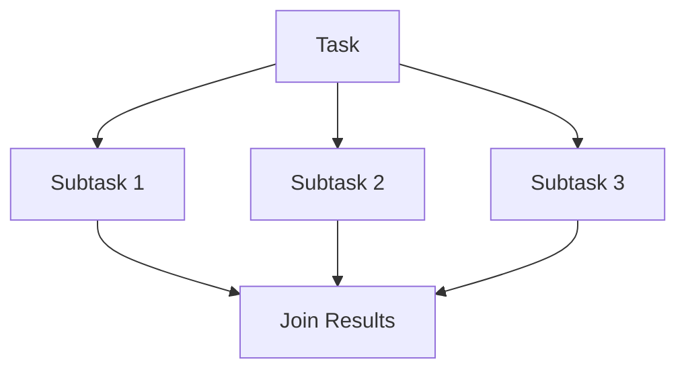
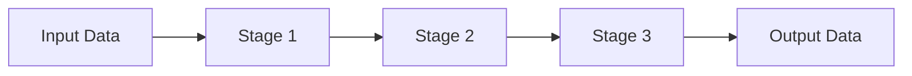

## 7.13 Concurrency Design Patterns

Concurrency design patterns are essential for developing robust and efficient C++ applications that leverage the power of modern multicore processors. In this section, we delve into task-based programming, the fork-join model, and pipeline and dataflow programming. These patterns help manage the complexity of concurrent execution, allowing developers to write scalable and maintainable code.

### Task-Based Programming

Task-based programming is a paradigm that focuses on dividing a program into discrete tasks that can be executed concurrently. This approach abstracts the details of thread management, allowing the developer to focus on the tasks themselves rather than the underlying threading model.

#### Key Concepts

- **Tasks**: Independent units of work that can be executed in parallel.
- **Task Scheduler**: A component that manages the execution of tasks, distributing them across available threads.
- **Future and Promise**: Mechanisms to handle the results of asynchronous tasks.

#### Benefits

- **Scalability**: Tasks can be distributed across multiple cores, improving performance.
- **Simplicity**: Developers can focus on defining tasks without worrying about thread management.
- **Flexibility**: Tasks can be dynamically created and managed, adapting to changing workloads.

#### Sample Code Snippet

Let's explore a simple example of task-based programming using the C++ Standard Library's `std::async` and `std::future`.

```cpp
#include <iostream>
#include <future>
#include <vector>

// A simple function to simulate a task
int computeSquare(int x) {
    return x * x;
}

int main() {
    std::vector<std::future<int>> futures;
    
    // Launch tasks asynchronously
    for (int i = 0; i < 10; ++i) {
        futures.push_back(std::async(std::launch::async, computeSquare, i));
    }
    
    // Collect results
    for (auto& future : futures) {
        std::cout << "Result: " << future.get() << std::endl;
    }
    
    return 0;
}
```

In this example, we launch multiple tasks asynchronously using `std::async`. Each task computes the square of a number, and the results are collected using `std::future`.

### Fork-Join Model

The fork-join model is a popular concurrency pattern that involves splitting a task into subtasks (forking), executing them concurrently, and then combining their results (joining). This model is particularly useful for divide-and-conquer algorithms.

#### Key Participants

- **Fork**: The process of dividing a task into smaller subtasks.
- **Join**: The process of combining the results of subtasks.
- **Worker Threads**: Threads that execute the subtasks.

#### Applicability

- **Recursive Algorithms**: Such as quicksort or mergesort, where tasks can be divided recursively.
- **Parallel Processing**: When tasks can be executed independently and combined later.

#### Sample Code Snippet

Here's an example of the fork-join model using a simple recursive sum function.

```cpp
#include <iostream>
#include <vector>
#include <future>

// Recursive function to compute sum using fork-join
int parallelSum(const std::vector<int>& data, int start, int end) {
    if (end - start < 10) { // Base case for small arrays
        int sum = 0;
        for (int i = start; i < end; ++i) {
            sum += data[i];
        }
        return sum;
    } else {
        int mid = start + (end - start) / 2;
        auto left = std::async(std::launch::async, parallelSum, std::ref(data), start, mid);
        auto right = std::async(std::launch::async, parallelSum, std::ref(data), mid, end);
        return left.get() + right.get(); // Join results
    }
}

int main() {
    std::vector<int> data(100, 1); // Vector with 100 elements, all set to 1
    int totalSum = parallelSum(data, 0, data.size());
    std::cout << "Total Sum: " << totalSum << std::endl;
    return 0;
}
```

In this example, the `parallelSum` function divides the input vector into smaller segments, computes the sum of each segment concurrently, and then combines the results.

### Pipeline and Dataflow Programming

Pipeline and dataflow programming are patterns that organize computations as a series of stages, where the output of one stage is the input to the next. This approach is particularly useful for processing streams of data.

#### Key Concepts

- **Stages**: Individual processing steps in the pipeline.
- **Dataflow**: The movement of data between stages.
- **Concurrency**: Each stage can be executed concurrently, allowing for parallel processing.

#### Benefits

- **Modularity**: Each stage can be developed and tested independently.
- **Scalability**: Stages can be executed on different threads or machines.
- **Efficiency**: Data can be processed as it arrives, reducing latency.

#### Sample Code Snippet

Let's look at a simple pipeline example using C++ threads.

```cpp
#include <iostream>
#include <thread>
#include <queue>
#include <mutex>
#include <condition_variable>
#include <vector>

// A simple pipeline stage
void stage(std::queue<int>& input, std::queue<int>& output, std::mutex& mtx, std::condition_variable& cv) {
    while (true) {
        std::unique_lock<std::mutex> lock(mtx);
        cv.wait(lock, [&input] { return !input.empty(); });
        int data = input.front();
        input.pop();
        lock.unlock();
        
        // Process data
        data *= 2;
        
        lock.lock();
        output.push(data);
        lock.unlock();
        cv.notify_all();
    }
}

int main() {
    std::queue<int> inputQueue;
    std::queue<int> outputQueue;
    std::mutex mtx;
    std::condition_variable cv;
    
    // Launch pipeline stage
    std::thread t1(stage, std::ref(inputQueue), std::ref(outputQueue), std::ref(mtx), std::ref(cv));
    
    // Feed data into the pipeline
    for (int i = 0; i < 10; ++i) {
        std::unique_lock<std::mutex> lock(mtx);
        inputQueue.push(i);
        lock.unlock();
        cv.notify_all();
    }
    
    // Collect results
    for (int i = 0; i < 10; ++i) {
        std::unique_lock<std::mutex> lock(mtx);
        cv.wait(lock, [&outputQueue] { return !outputQueue.empty(); });
        int result = outputQueue.front();
        outputQueue.pop();
        std::cout << "Processed Result: " << result << std::endl;
    }
    
    t1.join();
    return 0;
}
```

In this example, we create a simple pipeline with one stage that doubles the input data. The pipeline uses a queue to pass data between stages, with a mutex and condition variable to synchronize access.

### Visualizing Concurrency Patterns

To better understand these concurrency patterns, let's visualize them using Mermaid.js diagrams.

#### Fork-Join Model



**Caption**: The fork-join model splits a task into subtasks, executes them concurrently, and joins their results.

#### Pipeline Pattern



**Caption**: The pipeline pattern processes data through a series of stages, each performing a specific transformation.

### Design Considerations

When implementing concurrency patterns in C++, consider the following:

- **Thread Safety**: Ensure that shared data is protected using mutexes or other synchronization mechanisms.
- **Performance**: Balance the overhead of creating and managing threads with the performance gains from parallel execution.
- **Scalability**: Design patterns to scale with the number of available cores and adapt to different hardware configurations.
- **Deadlock Avoidance**: Carefully design synchronization to prevent deadlocks, especially in complex pipelines.

### Differences and Similarities

- **Fork-Join vs. Pipeline**: The fork-join model is suitable for tasks that can be divided into independent subtasks, while the pipeline pattern is ideal for sequential processing of data streams.
- **Task-Based vs. Fork-Join**: Task-based programming abstracts thread management, whereas the fork-join model explicitly divides tasks into subtasks.
- **Pipeline vs. Dataflow**: Both patterns involve sequential processing, but dataflow emphasizes the movement of data between stages, often with more complex dependencies.

### Try It Yourself

Experiment with the provided code examples by:

- Modifying the number of tasks or subtasks to see how it affects performance.
- Adding more stages to the pipeline and observing how data flows through them.
- Implementing error handling in the pipeline to manage failures gracefully.

### References and Links

- [C++ Reference on std::async](https://en.cppreference.com/w/cpp/thread/async)
- [Concurrency in C++: A Practical Guide](https://www.modernescpp.com/index.php/concurrency-in-c)
- [Boost Asio for Network Programming](https://www.boost.org/doc/libs/release/doc/html/boost_asio.html)

### Knowledge Check

- What are the key benefits of task-based programming?
- How does the fork-join model handle task division and result combination?
- What synchronization mechanisms are used in the pipeline example?

### Embrace the Journey

Remember, mastering concurrency patterns in C++ is a journey. As you progress, you'll build more complex and efficient systems. Keep experimenting, stay curious, and enjoy the journey!

## Quiz Time!



### What is the primary benefit of task-based programming?

- [x] Simplifies thread management
- [ ] Increases memory usage
- [ ] Reduces code readability
- [ ] Decreases execution speed

> **Explanation:** Task-based programming abstracts the complexity of thread management, allowing developers to focus on defining tasks.

### In the fork-join model, what is the purpose of the "join" step?

- [x] To combine the results of subtasks
- [ ] To divide tasks into smaller parts
- [ ] To synchronize threads
- [ ] To terminate threads

> **Explanation:** The "join" step combines the results of concurrently executed subtasks into a final result.

### Which pattern is best suited for processing streams of data?

- [ ] Fork-Join
- [x] Pipeline
- [ ] Task-Based
- [ ] Singleton

> **Explanation:** The pipeline pattern is ideal for sequentially processing streams of data through multiple stages.

### What synchronization mechanism is used in the pipeline example to manage access to shared data?

- [ ] Semaphore
- [x] Mutex and condition variable
- [ ] Spinlock
- [ ] Atomic operations

> **Explanation:** The example uses a mutex and condition variable to synchronize access to shared queues.

### How can you prevent deadlocks in concurrent programming?

- [x] By carefully designing synchronization
- [ ] By using more threads
- [ ] By ignoring race conditions
- [ ] By increasing task complexity

> **Explanation:** Careful design of synchronization mechanisms is essential to prevent deadlocks.

### What is a key difference between the fork-join model and task-based programming?

- [x] Fork-join explicitly divides tasks, while task-based abstracts thread management
- [ ] Fork-join is simpler to implement
- [ ] Task-based is less flexible
- [ ] Fork-join requires more memory

> **Explanation:** Fork-join explicitly divides tasks into subtasks, while task-based programming abstracts thread management.

### Which pattern emphasizes the movement of data between stages?

- [ ] Fork-Join
- [ ] Task-Based
- [x] Dataflow
- [ ] Singleton

> **Explanation:** Dataflow programming emphasizes the movement of data between stages, often with complex dependencies.

### What is a common use case for the fork-join model?

- [x] Recursive algorithms like quicksort
- [ ] Real-time data processing
- [ ] Event-driven systems
- [ ] GUI applications

> **Explanation:** The fork-join model is well-suited for recursive algorithms that can be divided into independent subtasks.

### What is the role of a task scheduler in task-based programming?

- [x] To manage the execution of tasks
- [ ] To increase memory usage
- [ ] To decrease code readability
- [ ] To reduce execution speed

> **Explanation:** A task scheduler manages the execution of tasks, distributing them across available threads.

### True or False: The pipeline pattern can only be used for sequential processing.

- [ ] True
- [x] False

> **Explanation:** While the pipeline pattern is often used for sequential processing, stages can be executed concurrently, allowing for parallel processing.


