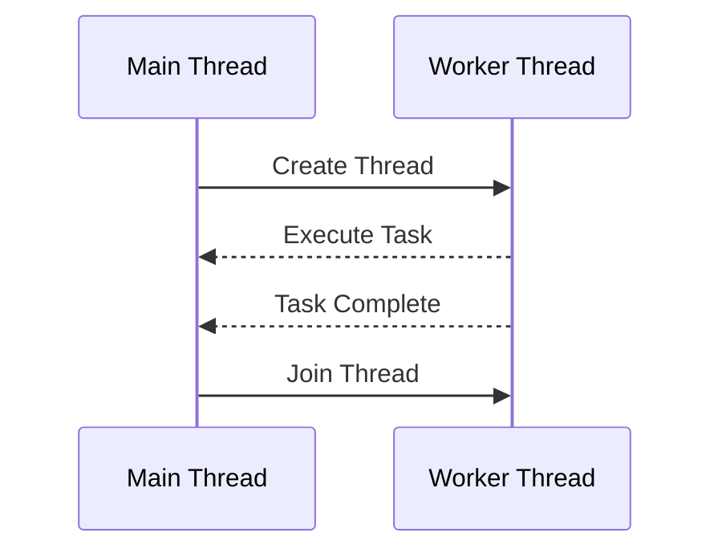

## 7.2 Thread Management

In today's computing landscape, the ability to efficiently manage threads is crucial for developing high-performance applications. C++ offers powerful tools and libraries to handle concurrency and multithreading, allowing developers to exploit the full potential of modern multi-core processors. This section delves into the essential aspects of thread management in C++, including creating and joining threads, managing their lifecycles, and utilizing thread functions and callable objects.

### Introduction to Thread Management

Thread management is a fundamental aspect of concurrent programming. It involves creating, synchronizing, and terminating threads to ensure efficient execution of tasks. In C++, the `<thread>` library, introduced in C++11, provides a robust framework for thread management, making it easier to write portable and efficient multithreaded code.

#### Key Concepts

- **Thread**: A thread is the smallest unit of processing that can be scheduled by an operating system. In C++, threads allow multiple tasks to run concurrently within a single process.
- **Concurrency**: Concurrency refers to the execution of multiple tasks simultaneously. It can be achieved through multithreading, where multiple threads run in parallel.
- **Synchronization**: Synchronization is the coordination of threads to ensure correct execution order and data integrity. It often involves mechanisms like mutexes and condition variables.

### Creating and Joining Threads

Creating and joining threads are fundamental operations in thread management. Let's explore how these operations are performed in C++.

#### Creating Threads

In C++, threads are created using the `std::thread` class. A thread can be initialized with a function or a callable object, which defines the task to be executed. Here's a simple example:

```cpp
#include <iostream>
#include <thread>

// Function to be executed by the thread
void printMessage() {
    std::cout << "Hello from the thread!" << std::endl;
}

int main() {
    // Create a thread that runs the printMessage function
    std::thread myThread(printMessage);

    // Wait for the thread to finish execution
    myThread.join();

    return 0;
}
```

In this example, we create a thread `myThread` that executes the `printMessage` function. The `join()` method is called to wait for the thread to complete before the program exits.

#### Joining Threads

Joining a thread is crucial to ensure that a thread has completed its execution before the program continues. The `join()` method blocks the calling thread until the thread represented by the `std::thread` object terminates. Failing to join a thread can lead to undefined behavior, as the program may exit before the thread completes.

### Managing Thread Lifecycles

Managing the lifecycle of a thread involves controlling its creation, execution, and termination. Proper management ensures efficient resource utilization and prevents common issues like deadlocks and race conditions.

#### Thread Detachment

In some cases, you may want a thread to run independently of the main program flow. This can be achieved by detaching the thread using the `detach()` method. A detached thread runs in the background, and its resources are automatically released upon completion.

```cpp
#include <iostream>
#include <thread>
#include <chrono>

// Function to simulate a long-running task
void longTask() {
    std::this_thread::sleep_for(std::chrono::seconds(2));
    std::cout << "Task completed!" << std::endl;
}

int main() {
    std::thread backgroundThread(longTask);
    backgroundThread.detach();

    std::cout << "Main thread continues..." << std::endl;

    return 0;
}
```

In this example, the `backgroundThread` is detached, allowing the main thread to continue execution without waiting for the background task to complete.

#### Thread Termination

Threads can terminate in several ways:

1. **Normal Completion**: A thread completes its task and exits the function it was executing.
2. **Exception Handling**: If an exception is thrown and not caught within the thread, it will terminate the thread.
3. **Program Termination**: If the main program exits, all threads are terminated.

It's important to handle exceptions within threads to prevent abrupt termination and resource leaks.

### Thread Functions and Callable Objects

Threads in C++ can execute various types of callable objects, including functions, function pointers, lambda expressions, and objects with `operator()` defined.

#### Using Functions and Function Pointers

Functions and function pointers are the simplest way to define tasks for threads. As shown in previous examples, you can pass a function directly to a `std::thread` object.

#### Using Lambda Expressions

Lambda expressions provide a concise way to define inline functions. They are particularly useful for short tasks and capturing variables from the surrounding scope.

```cpp
#include <iostream>
#include <thread>

int main() {
    int value = 42;

    // Create a thread with a lambda expression
    std::thread lambdaThread([value]() {
        std::cout << "Value from lambda: " << value << std::endl;
    });

    lambdaThread.join();

    return 0;
}
```

In this example, a lambda expression captures the variable `value` and prints it within the thread.

#### Using Callable Objects

Callable objects, or functors, are objects that can be called like functions. They provide more flexibility than functions and lambdas, as they can maintain state.

```cpp
#include <iostream>
#include <thread>

// Functor class
class Task {
public:
    void operator()() const {
        std::cout << "Task executed by functor!" << std::endl;
    }
};

int main() {
    Task task;
    std::thread functorThread(task);

    functorThread.join();

    return 0;
}
```

Here, the `Task` class defines an `operator()` method, making it a callable object that can be executed by a thread.

### Visualizing Thread Management

To better understand thread management, let's visualize the lifecycle of a thread using a sequence diagram.



This diagram illustrates the interaction between the main thread and a worker thread. The main thread creates the worker thread, which executes a task and signals completion. Finally, the main thread joins the worker thread to ensure it has finished execution.

### Best Practices for Thread Management

Managing threads effectively requires adherence to best practices to ensure performance and reliability.

#### Avoiding Data Races

Data races occur when multiple threads access shared data simultaneously, leading to inconsistent results. Use synchronization mechanisms like mutexes to protect shared data.

```cpp
#include <iostream>
#include <thread>
#include <mutex>

std::mutex mtx;
int counter = 0;

void incrementCounter() {
    std::lock_guard<std::mutex> lock(mtx);
    ++counter;
}

int main() {
    std::thread t1(incrementCounter);
    std::thread t2(incrementCounter);

    t1.join();
    t2.join();

    std::cout << "Counter: " << counter << std::endl;

    return 0;
}
```

In this example, `std::lock_guard` is used to lock the mutex, ensuring that only one thread can increment the counter at a time.

#### Minimizing Lock Contention

Lock contention occurs when multiple threads compete for the same lock, leading to performance degradation. To minimize contention, reduce the scope of locks and use finer-grained locking.

#### Using Thread Pools

Thread pools are a common pattern for managing a large number of short-lived tasks. They allow you to reuse threads, reducing the overhead of thread creation and destruction.

```cpp
#include <iostream>
#include <vector>
#include <thread>
#include <queue>
#include <functional>
#include <condition_variable>

class ThreadPool {
public:
    ThreadPool(size_t numThreads);
    ~ThreadPool();

    void enqueueTask(std::function<void()> task);

private:
    std::vector<std::thread> workers;
    std::queue<std::function<void()>> tasks;
    std::mutex queueMutex;
    std::condition_variable condition;
    bool stop;

    void workerThread();
};

ThreadPool::ThreadPool(size_t numThreads) : stop(false) {
    for (size_t i = 0; i < numThreads; ++i) {
        workers.emplace_back(&ThreadPool::workerThread, this);
    }
}

ThreadPool::~ThreadPool() {
    {
        std::unique_lock<std::mutex> lock(queueMutex);
        stop = true;
    }
    condition.notify_all();
    for (std::thread &worker : workers) {
        worker.join();
    }
}

void ThreadPool::enqueueTask(std::function<void()> task) {
    {
        std::unique_lock<std::mutex> lock(queueMutex);
        tasks.push(task);
    }
    condition.notify_one();
}

void ThreadPool::workerThread() {
    while (true) {
        std::function<void()> task;
        {
            std::unique_lock<std::mutex> lock(queueMutex);
            condition.wait(lock, [this] { return stop || !tasks.empty(); });
            if (stop && tasks.empty()) return;
            task = std::move(tasks.front());
            tasks.pop();
        }
        task();
    }
}

int main() {
    ThreadPool pool(4);

    for (int i = 0; i < 8; ++i) {
        pool.enqueueTask([i] {
            std::cout << "Task " << i << " is being processed" << std::endl;
        });
    }

    return 0;
}
```

This example demonstrates a simple thread pool implementation. Tasks are enqueued and processed by a fixed number of worker threads.

#### Handling Thread Exceptions

Ensure that exceptions within threads are properly handled to prevent resource leaks and undefined behavior. Use try-catch blocks within thread functions to manage exceptions gracefully.

### Advanced Thread Management Techniques

For expert developers, advanced techniques can further enhance thread management.

#### Thread Local Storage

Thread local storage allows each thread to have its own instance of a variable. This is useful for storing data that should not be shared between threads.

```cpp
#include <iostream>
#include <thread>

thread_local int threadLocalVar = 0;

void increment() {
    ++threadLocalVar;
    std::cout << "Thread local variable: " << threadLocalVar << std::endl;
}

int main() {
    std::thread t1(increment);
    std::thread t2(increment);

    t1.join();
    t2.join();

    return 0;
}
```

In this example, each thread has its own instance of `threadLocalVar`, ensuring that changes in one thread do not affect the other.

#### Using `std::future` and `std::promise`

`std::future` and `std::promise` provide a mechanism for asynchronous communication between threads. They allow a thread to wait for a result that will be available in the future.

```cpp
#include <iostream>
#include <thread>
#include <future>

int calculateSquare(int x) {
    return x * x;
}

int main() {
    std::promise<int> promise;
    std::future<int> future = promise.get_future();

    std::thread t([&promise] {
        int result = calculateSquare(5);
        promise.set_value(result);
    });

    std::cout << "Square: " << future.get() << std::endl;

    t.join();

    return 0;
}
```

In this example, a promise is used to set the result of a calculation, which is then retrieved by a future in the main thread.

### Try It Yourself

Experiment with the provided code examples to deepen your understanding of thread management in C++. Try modifying the examples to:

- Create additional threads and observe their behavior.
- Implement error handling within threads.
- Use thread pools for different types of tasks.

### Conclusion

Effective thread management is essential for building robust and high-performance C++ applications. By understanding how to create, join, and manage threads, you can harness the power of modern multi-core processors and improve the responsiveness and efficiency of your software. Remember to follow best practices, such as avoiding data races and minimizing lock contention, to ensure reliable and maintainable code.

## Quiz Time!



### What is the primary purpose of the `std::thread` class in C++?

- [x] To create and manage threads
- [ ] To handle exceptions in threads
- [ ] To synchronize data between threads
- [ ] To provide a graphical user interface

> **Explanation:** The `std::thread` class is used to create and manage threads in C++.

### What does the `join()` method do in thread management?

- [x] It blocks the calling thread until the thread represented by the `std::thread` object terminates.
- [ ] It detaches the thread from the main program flow.
- [ ] It starts the execution of a thread.
- [ ] It synchronizes data between threads.

> **Explanation:** The `join()` method blocks the calling thread until the thread represented by the `std::thread` object terminates, ensuring that the thread has completed its execution.

### What is the effect of calling `detach()` on a thread?

- [x] The thread runs independently, and its resources are released upon completion.
- [ ] The thread is terminated immediately.
- [ ] The thread is paused until further notice.
- [ ] The thread is joined with the main thread.

> **Explanation:** Calling `detach()` on a thread allows it to run independently, and its resources are automatically released upon completion.

### How can you avoid data races in multithreaded C++ programs?

- [x] By using mutexes to protect shared data
- [ ] By using the `detach()` method
- [ ] By creating more threads
- [ ] By using the `std::thread` class

> **Explanation:** Data races can be avoided by using mutexes to protect shared data, ensuring that only one thread can access the data at a time.

### What is a thread pool used for?

- [x] To manage a large number of short-lived tasks efficiently
- [ ] To create and manage a single thread
- [ ] To synchronize data between threads
- [ ] To handle exceptions in threads

> **Explanation:** A thread pool is used to manage a large number of short-lived tasks efficiently by reusing threads, reducing the overhead of thread creation and destruction.

### Which C++ feature allows each thread to have its own instance of a variable?

- [x] Thread local storage
- [ ] `std::promise`
- [ ] `std::future`
- [ ] `std::mutex`

> **Explanation:** Thread local storage allows each thread to have its own instance of a variable, ensuring that changes in one thread do not affect others.

### What is the purpose of `std::promise` and `std::future` in C++?

- [x] To provide a mechanism for asynchronous communication between threads
- [ ] To create and manage threads
- [ ] To synchronize data between threads
- [ ] To handle exceptions in threads

> **Explanation:** `std::promise` and `std::future` provide a mechanism for asynchronous communication between threads, allowing a thread to wait for a result that will be available in the future.

### What is a common issue that can occur if threads are not properly synchronized?

- [x] Data races
- [ ] Thread detachment
- [ ] Thread joining
- [ ] Thread creation

> **Explanation:** Data races can occur if threads are not properly synchronized, leading to inconsistent results when multiple threads access shared data simultaneously.

### What is the role of `std::lock_guard` in thread management?

- [x] To automatically acquire and release a mutex
- [ ] To create and manage threads
- [ ] To detach a thread from the main program flow
- [ ] To handle exceptions in threads

> **Explanation:** `std::lock_guard` is used to automatically acquire and release a mutex, ensuring that a mutex is properly locked and unlocked.

### True or False: A detached thread's resources are automatically released upon completion.

- [x] True
- [ ] False

> **Explanation:** A detached thread runs independently, and its resources are automatically released upon completion.


